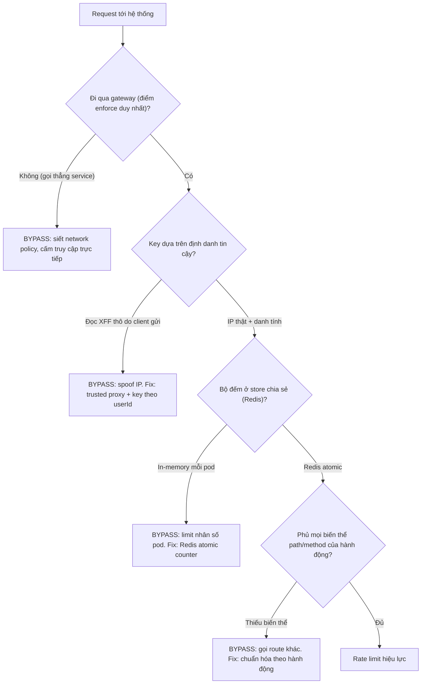

# Rate limit bị bypass. Nguyên nhân có thể là gì?

## ⚡ Tóm tắt ngắn (30s)
* **Bản chất**: Rate limit "có vẻ chạy" nhưng kẻ tấn công vẫn spam vượt giới hạn nghĩa là cơ chế đếm đang dựa trên một **định danh sai/giả mạo được**, hoặc bộ đếm **không nhất quán giữa các instance**, hoặc còn **đường vòng** không qua điểm kiểm soát. Nguyên nhân gốc phổ biến nhất là **tin tưởng header `X-Forwarded-For` (XFF) do client tự đặt** — kẻ tấn công đổi XFF mỗi request để giả là IP mới. Senior điều tra theo trục: **Định danh (key) → Tính nhất quán (state) → Vùng phủ (coverage) → Lớp enforce**.
* **Thảm họa thực chiến được giải quyết**:
  1. **In-memory counter trên nhiều pod**: Rate limiter dùng `Map`/`AtomicInteger` cục bộ trong mỗi instance. Có 5 pod sau load balancer → giới hạn thực tế bị nhân 5, và mỗi lần scale/restart là reset bộ đếm.
  2. **Spoof XFF**: Limiter key theo `request.getRemoteAddr()` đọc từ XFF chưa được cấu hình trusted proxy → client gửi `X-Forwarded-For: <random>` mỗi request, mỗi request thành "IP mới", limit vô hiệu.
* **Quyết định Senior**:
  1. **State tập trung ở Redis**, không đếm cục bộ trong RAM mỗi instance.
  2. **Chỉ tin XFF từ proxy tin cậy**; key theo *danh tính đã xác thực* (userId/API key) thay vì chỉ IP.
  3. **Enforce ở gateway** để không có route nào lọt lưới, và phủ mọi biến thể path/method của cùng một hành động.

---

## 🔍 Chi tiết bản chất thực chiến: 4 trục điều tra bypass

```
[🚨 Rate limit bị bypass]
        │
   ┌────┼─────────────┬──────────────────┬─────────────────┐
   ▼    ▼             ▼                  ▼                 ▼
[Key sai]      [State không      [Coverage thiếu]    [Lớp enforce sai]
spoof XFF /     nhất quán]        route/biến thể      bypass gateway gọi
key dễ đoán     in-memory đa pod  không bị limit      thẳng service
```

### Trục 1: Định danh (key) bị giả mạo hoặc dễ né
* **XFF spoofing — nguyên nhân số 1**: `X-Forwarded-For` là header *do client gửi*. Nếu app đọc thẳng nó làm IP mà không qua cấu hình trusted proxy, client đặt giá trị tùy ý → giả vô số IP. Phải cấu hình `ForwardedHeaderFilter`/`server.forward-headers-strategy` và chỉ tin XFF do *proxy của ta* ghi (lấy IP thật ở vị trí xác định trong chuỗi, thường là IP ngoài cùng bên phải mà ta kiểm soát).
* **Key chỉ theo IP**: Kẻ tấn công xoay IP qua botnet/proxy pool → limit theo IP vô dụng. Với endpoint nhạy cảm (login, OTP), phải limit thêm theo **tài khoản đích** (username/email) và **danh tính đã xác thực**.

### Trục 2: Tính nhất quán của state (đa instance)
* Đếm trong RAM của từng pod làm giới hạn bị nhân theo số pod và mất khi restart/scale. Bộ đếm phải nằm ở **store chia sẻ** (Redis) để mọi instance thấy cùng một con số. Thao tác tăng-và-kiểm-tra phải **atomic** (Lua script / `INCR` + `EXPIRE`) để tránh race condition cho phép vượt ngưỡng ở biên.

### Trục 3: Vùng phủ (coverage) — đường vòng
* Cùng một hành động nhưng nhiều đường vào: `/api/login`, `/api/v2/login`, `/api/login/` (dấu `/` cuối), khác hoa-thường, hoặc GraphQL/gRPC song song với REST. Nếu chỉ limit một biến thể, các biến thể khác là cửa hậu. Phải chuẩn hóa path và áp limit theo *hành động logic*, không theo string path thô.

### Trục 4: Lớp enforce bị vòng qua
* Limit đặt ở app, nhưng kẻ tấn công gọi *thẳng* service nội bộ (bypass gateway) nếu network không cô lập. Hoặc limit ở một replica cũ trong lúc rolling update chưa có rule. Giải pháp: enforce ở **gateway/edge** (điểm vào duy nhất) và cấm truy cập trực tiếp service qua network policy.

---

## 🎨 Sơ đồ trực quan: Các vector bypass và chốt chặn



---

## 💻 Code thực chiến: BAD vs GOOD

### ❌ BAD: Đếm in-memory + đọc XFF thô
```java
public class RateLimitFilter implements Filter {
    // ❌ Map cục bộ: mỗi pod một bản đếm riêng -> limit nhân số pod, reset khi restart
    private final Map<String, AtomicInteger> counters = new ConcurrentHashMap<>();

    public void doFilter(ServletRequest req, ServletResponse res, FilterChain chain) {
        HttpServletRequest http = (HttpServletRequest) req;
        // ❌ Đọc X-Forwarded-For do client gửi -> spoof được, mỗi request một "IP"
        String ip = http.getHeader("X-Forwarded-For");
        int count = counters.computeIfAbsent(ip, k -> new AtomicInteger())
                            .incrementAndGet();
        if (count > 100) { /* reject */ }
        // ...
    }
}
```

### ✅ GOOD: Redis atomic + key theo danh tính + trusted proxy
```java
@Component
public class RateLimitFilter extends OncePerRequestFilter {
    private final StringRedisTemplate redis;
    private final DefaultRedisScript<Long> incrAndCheck; // Lua: INCR + EXPIRE atomic

    protected void doFilterInternal(HttpServletRequest req, HttpServletResponse res,
                                    FilterChain chain) throws IOException, ServletException {
        // ✅ IP thật lấy từ XFF do PROXY TIN CẬY ghi (đã cấu hình ForwardedHeaderFilter).
        //    Ưu tiên key theo danh tính đã xác thực để chống xoay IP.
        String identity = resolveAuthenticatedId(req); // userId nếu đã đăng nhập
        String clientIp = req.getRemoteAddr();          // đã là IP thật nhờ trusted proxy
        String key = "rl:" + (identity != null ? "uid:" + identity : "ip:" + clientIp);

        // ✅ Đếm tập trung & atomic trên Redis (mọi pod thấy cùng con số)
        Long count = redis.execute(incrAndCheck,
                List.of(key), "100", "60"); // tối đa 100 req / 60s
        if (count != null && count > 100) {
            res.setStatus(429);
            res.setHeader("Retry-After", "60");
            return;
        }
        chain.doFilter(req, res);
    }
}
```

```yaml
# ✅ Chỉ tin forwarded header khi đứng sau proxy/LB mà ta kiểm soát
server:
  forward-headers-strategy: framework   # Spring xử lý X-Forwarded-* đúng cách
# Cấu hình proxy (Nginx/LB) GHI ĐÈ X-Forwarded-For bằng IP thật, không nối thêm từ client
```

---

## 📊 Bảng so sánh nguyên nhân bypass và cách khắc phục

| Nguyên nhân bypass | Dấu hiệu | Cách khắc phục |
| :--- | :--- | :--- |
| **Spoof X-Forwarded-For** | Mỗi request một IP lạ | Trusted proxy + key theo userId/API key |
| **In-memory counter đa pod** | Limit thực ≈ N × ngưỡng | Redis atomic counter chia sẻ |
| **Xoay IP (botnet/proxy)** | Nhiều IP, mỗi IP ít request | Limit theo tài khoản đích + WAF threat intel |
| **Route/biến thể không phủ** | Spam qua path khác | Chuẩn hóa path, limit theo hành động logic |
| **Gọi thẳng service** | Traffic không thấy ở gateway | Network policy, enforce ở edge |

---

## ⚠️ Common Gotchas & Questions follow-up

### 1. Cạm bẫy "NAT chung IP" gây false positive
* **Vấn đề**: Limit thuần theo IP có thể chặn nhầm cả một văn phòng/nhà mạng dùng chung một IP NAT (CGNAT của nhà mạng di động Việt Nam là ví dụ điển hình — hàng nghìn người dùng chung một dải IP). Limit quá chặt theo IP biến thành tự gây DoS cho người dùng thật.
* **Giải pháp**: Với endpoint sau đăng nhập, key theo *danh tính người dùng* thay vì IP. Với endpoint trước đăng nhập (login), kết hợp IP + tài khoản đích + CAPTCHA khi nghi ngờ, thay vì siết IP một cách thô bạo.

### 2. Câu hỏi đào sâu từ interviewer
* **Interviewer: "Kẻ tấn công dùng botnet hàng nghìn IP, mỗi IP chỉ gửi vài request nên không IP nào vượt ngưỡng. Rate limit theo IP vô dụng. Bạn làm gì?"**
* **Trả lời**:
  1. **Đổi trục giới hạn sang tài sản đích**: Limit theo *tài khoản bị nhắm* (login: tối đa N lần thử cho một username từ *mọi* nguồn) và theo *tài nguyên* (tổng request tới endpoint nhạy cảm), thay vì theo nguồn.
  2. **Phòng thủ theo hành vi**: Thêm CAPTCHA/challenge khi điểm rủi ro cao, dùng WAF threat-intelligence chặn dải IP hosting/VPN đã biết, phân tích fingerprint.
  3. **Bảo vệ tài nguyên đắt đỏ**: Đặt giới hạn toàn cục (global) cho các thao tác tốn CPU (verify mật khẩu) để dù phân tán cũng không làm sập DB.
  4. **Trung thực**: Rate limit không "chống được mọi thứ" — nó là một lớp. Phối hợp với WAF, MFA, và giám sát anomaly mới tạo phòng thủ chiều sâu thực sự.
