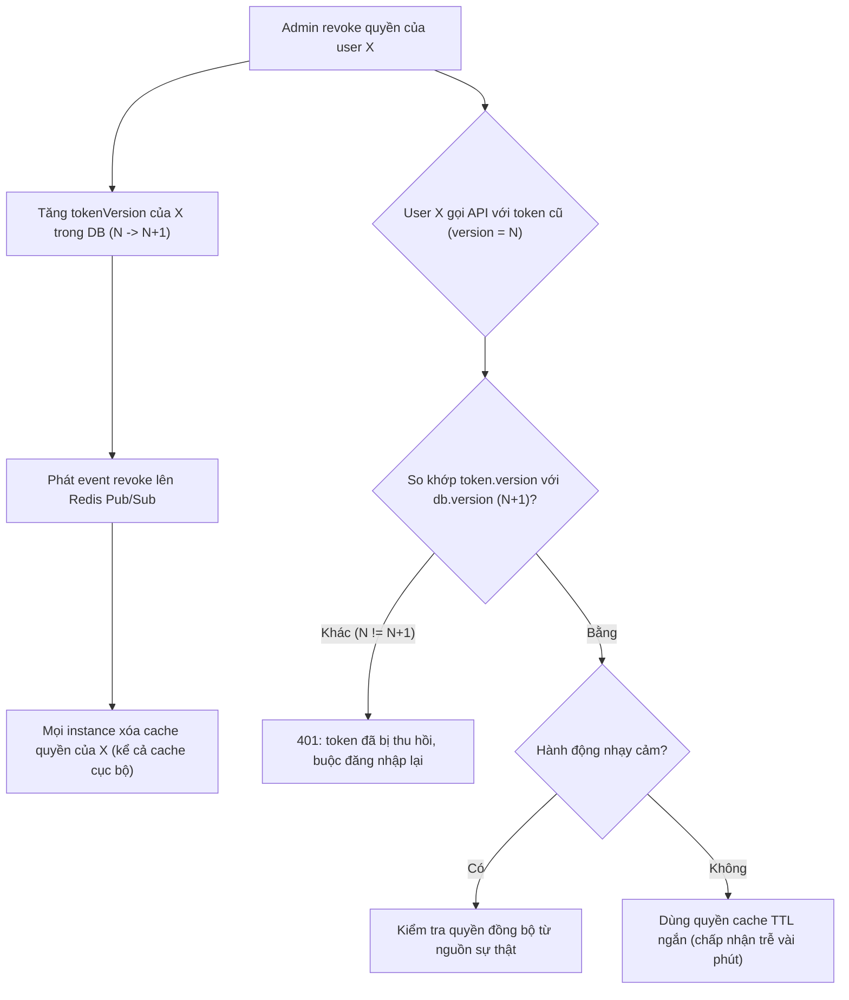

# Permission cache stale làm user vẫn có quyền sau khi bị revoke. Xử lý thế nào?

## ⚡ Tóm tắt ngắn (30s)
* **Bản chất**: Khi admin thu hồi quyền (đuổi nhân viên, hạ vai trò) nhưng user *vẫn truy cập được* trong một khoảng thời gian, đó là vấn đề **độ trễ lan truyền của việc thu hồi (revocation propagation lag)**. Quyền đã được **cache** ở đâu đó — trong **JWT** (claim nhúng sẵn), trong **Redis/cache cục bộ**, hoặc trong **session** — và bản sao cache đó chưa được làm mới. Nghịch lý cốt lõi: **JWT stateless về bản chất không thể thu hồi** trước khi hết hạn; cache tăng tốc nhưng tạo ra cửa sổ dữ liệu cũ. Senior giải quyết bằng cách chọn đúng *điểm cân bằng giữa hiệu năng và độ tươi*, không phải bỏ cache.
* **Thảm họa thực chiến được giải quyết**:
  1. **JWT 24h chứa role nhúng**: Nhân viên bị sa thải, admin xóa quyền trong DB, nhưng token JWT của họ còn hạn 12 tiếng vẫn mang claim `role=ADMIN`. Vì API chỉ đọc role *từ token*, người này vẫn thao tác admin suốt 12 tiếng.
  2. **Cache cục bộ mỗi instance không được invalidate**: Quyền cache trong Caffeine của từng pod. Flush một pod không ảnh hưởng pod khác → user vẫn lọt qua các pod chưa được dọn.
* **Quyết định Senior**:
  1. **Access token TTL ngắn + refresh**: Giảm cửa sổ stale xuống vài phút thay vì hàng giờ.
  2. **Invalidation theo sự kiện**: Khi revoke, phát event (Redis Pub/Sub) để mọi instance xóa cache ngay.
  3. **Cơ chế thu hồi tức thì cho hành động nhạy cảm**: token version / denylist để vô hiệu token ngay khi cần, không đợi hết hạn.

---

## 🔍 Chi tiết bản chất thực chiến: Xác định cache nằm ở đâu rồi mới chọn cách thu hồi

### Bước 1: Định vị quyền đang được cache ở tầng nào
Triệu chứng giống nhau nhưng cách xử lý khác hẳn tùy nơi cache:
* **Trong JWT** (claim `roles`/`scopes` nhúng trong token): token *là* bản cache đi theo người dùng. Không thu hồi được trực tiếp vì server không giữ trạng thái.
* **Trong Redis (cache chia sẻ)**: dễ xử lý nhất — chỉ cần `DEL` key khi revoke.
* **Trong cache cục bộ mỗi instance** (Caffeine/Guava trong RAM pod): khó nhất vì mỗi pod một bản, cần broadcast invalidation.
* **Trong HTTP session**: phải cập nhật/hủy session ở session store.

### Bước 2: Các cơ chế thu hồi (theo độ tức thì tăng dần)
* **TTL ngắn (cách đơn giản nhất)**: Đặt access token/cache sống ngắn (ví dụ 5 phút) + refresh token. Khi revoke, chỉ cần *không cấp refresh mới* → quyền hết hiệu lực sau tối đa 5 phút. Đánh đổi: nhiều lần refresh hơn. Đây thường là điểm cân bằng tốt nhất cho phần lớn hệ thống.
* **Event-driven invalidation**: Khi admin revoke, service phát một event lên **Redis Pub/Sub** (hoặc Kafka); mọi instance lắng nghe và xóa entry cache liên quan ngay lập tức. Giải quyết bài toán cache cục bộ đa pod.
* **Token version / `tokenVersion` claim**: Lưu một số version trong DB user. Token mang `tokenVersion=N`. Khi revoke, tăng version trong DB lên N+1. Mỗi request kiểm tra `token.version == db.version` → token cũ lập tức vô hiệu. Tốn một lần đọc nhẹ (cache được) mỗi request nhưng cho thu hồi *tức thì*.
* **Token denylist/blocklist**: Lưu `jti` (JWT ID) của token đã thu hồi vào Redis với TTL = thời gian sống còn lại của token. Mỗi request kiểm tra `jti` có trong denylist không. Phù hợp khi cần thu hồi *một số* token cụ thể.

### Bước 3: Chọn theo độ nhạy cảm
* Hành động thường (xem danh sách): TTL ngắn là đủ, chấp nhận cửa sổ vài phút.
* Hành động nhạy cảm (chuyển tiền, đổi quyền người khác): **introspect/kiểm tra thu hồi đồng bộ** tại thời điểm thực hiện (token version hoặc denylist), không dựa vào claim cache.

---

## 🎨 Sơ đồ trực quan: Lan truyền việc thu hồi quyền



---

## 💻 Code thực chiến: BAD vs GOOD

### ❌ BAD: JWT dài hạn nhúng role, không có cách thu hồi
```java
// ❌ Token sống 24h, role nhúng cứng, không kiểm tra thu hồi
String jwt = Jwts.builder()
    .setSubject(user.getId().toString())
    .claim("roles", user.getRoles())     // ❌ role đông cứng trong token 24h
    .setExpiration(Date.from(Instant.now().plus(24, ChronoUnit.HOURS)))
    .signWith(key)
    .compact();

// Mọi request chỉ đọc role TỪ TOKEN -> revoke trong DB vô tác dụng tới khi hết hạn
List<String> roles = claims.get("roles", List.class);
```

### ✅ GOOD: Access token ngắn + tokenVersion + invalidation theo event
```java
// ✅ Access token sống ngắn (5 phút), mang tokenVersion để thu hồi tức thì
String access = Jwts.builder()
    .setSubject(user.getId().toString())
    .claim("ver", user.getTokenVersion())   // ✅ version để kiểm tra thu hồi
    .setExpiration(Date.from(Instant.now().plus(5, ChronoUnit.MINUTES)))
    .signWith(key)
    .compact();
```
```java
@Component
public class TokenValidationFilter extends OncePerRequestFilter {
    private final UserVersionCache versionCache; // cache version, invalidate qua Pub/Sub

    protected void doFilterInternal(HttpServletRequest req, HttpServletResponse res,
                                    FilterChain chain) throws IOException, ServletException {
        Claims claims = parse(req);
        long tokenVer = claims.get("ver", Long.class);
        // ✅ So với version hiện hành (đọc từ cache, được invalidate khi revoke)
        long currentVer = versionCache.getVersion(claims.getSubject());
        if (tokenVer != currentVer) {
            res.sendError(401, "Token đã bị thu hồi");   // ✅ chặn ngay token cũ
            return;
        }
        chain.doFilter(req, res);
    }
}
```
```java
@Service
public class PermissionRevocationService {
    private final UserRepository repo;
    private final StringRedisTemplate redis;

    @Transactional
    public void revoke(Long userId) {
        // ✅ 1) Tăng version -> mọi access token cũ lập tức vô hiệu ở lần request kế tiếp
        repo.incrementTokenVersion(userId);
        // ✅ 2) Phát event để mọi instance (kể cả cache Caffeine cục bộ) xóa cache quyền
        redis.convertAndSend("perm-invalidate", String.valueOf(userId));
    }
}
```

---

## 📊 Bảng so sánh các cơ chế thu hồi quyền

| Cơ chế | Độ tức thì | Chi phí mỗi request | Phù hợp khi |
| :--- | :--- | :--- | :--- |
| **TTL ngắn + refresh** | Trễ ~vài phút | Không (stateless) | Đa số hệ thống, hành động thường |
| **Event-driven invalidation** | Gần tức thì | Thấp (đọc cache) | Cache cục bộ đa pod |
| **tokenVersion claim** | Tức thì | 1 đọc nhẹ (cache được) | Cần thu hồi ngay, mọi token của user |
| **Denylist theo jti** | Tức thì | 1 tra Redis | Thu hồi chọn lọc vài token |
| **Session đầy đủ (stateful)** | Tức thì | 1 đọc session | Ưu tiên kiểm soát hơn scale |

---

## ⚠️ Common Gotchas & Questions follow-up

### 1. Cạm bẫy "flush cache gây stampede" và bỏ quên refresh token
* **Vấn đề 1**: Khi xóa hàng loạt entry cache quyền cùng lúc (ví dụ đổi role áp cho cả nhóm), nhiều request đồng thời dội xuống DB để nạp lại quyền — **cache stampede** làm DB nghẽn. Giải pháp: dùng khóa nạp lại (single-flight) hoặc làm mới lệch thời gian.
* **Vấn đề 2**: Rút ngắn access token nhưng *quên* xử lý refresh token — refresh token sống dài vẫn cấp được access token mới sau khi revoke. Khi thu hồi, phải **vô hiệu refresh token** (xóa khỏi store), nếu không TTL ngắn của access token trở nên vô nghĩa.

### 2. Câu hỏi đào sâu từ interviewer
* **Interviewer: "Bạn nói TTL ngắn giảm cửa sổ stale. Nhưng với chuyển tiền, trễ 5 phút là không chấp nhận được. Thiết kế của bạn?"**
* **Trả lời**:
  1. **Tách hai loại quyền**: Quyền "hiển thị/đọc" có thể chấp nhận cache TTL ngắn để tối ưu hiệu năng. Quyền cho **hành động nhạy cảm** (chuyển tiền, phê duyệt) phải kiểm tra **đồng bộ tại thời điểm thực hiện** từ nguồn sự thật (DB hoặc tokenVersion), không bao giờ tin claim cache.
  2. **Step-up xác thực**: Với giao dịch nhạy cảm, yêu cầu xác thực lại (re-auth/OTP) — vừa chống token bị thu hồi, vừa chống session bị chiếm.
  3. **Cân bằng có chủ đích**: Đây là đánh đổi hiệu năng ↔ độ tươi, và lựa chọn *theo từng loại hành động* thay vì một chính sách chung. Đó là điểm khác biệt của thiết kế Senior.
  4. **Trung thực**: Không tồn tại cache vừa nhanh tuyệt đối vừa tươi tuyệt đối; mọi cache đều có cửa sổ stale. Việc của ta là *thu hẹp cửa sổ tới mức rủi ro chấp nhận được* cho từng ngữ cảnh, và có đường thu hồi tức thì cho phần nhạy cảm.
