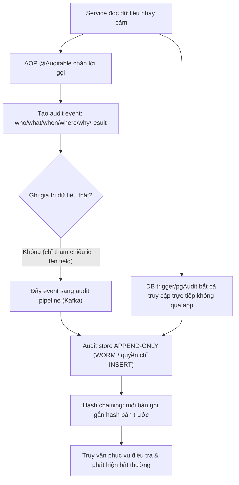

# Làm sao audit access tới dữ liệu nhạy cảm?

## ⚡ Tóm tắt ngắn (30s)
* **Bản chất**: Audit access là việc ghi lại **ai đã truy cập dữ liệu nhạy cảm nào, khi nào, từ đâu, để làm gì, kết quả ra sao** — một bản ghi *bất biến, chống sửa* phục vụ điều tra sự cố, phát hiện lạm dụng nội bộ và đáp ứng tuân thủ. Nguyên tắc vàng của Senior: **ghi lại *việc truy cập*, KHÔNG ghi lại *giá trị dữ liệu nhạy cảm*** (audit log không được biến thành chỗ rò rỉ mới). Audit log phải **append-only** (chỉ thêm, không sửa/xóa), tách khỏi DB nghiệp vụ, và **không thể bị bỏ qua** bởi chính code nghiệp vụ.
* **Thảm họa thực chiến được giải quyết**:
  1. **Audit log ngay trong bảng nghiệp vụ, sửa được**: Lưu audit trong bảng `logs` cùng DB ứng dụng, admin có quyền `UPDATE/DELETE` → kẻ tấn công nội bộ xóa dấu vết của chính mình. Audit mất giá trị pháp lý.
  2. **Audit "ngấm" giá trị nhạy cảm**: Ghi `accessed value = <số CCCD đầy đủ>` vào audit → bản thân audit log trở thành kho PII thứ hai, lộ là thảm họa nhân đôi.
* **Quyết định Senior**:
  1. **Audit qua AOP/`@Auditable`** tập trung, không rải rác — không thể vô tình quên.
  2. **Store append-only riêng biệt** (WORM/quyền chỉ-ghi cho app), tamper-evident bằng chuỗi hash.
  3. **Ghi tham chiếu, không ghi giá trị**: log "đã đọc hồ sơ của customer #123", không log nội dung hồ sơ.

---

## 🔍 Chi tiết bản chất thực chiến: Thiết kế hệ thống audit đúng chuẩn

### Audit ghi cái gì? (mô hình 6 chiều)
Một bản ghi audit chuẩn trả lời được 6 câu hỏi:
* **Who** — actor: userId, service account, IP, user-agent.
* **What** — hành động + tài nguyên: `READ customer_profile`, resource id `123` (tham chiếu, *không* phải giá trị).
* **When** — timestamp chính xác (UTC), có thứ tự.
* **Where** — nguồn: IP, endpoint, instance.
* **Why** — mục đích/ngữ cảnh nghiệp vụ nếu có (ví dụ "xử lý ticket #456").
* **Result** — thành công/từ chối, số bản ghi truy cập.

### Audit log KHÔNG được là gì
* **Không chứa dữ liệu nhạy cảm thật**: ghi *việc* truy cập, không ghi *nội dung*. Nếu cần biết "đã xem field nào", ghi tên field, không ghi giá trị.
* **Không sửa/xóa được**: append-only. App chỉ có quyền `INSERT`, không có `UPDATE/DELETE` trên store audit.
* **Không bị code nghiệp vụ vô tình bỏ qua**: dùng cơ chế cắt ngang (AOP/trigger/CDC) để audit không phụ thuộc việc dev nhớ gọi.

### Các phương án kỹ thuật (theo tầng)
* **Application-level AOP (`@Auditable`)**: aspect chặn các method đọc dữ liệu nhạy cảm, ghi audit event. *Hiểu ngữ cảnh nghiệp vụ* tốt nhất (biết "tại sao"), nhưng chỉ bắt được truy cập *đi qua app*.
* **Hibernate Envers**: tự version hóa entity, tốt cho *thay đổi dữ liệu* (write) hơn là *đọc*.
* **DB trigger / native audit (pgAudit)**: bắt mọi truy cập tại tầng DB, kể cả truy cập trực tiếp không qua app. Mạnh về độ phủ nhưng thiếu ngữ cảnh nghiệp vụ.
* **CDC (Debezium)**: stream thay đổi từ transaction log của DB sang Kafka → audit store. Tách rời, không ảnh hưởng hiệu năng giao dịch, tốt cho quy mô lớn.
* **Thực tế Senior**: kết hợp — AOP cho ngữ cảnh "ai/tại sao" ở tầng app, + audit ở tầng DB cho độ phủ (bắt cả DBA truy cập trực tiếp).

### Tamper-evidence (chống sửa) & lưu trữ
* **Append-only storage**: bảng riêng với quyền chỉ `INSERT`; hoặc store WORM (Write-Once-Read-Many) như S3 Object Lock.
* **Hash chaining**: mỗi bản ghi chứa hash của bản ghi trước → sửa/xóa một bản ghi làm gãy chuỗi, phát hiện được. Bản ghi $n$ lưu $h_n = \text{hash}(\text{record}_n \mathbin\Vert h_{n-1})$.
* **Tách quyền truy cập**: người vận hành hệ thống nghiệp vụ *không* có quyền sửa store audit; audit do team bảo mật/tuân thủ quản lý (separation of duties).

---

## 🎨 Sơ đồ trực quan: Đường đi của một sự kiện audit



---

## 💻 Code thực chiến: BAD vs GOOD

### ❌ BAD: Audit chung DB nghiệp vụ, ghi cả giá trị, sửa được
```java
// ❌ Ghi audit thủ công rải rác (dễ quên), lưu cả giá trị nhạy cảm
public CustomerDto getCustomer(Long id) {
    CustomerDto c = repo.findById(id);
    // ❌ Lưu cả số CCCD vào audit -> audit log thành kho PII thứ hai
    auditRepo.save(new AuditLog("READ customer, cccd=" + c.getNationalId()));
    return c; // ❌ auditRepo dùng chung DB, admin UPDATE/DELETE được -> xóa dấu vết
}
```

### ✅ GOOD: AOP + tham chiếu (không giá trị) + store append-only
```java
@Target(ElementType.METHOD) @Retention(RetentionPolicy.RUNTIME)
public @interface Auditable {
    String action();          // ví dụ "READ_CUSTOMER_PROFILE"
    String resourceType();    // ví dụ "CUSTOMER"
}

@Aspect @Component
public class AuditAspect {
    private final AuditEventPublisher publisher; // đẩy sang Kafka -> store riêng

    @AfterReturning(pointcut = "@annotation(auditable)", returning = "result")
    public void record(JoinPoint jp, Auditable auditable, Object result) {
        Authentication auth = SecurityContextHolder.getContext().getAuthentication();
        AuditEvent event = AuditEvent.builder()
            .actor(auth.getName())                       // WHO
            .action(auditable.action())                  // WHAT (hành động)
            .resourceType(auditable.resourceType())
            .resourceId(extractId(jp.getArgs()))         // ✅ tham chiếu id, KHÔNG giá trị
            .sourceIp(RequestContext.currentIp())        // WHERE
            .timestamp(Instant.now())                    // WHEN
            .result("SUCCESS")                           // RESULT
            .build();
        publisher.publish(event);                        // ✅ không ghi nội dung nhạy cảm
    }
}

@Service
public class CustomerService {
    @Auditable(action = "READ_CUSTOMER_PROFILE", resourceType = "CUSTOMER")
    public CustomerDto getCustomer(Long id) {
        return repo.findById(id);   // ✅ audit tự động qua AOP, không thể quên
    }
}
```

```sql
-- ✅ Store audit append-only: app chỉ được INSERT, không UPDATE/DELETE
CREATE TABLE audit_log (
    id           BIGINT GENERATED ALWAYS AS IDENTITY PRIMARY KEY,
    actor        VARCHAR(128) NOT NULL,
    action       VARCHAR(64)  NOT NULL,
    resource_id  VARCHAR(64),            -- tham chiếu, không phải giá trị nhạy cảm
    source_ip    INET,
    occurred_at  TIMESTAMPTZ  NOT NULL DEFAULT now(),
    prev_hash    CHAR(64),               -- hash chaining chống sửa
    record_hash  CHAR(64)     NOT NULL
);
-- App dùng DB role chỉ có quyền INSERT trên bảng này:
REVOKE UPDATE, DELETE ON audit_log FROM app_role;
GRANT  INSERT, SELECT ON audit_log TO app_role;
```

---

## 📊 Bảng so sánh các phương án audit

| Phương án | Độ phủ | Ngữ cảnh nghiệp vụ | Ảnh hưởng hiệu năng | Lưu ý |
| :--- | :--- | :--- | :--- | :--- |
| **AOP `@Auditable`** | Chỉ truy cập qua app | Cao (biết "tại sao") | Thấp | Bỏ sót truy cập trực tiếp DB |
| **Hibernate Envers** | Thay đổi qua ORM | Trung bình | Trung bình | Mạnh cho write, yếu cho read |
| **DB trigger / pgAudit** | Mọi truy cập DB | Thấp | Trung bình–cao | Bắt cả DBA truy cập trực tiếp |
| **CDC (Debezium)** | Mọi thay đổi commit | Thấp | Rất thấp (tách rời) | Tốt cho quy mô lớn, độ trễ nhỏ |

---

## ⚠️ Common Gotchas & Questions follow-up

### 1. Cạm bẫy "audit log là dữ liệu nhạy cảm" và performance
* **Vấn đề 1**: Bản thân audit log rất nhạy cảm — nó tiết lộ ai quan tâm tới ai, mô hình truy cập. Phải bảo vệ audit store *ít nhất ngang* dữ liệu gốc: mã hóa at-rest, kiểm soát truy cập chặt (chỉ team bảo mật/tuân thủ), và chính việc *đọc audit log* cũng phải được audit.
* **Vấn đề 2**: Audit đồng bộ (ghi DB ngay trong luồng request) làm tăng latency mỗi request. Với dữ liệu được đọc nhiều, đẩy audit event qua hàng đợi bất đồng bộ (Kafka) để không chặn nghiệp vụ — đánh đổi: có cửa sổ nhỏ event có thể mất nếu hệ thống chết giữa chừng, cần cân nhắc độ bền (durability) theo yêu cầu tuân thủ.

### 2. Câu hỏi đào sâu từ interviewer
* **Interviewer: "Làm sao đảm bảo một admin có quyền cao không thể truy cập dữ liệu nhạy cảm rồi xóa luôn bản ghi audit của hành vi đó?"**
* **Trả lời**:
  1. **Separation of duties**: Người vận hành hệ thống nghiệp vụ và người quản trị store audit là *hai vai trò tách biệt*. App ghi audit bằng DB role chỉ có `INSERT`; không một tài khoản ứng dụng nào có `DELETE` trên store audit.
  2. **Append-only + WORM + hash chaining**: Lưu sang storage không cho sửa (S3 Object Lock/WORM); chuỗi hash khiến mọi thao tác xóa/sửa làm gãy chuỗi và bị phát hiện khi đối soát.
  3. **Đẩy ra ngoài tầm với**: Stream audit sang một hệ thống tách biệt (SIEM/log store riêng) gần như real-time, nên dù xóa được bản ghi ở DB gốc thì bản sao đã nằm ngoài quyền kiểm soát của admin đó.
  4. **Trung thực**: Không thể *tuyệt đối* chống được kẻ có toàn quyền hạ tầng (root); mục tiêu thực tế là **tamper-evident** (phát hiện được mọi can thiệp) và *tăng chi phí/độ khó* của việc che giấu tới mức không khả thi, kết hợp giám sát và phân tách quyền — chứ không hứa hẹn "không thể xóa".
