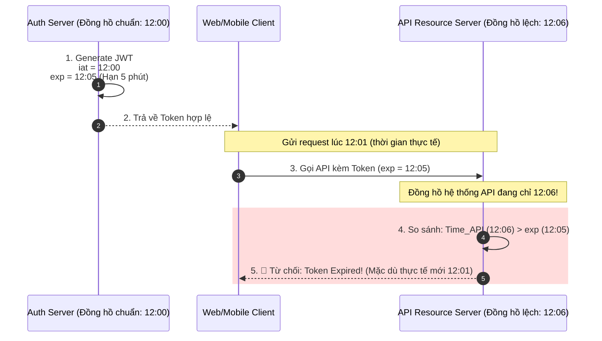

# JWT hết hạn sớm hơn dự kiến. Nguyên nhân có thể là gì?

## ⚡ Tóm tắt ngắn (30s)
* **Bản chất**: Lỗi JWT hết hạn sớm hơn dự kiến (Premature Token Expiration) là một bug kinh điển trong môi trường phân tán, bắt nguồn từ 3 sự lệch pha chính: **Độ lệch đơn vị thời gian (Seconds vs Milliseconds)** khi tính toán trường `exp`, **Sai lệch múi giờ (Timezone Offset)** giữa Application Server và Database/Identity Provider, hoặc **Clock Drift (Sai lệch đồng hồ vật lý)** giữa các node máy chủ.
* **Thảm họa thực chiến được giải quyết**:
  1. **Cơn bão Token (Token Storm/Refresh Storm)**: JWT hết hạn sau vài giây thay vì vài giờ làm hàng triệu thiết bị client đồng loạt gọi API Refresh Token liên tục. Hệ thống Gateway và Auth Service chịu tải cực đại, cạn kiệt Connection Pool và sập hoàn toàn (Cascading Failure).
  2. **Trải nghiệm người dùng tồi tệ (UX Session Eviction)**: User đang điền form thanh toán hoặc nhập liệu dở dang thì đột ngột bị đá văng ra màn hình đăng nhập mà không rõ lý do.
* **Quyết định Senior**:
  1. **Giải mã & Kiểm toán Token (JWT Payload Inspection)**: Chụp lại Token bị lỗi, đưa lên `jwt.io` hoặc dùng công cụ giải mã để đọc giá trị timestamp của các claim `exp` (Expiration Time), `iat` (Issued At), `nbf` (Not Before) để xem giá trị lưu trữ thực sự là gì.
  2. **Đồng bộ hóa NTP (Network Time Protocol)**: Cấu hình đồng bộ thời gian tuyệt đối trên tất cả các server vật lý/container về UTC.
  3. **Thắt chặt unit-test**: Viết test case bao phủ toàn bộ logic tính toán thời gian hết hạn của Token, giả lập các múi giờ khác nhau.

---

## 🔍 Chi tiết bản chất thực chiến: 4 Nguyên nhân chính & Cách khắc phục

Khi JWT bị hết hạn sớm hơn cấu hình (ví dụ đặt 1 tiếng nhưng 1 phút đã hết hạn), hãy rà soát ngay 4 lỗi cấu hình hệ thống sau:

### 1. Nhầm lẫn đơn vị thời gian: Seconds vs Milliseconds (Đặc biệt giữa Java và Node.js/Go)
* **Bản chất**: 
  * Tiêu chuẩn JWT (RFC 7519) quy định trường `exp` phải là thời gian tính bằng **Giây** (Epoch Time / Unix Timestamp).
  * Tuy nhiên, hàm `System.currentTimeMillis()` trong Java trả về đơn vị **Miligiây**.
* **Lỗi thực tế**:
  ```java
  // SAI: Nhầm lẫn miligiây và giây khi đặt Expiration
  long expireAt = System.currentTimeMillis() + 3600 * 1000; // 1 giờ tính bằng miligiây (3,600,000 ms)
  builder.setExpiration(new Date(expireAt)); // Thư viện tự động chia cho 1000 để lưu giây -> Đúng.
  
  // NHƯNG nếu ghi đè claim thủ công bằng số nguyên:
  claims.put("exp", expireAt); // LƯU SAI: Lưu giá trị 3,600,000,000,000 (giây) thay vì 3,600,000 (giây)
  ```
  Nếu nhầm lẫn ngược lại (chia cho 1000 quá nhiều lần), Token sẽ có hạn dùng cực kỳ ngắn (ví dụ: chỉ sống được 3.6 giây thay vì 1 giờ).

### 2. Lệch múi giờ hệ thống (Timezone Offset: UTC vs Local)
* Nếu Auth Server chạy trên môi trường Docker/Kubernetes sử dụng múi giờ mặc định là UTC, trong khi Database lưu cấu hình thời hạn Token sử dụng múi giờ Châu Á/Việt Nam (GMT+7).
* Khi JVM tính toán:
  `Expiration = DB_Config_Duration (ví dụ: 1 giờ, lấy thời gian GMT+7 làm mốc) + System_Current_Time (UTC)`.
  Sự chênh lệch 7 tiếng này sẽ khiến Token mới sinh ra lập tức rơi vào trạng thái "đã hết hạn từ 6 tiếng trước" khi được gửi về client.

### 3. Sự cố Clock Drift (Độ lệch đồng hồ máy chủ phân tán)
* Trong hệ thống Microservices, Service A (Auth Service) phát hành Token và ghi nhận `iat = 10:00:00`, `exp = 11:00:00`.
* Service B (Gateway / Resource Server) nhận Token lúc 10:05:00. Nhưng đồng hồ vật lý của Service B bị chạy nhanh hơn Service A 60 phút (tức là đồng hồ của B đang chỉ 11:05:00).
* Service B so sánh thời gian hiện tại của nó (`11:05:00`) với `exp` của Token (`11:00:00`) và kết luận: **Token đã hết hạn**, trả về lỗi 401 Unauthorized.

### 4. Đảo khóa ký JWT đột ngột (Key Invalidation / Key Leak Response)
* Nếu hệ thống sử dụng Key lưu trong Memory của Auth Service, khi instance bị restart hoặc auto-scale, key mới được sinh ngẫu nhiên làm toàn bộ các Token cũ được ký bởi key cũ lập tức bị coi là không hợp lệ (Invalid Signature), Client hiểu nhầm là Token hết hạn.

---

## 🎨 Sơ đồ trực quan: Cơ chế lỗi do lệch đồng hồ vật lý (Clock Drift)

Sơ đồ dưới đây mô tả cách một JWT hợp lệ bị từ chối do máy chủ xác thực bị chạy chậm hơn máy chủ API (Resource Server):



---

## 💻 Code thực chiến: Hàm Generate JWT chuẩn bảo mật và an toàn thời gian

Dưới đây là cách triển khai Java Spring Boot sử dụng thư viện `jjwt` bản mới nhất để tạo JWT nhất quán theo UTC và tránh các lỗi đơn vị thời gian.

### 1. Triển khai lớp sinh JWT chuẩn hóa UTC và an toàn đơn vị
```java
package com.example.auth.util;

import io.jsonwebtoken.Jwts;
import io.jsonwebtoken.SignatureAlgorithm;
import io.jsonwebtoken.security.Keys;
import java.security.Key;
import java.time.Instant;
import java.time.temporal.ChronoUnit;
import java.util.Date;
import java.util.HashMap;
import java.util.Map;

public class JwtTokenUtil {

    private static final String SECRET_KEY_STRING = "your-super-secret-key-must-be-at-least-256-bits-long";
    private static final Key SIGNING_KEY = Keys.hmacShaKeyFor(SECRET_KEY_STRING.getBytes());
    
    // Đặt thời hạn sống của Token: 1 Giờ (3600 Giây)
    private static final long EXPIRATION_SECONDS = 3600; 

    public String generateToken(String username, Map<String, Object> extraClaims) {
        // Sử dụng Instant (luôn tuân theo chuẩn UTC bất chấp timezone của OS)
        Instant now = Instant.now(); 
        Instant expiryLimit = now.plus(EXPIRATION_SECONDS, ChronoUnit.SECONDS);

        return Jwts.builder()
                .setClaims(extraClaims)
                .setSubject(username)
                // iat và exp được convert sang Date chuẩn xác theo Epoch Milliseconds
                .setIssuedAt(Date.from(now)) 
                .setExpiration(Date.from(expiryLimit)) 
                .signWith(SIGNING_KEY, SignatureAlgorithm.HS256)
                .compact();
    }
}
```

### 2. Unit Test kiểm tra tính nhất quán của Expiration (Junit 5)
```java
package com.example.auth.util;

import io.jsonwebtoken.Claims;
import io.jsonwebtoken.Jwts;
import org.junit.jupiter.api.Assertions;
import org.junit.jupiter.api.Test;
import java.time.Instant;
import java.util.HashMap;

public class JwtTokenUtilTest {

    private final JwtTokenUtil tokenUtil = new JwtTokenUtil();

    @Test
    public void testTokenExpirationShouldBeExactlyOneHourInFuture() {
        String username = "senior_engineer";
        String token = tokenUtil.generateToken(username, new HashMap<>());

        // Decode Token để kiểm toán (Audit)
        Claims claims = Jwts.parserBuilder()
                .setSigningKey("your-super-secret-key-must-be-at-least-256-bits-long".getBytes())
                .build()
                .parseClaimsJws(token)
                .getBody();

        Instant issuedAt = claims.getIssuedAt().toInstant();
        Instant expiration = claims.getExpiration().toInstant();

        // Kiểm tra khoảng cách exp - iat phải đúng bằng 3600 giây (1 giờ)
        long durationSeconds = expiration.getEpochSecond() - issuedAt.getEpochSecond();
        Assertions.assertEquals(3600, durationSeconds, "Thời hạn token phải chính xác là 3600 giây!");
        
        // Đảm bảo token được tạo sau thời điểm hiện tại vài giây (tránh lệch NTP local test)
        Assertions.assertTrue(expiration.isAfter(Instant.now()));
    }
}
```

---

## 📊 Bảng so sánh các nguyên nhân gây lỗi hết hạn JWT sớm

| Tiêu chí | Lỗi 1: Clock Drift (Lệch đồng hồ) | Lỗi 2: Nhầm lẫn đơn vị (Ms vs Sec) | Lỗi 3: Timezone Offset (Lệch múi giờ) |
| :--- | :--- | :--- | :--- |
| **Triệu chứng** | Token hoạt động ở Auth Service nhưng bị reject ngay lập tức khi gửi sang Gateway. | Token hết hạn chỉ sau vài giây hoặc sống lâu hàng thế kỷ. | Token bị lỗi ngay lập tức sau khi sinh ra (lỗi 401). |
| **Bản chất kỹ thuật** | Đồng hồ máy chủ API chạy nhanh hơn đồng hồ máy chủ Auth. | Gán trực tiếp giá trị `System.currentTimeMillis()` vào claim `exp`. | Tính toán thời gian dựa trên `LocalDateTime` của HĐH thay vì dùng `Instant` (UTC). |
| **Tác động hệ thống** | Thấp đến Trung bình (Chỉ ảnh hưởng một số server có NTP bị drift). | **Cực kỳ nguy hiểm** (Gây bão request Refresh Token sập hệ thống). | Cao (Ảnh hưởng toàn bộ user trên production nếu deploy sang máy chủ khác múi giờ). |
| **Cách xử lý** | 1. Cài đặt NTP Service.<br/>2. Cấu hình `AllowedClockSkew` ở Resource Server. | Đảm bảo giá trị truyền vào `exp` là Epoch Giây (10 chữ số) chứ không phải Miligiây (13 chữ số). | Luôn dùng chuẩn `Instant.now()` để tính toán thời gian xác thực. |

---

## ⚠️ Common Gotchas & Questions follow-up

### 1. Cạm bẫy "Bỏ qua cấu hình AllowedClockSkew"
* **Vấn đề**: Trong thế giới thực, việc đồng hồ vật lý của hai máy chủ bị lệch nhau vài giây đến dưới 1 phút (Clock Drift) là hiện tượng xảy ra thường xuyên ngay cả khi có chạy dịch vụ NTP. Nếu ta cấu hình thư viện Verify JWT khắt khe đến từng mili-giây, hệ thống sẽ liên tục từ chối các token hợp lệ.
* **Giải pháp khắc phục**: Luôn cấu hình một khoảng dung sai (thường là 1 đến 2 phút) khi verify JWT trên Gateway/Resource Server bằng cách sử dụng cài đặt `setAllowedClockSkew` hoặc `setAllowedClockSkewSeconds(60)`. Khoảng thời gian này sẽ bù trừ cho sự lệch giây của đồng hồ máy chủ một cách an toàn.

### 2. Câu hỏi đào sâu từ interviewer
* **Interviewer: "Làm sao chúng ta phát hiện sớm việc hệ thống đang xảy ra lỗi JWT hết hạn sớm trên Production trước khi người dùng kịp gửi ticket phàn nàn?"**
* **Trả lời**:
  * Để phát hiện sớm sự cố này, ta cần thiết lập hệ thống giám sát và cảnh báo (Observability & Alerting):
    1. **Theo dõi tỷ lệ lỗi 401**: Thiết lập Alert trên Grafana/Kibana kích hoạt cảnh báo nếu số lượng phản hồi `HTTP 401 Unauthorized` từ API Gateway tăng đột biến (ví dụ vượt quá 5% tổng request trong 2 phút liên tiếp).
    2. **Monitor Endpoint Refresh Token**: Giám sát lượng traffic đổ vào endpoint `/api/auth/refresh`. Nếu số lượng request refresh tăng vọt gấp 5-10 lần bình thường mà không đi kèm lượng user đăng nhập mới tương đương, chứng tỏ client đang phải thực hiện refresh liên tục do JWT hết hạn quá nhanh.
    3. **Log Exception chi tiết**: Log cụ thể nguyên nhân lỗi 401 (như `ExpiredJwtException`, `SignatureException`) dưới dạng structured log để dễ dàng truy vấn và thống kê tỷ lệ lỗi thực tế.
