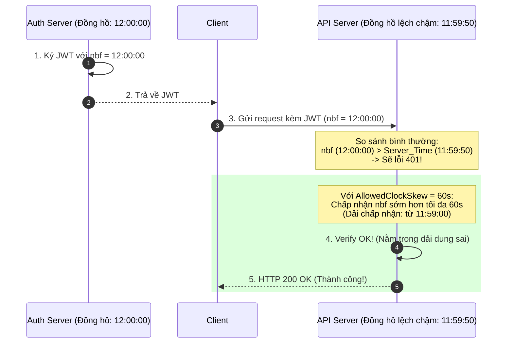

# Clock skew giữa server gây lỗi token. Bạn xử lý ra sao?

## ⚡ Tóm tắt ngắn (30s)
* **Bản chất**: **Clock Skew (Lệch đồng hồ)** là hiện tượng thời gian vật lý của các máy chủ trong hệ thống phân tán bị lệch nhau từ vài giây đến vài phút. Trong cơ chế xác thực JWT, Clock Skew sẽ trực tiếp phá vỡ hai ràng buộc logic cốt lõi: **Not Before (`nbf`)** (Token chưa có hiệu lực) và **Expiration (`exp`)** (Token đã hết hạn). Dẫn đến các lỗi `HTTP 401 Unauthorized` chập chờn rất khó tái hiện.
* **Thảm họa thực chiến được giải quyết**:
  1. **Lỗi xác thực chập chờn (Intermittent 401 Error)**: User vừa đăng nhập thành công ở Auth Service, chuyển hướng sang API Gateway lập tức nhận lỗi `Token not active yet` (do API Gateway chạy chậm hơn Auth Service vài giây).
  2. **Báo động giả (False Alerts)**: Hệ thống giám sát kích hoạt cảnh báo lỗi bảo mật tăng vọt sau khi scale-up các Pod mới trên Kubernetes do một số worker node bị mất đồng bộ thời gian (Out of Sync).
* **Quyết định Senior**:
  1. **Khắc phục ở tầng Ứng dụng (Immediate Mitigation)**: Cấu hình dung sai thời gian lệch (Allowed Clock Skew) từ **30 đến 60 giây** trong thư viện JWT Decoder của tất cả API Gateway và Resource Servers.
  2. **Khắc phục ở tầng Hệ thống (Root Cause Fix)**: Triển khai đồng bộ hóa thời gian tuyệt đối bằng **NTP (Network Time Protocol)** / `chrony` trên toàn bộ các Host vật lý và Kubernetes Worker Nodes.

---

## 🔍 Chi tiết bản chất thực chiến: Tại sao Clock Skew phá vỡ JWT?

Để hiểu vì sao Clock Skew phá vỡ JWT, hãy xem xét cách thư viện xác thực kiểm tra hai trường thời gian bất biến (Claims):

```
                       [JWT PAYLOAD]
    ┌─────────────────────────────────────────────────┐
    │  "iat": 12:00:00 (Thời điểm phát hành)          │
    │  "nbf": 12:00:00 (Không được dùng trước mốc này)│
    │  "exp": 12:05:00 (Hết hạn lúc này)              │
    └─────────────────────────────────────────────────┘
                             │
                             ▼
  [Kịch bản 1: API Server chạy CHẬM hơn Auth Server 10s (Ví dụ: 11:59:50)]
    ├── Lỗi: System_Time (11:59:50) < nbf (12:00:00)
    └── Kết luận: 🚨 JWT NOT ACTIVE YET! (Lỗi 401 khi vừa login xong)
                             │
                             ▼
  [Kịch bản 2: API Server chạy NHANH hơn Auth Server 10s (Ví dụ: 12:05:05)]
    ├── Lỗi: System_Time (12:05:05) > exp (12:05:00)
    └── Kết luận: 🚨 JWT EXPIRED! (Token bị hết hạn sớm)
```

### 1. Ràng buộc `nbf` (Not Before) bị vi phạm
Khi một User đăng nhập thành công, Auth Service tạo JWT với `nbf = 12:00:00`. Client nhận token và ngay lập tức gọi API ở Resource Server.
* Nếu Resource Server bị **chậm** đồng hồ 5 giây (đang là `11:59:55`).
* Thư viện so sánh: `System.currentTime() (11:59:55) < claims.getNotBefore() (12:00:00)`.
* Kết quả: Ném lỗi `PrematureJwtException` (Token chưa đến giờ sử dụng).

### 2. Ràng buộc `exp` (Expiration) bị vi phạm
Auth Service tạo JWT với `exp = 12:05:00` (hạn dùng 5 phút).
* Nếu Resource Server bị **nhanh** đồng hồ 10 giây (thời gian thực tế là `12:04:55` nhưng đồng hồ của nó chỉ `12:05:05`).
* Thư viện so sánh: `System.currentTime() (12:05:05) > claims.getExpiration() (12:05:00)`.
* Kết quả: Ném lỗi `ExpiredJwtException` mặc dù thực tế hạn dùng của token vẫn còn 5 giây.

---

## 🎨 Sơ đồ trực quan: Cơ chế AllowedClockSkew giải cứu Token

Sơ đồ dưới đây minh họa cách cấu hình `AllowedClockSkew = 60s` giúp Resource Server chấp nhận Token bị lệch thời gian một cách an toàn:



---

## 💻 Code thực chiến: Cấu hình AllowedClockSkew & Đồng bộ NTP trên Production

### 1. Cấu hình Allowed Clock Skew trong Java Spring Boot (Spring Security)
Sử dụng `NimbusJwtDecoder` để thiết lập khoảng dung sai (Clock Skew) 60 giây khi xác thực Token.

```java
package com.example.auth.config;

import org.springframework.context.annotation.Bean;
import org.springframework.context.annotation.Configuration;
import org.springframework.security.config.annotation.web.builders.HttpSecurity;
import org.springframework.security.oauth2.jwt.JwtDecoder;
import org.springframework.security.oauth2.jwt.NimbusJwtDecoder;
import org.springframework.security.oauth2.jwt.DelegatingOAuth2TokenValidator;
import org.springframework.security.oauth2.jwt.JwtValidators;
import org.springframework.security.oauth2.jwt.JwtTimestampValidator;
import org.springframework.security.web.SecurityFilterChain;
import java.time.Duration;

@Configuration
public class SecurityConfig {

    @Bean
    public SecurityFilterChain filterChain(HttpSecurity http) throws Exception {
        http
            .oauth2ResourceServer(oauth2 -> oauth2
                .jwt(jwt -> jwt.decoder(jwtDecoder()))
            );
        return http.build();
    }

    @Bean
    public JwtDecoder jwtDecoder() {
        String jwkSetUri = "https://identity.company.com/.well-known/jwks.json";
        NimbusJwtDecoder jwtDecoder = NimbusJwtDecoder.withJwkSetUri(jwkSetUri).build();

        // Đặt khoảng dung sai Clock Skew là 60 giây để xử lý lệch đồng hồ phân tán
        Duration allowedSkew = Duration.ofSeconds(60);
        
        // Khởi tạo validator mặc định của Spring Security kèm theo Clock Skew cấu hình
        JwtTimestampValidator timestampValidator = new JwtTimestampValidator(allowedSkew);
        
        // Kết hợp với các Validator mặc định khác (như Issuer, Audience)
        jwtDecoder.setJwtValidator(new DelegatingOAuth2TokenValidator<>(
                JwtValidators.createDefault(), 
                timestampValidator
        ));

        return jwtDecoder;
    }
}
```

### 2. File cấu hình Chrony (NTP) đồng bộ thời gian trên Server Linux
Duy trì đồng hồ máy chủ chính xác đến mức mili-giây bằng cách cài đặt và cấu hình `chrony`.

```ini
# Đường dẫn: /etc/chrony/chrony.conf

# Sử dụng pool máy chủ NTP công cộng gần khu vực châu Á
pool asia.pool.ntp.org iburst

# Cho phép tăng/giảm tốc độ đồng hồ dần dần nếu lệch dưới 1 giây
# Nếu lệch trên 1 giây, cho phép nhảy bước đồng hồ (step) trong 3 lần cập nhật đầu tiên
makestep 1.0 3

# Lưu trữ sai số của clock vật lý để tự động bù trừ khi mất mạng
driftfile /var/lib/chrony/drift

# Ghi nhật ký đồng bộ
log tracking measurements statistics
logdir /var/log/chrony
```
*Lệnh kiểm tra trạng thái đồng bộ trên Linux:*
```bash
# Kiểm tra xem hệ thống đã được đồng bộ với NTP chưa
chronyc tracking
# Xem danh sách máy chủ NTP đang kết nối và độ lệch (Offset)
chronyc sources -v
```

---

## 📊 So sánh giải pháp tầng Hệ thống và tầng Ứng dụng

| Tiêu chí | Giải pháp 1: AllowedClockSkew (App-level) | Giải pháp 2: NTP / Chrony (System-level) |
| :--- | :--- | :--- |
| **Vị trí xử lý** | Viết code cấu hình trong JWT Decoder của dịch vụ Backend. | Cấu hình cài đặt service ở mức Hệ điều hành của Host vật lý. |
| **Độ phức tạp** | **Cực kỳ thấp** (Chỉ cần thêm vài dòng code Java/Spring). | Trung bình (Cần can thiệp hạ tầng DevOps, phân quyền root). |
| **Mục đích** | Bù trừ dung sai tạm thời, xử lý các lệch pha nhỏ dưới 1 phút. | **Giải quyết tận gốc rễ** vấn đề sai lệch đồng hồ của toàn hệ thống. |
| **Rủi ro bảo mật** | Nếu đặt quá lớn (ví dụ > 5 phút), kẻ tấn công có thể lợi dụng kẽ hở thời gian để thực hiện Replay Attack. | Hầu như không có rủi ro nếu sử dụng nguồn NTP đáng tin cậy. |
| **Khuyến nghị** | **Bắt buộc áp dụng song song** để làm lá chắn phòng ngự chiều sâu (Defense-in-depth). | **Bắt buộc cài đặt mặc định** trên tất cả môi trường Production. |

---

## ⚠️ Common Gotchas & Questions follow-up

### 1. Cạm bẫy "AllowedClockSkew quá lớn" (An ninh bảo mật bị đe dọa)
* **Vấn đề**: Nhiều dev khi thấy lỗi `Token Expired` do lệch múi giờ hay clock skew đã vội vã tăng giá trị `AllowedClockSkew` lên **30 phút** hoặc **1 tiếng** để "chữa cháy" nhanh. Điều này vô cùng nguy hiểm vì nó làm vô hiệu hóa thuộc tính bất biến của Token.
* **Hậu quả**: Kẻ tấn công nếu cướp được một JWT đã hết hạn từ 20 phút trước vẫn có thể sử dụng lại (Replay Attack) để gọi vào Gateway, vì Gateway cấu hình dung sai lên đến 1 tiếng vẫn coi Token đó là "hợp lệ".
* **Quy tắc Senior**: Giữ `AllowedClockSkew` luôn nằm trong khoảng từ **30 giây đến tối đa 120 giây**. Không bao giờ được phép đặt cao hơn. Nếu Clock Skew lệch trên 2 phút, đó là lỗi nghiêm trọng của hạ tầng và phải được sửa bằng NTP chứ không phải bằng code.

### 2. Câu hỏi đào sâu từ interviewer
* **Interviewer: "Trong môi trường Docker container chạy trên Kubernetes, làm sao chúng ta đảm bảo thời gian trong container không bị lệch? Chúng ta có cần cài đặt NTP bên trong mỗi Docker image không?"**
* **Trả lời**:
  * **Không**, tuyệt đối không cài đặt NTP Daemon (`chrony`, `ntpd`) bên trong từng Docker image.
  * *Lý do*: Tất cả các Docker Container chạy trên cùng một Kubernetes Worker Node đều chia sẻ chung **Kernel của Host vật lý**. Đồng hồ hệ thống (`system clock`) của container được lấy trực tiếp từ Kernel của Host.
  * *Giải pháp chuẩn*: Chỉ cần cài đặt và kích hoạt dịch vụ NTP đồng bộ thời gian trên chính **Kubernetes Worker Node (Host OS)**. Khi đồng hồ của Host chính xác, đồng hồ của toàn bộ container chạy trên đó sẽ tự động chính xác theo.
