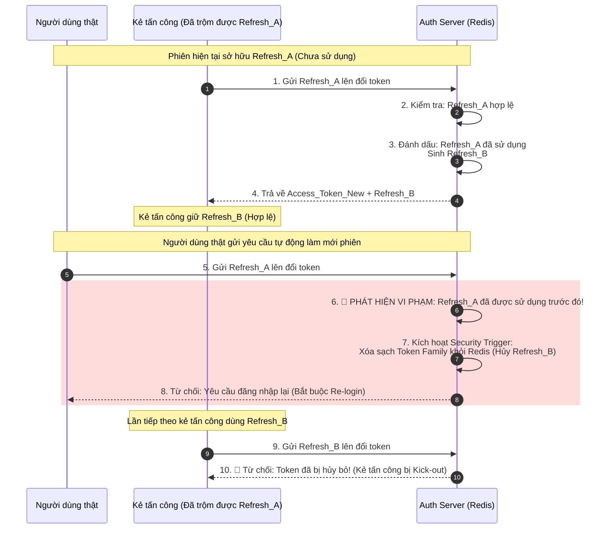

# Refresh token bị reuse. Có rủi ro gì?

## ⚡ Tóm tắt ngắn (30s)
* **Bản chất**: Lỗi tái sử dụng Refresh Token (Refresh Token Reuse) xảy ra khi một Refresh Token đã được dùng để đổi Access Token mới trước đó lại được trình lên máy chủ xác thực lần thứ hai. Rủi ro lớn nhất ở đây là **Chiếm đoạt phiên làm việc (Session Hijacking)**. Nếu kẻ tấn công đánh cắp được Refresh Token của nạn nhân, cả hai sẽ liên tục thực hiện refresh song song và kẻ tấn công có quyền truy cập vĩnh viễn vào tài khoản mà nạn nhân không hề hay biết.
* **Thảm họa thực chiến được giải quyết**:
  1. **Rò rỉ dữ liệu thầm lặng (Silent Session Theft)**: Kẻ tấn công âm thầm thực hiện các giao dịch trái phép mà không bị hệ thống đá ra ngoài vì mỗi lần refresh đều sinh ra phiên hợp lệ mới.
  2. **Không thể thu hồi phiên (Revocation Failure)**: Người dùng thật có đổi mật khẩu thì phiên đăng nhập của kẻ tấn công vẫn tiếp tục được duy trì nếu hệ thống không quản lý liên kết chuỗi Token (Token Family).
* **Quyết định Senior**:
  1. **Triển khai cơ chế Refresh Token Rotation (RTR)**: Mỗi lần Client gửi Refresh Token lên, Auth Server sẽ thu hồi ngay lập tức token đó và trả về **một cặp Access Token mới + Refresh Token mới tinh**.
  2. **Phát hiện tái sử dụng (Reuse Detection)**: Nếu phát hiện một Refresh Token đã nằm trong danh sách "đã sử dụng" được trình lên lần thứ hai, hệ thống coi đây là dấu hiệu bị xâm nhập, lập tức **vô hiệu hóa toàn bộ gia đình Token (Token Family)** của phiên đó, buộc cả người dùng thật và kẻ tấn công phải đăng nhập lại từ đầu để bảo mật.

---

## 🔍 Chi tiết bản chất thực chiến: Rủi ro khổng lồ & Cơ chế RTR (Refresh Token Rotation)

Nếu Refresh Token được thiết kế "tĩnh" (có hạn dùng lâu dài, ví dụ 30 ngày và được tái sử dụng nhiều lần để sinh Access Token mới), hậu quả bảo mật sẽ vô cùng nghiêm trọng.

### 1. Tại sao Refresh Token tĩnh lại nguy hiểm?
* Do Access Token có thời gian sống ngắn (15-30 phút) để giảm thiểu rủi ro, nên Client phải lưu trữ Refresh Token (thời gian sống dài, ví dụ 30 ngày) ở LocalStorage hoặc Cookie để tự động làm mới phiên làm việc.
* Nếu kẻ tấn công sử dụng mã độc XSS hoặc chiếm quyền vật lý thiết bị để đánh cắp Refresh Token:
  1. Kẻ tấn công gửi Refresh Token lên Auth Server ➔ Nhận về Access Token mới hợp lệ.
  2. Người dùng thật cũng gửi Refresh Token đó lên ➔ Vẫn nhận về Access Token mới hợp lệ.
  3. **Kết quả**: Cả hai cùng duy trì phiên làm việc độc lập. Hệ thống hoàn toàn không phát hiện ra sự bất thường.

### 2. Giải pháp Phòng thủ Chiều sâu: Refresh Token Rotation (RTR)
Để giải quyết triệt để lỗi này, tiêu chuẩn OAuth 2.1 khuyến nghị bắt buộc sử dụng **Refresh Token Rotation (RTR)**:

```
[Mỗi lần đổi Access Token, Refresh Token cũng phải xoay vòng]
  
  Lần 1: Client gửi [Refresh_Token_A] ──► Auth Server
                                           │
                        ┌──────────────────┴──────────────────┐
                        ▼                                     ▼
             [Hủy Refresh_Token_A]                 [Trả về: Access_Token_B +
                                                            Refresh_Token_B]
  
  Lần 2: Nếu có kẻ xấu gửi lại [Refresh_Token_A] (Đã sử dụng)
                        │
                        ▼
         🚨 PHÁT HIỆN TÁI SỬ DỤNG (REUSE DETECTED!)
                        │
                        ▼
         [Xóa sạch toàn bộ Session liên quan] ──► Bắt buộc Re-Login
```

### 3. Khái niệm Gia đình Token (Token Family)
Khi người dùng đăng nhập thành công, hệ thống sinh ra một **Token Family ID** cố định (ví dụ `tf_98765`). Mọi cặp Token được xoay vòng sau đó đều mang nhãn ID này.
* Cây phả hệ Token: `Refresh_A` ➔ sinh ra `Refresh_B` ➔ sinh ra `Refresh_C`.
* Nếu kẻ tấn công đánh cắp được `Refresh_B` và gửi lên đổi token trước khi nạn nhân dùng nó. Kẻ tấn công nhận về `Refresh_C_Attacker`.
* Khi nạn nhân gửi `Refresh_B` lên sau đó: Auth Server phát hiện `Refresh_B` đã được sử dụng. Nhờ liên kết chung `Token Family tf_98765`, Auth Server lập tức hủy bỏ cả `Refresh_B`, `Refresh_C_Attacker` và toàn bộ các token khác thuộc Family này. Kẻ tấn công lập tức bị mất quyền truy cập.

---

## 🎨 Sơ đồ trực quan: Phát hiện tấn công chiếm đoạt phiên bằng RTR

Sơ đồ dưới đây minh họa luồng xử lý của hệ thống khi phát hiện kẻ tấn công tái sử dụng Refresh Token cũ đã bị vô hiệu hóa:



---

## 💻 Code thực chiến: Triển khai Refresh Token Rotation (RTR) bằng Java & Redis

Dưới đây là cách cài đặt dịch vụ xử lý Refresh Token trong Java Spring Boot, sử dụng Redis để lưu trạng thái của chuỗi Token và phát hiện reuse.

### 1. Cấu trúc dữ liệu Token Metadata lưu trong Redis
```java
package com.example.auth.model;

import java.io.Serializable;
import java.time.Instant;

public class RefreshTokenMetadata implements Serializable {
    private static final long serialVersionUID = 1L;

    private String token;
    private String tokenFamilyId; // Liên kết chuỗi các token xoay vòng
    private String username;
    private boolean used; // Cờ đánh dấu token đã được sử dụng
    private Instant expiryTime;

    // Getters, Setters, Constructor
    public RefreshTokenMetadata(String token, String tokenFamilyId, String username, Instant expiryTime) {
        this.token = token;
        this.tokenFamilyId = tokenFamilyId;
        this.username = username;
        this.used = false;
        this.expiryTime = expiryTime;
    }
    
    public void markAsUsed() {
        this.used = true;
    }
}
```

### 2. Dịch vụ Xoay vòng Token & Phát hiện Tái sử dụng (Auth Service)
```java
package com.example.auth.service;

import com.example.auth.model.RefreshTokenMetadata;
import org.springframework.beans.factory.annotation.Autowired;
import org.springframework.data.redis.core.RedisTemplate;
import org.springframework.stereotype.Service;
import java.time.Instant;
import java.time.temporal.ChronoUnit;
import java.util.Set;
import java.util.UUID;

@Service
public class TokenRotationService {

    @Autowired
    private RedisTemplate<String, Object> redisTemplate;

    private static final String REDIS_PREFIX = "rt:";
    private static final String FAMILY_PREFIX = "tf:";

    public RefreshTokenResponse rotateToken(String oldTokenString) {
        String oldKey = REDIS_PREFIX + oldTokenString;
        RefreshTokenMetadata oldMetadata = (RefreshTokenMetadata) redisTemplate.opsForValue().get(oldKey);

        if (oldMetadata == null) {
            throw new SecurityException("Refresh Token không tồn tại hoặc đã hết hạn!");
        }

        String familyKey = FAMILY_PREFIX + oldMetadata.getTokenFamilyId();

        // 🚨 BƯỚC QUAN TRỌNG: PHÁT HIỆN TÁI SỬ DỤNG (REUSE DETECTION)
        if (oldMetadata.isUsed()) {
            // Hủy ngay lập tức toàn bộ Token Family
            revokeTokenFamily(oldMetadata.getTokenFamilyId());
            throw new SecurityException("🚨 CẢNH BÁO BẢO MẬT: Refresh Token đã được sử dụng! Toàn bộ session bị thu hồi.");
        }

        // Đánh dấu Token cũ đã sử dụng
        oldMetadata.markAsUsed();
        redisTemplate.opsForValue().set(oldKey, oldMetadata);

        // Sinh Token mới và duy trì cùng Token Family ID
        String newTokenString = UUID.randomUUID().toString();
        Instant newExpiry = Instant.now().plus(7, ChronoUnit.DAYS);
        
        RefreshTokenMetadata newMetadata = new RefreshTokenMetadata(
                newTokenString,
                oldMetadata.getTokenFamilyId(),
                oldMetadata.getUsername(),
                newExpiry
        );

        // Lưu Token mới vào Redis
        String newKey = REDIS_PREFIX + newTokenString;
        redisTemplate.opsForValue().set(newKey, newMetadata);
        
        // Đăng ký token mới vào tập hợp (Set) của Token Family để tiện quản lý xóa hàng loạt
        redisTemplate.opsForSet().add(familyKey, newTokenString);

        return new RefreshTokenResponse(newTokenString, "Access_Token_New_Placeholder");
    }

    private void revokeTokenFamily(String familyId) {
        String familyKey = FAMILY_PREFIX + familyId;
        // Lấy tất cả token thuộc Family này trong Redis
        Set<Object> tokensInFamily = redisTemplate.opsForSet().members(familyKey);
        
        if (tokensInFamily != null) {
            for (Object token : tokensInFamily) {
                // Xóa từng token khỏi Redis
                redisTemplate.delete(REDIS_PREFIX + token.toString());
            }
        }
        // Xóa Set Family
        redisTemplate.delete(familyKey);
    }
}
```

---

## 📊 Bảng so sánh giữa Refresh Token tĩnh và Refresh Token động có Rotation (RTR)

| Tiêu chí | Thiết kế 1: Refresh Token tĩnh (Static) | Thiết kế 2: Refresh Token xoay vòng (RTR) |
| :--- | :--- | :--- |
| **Cơ chế** | Sử dụng một token duy nhất trong suốt thời gian sống (ví dụ 30 ngày) để đổi Access Token. | Mỗi lần đổi Access Token sẽ đồng thời cấp Refresh Token mới và hủy Refresh Token cũ. |
| **Phát hiện tấn công** | **Không thể phát hiện** khi bị rò rỉ token. Kẻ xấu và nạn nhân dùng chung song song. | **Phát hiện ngay lập tức** khi có bất kỳ token cũ nào được tái sử dụng. |
| **Mức độ an toàn** | Thấp (Nếu lộ token, tài khoản bị xâm nhập toàn diện cho đến khi đổi pass). | **Cực kỳ cao** (Kẻ tấn công bị block ngay lập tức khi xảy ra tranh chấp token). |
| **Độ phức tạp Client** | Rất thấp (Client chỉ cần lưu cứng token và gửi đi). | Trung bình (Client phải liên tục cập nhật Refresh Token mới vào bộ lưu trữ sau mỗi API call). |
| **Xử lý Race Condition** | Không bị ảnh hưởng. | **Có rủi ro** nếu Client gửi nhiều request làm mới song song. Cần cơ chế Grace Period. |

---

## ⚠️ Common Gotchas & Questions follow-up

### 1. Cạm bẫy "Lỗi Race Condition trên Client khi mạng lag"
* **Vấn đề**: Trong ứng dụng Web/Mobile thực tế, khi trang web được tải lại, có thể có 3 API requests được kích hoạt đồng thời. Cả 3 requests đều nhận thấy Access Token hết hạn nên cùng gửi lệnh gọi `/refresh` song song.
  * Request 1 đến Auth Server trước ➔ Sinh ra `Refresh_B` hợp lệ và hủy `Refresh_A`.
  * Request 2 và 3 đến chậm hơn vài mili-giây vẫn gửi `Refresh_A`. Auth Server lập tức coi Request 2 & 3 là hành vi "Tái sử dụng trái phép" ➔ Hệ thống lập tức hủy phiên làm việc, bắt user login lại. User bị logout phi lý khi mạng chập chờn!
* **Giải pháp khắc phục (Grace Period)**:
  * Khi đánh dấu một Refresh Token cũ là "đã sử dụng", ta cấp cho nó một **khoảng thời gian ân hạn (Grace Period)** từ **2 đến 5 giây**.
  * Trong khoảng 5 giây này, nếu có request trùng lặp gửi lại Token cũ đó lên, Auth Server vẫn chấp nhận và trả về đúng cặp Token mới đã sinh ở Request 1 thay vì kích hoạt cảnh báo tấn công.

### 2. Câu hỏi đào sâu từ interviewer
* **Interviewer: "Nếu kẻ tấn công đánh cắp được Refresh Token và lập tức gọi API refresh trước cả người dùng thật, thì kẻ tấn công sẽ có token mới hợp lệ, còn người dùng thật gửi sau sẽ bị coi là reuse và bị logout. Vậy kẻ tấn công đã chiến thắng?"**
* **Trả lời**:
  * Đúng là trong mili-giây đầu tiên, kẻ tấn công chiếm được quyền truy cập. Nhưng **chiến thắng đó cực kỳ ngắn ngủi**:
    1. Khi người dùng thật gửi yêu cầu refresh lên sau đó (quá trình này tự động chạy ngầm ở thiết bị của nạn nhân).
    2. Auth Server phát hiện `Refresh_A` (đã bị kẻ tấn công dùng trước đó) bị gửi lại.
    3. Hệ thống kích hoạt chế độ tự hủy: **Xóa sạch toàn bộ Session** của Token Family này khỏi Redis.
    4. Cả người dùng thật và kẻ tấn công đều bị hủy quyền truy cập ngay lập tức. Kẻ tấn công bị đá văng (kick-out) ở request tiếp theo.
    5. Nạn nhân đăng nhập lại và sinh ra một Token Family mới hoàn toàn an toàn. Giải pháp RTR đảm bảo kẻ tấn công không thể âm thầm chiếm đoạt tài khoản lâu dài.
