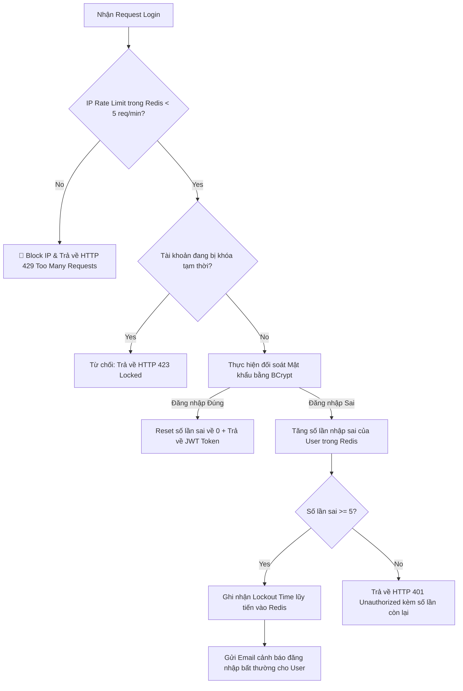

# API bị brute force login. Bạn làm gì?

## ⚡ Tóm tắt ngắn (30s)
* **Bản chất**: Tấn công Brute Force Login (hoặc Credential Stuffing) là hành vi tự động dò quét mật khẩu của kẻ tấn công trên API đăng nhập. Để chống Brute Force hiệu quả, Senior Engineer không bao giờ dựa vào một giải pháp đơn lẻ, mà phải triển khai **Chiến lược Phòng thủ đa tầng (Defense-in-depth)** kết hợp: **IP Rate Limiting** (Chặn nguồn spam), **Account Lockout Policy** (Khóa tài khoản lũy tiến), và **Smart Challenge (CAPTCHA/MFA)** để phân loại bot.
* **Thảm họa thực chiến được giải quyết**:
  1. **Tự hủy dịch vụ (Self-Inflicted DoS via Account Lockout)**: Dev cấu hình rule "Khóa tài khoản vĩnh viễn sau 5 lần nhập sai". Kẻ tấn công lợi dụng điều này quét qua hàng loạt User ID của hệ thống khiến 90% khách hàng thật bị khóa tài khoản hàng loạt, làm tê liệt hoạt động kinh doanh mà không cần biết mật khẩu của ai.
  2. **Nghẽn cổ chai Database (DB Exhaustion)**: Mỗi request login yêu cầu truy vấn bcrypt/argon2 hash rất tốn CPU. Kẻ tấn công spam 1000 requests/s làm DB CPU tăng lên 100%, gây sập toàn bộ các dịch vụ phụ thuộc.
* **Quyết định Senior**:
  1. **Tính toán Rate Limit ở tầng Gateway/WAF**: Chặn đứng traffic spam ở rìa hệ thống (Cloudflare, Kong API Gateway) dựa trên IP trước khi request chạm vào Backend App.
  2. **Khóa mềm lũy tiến (Exponential Lockout)**: Thay vì khóa cứng tài khoản, ta tăng thời gian chờ bắt buộc giữa các lần nhập sai kế tiếp (`5s` -> `30s` -> `5m` -> `1h`) lưu trong Redis.
  3. **Tích hợp Invisible CAPTCHA (Cloudflare Turnstile/reCAPTCHA v3)**: Chỉ kích hoạt thử thách khi hệ thống phát hiện hành vi đáng ngờ (Risk Score cao), giúp bảo toàn trải nghiệm mượt mà của khách hàng thật.

---

## 🔍 Chi tiết bản chất thực chiến: Kiến trúc Phòng thủ 4 Tầng (Defense-in-Depth)

Hệ thống chống Brute Force chuẩn Enterprise được chia làm 4 bức tường phòng thủ vững chắc:

```
[Kẻ Tấn Công / Bot Spam Requests 🚨]
                   │
                   ▼
  [Tầng 1: NETWORK & GATEWAY EDGE (WAF / KONG)]
    └── Chặn IP spam nhanh chóng, lọc IP từ các nhà mạng hosting (AWS, DigitalOcean).
                   │
                   ▼
  [Tầng 2: APPLICATION LEVEL IP RATE LIMIT (REDIS)]
    └── Giới hạn tối đa 5 requests login/phút trên mỗi IP.
                   │
                   ▼
  [Tầng 3: ACCOUNT LOCKOUT POLICY (REDIS METADATA)]
    └── Khóa tạm thời tài khoản theo cơ chế lũy tiến thời gian (Exponential Backoff).
                   │
                   ▼
  [Tầng 4: SMART CHALLENGE & ALERTS (CAPTCHA / MFA)]
    └── Yêu cầu nhập CAPTCHA/OTP. Gửi cảnh báo "Đăng nhập bất thường" cho User thật.
```

### Tầng 1: Network & Edge Gateway (WAF / API Gateway)
* Sử dụng Web Application Firewall (WAF) như Cloudflare để cấu hình chặn các dải IP không thuộc khu vực phục vụ (ví dụ: Chặn IP nước ngoài nếu app chỉ chạy ở Việt Nam).
* Phát hiện hành vi "Credential Stuffing" khi có một IP đăng nhập thành công vào nhiều tài khoản khác nhau trong thời gian ngắn.

### Tầng 2: Giới hạn tần suất ở tầng App bằng Redis Sliding Window
* Giới hạn tần suất gọi API `/api/v1/auth/login` theo địa chỉ IP của Client.
* Sử dụng thuật toán **Sliding Window Log** hoặc **Token Bucket** lưu trên Redis để đảm bảo tính thời gian thực cao và không bị bypass ở ranh giới các block thời gian (Fixed Window).

### Tầng 3: Khóa tài khoản lũy tiến (Exponential Backoff Lockout)
* Để chống việc kẻ tấn công dò hàng ngàn mật khẩu trên một tài khoản cụ thể. Ta đếm số lần đăng nhập sai của `username` trong Redis:
  * Sai 3 lần: Yêu cầu chờ 30 giây mới được thử lại.
  * Sai 5 lần: Khóa tài khoản trong 15 phút.
  * Sai 10 lần: Khóa tài khoản trong 24 giờ và gửi Email cảnh báo đổi mật khẩu cho user.

### Tầng 4: Thử thách thông minh (Smart Challenge)
* Tích hợp **Cloudflare Turnstile** hoặc **Google reCAPTCHA v3**. Các dịch vụ này chạy ngầm dưới Client, phân tích hành vi của user (di chuyển chuột, tốc độ gõ phím) để trả về một điểm rủi ro (Risk Score từ 0.0 đến 1.0).
* Nếu Score < 0.5 (nghi ngờ là Bot), Backend sẽ yêu cầu Client hiển thị CAPTCHA hoặc gửi mã OTP về số điện thoại/email để xác minh danh tính.

---

## 🎨 Sơ đồ trực quan: Luồng xử lý Brute Force tự động khóa IP và tài khoản

Sơ đồ dưới đây mô tả luồng kiểm tra đa tầng khi nhận request đăng nhập từ Client để phòng chống Brute Force:



---

## 💻 Code thực chiến: Redis Sliding Window Rate Limiter bằng Lua Script & Java

Sử dụng Redis Lua Script đảm bảo việc đếm số request và kiểm tra thời gian trượt (Sliding Window) được thực hiện dưới dạng một thao tác nguyên tử (Atomic Operation), loại bỏ hoàn toàn lỗi Race Condition.

### 1. Lua Script triển khai Sliding Window Rate Limiter (lưu ở `src/main/resources/scripts/sliding_window.lua`)
```lua
local key = KEYS[1]
local now = tonumber(ARGV[1])
local window = tonumber(ARGV[2])
local limit = tonumber(ARGV[3])
local clearBefore = now - window

-- 1. Xóa các request cũ nằm ngoài khung thời gian trượt (window)
redis.call('ZREMRANGEBYSCORE', key, 0, clearBefore)

-- 2. Đếm số lượng request hiện tại trong window
local currentRequests = redis.call('ZCARD', key)

-- 3. Kiểm tra xem có vượt quá giới hạn (limit) hay không
if currentRequests < limit then
    -- Thêm request hiện tại vào Sorted Set (Score = Timestamp, Value = Unique ID/Timestamp)
    redis.call('ZADD', key, now, now)
    -- Đặt thời gian sống cho Key bằng kích thước Window để tự động giải phóng bộ nhớ
    redis.call('EXPIRE', key, window)
    return 1 -- Chấp nhận request (Success)
else
    return 0 -- Từ chối request (Rate limited)
end
```

### 2. Triển khai Java Service gọi Lua Script trong Spring Boot
```java
package com.example.auth.security;

import org.springframework.beans.factory.annotation.Autowired;
import org.springframework.core.io.ClassPathResource;
import org.springframework.data.redis.core.StringRedisTemplate;
import org.springframework.data.redis.core.script.DefaultRedisScript;
import org.springframework.scripting.support.ResourceScriptSource;
import org.springframework.stereotype.Service;
import java.time.Instant;
import java.util.Collections;

@Service
public class IpRateLimiterService {

    @Autowired
    private StringRedisTemplate redisTemplate;

    private final DefaultRedisScript<Long> script;

    public IpRateLimiterService() {
        this.script = new DefaultRedisScript<>();
        this.script.setResultType(Long.class);
        this.script.setScriptSource(new ResourceScriptSource(new ClassPathResource("scripts/sliding_window.lua")));
    }

    public boolean isAllowed(String ipAddress) {
        String key = "rate:login:ip:" + ipAddress;
        long now = Instant.now().toEpochMilli();
        long windowSizeMs = 60000; // Khung thời gian trượt: 1 Phút (60,000 ms)
        long maxLimit = 5; // Giới hạn tối đa: 5 requests/phút trên mỗi IP

        // Thực thi Lua Script một cách nguyên tử (Atomic) trên Redis
        Long result = redisTemplate.execute(
                script,
                Collections.singletonList(key),
                String.valueOf(now),
                String.valueOf(windowSizeMs),
                String.valueOf(maxLimit)
        );

        return result != null && result == 1;
    }
}
```

---

## 📊 Bảng so sánh 3 thuật toán Rate Limiting phổ biến

| Tiêu chí | Thuật toán 1: Fixed Window (Cửa sổ cố định) | Thuật toán 2: Sliding Window (Cửa sổ trượt) | Thuật toán 3: Token Bucket (Giỏ thẻ) |
| :--- | :--- | :--- | :--- |
| **Bản chất** | Reset bộ đếm ở các mốc thời gian cố định (ví dụ: đúng 12:00, 12:01). | Lưu trữ lịch sử tất cả request dưới dạng Sorted Set để tính toán chính xác dải thời gian trượt. | Sinh các Token vào giỏ với tốc độ đều đặn, request lấy Token ra để thực thi. |
| **Ưu điểm** | Đơn giản, tốn rất ít bộ nhớ Redis (chỉ lưu 1 key String đếm số). | **Tuyệt đối chính xác**, loại bỏ lỗi bùng nổ request ở ranh giới cửa sổ (Boundary Burst). | Hỗ trợ xử lý các đợt bùng nổ traffic ngắn hạn (Burst Traffic) rất tốt. |
| **Nhược điểm** | Kẻ tấn công có thể spam gấp đôi giới hạn ở ranh giới giữa 2 block thời gian. | Tốn nhiều bộ nhớ Redis hơn vì phải lưu trữ timestamp của tất cả request active. | Cấu hình tham số phức tạp hơn (tốc độ sinh token, dung tích tối đa của giỏ). |
| **Độ phù hợp** | Các API thường, ít rủi ro bảo mật. | **Các API nhạy cảm cao** như Login, Đổi mật khẩu, Thanh toán. | Giới hạn traffic diện rộng cho toàn bộ hệ thống API Gateway. |

---

## ⚠️ Common Gotchas & Questions follow-up

### 1. Cạm bẫy "Tự sát bằng chính sách Khóa tài khoản cứng" (Account Lockout DoS)
* **Vấn đề**: Rất nhiều hệ thống cấu hình: Đăng nhập sai 5 lần ➔ Set `is_locked = true` trực tiếp vào bảng `users` trong Database. Kẻ tấn công chỉ cần viết một script Python đơn giản lấy danh sách email/username công khai của các doanh nghiệp, gửi 5 request login sai mật khẩu lên hệ thống.
  * **Hậu quả**: Toàn bộ nhân viên và khách hàng của doanh nghiệp đó lập tức bị khóa tài khoản vĩnh viễn, CSKH quá tải, hoạt động vận hành tê liệt. Kẻ tấn công thực hiện thành công một vụ DDoS logic mà không cần hạ tầng mạnh.
* **Giải pháp khắc phục của Senior**:
  1. Tuyệt đối không khóa cứng tài khoản ở Database cho các lỗi đăng nhập thông thường.
  2. Chỉ ghi nhận số lần sai vào **Redis Cache** kèm TTL (Time-To-Live). Nếu bị spam, hệ thống chỉ khóa tạm thời (ví dụ: khóa 15 phút, hết 15 phút tự mở).
  3. Khi phát hiện số lần sai tăng, bắt buộc chuyển hướng sang thử thách CAPTCHA. CAPTCHA là bức tường ngăn bot hiệu quả nhất mà không làm phiền hay khóa tài khoản của người dùng thật.

### 2. Câu hỏi đào sâu từ interviewer
* **Interviewer: "Giả sử kẻ tấn công vượt qua IP Rate Limit bằng cách sử dụng mạng Botnet (hàng triệu IP khác nhau, mỗi IP chỉ gửi 1 request login). Lúc này IP Rate Limit hoàn toàn vô dụng. Bạn giải quyết thế nào?"**
* **Trả lời**:
  * Khi đối đầu với mạng Botnet phân tán (DDoS Brute Force), IP Rate Limit riêng lẻ sẽ không còn hiệu quả. Ta phải chuyển sang cơ chế phòng thủ dựa trên **Hành vi (Behavioral Limiting) & Tài sản đích (Target Asset Protection)**:
    1. **Rate Limit theo Target Account (Username/Email)**: Giới hạn số lần thử đăng nhập vào **cùng một tài khoản** bất kể request đến từ IP nào (ví dụ: 1 tài khoản chỉ được thử tối đa 10 lần/phút từ mọi nguồn).
    2. **WAF Threat Intelligence**: Cloudflare/AWS WAF sở hữu danh sách dải IP của các VPN công cộng, các mạng Botnet đã biết, và các hosting provider (AWS, GCP, DigitalOcean - nơi hacker thường thuê VPS để chạy script). Ta cấu hình chặn hoặc kích hoạt CAPTCHA bắt buộc với toàn bộ request đi ra từ các nguồn này.
    3. **Kiểm tra Risk Score**: Phân tích Browser Fingerprint (Header, User-Agent, TLS Fingerprint) để nhận diện các yêu cầu giả lập trình duyệt và chặn đứng chúng.
