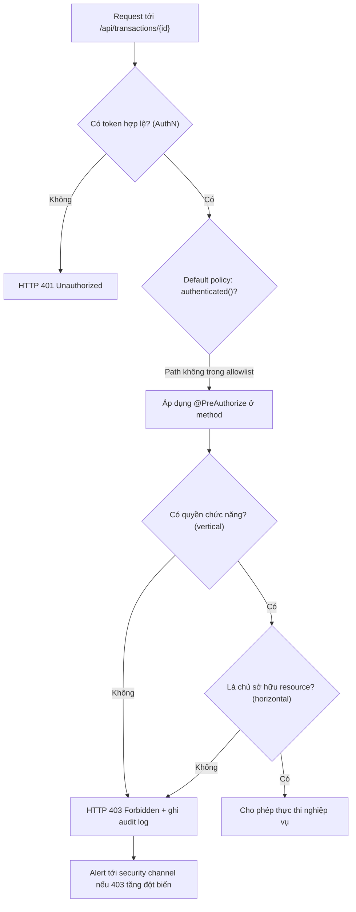

# Một endpoint thiếu authorization check. Bạn xử lý incident thế nào?

## ⚡ Tóm tắt ngắn (30s)
* **Bản chất**: Đây là lỗ hổng **Broken Access Control (OWASP A01:2021)** — loại lỗi bảo mật phổ biến và nguy hiểm nhất hiện nay. Endpoint đã được **authenticated** (hệ thống biết bạn là ai qua JWT/session) nhưng thiếu **authorization** (không kiểm tra bạn *có quyền* thực hiện hành động đó không). Senior Engineer xử lý theo runbook chuẩn **Impact → Stabilize → Evidence → Isolate → Fix → Prevent**, tuyệt đối không hoảng loạn deploy bừa.
* **Thảm họa thực chiến được giải quyết**:
  1. **Leo thang đặc quyền dọc (Vertical Privilege Escalation)**: Endpoint `POST /api/admin/users/{id}/role` không có check `ADMIN`, một user thường gọi thẳng API (qua Postman) tự nâng mình thành admin.
  2. **Truy cập chức năng ẩn (Forced Browsing)**: Frontend ẩn nút "Xóa giao dịch" với user thường, nhưng API `DELETE /api/transactions/{id}` lại để `permitAll`. Kẻ tấn công đoán URL và xóa dữ liệu trực tiếp — *security by obscurity là vô dụng*.
* **Quyết định Senior**:
  1. **Chặn khẩn cấp ở rìa (Stabilize trước, Fix sau)**: Tắt route qua **feature flag** hoặc chặn path tại API Gateway/WAF ngay lập tức để cầm máu, trước khi có thời gian viết fix đúng.
  2. **Điều tra phạm vi khai thác (Evidence)**: Grep access log tìm các request đã gọi vào endpoint trước khi vá, xác định ai đã gọi, truy cập/sửa ID nào để đánh giá thiệt hại thật.
  3. **Vá bằng default-deny + method security**: Áp `@PreAuthorize` ở tầng service, đồng thời siết `anyRequest().authenticated()` làm mặc định, không bao giờ tin frontend đã ẩn nút.

---

## 🔍 Chi tiết bản chất thực chiến: Incident Runbook 6 bước

Khi nhận report (từ pentest, bug bounty, hoặc log bất thường) rằng một endpoint thiếu authorization, ta KHÔNG vội sửa code ngay. Trình tự xử lý của Senior là cầm máu trước, mổ xẻ sau:

```
[🚨 Phát hiện endpoint thiếu authz]
                │
                ▼
  [1. IMPACT] Endpoint nào? Lộ dữ liệu/hành động gì? Đã bị khai thác chưa?
                │
                ▼
  [2. STABILIZE] Tắt feature flag / chặn path ở Gateway. Cầm máu tức thì.
                │
                ▼
  [3. EVIDENCE] Grep access log: ai đã gọi, truy cập ID nào, từ khi nào?
                │
                ▼
  [4. ISOLATE] Khoanh vùng dữ liệu/tài khoản bị ảnh hưởng để khắc phục hậu quả.
                │
                ▼
  [5. FIX] Thêm @PreAuthorize + ownership check. Default-deny toàn cục.
                │
                ▼
  [6. PREVENT] Security test, code-review checklist, kiến trúc deny-by-default.
```

### Bước 1-2: Đánh giá tác động & Cầm máu
* **Authentication ≠ Authorization**: Phải xác định chính xác lỗi thuộc loại nào. *Authentication* = "bạn là ai" (đăng nhập). *Authorization* = "bạn được phép làm gì" (phân quyền). Endpoint này đã có token hợp lệ nhưng thiếu lớp thứ hai.
* **Phân biệt leo thang dọc vs ngang**:
  * **Vertical**: user thường truy cập chức năng của admin (nguy hiểm hơn).
  * **Horizontal**: user A truy cập dữ liệu của user B cùng cấp (xem chi tiết ở câu IDOR/BOLA).
* **Cầm máu không cần code**: Nếu endpoint không phải nghiệp vụ sống còn, tắt ngay bằng feature flag hoặc thêm rule chặn `path` tại Kong/Nginx/WAF. Việc này nhanh hơn và an toàn hơn việc vội vàng deploy một bản hotfix chưa được review.

### Bước 3-4: Thu thập bằng chứng & Khoanh vùng
* Lỗ hổng đã tồn tại bao lâu? Dùng `git blame` trên file controller/security config để biết từ commit nào.
* Grep access log (Kibana/Loki) theo path + method, lọc ra danh sách `userId` đã gọi. So sánh với danh sách user *đáng lẽ* có quyền → ra danh sách truy cập trái phép.
* Nếu endpoint là ghi/sửa/xóa: đối chiếu audit log để khôi phục hoặc cô lập các bản ghi đã bị thay đổi trái phép.

### Bước 5-6: Vá đúng cách & Phòng ngừa
* **Không vá kiểu vá lá tre**: Thêm một dòng `if (role != ADMIN) throw` rải rác trong controller là chống chỉ định. Phải tập trung hóa: dùng `@PreAuthorize` của Spring Security (chạy ở tầng method, AOP-based) để authorization không thể bị quên khi thêm endpoint mới qua controller khác.
* **Default-deny**: Cấu hình security filter chain để mặc định *mọi* request đều phải `authenticated()`, và liệt kê tường minh (allowlist) các path public. Cách này biến lỗi "quên thêm check" từ *fail-open* (nguy hiểm) thành *fail-closed* (an toàn).

---

## 🎨 Sơ đồ trực quan: Luồng xử lý authorization theo deny-by-default



---

## 💻 Code thực chiến: BAD vs GOOD

### ❌ BAD: Tin tưởng frontend đã ẩn nút, endpoint để hở
```java
@RestController
@RequestMapping("/api/transactions")
public class TransactionController {

    // ❌ Không có annotation phân quyền. Bất kỳ ai có token đều xóa được
    //    giao dịch của BẤT KỲ user nào chỉ bằng cách đoán id.
    @DeleteMapping("/{id}")
    public ResponseEntity<Void> delete(@PathVariable Long id) {
        transactionService.delete(id); // ❌ Không kiểm tra ownership
        return ResponseEntity.noContent().build();
    }
}

// ❌ Security config fail-open: quên liệt kê là tự động public
http.authorizeHttpRequests(auth -> auth
    .requestMatchers("/api/admin/**").hasRole("ADMIN")
    .anyRequest().permitAll() // ❌ Thảm họa: mặc định cho qua tất cả
);
```

### ✅ GOOD: Default-deny + method security + ownership check
```java
@RestController
@RequestMapping("/api/transactions")
public class TransactionController {

    // ✅ Authorization tập trung ở tầng method qua AOP, không thể vô tình bỏ sót.
    //    Vừa check quyền chức năng (vertical) vừa check chủ sở hữu (horizontal).
    @DeleteMapping("/{id}")
    @PreAuthorize("hasAuthority('TRANSACTION_DELETE') " +
                  "and @transactionSecurity.isOwner(#id, authentication)")
    public ResponseEntity<Void> delete(@PathVariable Long id) {
        transactionService.delete(id);
        return ResponseEntity.noContent().build();
    }
}

@Component("transactionSecurity")
public class TransactionSecurity {
    private final TransactionRepository repo;
    public TransactionSecurity(TransactionRepository repo) { this.repo = repo; }

    public boolean isOwner(Long id, Authentication auth) {
        Long currentUserId = ((AppUserDetails) auth.getPrincipal()).getId();
        // ✅ So khớp chủ sở hữu ngay tại tầng dữ liệu, không tin client
        return repo.findById(id)
                   .map(t -> t.getOwnerId().equals(currentUserId))
                   .orElse(false);
    }
}
```

```java
// ✅ Security config fail-closed: mặc định CHẶN, chỉ mở tường minh
@Bean
SecurityFilterChain filterChain(HttpSecurity http) throws Exception {
    http
      .authorizeHttpRequests(auth -> auth
        .requestMatchers("/api/public/**", "/actuator/health").permitAll()
        .anyRequest().authenticated()) // ✅ Quên check = bị chặn, không phải mở
      .csrf(csrf -> csrf.disable()); // API stateless dùng JWT
    return http.build();
}
```

---

## 📊 Bảng so sánh: Nên enforce authorization ở tầng nào?

| Tầng enforce | Cơ chế | Ưu điểm | Hạn chế / Lưu ý |
| :--- | :--- | :--- | :--- |
| **API Gateway / WAF** | Match path + role thô | Cầm máu nhanh, chặn diện rộng | Không hiểu nghiệp vụ (không biết ai sở hữu resource) |
| **Filter chain (URL-based)** | `authorizeHttpRequests` | Default-deny toàn cục, dễ audit | Khó biểu diễn quyền theo từng object cụ thể |
| **Method security** | `@PreAuthorize` (AOP) | Gần logic, không bị quên khi thêm controller | Phải bật `@EnableMethodSecurity` |
| **Domain / Data layer** | Ownership check, Row-Level Security | Chống cả IDOR, nguồn sự thật cuối cùng | Tốn 1 truy vấn để xác thực chủ sở hữu |

> **Senior insight**: Không chọn một tầng duy nhất. Dùng **filter chain làm lưới mặc định (deny-by-default)** + **method security cho quyền chức năng** + **data layer cho ownership**. Phòng thủ nhiều lớp.

---

## ⚠️ Common Gotchas & Questions follow-up

### 1. Cạm bẫy "Security by obscurity" và Actuator hở
* **Vấn đề**: Dev nghĩ "URL này không ai biết" nên không cần bảo vệ. Thực tế kẻ tấn công dùng tool fuzzing (ffuf, Burp Intruder) quét hàng nghìn path/giây. Đặc biệt nguy hiểm là các endpoint `/actuator/**` (Spring Boot) — `/actuator/env`, `/actuator/heapdump` để lộ secret và toàn bộ RAM nếu quên bảo vệ.
* **Giải pháp**: Mặc định chặn tất cả, chỉ mở allowlist. Đưa `/actuator/**` (trừ `/health`) vào sau xác thực `hasRole('ACTUATOR_ADMIN')`.

### 2. Câu hỏi đào sâu từ interviewer
* **Interviewer: "Sau khi vá xong, làm sao bạn đảm bảo lỗi này KHÔNG tái diễn ở một endpoint mới do dev khác viết 6 tháng sau?"**
* **Trả lời**:
  1. **Kiến trúc fail-closed**: `anyRequest().authenticated()` biến việc "quên" thành lỗi an toàn (403) thay vì lỗ hổng (200). Đây là biện pháp phòng ngừa mạnh nhất vì nó không phụ thuộc kỷ luật con người.
  2. **Security test tự động**: Viết integration test cho mỗi endpoint nhạy cảm, gọi với token của user *không có quyền* và assert nhận `403`. Đưa test này vào CI để chặn merge.
  3. **Code-review checklist + ArchUnit**: Thêm rule ArchUnit kiểm tra mọi method trong `@RestController` của package nghiệp vụ phải có annotation phân quyền, fail build nếu thiếu.
  4. **Lưu ý trung thực**: Không có biện pháp nào *đảm bảo 100%* — phòng thủ nhiều lớp chỉ giảm xác suất và thu hẹp thiệt hại. Vì vậy vẫn cần pentest định kỳ và bug bounty làm lưới an toàn cuối.
