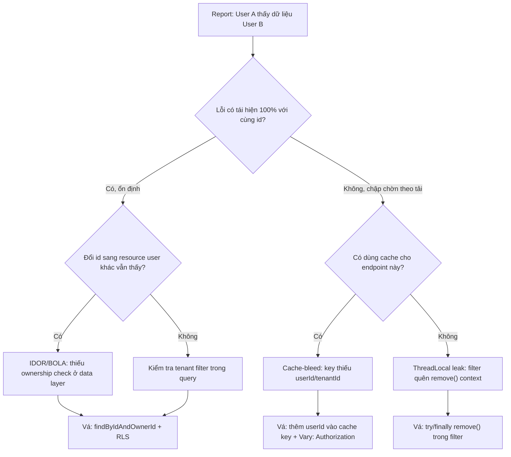

# User A thấy dữ liệu của User B. Bạn điều tra và khắc phục ra sao? (IDOR/BOLA)

## ⚡ Tóm tắt ngắn (30s)
* **Bản chất**: Đây là lỗ hổng **IDOR (Insecure Direct Object Reference)** — tên gọi mới trong OWASP API Security là **BOLA (Broken Object Level Authorization, API1:2023)**. Hệ thống nhận `id` do client cung cấp và trả về object tương ứng mà **không kiểm tra object đó có thuộc về user đang gọi hay không**. Nhưng "User A thấy dữ liệu User B" có thể đến từ **4 nguyên nhân gốc rất khác nhau**, và Senior phải phân biệt được trước khi vá, nếu không sẽ vá nhầm chỗ.
* **Thảm họa thực chiến được giải quyết**:
  1. **IDOR kinh điển**: `GET /api/orders/1042` trả về đơn hàng của người khác chỉ vì backend gọi `findById(1042)` mà không check `ownerId`. ID tuần tự dễ đoán → kẻ tấn công vét sạch dữ liệu bằng vòng lặp.
  2. **Cache key collision**: Cache theo key thiếu định danh user (ví dụ key = `"profile"` thay vì `"profile:" + userId`), khiến response của user B bị trả cho user A — *rò rỉ chéo mà code authorization vẫn đúng*.
* **Quyết định Senior**: Điều tra để phân biệt 4 nguyên nhân (**IDOR / Cache-bleed / ThreadLocal leak / Thiếu tenant filter**), rồi:
  1. **Cầm máu**: Tắt cache nghi ngờ hoặc bật lại ownership check, ưu tiên dừng rò rỉ.
  2. **Vá ở tầng dữ liệu**: Chuyển `findById(id)` → `findByIdAndOwnerId(id, currentUser)`, không tin `id` từ client.
  3. **Phòng ngừa hệ thống**: Row-Level Security / Hibernate filter theo `tenant_id` để authorization không thể bị quên.

---

## 🔍 Chi tiết bản chất thực chiến: Cây chẩn đoán 4 nguyên nhân

"User A thấy dữ liệu user B" là *triệu chứng*, không phải *bệnh*. Bốn nguyên nhân gốc hoàn toàn khác nhau:

```
[🚨 User A thấy dữ liệu User B]
                │
    ┌───────────┼───────────────┬────────────────────┐
    ▼           ▼               ▼                    ▼
[1. IDOR]   [2. Cache-bleed] [3. ThreadLocal]   [4. Tenant filter thiếu]
findById     key thiếu        leak chéo phiên     query không lọc
không check  userId           trong thread pool   tenant_id
ownership
```

### Nguyên nhân 1: IDOR/BOLA — thiếu ownership check
* Tái hiện: đăng nhập user A, đổi `id` trong URL thành resource của user B → nếu thấy data = IDOR xác nhận.
* Dấu hiệu trong code: `repository.findById(pathId)` rồi trả thẳng, không so `ownerId`.
* **Lỗi tư duy phổ biến**: "Dùng UUID thay vì ID tuần tự là an toàn". **Sai** — UUID chỉ làm khó đoán (giảm enumeration), *không phải* cơ chế authorization. Nếu UUID lộ qua URL chia sẻ, log, Referer header thì vẫn truy cập được. Authorization phải dựa trên *danh tính người gọi*, không dựa trên *độ khó đoán của id*.

### Nguyên nhân 2: Cache-bleed (rò rỉ qua cache)
* Tái hiện: lỗi *không ổn định* — lúc thấy lúc không, phụ thuộc ai vào cache trước. Đây là dấu hiệu nhận biết quan trọng phân biệt với IDOR (IDOR luôn tái hiện được).
* Nguyên nhân: cache key thiếu chiều `userId`/`tenantId`, hoặc cache HTTP response ở CDN/Nginx mà không phân biệt theo `Authorization` header.

### Nguyên nhân 3: ThreadLocal leak (rò rỉ chéo phiên)
* Tái hiện: cũng không ổn định, xảy ra dưới tải cao. `UserContext` lưu trong `ThreadLocal` nhưng filter quên `remove()`, thread quay lại pool còn giữ context của user trước.
* Dấu hiệu: dữ liệu lộ đúng bằng *user vừa xử lý trên cùng thread đó*.

### Nguyên nhân 4: Thiếu tenant filter (đa người thuê)
* Trong hệ thống multi-tenant (SaaS), query quên điều kiện `WHERE tenant_id = ?` → trả về dữ liệu của tenant khác. Thường do thiếu Hibernate `@Filter` hoặc viết native query bỏ sót.

---

## 🎨 Sơ đồ trực quan: Luồng điều tra IDOR/BOLA



---

## 💻 Code thực chiến: BAD vs GOOD

### ❌ BAD: Tin id từ client, cache key thiếu định danh
```java
@GetMapping("/api/orders/{id}")
public OrderDto getOrder(@PathVariable Long id) {
    // ❌ IDOR: lấy order theo id mà không kiểm tra ai là chủ sở hữu
    return orderService.findById(id);
}

@Cacheable("userProfile") // ❌ Cache-bleed: key mặc định không chứa userId
public ProfileDto currentProfile() {
    Long uid = SecurityUtils.currentUserId();
    return profileRepo.findByUserId(uid);
}
```

### ✅ GOOD: Ownership ràng buộc ngay trong query + cache key có userId
```java
@GetMapping("/api/orders/{id}")
public OrderDto getOrder(@PathVariable Long id, @AuthenticationPrincipal AppUser user) {
    // ✅ Ownership là một phần của truy vấn: không thể trả về order của người khác.
    //    Trả 404 (không phải 403) để tránh tiết lộ "id này có tồn tại".
    return orderRepo.findByIdAndOwnerId(id, user.getId())
                    .map(OrderMapper::toDto)
                    .orElseThrow(() -> new ResourceNotFoundException("Order not found"));
}

// ✅ Cache key chứa userId → mỗi user một entry riêng, không rò rỉ chéo
@Cacheable(value = "userProfile", key = "#user.id")
public ProfileDto currentProfile(AppUser user) {
    return profileRepo.findByUserId(user.getId());
}
```

```sql
-- ✅ Phòng ngừa tận gốc bằng PostgreSQL Row-Level Security (RLS):
-- DB tự lọc theo tenant, dù lập trình viên quên WHERE thì cũng không rò rỉ.
ALTER TABLE orders ENABLE ROW LEVEL SECURITY;

CREATE POLICY tenant_isolation ON orders
    USING (tenant_id = current_setting('app.current_tenant')::bigint);
-- Mỗi connection set: SET app.current_tenant = '<tenant_id_của_request>';
```

---

## 📊 Bảng so sánh 4 nguyên nhân "rò rỉ dữ liệu chéo user"

| Tiêu chí | IDOR/BOLA | Cache-bleed | ThreadLocal leak | Thiếu tenant filter |
| :--- | :--- | :--- | :--- | :--- |
| **Tính tái hiện** | 100%, ổn định | Chập chờn theo cache | Chập chờn theo tải | 100% với query lỗi |
| **Dữ liệu lộ là của ai** | Bất kỳ id nào đoán được | User vào cache trước | User vừa dùng cùng thread | Tenant bất kỳ |
| **Nguồn lỗi** | Thiếu ownership check | Key thiếu userId | Quên `remove()` | Query bỏ `tenant_id` |
| **Cách vá** | `findByIdAndOwnerId` + RLS | Thêm userId vào key | `try/finally remove()` | Hibernate `@Filter` / RLS |

---

## ⚠️ Common Gotchas & Questions follow-up

### 1. Cạm bẫy "404 vs 403" và enumeration
* **Vấn đề**: Trả `403 Forbidden` khi user truy cập resource không thuộc về mình *vô tình tiết lộ* rằng resource đó tồn tại. Kẻ tấn công dùng nó để liệt kê (enumerate) id hợp lệ trong hệ thống.
* **Giải pháp**: Với resource user không sở hữu, trả `404 Not Found` (như thể nó không tồn tại). Chỉ dùng `403` khi muốn báo rõ "bạn thiếu vai trò chức năng" trong các ngữ cảnh không tiết lộ tồn tại.

### 2. Câu hỏi đào sâu từ interviewer
* **Interviewer: "Hệ thống của bạn có hàng trăm endpoint. Làm sao chống IDOR một cách hệ thống thay vì sửa từng cái một?"**
* **Trả lời**:
  1. **Đẩy authorization xuống tầng dữ liệu**: Dùng **Row-Level Security** (Postgres) hoặc **Hibernate `@Filter`** tự động chèn điều kiện `tenant_id`/`owner_id` vào *mọi* query. Lập trình viên không thể "quên" vì DB/ORM tự áp.
  2. **Set tenant context một chỗ duy nhất**: Trong một filter, đọc `tenant_id` từ token đã xác thực và `SET` vào session DB. Authorization trở thành thuộc tính của kết nối, không phải của từng dòng code.
  3. **Test tự động**: Với mỗi endpoint, viết test "user A gọi resource của user B → 404". Đưa vào CI.
  4. **Lưu ý trung thực**: RLS rất mạnh nhưng *không* bảo vệ các thao tác chạy bằng connection privileged (job batch, admin). Phải kiểm soát riêng các đường đó — không có giải pháp nào "set-and-forget" tuyệt đối.
