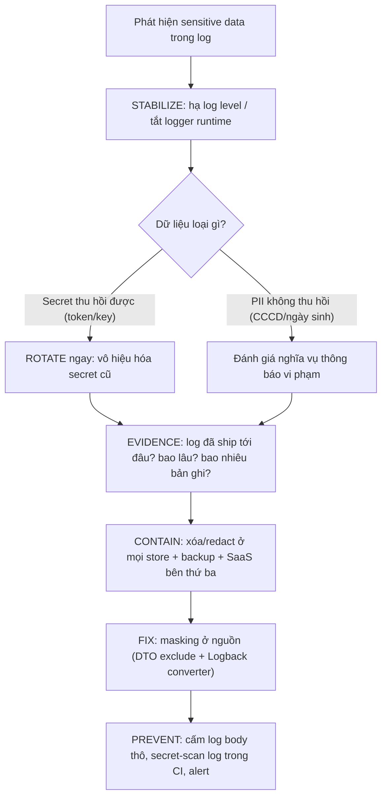

# Sensitive data bị log ra production. Bạn làm gì?

## ⚡ Tóm tắt ngắn (30s)
* **Bản chất**: Dữ liệu nhạy cảm (mật khẩu, token, số thẻ/PAN, CCCD, OTP) bị ghi vào log production là một **data exposure incident**. Điểm chí mạng mà nhiều người bỏ qua: log thường được **chuyển tiếp sang hệ thống bên thứ ba** (Datadog, ELK SaaS, Splunk) và lưu nhiều bản sao, nên không thể chỉ "xóa file log trên server" là xong. Senior xử lý theo **Impact → Stabilize → Evidence → Contain → Fix → Prevent**, và coi mọi secret đã lộ là **đã bị xâm phạm** dù chưa có bằng chứng bị đọc.
* **Thảm họa thực chiến được giải quyết**:
  1. **`toString()` lộ toàn bộ entity**: `log.info("Login attempt: {}", user)` với `@Data` của Lombok sinh `toString()` chứa cả `passwordHash`, `email`, `phone`. Một dòng log tưởng vô hại làm lộ PII của toàn bộ user.
  2. **Token trong URL bị Nginx access-log nuốt trọn**: `GET /reset?token=abc...` — access log của Nginx/Gateway mặc định ghi full query string, token reset password nằm phơi bày trong log nhiều tháng.
* **Quyết định Senior**:
  1. **Cầm máu trước**: Hạ log level / vô hiệu hóa logger lỗi qua config động, hoặc deploy hotfix masking — *dừng việc ghi thêm* ngay.
  2. **Đánh giá phạm vi & rotate**: Xác định log đã đi tới đâu (bên thứ ba?), bao lâu, bao nhiêu bản ghi. **Rotate ngay mọi secret đã lộ** (token, key) vì xóa log không "thu hồi" được thứ có thể đã bị đọc.
  3. **Vá tận gốc bằng masking ở nguồn**: DTO loại trừ field nhạy cảm, masking converter ở Logback, cấm log request body thô.

---

## 🔍 Chi tiết bản chất thực chiến: Vì sao "xóa log" là chưa đủ

### Bước 1-2: Impact & Stabilize (cầm máu)
* **Phân loại mức độ**: secret *có thể thu hồi* (token, API key — rotate được) vs dữ liệu *không thể thu hồi* (CCCD, ngày sinh, địa chỉ — đã lộ là lộ vĩnh viễn). Cách xử lý hai loại khác nhau.
* **Cầm máu không cần đợi deploy**: Hầu hết framework cho phép đổi log level lúc runtime (Spring Boot Actuator `/loggers`, hoặc reload `logback.xml`). Hạ logger đang ghi nhạy cảm xuống `OFF` ngay để dừng dòng máu, trong lúc chuẩn bị bản vá masking đúng.

### Bước 3-4: Evidence & Contain (phạm vi & khoanh vùng)
* **Truy nguồn lan tỏa của log**: Đây là bước quan trọng nhất. Hỏi: log này được ship đi đâu? Hầu hết hệ thống production đẩy log sang **log aggregator tập trung** (ELK, Loki, Datadog, CloudWatch). Mỗi nơi là một bản sao cần xử lý. Nếu là **SaaS bên thứ ba**, dữ liệu đã rời khỏi tầm kiểm soát của bạn — vấn đề data residency/tuân thủ.
* **Xóa có chủ đích**: Xóa/redact các bản ghi chứa secret trong tất cả các store (kể cả cold storage, backup). Với SaaS, dùng API xóa của họ và yêu cầu xác nhận.
* **Rotate mọi secret đã lộ**: Giả định kẻ xấu *đã đọc* (nguyên tắc assume-breach). Token reset → vô hiệu hóa, key → rotate (xem câu API key leak), session → revoke, bắt user đổi mật khẩu nếu password lộ.

### Bước 5-6: Fix & Prevent (vá & phòng ngừa)
* **Mask ở nguồn, không ở đích**: Lọc tại điểm ghi log, không phải hy vọng log aggregator lọc giúp. Ba lớp:
  1. **Loại trừ ở DTO/entity**: dùng `@ToString.Exclude` (Lombok) cho field nhạy cảm; không bao giờ log object thô.
  2. **Masking converter ở Logback**: pattern thay thế regex (số thẻ → `**** **** **** 1234`).
  3. **Cấm log request/response body** ở interceptor, hoặc allowlist field được phép log.
* **Không log token trong URL**: Chuyển secret từ query string sang header/body; cấu hình access log bỏ qua query string nhạy cảm.

---

## 🎨 Sơ đồ trực quan: Quy trình ứng phó sự cố log lộ dữ liệu



---

## 💻 Code thực chiến: BAD vs GOOD

### ❌ BAD: Log cả object, để lộ qua toString()
```java
@Data // ❌ Lombok sinh toString() chứa MỌI field, kể cả passwordHash
public class User {
    private String email;
    private String passwordHash;
    private String phone;
}

public void login(User user) {
    // ❌ Một dòng này ghi cả email + passwordHash + phone vào log
    log.info("Login attempt for user: {}", user);
}
```

### ✅ GOOD: Loại trừ field nhạy cảm + masking converter
```java
@Getter @Setter
@ToString // chỉ in field an toàn
public class User {
    private String email;

    @ToString.Exclude            // ✅ Không bao giờ xuất hiện trong toString()
    private String passwordHash;

    @ToString.Exclude
    private String phone;
}

public void login(User user) {
    // ✅ Chỉ log định danh không nhạy cảm (id), không log object thô
    log.info("Login attempt for userId={}", user.getId());
}
```

```xml
<!-- ✅ Logback masking converter: thay regex số thẻ/token trước khi ghi -->
<configuration>
  <conversionRule conversionWord="mask"
      converterClass="com.example.logging.MaskingConverter"/>
  <appender name="STDOUT" class="ch.qos.logback.core.ConsoleAppender">
    <encoder>
      <pattern>%d{ISO8601} %-5level %logger - %mask</pattern>
    </encoder>
  </appender>
</configuration>
```

```java
// ✅ Converter che số thẻ (giữ 4 số cuối) và bearer token
public class MaskingConverter extends MessageConverter {
    private static final Pattern PAN = Pattern.compile("\\b\\d{12}(\\d{4})\\b");
    private static final Pattern TOKEN = Pattern.compile("(?i)(bearer\\s+)[A-Za-z0-9._-]+");

    @Override
    public String convert(ILoggingEvent event) {
        String msg = super.convert(event);
        msg = PAN.matcher(msg).replaceAll("**** **** **** $1");
        msg = TOKEN.matcher(msg).replaceAll("$1***");
        return msg;
    }
}
```

---

## 📊 Bảng so sánh các lớp phòng vệ chống log lộ dữ liệu

| Lớp phòng vệ | Cơ chế | Ưu điểm | Hạn chế |
| :--- | :--- | :--- | :--- |
| **DTO exclude** | `@ToString.Exclude`, không log object thô | Chặn ngay tại nguồn, hiệu năng tốt | Phụ thuộc kỷ luật dev, dễ sót field mới |
| **Logback masking converter** | Regex thay thế khi ghi | Lưới an toàn cho mọi logger | Regex tốn CPU, có thể sót định dạng lạ |
| **Cấm log body ở interceptor** | Allowlist field được phép log | Chặn cả request/response thô | Mất thông tin debug hữu ích |
| **Secret-scan log trong CI** | gitleaks/regex quét mẫu | Phát hiện hồi quy sớm | Chỉ phát hiện, không ngăn runtime |

---

## ⚠️ Common Gotchas & Questions follow-up

### 1. Cạm bẫy "Stack trace và DEBUG log lộ nhiều hơn bạn nghĩ"
* **Vấn đề**: Exception stack trace của lỗi SQL có thể in cả câu query kèm tham số (chứa email, số điện thoại). Log ở mức `DEBUG` của framework (Hibernate show-sql, Feign full logging, Spring Security) in cả header `Authorization`. Bật DEBUG trên production để debug rồi quên tắt là kịch bản rò rỉ cực phổ biến.
* **Giải pháp**: Cấm `DEBUG`/`TRACE` của các package nhạy cảm trên production qua config; review cẩn thận khi tạm bật DEBUG và tắt ngay sau khi xong.

### 2. Câu hỏi đào sâu từ interviewer
* **Interviewer: "Log đã bị đẩy sang một SaaS giám sát bên thứ ba 3 tháng nay. Bạn không xóa được tận gốc trên hạ tầng của họ. Bạn xử lý thế nào?"**
* **Trả lời**:
  1. **Coi như đã bị xâm phạm**: Mọi secret trong log đó (token, key) phải được **rotate ngay**, vì ta không kiểm soát được ai đã truy cập log SaaS.
  2. **Dùng kênh xóa của nhà cung cấp**: Mở ticket yêu cầu họ xóa/redact theo hợp đồng DPA (Data Processing Agreement), lấy xác nhận bằng văn bản, rà soát ai trong team có quyền truy cập SaaS đó.
  3. **Đánh giá nghĩa vụ thông báo**: Nếu là PII của người dùng, phối hợp với pháp chế/DPO để đánh giá nghĩa vụ thông báo vi phạm theo quy định hiện hành (ví dụ Nghị định 13/2023 về bảo vệ dữ liệu cá nhân ở Việt Nam) — tôi *trình bày sự việc cho bộ phận pháp chế quyết định*, không tự ý kết luận.
  4. **Phòng ngừa**: Bật masking *trước* khi ship sang aggregator (lọc tại agent/sidecar), để log rời server đã sạch — không phụ thuộc vào việc xóa sau ở bên thứ ba.
