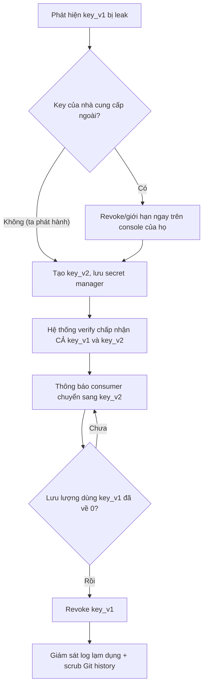

# API key bị leak. Quy trình rotate như thế nào?

## ⚡ Tóm tắt ngắn (30s)
* **Bản chất**: API key bị lộ (commit lên Git, lọt vào log, để trong app mobile bị decompile) là sự cố cần xử lý theo nguyên tắc vàng: **rotate, đừng chỉ xóa**. Xóa key khỏi lịch sử Git *không* thu hồi được key — nó đã có thể bị bot quét Git (GitGuardian, các crawler) thu thập trong vài giây. Quy trình rotate chuẩn của Senior dùng cơ chế **dual-key overlap (hai khóa song song)** để xoay vòng *không gây downtime*: tạo key mới → triển khai → chuyển traffic → thu hồi key cũ → giám sát.
* **Thảm họa thực chiến được giải quyết**:
  1. **Xóa commit nhưng vẫn bị lạm dụng**: Dev thấy key trong code, `git rm` + commit mới rồi yên tâm. Nhưng key vẫn nằm trong Git history và đã bị bot quét. Hôm sau hóa đơn cloud tăng vọt vì key bị dùng đào coin.
  2. **Rotate kiểu "big bang" gây sập dịch vụ**: Thu hồi key cũ trước khi consumer kịp nhận key mới → toàn bộ tích hợp đối tác chết đồng loạt, vì không có cửa sổ chồng lấp.
* **Quyết định Senior**:
  1. **Ưu tiên thu hồi/giới hạn ngay**: Nếu là key của nhà cung cấp ngoài (AWS, Stripe), vô hiệu hóa/đặt giới hạn quyền ngay trên console của họ để cầm máu.
  2. **Dual-key rotation**: Hệ thống chấp nhận *cả key cũ lẫn mới* trong một cửa sổ chồng lấp, để consumer chuyển dần, sau đó mới revoke key cũ.
  3. **Phòng ngừa tận gốc**: Đưa secret vào **secret manager** (Vault/AWS Secrets Manager), dùng credential ngắn hạn, bật secret-scanning chặn commit.

---

## 🔍 Chi tiết bản chất thực chiến: Quy trình rotate 6 bước

```
[🚨 API key bị leak]
        │
        ▼
[1. ĐÁNH GIÁ] Key nào? Quyền gì? Lộ ở đâu (Git/log/client)? Đã bị dùng chưa?
        │
        ▼
[2. CẦM MÁU] Key nhà cung cấp ngoài -> disable/giới hạn ngay trên console của họ.
        │
        ▼
[3. TẠO KEY MỚI] Sinh key mới, lưu vào secret manager (KHÔNG vào code).
        │
        ▼
[4. TRIỂN KHAI CHỒNG LẤP] Hệ thống chấp nhận cả key cũ + mới (dual-key window).
        │
        ▼
[5. CHUYỂN & THU HỒI] Mọi consumer dùng key mới -> revoke key cũ.
        │
        ▼
[6. GIÁM SÁT] Theo dõi lưu lượng key cũ về 0, soi log lạm dụng, scrub Git history.
```

### Bước 1-2: Đánh giá blast radius & cầm máu
* **Xác định quyền của key (scope)**: Key chỉ đọc hay ghi? Truy cập được tài nguyên nào? Một key Stripe `sk_live` lộ là khẩn cấp tối đa (rút tiền); một key đọc tỷ giá ít nghiêm trọng hơn. Mức độ phản ứng tỷ lệ với quyền của key.
* **Cầm máu phụ thuộc loại key**:
  * Key của **nhà cung cấp ngoài**: vào dashboard của họ revoke/regenerate ngay — ta kiểm soát được.
  * Key **do hệ thống ta phát hành** cho đối tác: vào DB/secret store đánh dấu `revoked`, nhưng cần dual-key để không sập đối tác.

### Bước 3-5: Dual-key rotation (xoay vòng không downtime)
* **Vì sao cần chồng lấp**: Nếu revoke key cũ ngay khi tạo key mới, mọi client còn dùng key cũ sẽ lỗi tức thì. Giải pháp là giai đoạn hai key cùng hợp lệ:
  1. Tạo `key_v2`, lưu vào secret manager.
  2. Cấu hình hệ thống verify chấp nhận **cả `key_v1` và `key_v2`**.
  3. Triển khai/thông báo consumer cập nhật sang `key_v2`.
  4. Theo dõi metric "số request dùng `key_v1`" giảm về 0.
  5. Khi về 0 (hoặc hết hạn cửa sổ), **revoke `key_v1`**.
* **Tự động hóa**: Secret manager (Vault, AWS Secrets Manager) hỗ trợ rotation tự động theo lịch + multi-version, nên rotate trở thành thao tác định kỳ, không phải sự kiện hoảng loạn.

### Bước 6: Giám sát & dọn dẹp
* **Scrub Git history nếu lộ qua Git**: Dùng `git filter-repo` (hoặc BFG) để xóa khỏi lịch sử, *nhưng* coi như key đã chết — đây chỉ là vệ sinh, không phải biện pháp bảo mật. Key vẫn phải được rotate bất kể.
* Soi log nhà cung cấp tìm dấu hiệu lạm dụng trong khoảng thời gian key bị lộ.

---

## 🎨 Sơ đồ trực quan: Dual-key rotation không downtime



---

## 💻 Code thực chiến: BAD vs GOOD

### ❌ BAD: Hardcode key, một key duy nhất, không rotate được
```java
public class PaymentClient {
    // ❌ Key nằm trong source code -> commit lên Git là lộ vĩnh viễn trong history
    private static final String API_KEY = "sk_live_a1b2c3d4e5f6...";

    public void charge(Order o) {
        httpClient.post("/charge")
                  .header("Authorization", "Bearer " + API_KEY) // ❌ một key cứng
                  .body(o).execute();
    }
}
```

### ✅ GOOD: Lấy key từ secret manager, hỗ trợ multi-version
```java
@Service
public class PaymentClient {
    private final SecretManager secrets; // bọc Vault/AWS Secrets Manager

    public PaymentClient(SecretManager secrets) { this.secrets = secrets; }

    public void charge(Order o) {
        // ✅ Lấy key hiện hành lúc runtime; rotate ở secret manager không cần deploy lại
        String apiKey = secrets.getCurrent("payment.api_key");
        httpClient.post("/charge")
                  .header("Authorization", "Bearer " + apiKey)
                  .body(o).execute();
    }
}
```

```java
// ✅ Phía hệ thống PHÁT HÀNH key: verify chấp nhận nhiều version trong cửa sổ rotate
@Component
public class ApiKeyVerifier {
    private final ApiKeyRepository repo;

    public boolean isValid(String presentedKey) {
        // ✅ Tra cứu bằng hash của key, chấp nhận cả version cũ chưa hết hạn (dual-key)
        String hash = Hashing.sha256(presentedKey);
        return repo.findByKeyHash(hash)
                   .filter(k -> k.getStatus() == ACTIVE)
                   .filter(k -> k.getExpiresAt().isAfter(Instant.now()))
                   .isPresent();
    }
}
```

```bash
# ✅ Xóa key khỏi toàn bộ Git history (chỉ là dọn dẹp — VẪN phải rotate key!)
git filter-repo --replace-text <(echo 'sk_live_a1b2c3d4e5f6==>***REMOVED***')
# Bot quét Git có thể đã lấy key trong vài giây sau khi push -> luôn coi là đã lộ.
```

---

## 📊 Bảng so sánh chiến lược quản lý & rotate key

| Tiêu chí | Hardcode trong code | Biến môi trường (.env) | Secret Manager (Vault/AWS SM) |
| :--- | :--- | :--- | :--- |
| **Rủi ro lộ qua Git** | Rất cao (vào history) | Trung bình (nếu commit nhầm) | Thấp (không nằm trong repo) |
| **Rotate không downtime** | Không thể (phải deploy) | Khó (restart pod) | Có (multi-version + reload) |
| **Phân quyền truy cập key** | Không | Mọi pod đọc được | Có (policy theo service) |
| **Audit ai đọc key** | Không | Không | Có (access log của manager) |
| **Tự động rotate định kỳ** | Không | Không | Có |

---

## ⚠️ Common Gotchas & Questions follow-up

### 1. Cạm bẫy "Xóa khỏi Git là an toàn" và key trong app mobile
* **Vấn đề 1**: `git rm` rồi commit mới chỉ xóa ở HEAD; key vẫn nằm trong các commit cũ và đã có thể bị bot thu thập. **Luôn rotate**, đừng chỉ xóa.
* **Vấn đề 2**: Nhúng API key của dịch vụ trả phí (bản đồ, SMS) thẳng vào app mobile/SPA. Mọi thứ chạy trên client đều **decompile/inspect được** — không có "secret" nào trên client là bí mật. Giải pháp: gọi qua backend proxy của mình (giữ key ở server), hoặc dùng key bị giới hạn theo domain/bundle-id + quota.

### 2. Câu hỏi đào sâu từ interviewer
* **Interviewer: "Làm sao giảm thiệt hại khi key chắc chắn sẽ lộ vào một ngày nào đó, dù bạn cẩn thận đến đâu?"**
* **Trả lời**:
  1. **Least privilege + scoping**: Mỗi key chỉ cấp đúng quyền tối thiểu (read-only nếu chỉ cần đọc), giới hạn theo IP allowlist, theo resource. Key lộ thì thiệt hại bị giới hạn trong phạm vi đó.
  2. **Credential ngắn hạn thay vì key tĩnh**: Ưu tiên token có thời hạn ngắn (OAuth2 client-credentials, AWS STS, Vault dynamic secrets). Key sống vài phút thì cửa sổ khai thác rất hẹp — đây là phòng thủ mạnh hơn nhiều so với key tĩnh "bảo vệ thật kỹ".
  3. **Phát hiện sớm**: Bật secret-scanning (gitleaks pre-commit + push protection của Git host) để chặn commit ngay, và giám sát anomaly (lưu lượng/địa lý bất thường) để phát hiện lạm dụng.
  4. **Trung thực**: Không thể *đảm bảo* key không bao giờ lộ; chiến lược đúng là *thiết kế để chịu được việc lộ* (least-privilege + short-lived + phát hiện nhanh + rotate dễ).
