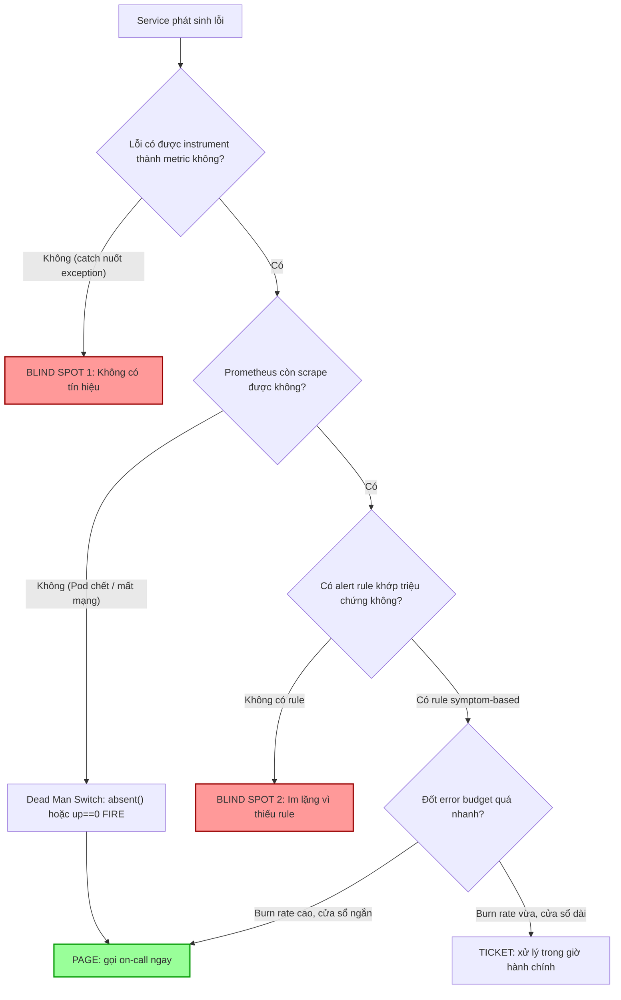

# Service lỗi nhưng không có alert. Bạn cải thiện thế nào?

## ⚡ Tóm tắt ngắn (30s)
* **Bản chất**: "Service lỗi nhưng không có alert" là một **lỗ hổng quan sát (observability blind spot)**. Nó xảy ra vì một trong bốn nguyên nhân gốc: (1) **Không thu thập tín hiệu** (metric chưa được instrument), (2) **Thiếu rule alert** cho tín hiệu đó, (3) **Ngưỡng (threshold) sai** — đặt tĩnh quá cao nên không bao giờ chạm, và đặc biệt nguy hiểm là (4) **Không cảnh báo khi mất dữ liệu (no-data)** — service chết hẳn, ngừng phát metric, nên alert dựa trên ngưỡng không bao giờ kích hoạt vì... không có số liệu nào để so sánh.
* **Hướng xử lý Senior**:
  1. **Chuyển từ cause-based sang symptom-based alerting**: Cảnh báo dựa trên **triệu chứng người dùng cảm nhận được** (Four Golden Signals: Latency, Traffic, Errors, Saturation — hoặc RED: Rate/Errors/Duration), không chỉ dựa trên nguyên nhân kỹ thuật rời rạc.
  2. **Gắn alert vào SLO + Error Budget Burn Rate**: Mỗi luồng nghiệp vụ quan trọng phải có SLI → SLO → alert khi đốt error budget quá nhanh.
  3. **Dead Man's Switch (Heartbeat/absent)**: Luôn có một alert kích hoạt khi metric **biến mất** (`absent()` / `up == 0`), bắt được trường hợp service chết câm lặng.
* **Quyết định Senior**: Coi việc thiếu alert là một **bug ưu tiên cao** chứ không phải "thiếu sót nhỏ". Mỗi sự cố không có alert (incident phát hiện bởi khách hàng thay vì hệ thống) phải tạo ra một **action item bổ sung alert** trong postmortem, để "detection gap" thu hẹp dần qua thời gian.

---

## 🔍 Chi tiết bản chất thực chiến: Vì sao service chết mà chuông không reo?

### 1. Bốn tầng có thể đứt gãy của một đường ống cảnh báo
Một alert chỉ kêu khi **toàn bộ chuỗi** sau đây nguyên vẹn. Đứt bất kỳ mắt xích nào → im lặng:

```
[Instrument metric] → [Scrape/Collect] → [Alert Rule khớp] → [Routing tới đúng người] → [Thông báo]
```

* **Đứt ở Instrument**: Code chưa đếm lỗi (ví dụ nuốt exception trong `catch` trống). Không có dữ liệu thì không có gì để cảnh báo.
* **Đứt ở Rule**: Có metric nhưng chưa ai viết rule. Đây là nguyên nhân phổ biến nhất.
* **Đứt ở Threshold**: Rule tồn tại nhưng ngưỡng tĩnh (`errors > 1000/s`) không bao giờ đạt với traffic thật, hoặc ngược lại quá nhạy nên bị tắt đi.
* **Đứt ở No-data**: Đây là cái bẫy chết người. Nếu Pod bị OOMKilled hoặc mất mạng, Prometheus không scrape được → series ngừng cập nhật → rule `rate(errors) > 0.05` đánh giá trên "không có dữ liệu" và **không fire**. Phải có alert riêng cho chính sự vắng mặt này.

### 2. Symptom-based alerting — triết lý cốt lõi của Google SRE
Thay vì cảnh báo "CPU của node-3 cao" (cause), ta cảnh báo "tỷ lệ lỗi của API thanh toán > 1%" (symptom). Lý do:
* **Symptom phản ánh trải nghiệm thật**: User không quan tâm CPU; họ quan tâm request có thành công không.
* **Ít bị bỏ sót**: Một symptom (latency cao) có thể đến từ hàng chục cause khác nhau (DB chậm, GC pause, pool cạn). Cảnh báo symptom bắt được tất cả, kể cả cause chưa từng gặp.
* **Cause metrics dùng để chẩn đoán, không phải để page**: Đẩy chúng vào dashboard và ticket, không gọi điện báo động lúc 3h sáng.

### 3. Error Budget Burn Rate thay cho ngưỡng tĩnh
Với SLO 99.9% (error budget = 0.1%), thay vì hỏi "lỗi có > X không?", ta hỏi "ta đang **đốt error budget nhanh gấp mấy lần** mức cho phép?". Burn rate cao + cửa sổ ngắn → page ngay; burn rate vừa + cửa sổ dài → tạo ticket. Cách này tự thích nghi theo traffic và giảm cả false negative lẫn false positive.

---

## 🎨 Sơ đồ trực quan: Từ lỗ hổng phát hiện đến cảnh báo đa tầng



---

## 💻 Code thực chiến: BAD vs GOOD

### ❌ BAD: Chỉ có ngưỡng tĩnh, không bắt được service chết câm lặng
```yaml
# prometheus/rules.yml — CÁCH SAI
groups:
  - name: payment
    rules:
      # ❌ Ngưỡng tuyệt đối, vô nghĩa khi traffic thay đổi
      - alert: TooManyErrors
        expr: sum(rate(http_requests_total{job="payment",code="500"}[5m])) > 1000
        for: 5m
        # ❌ Nếu Pod chết, series biến mất -> expr không bao giờ true -> KHÔNG fire
        # ❌ Không có nhãn severity, không có runbook, không cảnh báo no-data
```

### ✅ GOOD: Symptom-based theo tỷ lệ + Dead Man's Switch + Burn Rate
```yaml
# prometheus/rules.yml — CHUẨN SENIOR
groups:
  - name: payment-slo
    rules:
      # ✅ 1. Cảnh báo theo TỶ LỆ lỗi (symptom), tự thích nghi theo traffic
      - alert: PaymentHighErrorRateFast
        expr: |
          (
            sum(rate(http_requests_total{job="payment",code=~"5.."}[5m]))
            /
            sum(rate(http_requests_total{job="payment"}[5m]))
          ) > 0.02
        for: 2m
        labels: { severity: page }
        annotations:
          summary: "Tỷ lệ lỗi 5xx của payment > 2% trong 5 phút"
          runbook: "https://wiki/runbooks/payment-errors"

      # ✅ 2. DEAD MAN'S SWITCH: bắt service chết câm lặng (mất metric hoàn toàn)
      - alert: PaymentTargetDown
        expr: up{job="payment"} == 0 or absent(up{job="payment"})
        for: 1m
        labels: { severity: page }
        annotations:
          summary: "Không scrape được payment — service có thể đã chết hoàn toàn"

      # ✅ 3. BURN RATE: đốt error budget gấp 14.4x trong cả cửa sổ 1h và 5m
      - alert: PaymentErrorBudgetBurnFast
        expr: |
          (sum(rate(http_requests_total{job="payment",code=~"5.."}[1h]))
            / sum(rate(http_requests_total{job="payment"}[1h]))) > (14.4 * 0.001)
          and
          (sum(rate(http_requests_total{job="payment",code=~"5.."}[5m]))
            / sum(rate(http_requests_total{job="payment"}[5m]))) > (14.4 * 0.001)
        for: 2m
        labels: { severity: page }
```

```java
// ❌ BAD: nuốt lỗi -> không bao giờ có metric -> không thể alert
try {
    paymentGateway.charge(req);
} catch (Exception e) {
    // im lặng, không log, không đếm
}

// ✅ GOOD: instrument lỗi để alert có dữ liệu mà bắt
try {
    paymentGateway.charge(req);
} catch (Exception e) {
    meterRegistry.counter("payment.charge.errors",
        "reason", classify(e)).increment();   // ✅ đếm lỗi theo nguyên nhân
    log.error("charge failed orderId={}", req.orderId(), e); // ✅ log có ngữ cảnh
    throw e;                                    // ✅ không nuốt lỗi
}
```

---

## 📊 Bảng so sánh: Các chiến lược lấp lỗ hổng cảnh báo

| Tiêu chí | Threshold tĩnh (cũ) | Symptom-based theo tỷ lệ | Error Budget Burn Rate | Dead Man's Switch |
| :--- | :--- | :--- | :--- | :--- |
| **Bắt được service chết câm** | ❌ Không | ❌ Không (mất series) | ❌ Không | ✅ Có (cốt lõi) |
| **Tự thích nghi theo traffic** | ❌ Phải chỉnh tay | ✅ Có (dùng tỷ lệ) | ✅ Có | — |
| **Tỷ lệ báo nhầm (noise)** | Cao | Trung bình | Thấp | Rất thấp |
| **Phản ánh trải nghiệm user** | Thấp | ✅ Cao | ✅ Cao nhất | Gián tiếp |
| **Độ phức tạp cấu hình** | Thấp | Trung bình | Cao | Thấp |
| **Vai trò** | Nên loại bỏ dần | Tuyến phòng thủ chính | Phân loại page/ticket | Lưới an toàn cuối |

---

## ⚠️ Common Gotchas & Questions follow-up

### Cạm bẫy thường gặp
1. **Quên alert no-data**: Đây là lỗ hổng kinh điển. Service càng chết nặng (OOM, mất mạng) thì alert ngưỡng càng im lặng. Luôn cặp đôi mỗi SLO alert với một `absent()`/`up==0`.
2. **Cảnh báo trên cause thay vì symptom**: Tạo ra rừng alert "CPU cao", "disk đầy" nhưng không ai biết user có bị ảnh hưởng không. Cause → dashboard; symptom → page.
3. **Threshold tuyệt đối**: `errors > 1000` đúng hôm nay, sai khi traffic x10 hoặc /10. Luôn dùng **tỷ lệ** hoặc **burn rate**.
4. **Alert không có runbook & owner**: Alert kêu nhưng on-call không biết làm gì → bị bỏ qua → mất niềm tin vào hệ thống alert.

### Câu hỏi đào sâu từ interviewer
* **Interviewer: "Service của bạn có traffic rất thấp vào ban đêm (vài request/phút). Alert theo tỷ lệ lỗi sẽ thế nào khi chỉ 1 request lỗi cũng thành 50%? Bạn xử lý ra sao?"**
* **Trả lời**:
  1. **Vấn đề low-traffic**: Với mẫu nhỏ, tỷ lệ lỗi dao động dữ dội — 1/2 request lỗi = 50%, gây báo nhầm liên tục lúc đêm. Đây là bài toán "statistical significance".
  2. **Giải pháp kết hợp điều kiện về lượng (volume guard)**: Chỉ kích hoạt alert tỷ lệ khi đồng thời có đủ traffic, ví dụ: `error_ratio > 0.05 AND sum(rate(requests[5m])) > 1`. Khi traffic thấp, để burn-rate cửa sổ dài (1h/6h) gánh, vì nó tích lũy đủ mẫu trước khi báo.
  3. **Multi-window multi-burn-rate**: Dùng đồng thời cửa sổ ngắn (phát hiện nhanh sự cố lớn) và cửa sổ dài (ổn định, ít nhiễu cho traffic thấp), yêu cầu cả hai cùng vượt ngưỡng mới page — đúng theo Google SRE Workbook.
  4. **Với job nền/cron đêm**: chuyển hẳn sang heartbeat/last-success-timestamp thay vì tỷ lệ lỗi, vì bản chất chúng không có "traffic" liên tục.
