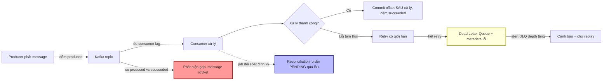

# Làm sao phát hiện lỗi âm thầm trong async processing?

## ⚡ Tóm tắt ngắn (30s)
* **Bản chất**: Xử lý bất đồng bộ (Kafka consumer, message queue, `@Async`, background worker) là nơi lỗi **chết âm thầm** nhất, vì không có ai (user/HTTP response) đứng đợi kết quả để báo lỗi ngay. Một message bị nuốt exception, một consumer ngừng poll, một job rớt giữa chừng — tất cả xảy ra trong im lặng. Producer vẫn "fire-and-forget" tưởng mọi thứ ổn, trong khi message biến mất hoặc kẹt vĩnh viễn.
* **Hướng xử lý Senior**:
  1. **Đo end-to-end, không chỉ đo "đã gửi"**: theo dõi `produced` vs `consumed` vs `succeeded` — nếu lệch là có message rơi.
  2. **Consumer lag + DLQ depth là hai tín hiệu sống còn**: lag tăng = consumer không theo kịp/đã chết; DLQ đầy = message lỗi đang tích tụ.
  3. **Không bao giờ nuốt exception**: mọi lỗi xử lý phải được đếm (metric), log có trace_id, và đẩy vào **Dead Letter Queue (DLQ)** thay vì `catch {}` rỗng.
  4. **Reconciliation định kỳ**: đối soát kết quả nghiệp vụ (vd: mọi order `PENDING` quá 10 phút) để bắt cái mà metric realtime bỏ lỡ.
* **Quyết định Senior**: Async đảo ngược mô hình quan sát — phải **chủ động đo độ trễ và độ hụt (gap)** thay vì chờ lỗi nổ ra. "Im lặng" trong async không có nghĩa là khỏe; nó thường nghĩa là đang mất dữ liệu mà chưa ai biết.

---

## 🔍 Chi tiết bản chất thực chiến: Các kiểu chết âm thầm và cách bắt

### 1. Vì sao async "nuốt" lỗi
* **Không có ai đợi**: HTTP request đồng bộ có client nhận 5xx → biết ngay. Message async không có "client" → lỗi không có nơi trả về.
* **Auto-commit offset sai chỗ**: Kafka consumer commit offset **trước khi** xử lý xong → nếu xử lý fail, offset đã tiến, message **mất vĩnh viễn** mà không retry.
* **Exception bị nuốt**: `try { process() } catch (Exception e) {}` → message coi như xong, lỗi biến mất.
* **Consumer chết câm**: consumer crash/treo/rebalance kẹt → ngừng poll, message chất đống nhưng không có "lỗi" nào fire.

### 2. Bốn nhóm tín hiệu phải giám sát
* **Consumer lag** (`records-lag-max`): khoảng cách giữa offset mới nhất và offset đã xử lý. Lag tăng đều = consumer không theo kịp hoặc đã chết. **Tín hiệu quan trọng số một**.
* **Throughput end-to-end**: so `messages_produced` vs `messages_consumed` vs `messages_succeeded`. Chênh lệch = message rơi hoặc kẹt.
* **DLQ depth**: số message vào Dead Letter Queue. DLQ tăng = lỗi xử lý đang tích tụ; DLQ có message mà không ai xử lý = lỗi bị bỏ quên.
* **Processing outcome rate**: tỷ lệ success/retry/failed của mỗi message — đếm bằng metric, không dựa vào log.

### 3. Dead Letter Queue (DLQ) — không nuốt, mà cách ly
Message xử lý fail sau N lần retry → đẩy vào DLQ (một topic riêng) kèm metadata (lý do, stacktrace, trace_id). Lợi ích: không chặn các message khác (poison message), không mất dữ liệu, và **có thể alert trên DLQ depth + replay** sau khi sửa bug.

### 4. Reconciliation — lưới an toàn cho cái realtime bỏ lỡ
Metric realtime có thể bỏ lỡ lỗi tinh vi (message xử lý "thành công" nhưng kết quả sai). Một job đối soát định kỳ quét trạng thái cuối: "có order nào ở `PENDING_PAYMENT` quá 15 phút không?", "có outbox event nào chưa publish quá 5 phút không?". Đây là cách bắt lỗi logic mà counter không thấy.

### 5. End-to-end latency / freshness SLI
Đo **tuổi của message lúc xử lý xong** (now − message timestamp). Nếu freshness tăng → pipeline đang tụt hậu dù chưa có lỗi rõ ràng.

---

## 🎨 Sơ đồ trực quan: Các điểm giám sát trong pipeline async



---

## 💻 Code thực chiến: BAD vs GOOD

### ❌ BAD: Nuốt exception, auto-commit, không metric, không DLQ
```java
// CÁCH SAI
@KafkaListener(topics = "orders")
public void consume(OrderEvent event) {
    try {
        orderService.process(event);
    } catch (Exception e) {
        // ❌ Nuốt lỗi: message coi như xong, lỗi biến mất không dấu vết
    }
    // ❌ enable.auto.commit=true -> offset commit dù xử lý fail -> mất message
}
```

### ✅ GOOD: Manual commit, đếm outcome, DLQ, đo lag, reconciliation
```java
// ✅ Manual ack + đếm outcome + đẩy DLQ khi hết retry
@KafkaListener(topics = "orders")
public void consume(OrderEvent event, Acknowledgment ack) {
    Timer.Sample s = Timer.start(registry);
    try {
        orderService.process(event);
        registry.counter("orders.consume", "outcome", "success").increment(); // ✅ đếm thật
        ack.acknowledge();                          // ✅ commit SAU khi xử lý xong
    } catch (RetryableException e) {
        registry.counter("orders.consume", "outcome", "retry").increment();
        throw e;                                     // ✅ để retry handler xử lý, KHÔNG nuốt
    } catch (Exception e) {
        registry.counter("orders.consume", "outcome", "failed",
            "reason", e.getClass().getSimpleName()).increment();
        deadLetterPublisher.send(event, e);         // ✅ cách ly poison message vào DLQ
        log.error("order consume failed eventId={} trace_id={}",
            event.id(), MDC.get("trace_id"), e);    // ✅ không nuốt: log có ngữ cảnh
        ack.acknowledge();                           // ✅ đã vào DLQ -> tiến offset an toàn
    } finally {
        s.stop(registry.timer("orders.consume.duration"));
    }
}
```
```promql
# ✅ Alert 1: consumer lag tăng (consumer chết/không theo kịp)
- alert: OrderConsumerLagHigh
  expr: max(kafka_consumergroup_lag{group="order-worker"}) > 10000
  for: 5m
  labels: { severity: page }

# ✅ Alert 2: DLQ đang tích tụ message lỗi
- alert: OrderDlqGrowing
  expr: sum(rate(orders_consume_total{outcome="failed"}[10m])) > 0
  for: 10m
  labels: { severity: page }

# ✅ Alert 3: gap end-to-end (produced nhưng không succeeded)
- alert: OrderPipelineGap
  expr: |
    sum(rate(orders_produced_total[15m]))
    - sum(rate(orders_consume_total{outcome="success"}[15m])) > 0
  for: 15m
```
```java
// ✅ Reconciliation: bắt lỗi logic mà metric realtime bỏ lỡ
@Scheduled(fixedRate = 60000)
public void reconcileStuckOrders() {
    long stuck = orderRepo.countByStatusAndUpdatedBefore(
        "PENDING_PAYMENT", Instant.now().minus(Duration.ofMinutes(15)));
    registry.gauge("orders.stuck.pending", stuck);  // ✅ alert nếu > 0: có đơn kẹt âm thầm
}
```

---

## 📊 Bảng so sánh: Tín hiệu phát hiện lỗi âm thầm trong async

| Tín hiệu | Bắt được gì | Cách đo | Mức ưu tiên |
| :--- | :--- | :--- | :--- |
| **Consumer lag** | Consumer chết / không theo kịp | `kafka_consumergroup_lag` | ⭐ Cao nhất |
| **DLQ depth** | Lỗi xử lý tích tụ, poison message | Đếm message vào DLQ topic | ⭐ Cao |
| **Produced vs Succeeded gap** | Message rơi/kẹt giữa đường | So hai counter end-to-end | Cao |
| **Outcome rate (success/retry/failed)** | Tỷ lệ xử lý thất bại | Counter theo outcome | Cao |
| **End-to-end freshness/latency** | Pipeline tụt hậu | now − message timestamp | Trung bình |
| **Reconciliation** | Lỗi logic, kết quả sai âm thầm | Job quét trạng thái cuối định kỳ | Cao (lưới cuối) |

---

## ⚠️ Common Gotchas & Questions follow-up

### Cạm bẫy thường gặp
1. **`catch (Exception e) {}` rỗng**: Tội lỗi kinh điển. Lỗi biến mất hoàn toàn. Luôn đếm + log + DLQ.
2. **Auto-commit offset trước khi xử lý**: `enable.auto.commit=true` (hoặc commit sớm) → fail là mất message. Dùng manual ack sau khi xử lý xong.
3. **Retry vô hạn cho poison message**: Message lỗi vĩnh viễn retry mãi chặn cả partition. Phải có giới hạn retry → DLQ.
4. **Có DLQ nhưng không ai theo dõi**: DLQ trở thành "nghĩa địa message" không người dọn. Phải alert DLQ depth + quy trình replay.
5. **Chỉ đo "đã gửi"**: Producer đếm "đã produce" rồi yên tâm — không biết consumer có xử lý thành công không. Phải đo end-to-end.
6. **Mất trace context qua queue**: Không propagate trace_id → không debug được message lỗi. (Xem câu correlation ID.)

### Câu hỏi đào sâu từ interviewer
* **Interviewer: "Consumer của bạn báo lag = 0 và không có lỗi nào trong metric, nhưng nghiệp vụ phía dưới (vd: email xác nhận) lại không được gửi cho một số đơn. Lag = 0 nghĩa là đã xử lý hết, vậy lỗi nằm ở đâu và bạn phát hiện kiểu gì?"**
* **Trả lời**:
  1. **Hiểu đúng "lag = 0"**: Lag = 0 chỉ nghĩa là consumer **đã đọc và commit hết offset** — KHÔNG đảm bảo xử lý **đúng**. Message có thể đã được "xử lý thành công" theo nghĩa kỹ thuật (không ném exception, commit offset) nhưng **logic sai** khiến email không gửi (vd: nhánh if bỏ sót, điều kiện sai, hoặc nuốt lỗi ở bước con).
  2. **Đây là lỗi mức ngữ nghĩa, không phải mức vận chuyển**: Lag và outcome counter chỉ thấy tầng "đã nhận/đã chạy", không thấy "kết quả nghiệp vụ có đúng không". Cần một tầng giám sát khác.
  3. **Reconciliation là vũ khí chính**: Job đối soát định kỳ so hai sự thật độc lập: "số đơn `CONFIRMED`" vs "số email `SENT`". Nếu lệch → có đơn xử lý nhưng không gửi email. Đây là cách duy nhất bắt lỗi ngữ nghĩa mà lag/counter bỏ lỡ.
  4. **Idempotency + outbox để truy vết**: Dùng pattern **outbox/inbox** — mỗi tác dụng phụ (gửi email) ghi một bản ghi trạng thái; reconciliation quét bản ghi `PENDING` quá hạn. Vừa phát hiện, vừa cho phép **replay an toàn** nhờ idempotency key.
  5. **Bổ sung business SLI end-to-end**: Đo "tỷ lệ đơn confirmed có email gửi trong 5 phút" như một freshness SLI, alert khi tụt — biến lỗi âm thầm thành tín hiệu có thể page.
  6. **Bài học**: trong async, "không có lỗi" và "lag = 0" là điều kiện cần nhưng không đủ. Phải đối soát **kết quả nghiệp vụ thực tế** chứ không chỉ tín hiệu vận chuyển.
