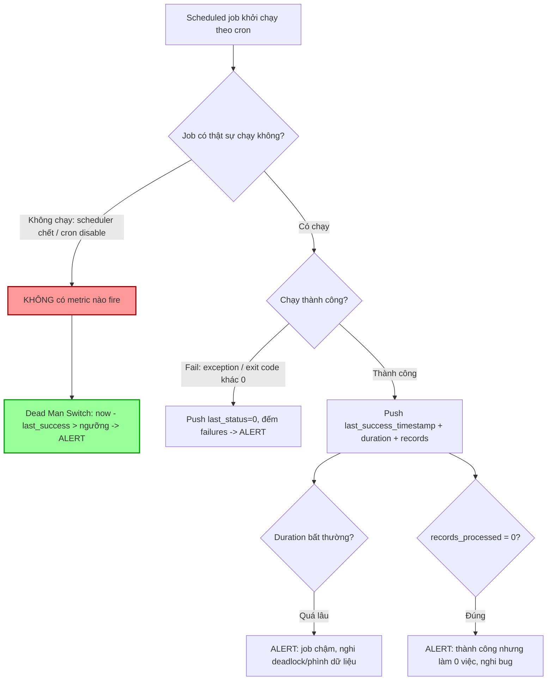

# Một job fail nhưng không ai biết. Bạn thêm monitoring gì?

## ⚡ Tóm tắt ngắn (30s)
* **Bản chất**: Batch job / cron / scheduled task là "vùng tối" của monitoring vì chúng chạy **không liên tục** và **không có ai đứng đợi**. Có hai kiểu fail âm thầm hoàn toàn khác nhau: (1) **Job chạy nhưng lỗi** (ném exception, xử lý sai) và (2) **Job KHÔNG chạy** (scheduler chết, cron bị disable, pod không lên) — kiểu thứ hai nguy hiểm hơn vì **không có tín hiệu nào để bắt** bằng cách thông thường (không có metric nào để vượt ngưỡng vì job đâu có chạy mà phát metric).
* **Hướng xử lý Senior**:
  1. **Dead Man's Switch / Heartbeat**: alert khi job **không báo thành công đúng hạn** — bắt được cả trường hợp job không chạy. Đây là chìa khóa.
  2. **Đẩy metric qua Pushgateway** (vì job ngắn hạn không tồn tại đủ lâu để Prometheus scrape): last_success_timestamp, duration, records_processed, exit status.
  3. **Giám sát ba chiều: success/failure, duration, và khối lượng xử lý** (job "thành công" nhưng xử lý 0 record cũng là bất thường).
* **Quyết định Senior**: Với job, đừng hỏi "có lỗi không" (vì khi không chạy thì chẳng có lỗi nào fire) — hãy hỏi **"lần cuối thành công là bao lâu trước?"**. Alert dựa trên **sự vắng mặt của thành công**, không phải sự hiện diện của lỗi.

---

## 🔍 Chi tiết bản chất thực chiến: Giám sát cái không chạy thường xuyên

### 1. Vì sao job khó giám sát hơn service
* **Service** chạy liên tục → luôn có metric để scrape, alert ngưỡng hoạt động tốt.
* **Job** chạy ngắn rồi tắt → Prometheus pull-based **không kịp scrape** (job có thể chạy 2 giây giữa hai lần scrape 15 giây). Và khi job **không chạy** thì hoàn toàn không có gì để scrape.

### 2. Hai kiểu fail và cách bắt khác nhau
* **Job chạy nhưng FAIL** (exception, exit code ≠ 0): bắt bằng cách đẩy `job_last_status` + đếm `job_failures_total`.
* **Job KHÔNG chạy** (scheduler chết, cron comment nhầm, deploy hỏng, timezone sai): **không có metric nào fire**. Chỉ bắt được bằng **Dead Man's Switch**: theo dõi `time() - job_last_success_timestamp > ngưỡng`. Nếu quá hạn mà không có lần thành công mới → alert. Đây là điểm mấu chốt mà nhiều hệ thống bỏ sót.

### 3. Pushgateway — cầu nối cho job ngắn hạn
Job push metric vào **Pushgateway** trước khi kết thúc; Prometheus scrape Pushgateway (luôn sống). Các metric nên push:
* `batch_job_last_success_timestamp_seconds` (cho Dead Man's Switch).
* `batch_job_duration_seconds` (phát hiện job chậm bất thường).
* `batch_job_records_processed` (phát hiện job "thành công" nhưng làm 0 việc).
* `batch_job_last_status` (0/1).

> Lưu ý: Pushgateway giữ metric **vĩnh viễn** đến khi bị ghi đè/xóa — phải dùng grouping key đúng và lý giải metric kèm timestamp, tránh đọc nhầm số cũ.

### 4. Dịch vụ Dead Man's Switch chuyên dụng
Ngoài tự build, có thể dùng **Healthchecks.io / Cronitor / PagerDuty heartbeat**: job gọi một URL ping khi xong; nếu service không nhận ping đúng lịch → nó tự alert. Ưu điểm: bên giám sát **độc lập** với hệ thống của bạn (nếu cả cụm của bạn chết, nó vẫn báo).

### 5. Ba chiều cần giám sát
* **Success/Failure**: có chạy xong đúng không.
* **Duration**: chạy bao lâu — job đột nhiên chạy 3 giờ thay vì 10 phút là dấu hiệu dữ liệu phình hoặc deadlock.
* **Volume/Correctness**: xử lý bao nhiêu record — "thành công nhưng 0 record" thường là bug (query sai, nguồn rỗng).

---

## 🎨 Sơ đồ trực quan: Giám sát job với Dead Man's Switch



---

## 💻 Code thực chiến: BAD vs GOOD

### ❌ BAD: Job nuốt lỗi, không phát tín hiệu gì
```java
// CÁCH SAI
@Scheduled(cron = "0 0 2 * * *")   // 2h sáng mỗi ngày
public void nightlyReconciliation() {
    try {
        reconcile();
    } catch (Exception e) {
        log.error("reconcile failed", e);   // ❌ chỉ log -> không alert, không ai đọc lúc 2h sáng
    }
    // ❌ Nếu scheduler chết / pod không lên -> job KHÔNG chạy -> không log, không metric, im lặng tuyệt đối
}
```

### ✅ GOOD: Push metric + Dead Man's Switch + giám sát 3 chiều
```java
// ✅ Job đẩy metric ra Pushgateway, ghi nhận success/duration/volume
@Scheduled(cron = "0 0 2 * * *")
public void nightlyReconciliation() {
    long start = System.currentTimeMillis();
    CollectorRegistry registry = new CollectorRegistry();
    Gauge lastSuccess = Gauge.build("batch_last_success_timestamp_seconds", "Lần cuối thành công")
        .register(registry);
    Gauge duration = Gauge.build("batch_duration_seconds", "Thời gian chạy").register(registry);
    Gauge records = Gauge.build("batch_records_processed", "Số bản ghi xử lý").register(registry);
    try {
        int n = reconcile();
        records.set(n);                                 // ✅ đo volume: 0 record sẽ bị alert
        lastSuccess.setToCurrentTime();                 // ✅ mốc cho Dead Man's Switch
    } catch (Exception e) {
        log.error("reconcile failed", e);
        meterRegistry.counter("batch.failures", "job", "nightly_reconcile").increment(); // ✅ đếm fail
        throw e;
    } finally {
        duration.set((System.currentTimeMillis() - start) / 1000.0);
        // ✅ push tất cả metric ra Pushgateway TRƯỚC khi job tắt
        new PushGateway("pushgateway:9091")
            .pushAdd(registry, "nightly_reconcile");
    }
}
```
```promql
# ✅ DEAD MAN'S SWITCH: job phải thành công ít nhất 1 lần/26 giờ, nếu không -> alert
- alert: NightlyJobMissingOrStale
  expr: time() - batch_last_success_timestamp_seconds{job="nightly_reconcile"} > 26*3600
  labels: { severity: page }
  annotations:
    summary: "Job nightly_reconcile chưa thành công trong 26 giờ — có thể đã chết/không chạy"

# ✅ Job chạy nhưng xử lý 0 record (nghi query sai / nguồn rỗng)
- alert: NightlyJobProcessedNothing
  expr: batch_records_processed{job="nightly_reconcile"} == 0
  labels: { severity: ticket }

# ✅ Job chạy quá lâu bất thường (nghi deadlock / phình dữ liệu)
- alert: NightlyJobTooSlow
  expr: batch_duration_seconds{job="nightly_reconcile"} > 3600
  labels: { severity: ticket }
```
```bash
# ✅ Phương án độc lập: ping Dead Man's Switch ngoài (Healthchecks.io/Cronitor)
# trong crontab — nếu service không nhận ping đúng lịch, NÓ tự alert (độc lập hạ tầng của bạn)
0 2 * * *  /opt/run_reconcile.sh && curl -fsS --retry 3 https://hc-ping.com/<uuid> || curl -fsS https://hc-ping.com/<uuid>/fail
```

---

## 📊 Bảng so sánh: Phương án giám sát job

| Phương án | Bắt "job không chạy"? | Bắt "job chạy nhưng fail"? | Độc lập hạ tầng? | Phù hợp |
| :--- | :--- | :--- | :--- | :--- |
| **Chỉ log lỗi** | ❌ Không | ❌ (không ai đọc) | ❌ | Không nên dùng một mình |
| **Counter `failures_total`** | ❌ Không (không chạy = không tăng) | ✅ Có | ❌ | Bổ trợ |
| **Pushgateway + last_success** | ✅ Có (Dead Man's Switch) | ✅ Có | ❌ (cùng Prometheus) | ⭐ Tiêu chuẩn cho job nội bộ |
| **Heartbeat service ngoài** | ✅ Có | ✅ Có (ping /fail) | ✅ Có | ⭐ Job quan trọng, cần độc lập |
| **Reconciliation nghiệp vụ** | Gián tiếp | ✅ (kết quả sai) | Tùy | Bắt lỗi ngữ nghĩa |

---

## ⚠️ Common Gotchas & Questions follow-up

### Cạm bẫy thường gặp
1. **Chỉ alert khi có lỗi**: Khi job **không chạy** thì không có lỗi nào để alert. Phải dùng Dead Man's Switch (vắng mặt thành công), đây là sai sót phổ biến nhất.
2. **Dùng Prometheus pull cho job ngắn**: Job chạy 2 giây không kịp bị scrape. Phải push qua Pushgateway hoặc dùng heartbeat.
3. **Pushgateway giữ metric cũ vĩnh viễn**: Nếu chỉ alert trên `last_status` mà không kết hợp timestamp, có thể đọc nhầm trạng thái cũ. Luôn dùng `last_success_timestamp` + `time()`.
4. **Bỏ qua duration và volume**: Job "thành công" nhưng xử lý 0 record hoặc chạy lâu gấp 10 lần là bất thường cần bắt.
5. **Giám sát cùng hạ tầng với job**: Nếu cả cụm chết thì cả Prometheus lẫn job đều chết → không ai báo. Job tối quan trọng nên có heartbeat **độc lập** bên ngoài.
6. **Overlapping runs**: Job chạy lâu hơn chu kỳ cron → các lần chạy chồng nhau. Cần khóa (lock) và giám sát số instance đang chạy.

### Câu hỏi đào sâu từ interviewer
* **Interviewer: "Bạn đặt Dead Man's Switch '26 giờ không thành công thì alert' cho job chạy hằng ngày. Nhưng có job chạy mỗi 5 phút, có job chạy hằng tuần. Làm sao chọn ngưỡng đúng và tránh cả false positive lẫn false negative?"**
* **Trả lời**:
  1. **Ngưỡng phải bám chu kỳ + biên độ trễ chấp nhận được**: Quy tắc chung là `ngưỡng = chu kỳ kỳ vọng + đệm cho một lần chạy/retry`. Job hằng ngày → ~26h (1 ngày + đệm cho retry/chạy trễ). Job mỗi 5 phút → ~15 phút (cho phép lỡ 2 nhịp). Job hằng tuần → ~8 ngày.
  2. **Cân bằng false positive/negative**: Đệm quá nhỏ → báo nhầm khi job chạy trễ hợp lệ (chậm scheduler, retry). Đệm quá lớn → phát hiện muộn (job tuần chết, 8 ngày sau mới biết). Chọn đệm theo **mức độ chịu đựng được nếu job lỡ một nhịp**.
  3. **Phân tầng severity theo độ trễ**: Lỡ một nhịp → ticket (cảnh báo nhẹ); quá hạn nhiều nhịp → page. Tránh đánh thức người vì một lần chạy trễ vô hại.
  4. **Khai báo lịch tường minh cho công cụ**: Healthchecks.io/Cronitor cho phép khai báo cron expression + grace period, nó tự tính "đáng lẽ phải ping lúc nào" — chính xác hơn ngưỡng tĩnh, và tự xử lý lịch không đều.
  5. **Cẩn thận chênh múi giờ & DST**: Một nguồn false positive tinh vi là cron theo UTC nhưng kỳ vọng theo giờ địa phương, hoặc đổi giờ mùa hè (DST) làm lệch một giờ. Chuẩn hóa timezone và tính ngưỡng có tính tới sai lệch lịch.
  6. **Với job tần suất cao, ưu tiên success-rate hơn last-success**: Job mỗi 5 phút thì dùng "tỷ lệ thành công trong 1 giờ" kết hợp Dead Man's Switch sẽ ổn định hơn là chỉ nhìn lần cuối, tránh báo nhầm vì một lần lỡ đơn lẻ.
