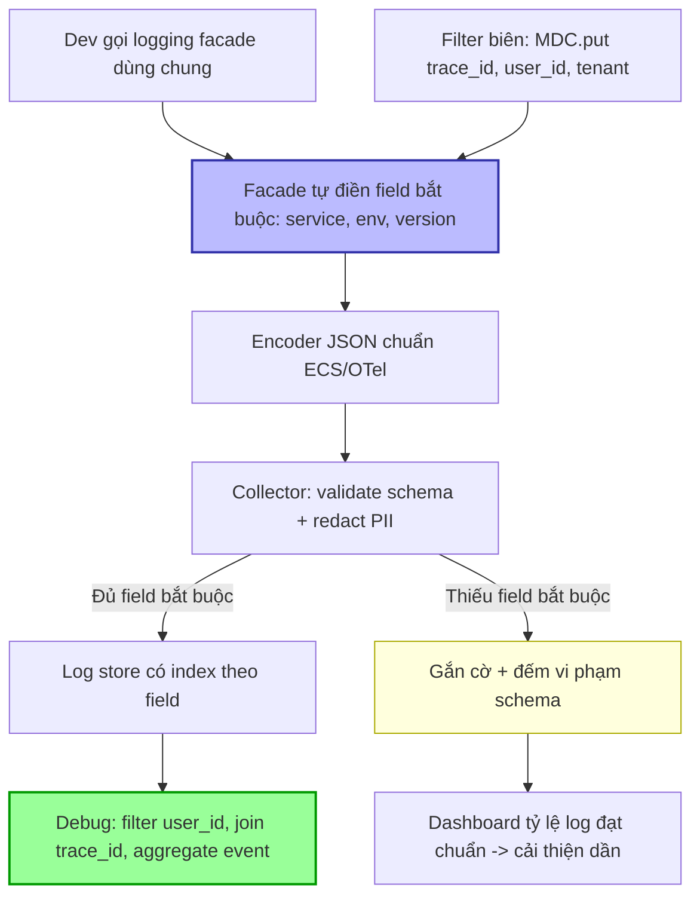

# Log bị thiếu field quan trọng để debug. Bạn chuẩn hóa ra sao?

## ⚡ Tóm tắt ngắn (30s)
* **Bản chất**: Khi log thiếu field then chốt (`trace_id`, `user_id`, `service`, `env`, `error_code`...), mỗi sự cố biến thành cuộc "khảo cổ" — grep regex trên free-text, đối chiếu timestamp thủ công, không filter/aggregate được. Nguyên nhân gốc: **log không có schema chuẩn**, mỗi dev tự nối chuỗi theo ý mình, không có field bắt buộc, và context (trace_id, user) không tự động đính kèm.
* **Hướng xử lý Senior**:
  1. **Structured logging (JSON) + schema chuẩn toàn tổ chức**: định nghĩa tập field bắt buộc và tùy chọn, mọi log là key-value máy đọc được, không phải câu văn.
  2. **Tự động bơm context qua MDC**: `trace_id`, `user_id`, `tenant`, `request_id` được đính tự động ở filter biên — dev không cần (và không được phép quên) thêm thủ công.
  3. **Cưỡng chế (enforce) bằng thư viện logging dùng chung + validation**, không dựa vào kỷ luật cá nhân: một logging facade/wrapper chung điền sẵn field bắt buộc.
* **Quyết định Senior**: Log là **dữ liệu có cấu trúc (data), không phải văn bản (prose)**. Chuẩn hóa schema một lần ở tầng nền tảng (platform) để toàn bộ service kế thừa, biến debug từ "grep và đoán" thành "filter và truy vấn".

---

## 🔍 Chi tiết bản chất thực chiến: Thiết kế schema log chuẩn

### 1. Free-text vs Structured — khác biệt cốt lõi
* **Free-text**: `log.info("User " + id + " bought " + n + " items")` → để query "tất cả đơn của user X" phải viết regex mong manh, không aggregate được, dễ vỡ khi đổi câu chữ.
* **Structured (JSON)**: `{"event":"order_placed","user_id":"123","items":3,"trace_id":"abc"}` → filter `user_id=123`, aggregate theo `event`, join với trace — máy đọc được.

### 2. Tập field chuẩn (logging schema)
Một schema log tốt thường gồm:
* **Bắt buộc (mọi log)**: `timestamp` (ISO-8601, UTC), `level`, `service`, `env` (prod/staging), `version`/`build`, `message`/`event`, `trace_id`, `span_id`.
* **Theo ngữ cảnh request**: `user_id`, `tenant_id`, `request_id`, `http_method`, `route`, `status_code`.
* **Cho lỗi**: `error_code`, `error_type`/`exception_class`, `stack_trace`.
* **Quy ước**: tên field nhất quán (snake_case), `event` là tên ổn định để query (không nhồi biến vào), giá trị động đặt ở field riêng.

### 3. MDC tự động đính context
Đặt context một lần ở filter biên → mọi log trong request kế thừa:
* Filter biên `MDC.put("trace_id", ...)`, `MDC.put("user_id", ...)`.
* Encoder (Logstash/ECS) tự serialize MDC + structured arguments thành JSON.
* **Bắt buộc `MDC.clear()`** cuối request (ThreadLocal, thread pool tái sử dụng).

### 4. Cưỡng chế thay vì trông cậy kỷ luật
Không thể bắt mọi dev nhớ điền đủ field. Phải đưa vào nền tảng:
* **Logging facade dùng chung**: một thư viện nội bộ wrap logger, **tự điền** service/env/version và bắt buộc truyền `event` + các field thiết yếu (qua API kiểu builder).
* **Encoder chuẩn (ECS/OTel semantic conventions)**: dùng một schema chuẩn ngành (Elastic Common Schema hoặc OpenTelemetry log data model) để liên thông công cụ.
* **Validation ở pipeline**: collector (Fluent Bit/OTel) drop hoặc gắn cờ log thiếu field bắt buộc, dashboard theo dõi "tỷ lệ log đạt schema".

### 5. Tránh nhồi PII và cardinality vô tội vạ
Chuẩn hóa cũng gồm **quy định cái KHÔNG được log**: mật khẩu, token, số thẻ, PII thô → redact tại nguồn/collector. Đồng thời tránh field giá trị vô hạn nếu định index nặng.

---

## 🎨 Sơ đồ trực quan: Chuẩn hóa log từ nguồn đến truy vấn



---

## 💻 Code thực chiến: BAD vs GOOD

### ❌ BAD: Free-text, nối chuỗi, thiếu context, mỗi dev một kiểu
```java
// CÁCH SAI
log.info("Order failed for user " + userId + ": " + e.getMessage());
// ❌ Không trace_id, không error_code, không service/env
// ❌ Nối chuỗi -> không filter/aggregate được, không biết request nào
// ❌ Mỗi dev viết một format khác nhau -> không thể chuẩn hóa query
log.error("ERR! " + e);   // ❌ vô dụng khi debug: thiếu mọi ngữ cảnh
```

### ✅ GOOD: Structured + MDC tự động + schema cưỡng chế
```java
// ✅ Filter biên: đính context chuẩn, mọi log kế thừa tự động
@Component
public class LoggingContextFilter extends OncePerRequestFilter {
    @Override
    protected void doFilterInternal(HttpServletRequest req, HttpServletResponse res,
                                    FilterChain chain) throws ServletException, IOException {
        MDC.put("trace_id", Span.current().getSpanContext().getTraceId()); // ✅ tự động
        MDC.put("user_id", SecurityContext.userId());
        MDC.put("tenant_id", RequestContext.tenant());
        MDC.put("route", req.getRequestURI());
        try {
            chain.doFilter(req, res);
        } finally {
            MDC.clear();   // ✅ tránh rò context sang request sau (thread pool)
        }
    }
}

// ✅ Log có cấu trúc với key-value rõ ràng (SLF4J fluent API)
log.atError()
   .addKeyValue("event", "order_failed")        // ✅ event ổn định để query/aggregate
   .addKeyValue("order_id", order.id())
   .addKeyValue("error_code", e.code())          // ✅ field chuẩn cho lỗi
   .addKeyValue("error_type", e.getClass().getSimpleName())
   .setCause(e)
   .log("Đặt hàng thất bại");                     // trace_id/user_id/service tự đính từ MDC + config
```
```xml
<!-- ✅ logback: encoder JSON theo schema, tự thêm field hằng (service, env, version) -->
<configuration>
  <appender name="JSON" class="ch.qos.logback.core.ConsoleAppender">
    <encoder class="net.logstash.logback.encoder.LogstashEncoder">
      <includeMdcKeyName>trace_id</includeMdcKeyName>
      <includeMdcKeyName>user_id</includeMdcKeyName>
      <customFields>{"service":"checkout","env":"${ENV}","version":"${BUILD_VERSION}"}</customFields>
    </encoder>
  </appender>
  <root level="INFO"><appender-ref ref="JSON"/></root>
</configuration>
```
```yaml
# ✅ Collector: validate field bắt buộc + redact PII trước khi vào store
processors:
  transform/enforce:
    log_statements:
      - context: log
        statements:
          - set(attributes["schema_violation"], true)
            where attributes["trace_id"] == nil or attributes["service"] == nil  # ✅ gắn cờ thiếu field
          - replace_pattern(body, "\\d{16}", "[REDACTED_CARD]")                   # ✅ che số thẻ
```

---

## 📊 Bảng so sánh: Free-text vs Structured logging

| Tiêu chí | Free-text logging | Structured logging (JSON + schema) |
| :--- | :--- | :--- |
| **Filter theo field** | ❌ Regex mong manh | ✅ `user_id=123` trực tiếp |
| **Aggregate / thống kê** | ❌ Gần như không | ✅ Group by `event`, `error_code` |
| **Join với trace** | ❌ Thủ công theo timestamp | ✅ Qua `trace_id` |
| **Bền khi đổi câu chữ** | ❌ Vỡ khi sửa message | ✅ `event` ổn định, message tách riêng |
| **Cưỡng chế field bắt buộc** | ❌ Tùy kỷ luật cá nhân | ✅ Facade + encoder + validation |
| **Chi phí index** | Cao (full-text) | Tối ưu (index field cần thiết) |
| **Debug experience** | "grep và đoán" | "filter và truy vấn" |

---

## ⚠️ Common Gotchas & Questions follow-up

### Cạm bẫy thường gặp
1. **Trông cậy kỷ luật cá nhân**: "Nhắc mọi người nhớ thêm trace_id" không bao giờ hiệu quả ở quy mô lớn. Phải cưỡng chế ở nền tảng (facade + MDC tự động).
2. **Nhồi biến vào message thay vì field**: `"order " + id + " failed"` khiến mỗi log là một chuỗi unique → không aggregate. Đặt `event` cố định, `order_id` ra field.
3. **Quên `MDC.clear()`**: Rò context sang request/thread sau → log gắn sai user/trace. Luôn clear trong finally.
4. **Mất context qua async/queue**: MDC là ThreadLocal, không theo sang thread con/consumer. Phải propagate thủ công hoặc qua OTel.
5. **Log PII sau khi "chuẩn hóa"**: Chuẩn hóa mà quên cấm PII → vừa rủi ro compliance vừa rò dữ liệu. Schema phải gồm cả danh sách cấm.
6. **Mỗi service một schema khác**: Không thống nhất → không join/correlate xuyên service được. Dùng chuẩn chung (ECS/OTel).

### Câu hỏi đào sâu từ interviewer
* **Interviewer: "Bạn có 50 service đã chạy lâu năm, mỗi service log một kiểu khác nhau, không thể sửa hết cùng lúc. Làm sao chuẩn hóa schema log mà không phải viết lại toàn bộ code và không gây downtime?"**
* **Trả lời**:
  1. **Chuẩn hóa tại tầng pipeline trước, tại nguồn sau**: Không cần sửa 50 codebase ngay. Trước hết đặt một **lớp xử lý ở collector** (Fluent Bit/Logstash/OTel Collector) để **parse và ánh xạ** log cũ về schema chung — trích field từ free-text bằng grok/regex, đổi tên field về chuẩn ECS, gắn `service`/`env` từ metadata Kubernetes (pod label). Toàn bộ log đổ về một schema thống nhất mà không đụng code.
  2. **Ưu tiên theo giá trị, không cào bằng**: Bắt đầu từ các service quan trọng/hay sự cố nhất. Với mỗi service, thêm dần MDC tự động (trace_id, user_id) qua một **filter/starter dùng chung** — chỉ cần thêm dependency, không viết lại logic nghiệp vụ.
  3. **Logging facade làm chuẩn cho code mới**: Phát hành thư viện logging nội bộ; quy định mọi service mới và mọi đoạn code sửa đổi phải dùng nó. Service cũ "đóng băng" được chuẩn hóa qua pipeline, code mới chuẩn từ gốc — di cư dần (strangler pattern).
  4. **Đo tiến độ bằng số**: Dashboard "tỷ lệ log đạt schema theo service". Biến việc chuẩn hóa thành mục tiêu đo được, ưu tiên service có tỷ lệ thấp + tần suất sự cố cao. Không có downtime vì mọi thay đổi là thêm field/parse, không phá vỡ luồng hiện tại.
  5. **Backward compatible**: Giữ message gốc trong một field (`raw_message`) khi parse, để không mất thông tin nếu regex ánh xạ sót — an toàn khi di cư.
