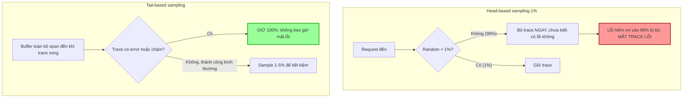

# Distributed tracing sampling quá thấp nên không thấy lỗi. Bạn xử lý thế nào?

## ⚡ Tóm tắt ngắn (30s)
* **Bản chất**: Để tiết kiệm chi phí (lưu trữ + băng thông), distributed tracing thường **sampling** — chỉ giữ một phần trace. Nếu dùng **head-based sampling** với tỷ lệ thấp (vd 1%), quyết định giữ/bỏ được đưa ra **ngay đầu request, ngẫu nhiên, trước khi biết request có lỗi hay không**. Hậu quả: các trace **lỗi/chậm hiếm gặp** (thứ ta cần nhất khi debug) gần như chắc chắn bị vứt cùng với 99% trace bình thường. Ta "tiết kiệm" đúng vào thứ quý giá nhất.
* **Hướng xử lý Senior**:
  1. **Chuyển sang tail-based sampling**: quyết định giữ/bỏ **sau khi** trace hoàn tất, để **giữ 100% trace lỗi và chậm**, chỉ sample bớt trace thành công bình thường.
  2. **Sampling theo ngữ cảnh (rule-based)**: luôn giữ trace có error, latency cao, hoặc thuộc luồng quan trọng (checkout); sample mạnh các health-check/nội bộ.
  3. **Nhất quán quyết định sampling toàn trace** (consistent sampling) để không bị "trace gãy" — nửa giữ nửa bỏ qua các service.
* **Quyết định Senior**: Mục tiêu không phải "sample nhiều hơn" (đắt) mà **sample thông minh hơn** — bỏ cái vô giá trị (trace thành công giống hệt nhau), giữ cái đáng giá (lỗi, chậm, hiếm). Đánh đổi: tail-based cần buffer + tài nguyên ở collector, nhưng đổi lại không bao giờ mất trace của sự cố.

---

## 🔍 Chi tiết bản chất thực chiến: Head-based vs Tail-based sampling

### 1. Head-based sampling — rẻ nhưng "mù" với lỗi
* Quyết định ở **ngay span gốc**, dựa trên xác suất cố định (vd `probability=0.01`) hoặc rate limit.
* Quyết định được **truyền xuống** mọi service qua trace flags để cả trace nhất quán (giữ cả hoặc bỏ cả).
* **Ưu**: đơn giản, rẻ, không cần buffer; giảm tải ngay tại nguồn.
* **Nhược chí mạng**: quyết định trước khi biết kết quả → lỗi hiếm bị vứt theo xác suất. Với sampling 1%, một lỗi xảy ra 5 lần/giờ thì **kỳ vọng chỉ ~0.05 trace lỗi được giữ/giờ** — gần như luôn mất.

### 2. Tail-based sampling — đắt hơn nhưng giữ đúng cái cần
* Collector **buffer toàn bộ span của một trace** đến khi trace kết thúc, rồi mới quyết định dựa trên **toàn cảnh**: có lỗi không? latency vượt ngưỡng không? thuộc luồng quan trọng không?
* **Chính sách điển hình**: giữ 100% trace có `error=true`, giữ 100% trace `duration > p99 ngưỡng`, sample 1–5% trace thành công còn lại.
* **Ưu**: không bao giờ mất trace lỗi/chậm; tối ưu chi phí trên giá trị thực.
* **Nhược/đánh đổi**: collector phải **giữ span trong bộ nhớ** đến khi trace hoàn tất (cần đủ RAM + thời gian chờ `decision_wait`), phức tạp hơn, và phải gom mọi span của một trace về **cùng một collector instance** (load-balancing theo trace_id).

### 3. Toán học vì sao 1% head-based làm mất lỗi
Xác suất **bỏ lỡ tất cả** $k$ lần xuất hiện của một lỗi hiếm với tỷ lệ giữ $s$:
$$P(\text{mất hết}) = (1-s)^k$$
Với $s = 0.01$ (giữ 1%) và lỗi xảy ra $k = 20$ lần:
$$P = (0.99)^{20} \approx 0.818 \Rightarrow \text{~82% khả năng KHÔNG có trace nào của lỗi đó}$$
Muốn xác suất bắt được ≥ 95% ($P(\text{mất hết}) \le 0.05$) cần $k \ge \frac{\ln 0.05}{\ln 0.99} \approx 298$ lần xuất hiện — tức lỗi phải khá phổ biến mới mong thấy. Tail-based đặt $s=1$ cho nhánh lỗi nên $P(\text{mất hết}) = 0$.

### 4. Consistent/deterministic sampling — tránh trace gãy
Nếu mỗi service tự quyết định ngẫu nhiên độc lập, một trace có thể bị service A giữ nhưng service B bỏ → **trace không hoàn chỉnh**. Giải pháp: quyết định **xác định theo trace_id** (hash trace_id < threshold) để mọi service cùng kết luận giống nhau, hoặc truyền sampling flag trong trace context.

---

## 🎨 Sơ đồ trực quan: Head-based vs Tail-based sampling



---

## 💻 Code thực chiến: BAD vs GOOD

### ❌ BAD: Head-based 1%, mất sạch trace lỗi
```yaml
# application.yml — CÁCH SAI
management:
  tracing:
    sampling:
      probability: 0.01     # ❌ giữ ngẫu nhiên 1% NGAY đầu request
      # ❌ Trace lỗi hiếm gần như luôn bị vứt -> khi sự cố, không có trace để điều tra
```

### ✅ GOOD: Tail-based sampling ở OTel Collector — giữ lỗi & chậm
```yaml
# otel-collector-config.yaml — giữ 100% lỗi/chậm, sample phần còn lại
processors:
  tail_sampling:
    decision_wait: 10s            # ✅ chờ gom đủ span của trace rồi mới quyết định
    num_traces: 100000
    policies:
      - name: keep-all-errors             # ✅ luôn giữ trace có lỗi
        type: status_code
        status_code: { status_codes: [ERROR] }
      - name: keep-slow-traces            # ✅ luôn giữ trace chậm bất thường
        type: latency
        latency: { threshold_ms: 1000 }
      - name: keep-critical-route         # ✅ luôn giữ luồng quan trọng
        type: string_attribute
        string_attribute: { key: http.route, values: ["/checkout", "/payment"] }
      - name: sample-the-rest             # ✅ trace thành công bình thường chỉ giữ 5%
        type: probabilistic
        probabilistic: { sampling_percentage: 5 }
```
```yaml
# ✅ Tail-based cần gom mọi span của 1 trace về CÙNG 1 collector (consistent decision)
# Dùng load-balancing exporter theo trace_id giữa các collector
exporters:
  loadbalancing:
    routing_key: traceID          # ✅ mọi span cùng trace_id -> cùng collector backend
    protocol:
      otlp: { tls: { insecure: true } }
    resolver:
      dns: { hostname: otel-collector-tailsampling }
```
```java
// ✅ App giữ head-sampling cao (hoặc parent-based) để KHÔNG bỏ span sớm,
//    nhường quyết định cuối cho tail-sampling ở collector
//    + đánh dấu rõ span lỗi để policy nhận diện
Span span = Span.current();
try {
    paymentGateway.charge(req);
} catch (Exception e) {
    span.setStatus(StatusCode.ERROR, e.getMessage()); // ✅ tail-sampling sẽ GIỮ nhờ status=ERROR
    span.recordException(e);
    throw e;
}
```

---

## 📊 Bảng so sánh: Head-based vs Tail-based sampling

| Tiêu chí | Head-based sampling | Tail-based sampling |
| :--- | :--- | :--- |
| **Thời điểm quyết định** | Đầu request (chưa biết kết quả) | Sau khi trace hoàn tất (biết toàn cảnh) |
| **Giữ được trace lỗi hiếm?** | ❌ Gần như mất (theo xác suất) | ✅ Giữ 100% nếu cấu hình |
| **Chi phí tài nguyên** | Thấp (không buffer) | Cao hơn (buffer span ở collector) |
| **Độ phức tạp** | Đơn giản | Phức tạp (cần load-balancing theo trace_id) |
| **Giảm tải ngay tại nguồn** | ✅ Có | ❌ Span vẫn gửi hết về collector trước |
| **Phù hợp** | Hệ thống nhỏ, ngân sách chặt tại nguồn | Hệ thống cần debug sự cố hiếm, lỗi/chậm |

---

## ⚠️ Common Gotchas & Questions follow-up

### Cạm bẫy thường gặp
1. **Sample thấp đều cho mọi trace**: Tiết kiệm đúng vào trace lỗi quý giá. Phải phân biệt: lỗi/chậm giữ hết, thành công sample mạnh.
2. **Tail-based nhưng span gửi rời rạc đến nhiều collector**: Mỗi collector chỉ thấy một phần trace → quyết định sai/trace gãy. Phải load-balance theo trace_id.
3. **`decision_wait` quá ngắn**: Trace có span đến muộn (async, downstream chậm) bị quyết định khi chưa đủ span → mất context. Đặt `decision_wait` đủ dài cho trace dài nhất.
4. **Buffer tail-sampling tràn bộ nhớ**: Lưu lượng cao + giữ span lâu → collector OOM. Cần giới hạn `num_traces`, đủ RAM, và scale collector.
5. **Quên đánh dấu span ERROR**: Nếu code nuốt lỗi không set `status=ERROR`, policy "keep-errors" không nhận ra → vẫn mất. Phải record exception/status đúng.
6. **Mất tính đại diện để tính metric từ trace**: Sample lệch (giữ toàn lỗi) làm thống kê tỷ lệ từ trace bị méo. Tính rate/latency từ **metric** (đo 100%), không từ trace đã sample.

### Câu hỏi đào sâu từ interviewer
* **Interviewer: "Tail-based sampling nghe lý tưởng nhưng tốn RAM và phức tạp. Với hệ thống 50K request/giây, bạn có bật tail-based cho tất cả không? Nếu không thì kiến trúc lai (hybrid) của bạn thế nào?"**
* **Trả lời**:
  1. **Không bật tail-based mù quáng cho 100% lưu lượng**: Ở 50K req/s, buffer mọi span đến khi trace xong là gánh nặng RAM/CPU lớn cho collector. Cần kiến trúc **lai (hybrid)** cân bằng giữa khả năng bắt lỗi và chi phí.
  2. **Tầng 1 — head-sampling vừa phải tại nguồn**: Đặt head-sampling ở mức tương đối (vd 10–20% hoặc parent-based + rate-limited) để **giảm khối lượng span thô** trước khi về collector, nhưng **đủ cao để không bỏ lỡ** trace lỗi ngay tại nguồn. Tránh 1% quá thấp.
  3. **Tầng 2 — tail-sampling ở collector trên phần đã giảm**: Trên luồng đã head-sample, áp tail-sampling để giữ 100% lỗi/chậm và sample mạnh phần còn lại. Collector chỉ phải buffer lượng span đã giảm bớt → khả thi về tài nguyên.
  4. **Bù phần head bỏ sót bằng tín hiệu khác**: Vì head-sampling vẫn có thể bỏ lỡ lỗi cực hiếm, **không phụ thuộc trace để biết có lỗi**. Dùng **metric đo 100% request** (error rate, latency histogram) làm nguồn sự thật cho alert/SLO; trace chỉ để **điều tra chi tiết** khi metric đã chỉ ra vấn đề.
  5. **Exemplars nối metric ↔ trace**: Gắn exemplar (trace_id mẫu) vào histogram bucket độ trễ cao — từ điểm p99 trên metric nhảy thẳng vào một trace chậm cụ thể, mà không cần giữ toàn bộ trace. Đây là cách rẻ để luôn có "một trace đại diện" cho mỗi vùng vấn đề.
  6. **Scale & cô lập collector tail-sampling**: Tách tầng collector tail-sampling riêng, scale ngang theo trace_id (load-balancing exporter), đặt giới hạn bộ nhớ và `decision_wait` hợp lý — để áp lực sampling không ảnh hưởng đường ống metric/log.
