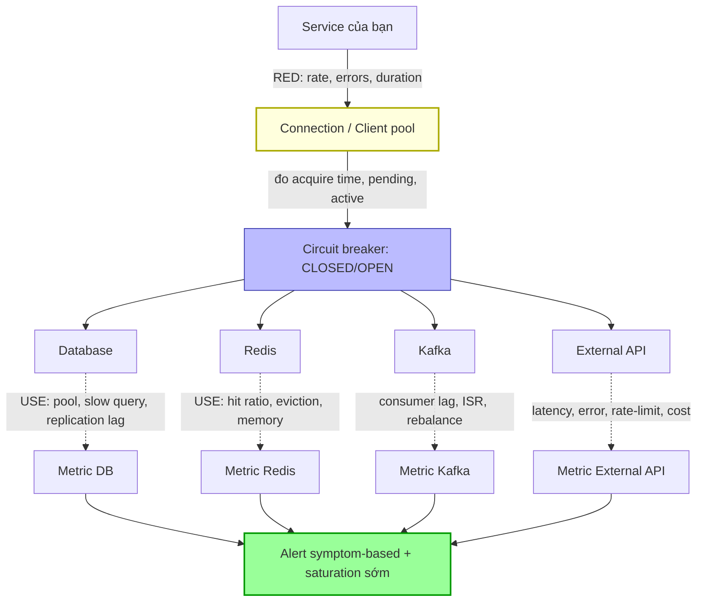

# Làm sao monitor dependency như DB, Redis, Kafka, external API?

## ⚡ Tóm tắt ngắn (30s)
* **Bản chất**: Phần lớn sự cố production không nằm ở code của bạn mà ở **các phụ thuộc (dependencies)**: DB chậm, Redis evict, Kafka lag, external API timeout. Giám sát dependency đúng nghĩa là đo **từ hai phía**: (1) **Client-side** — service của bạn trải nghiệm dependency thế nào (latency, error rate khi gọi), và (2) **Resource-side** — bản thân dependency có khỏe không (saturation, utilization). Chỉ nhìn một phía sẽ mù: dependency "khỏe" nhưng pool kết nối của bạn cạn thì user vẫn lỗi.
* **Hướng xử lý Senior**:
  1. **RED cho mọi lời gọi outbound**: Rate / Errors / Duration cho từng dependency, gắn nhãn `dependency` để phân rã.
  2. **USE cho tài nguyên dependency**: Utilization / Saturation / Errors (CPU, memory, connection pool, queue depth).
  3. **Đo connection pool + circuit breaker state**: nguồn sự cố ẩn phổ biến nhất — pool cạn gây queueing, circuit mở gây fail-fast.
  4. **Mỗi loại dependency có signal đặc thù**: DB (slow query, replication lag, pool), Redis (hit ratio, eviction, memory), Kafka (consumer lag, ISR), external API (latency, error, rate limit).
* **Quyết định Senior**: Coi mỗi dependency như một service có **SLI riêng từ góc nhìn client của bạn**. "DB của họ khỏe" không đủ — phải đo "service của tôi gọi DB có nhanh và thành công không", vì giữa hai cái đó là network, pool, retry, và circuit breaker.

---

## 🔍 Chi tiết bản chất thực chiến: RED + USE cho dependency

### 1. Hai khung đo bổ sung cho nhau
* **RED (Rate, Errors, Duration)** — đo **luồng request** tới dependency từ phía client:
  * **Rate**: số lời gọi/giây tới dependency.
  * **Errors**: tỷ lệ lời gọi lỗi (timeout, connection refused, 5xx).
  * **Duration**: độ trễ lời gọi (p50/p95/p99).
* **USE (Utilization, Saturation, Errors)** — đo **tài nguyên** của dependency:
  * **Utilization**: % tài nguyên đang dùng (CPU, memory, connections).
  * **Saturation**: mức độ "xếp hàng chờ" (queue depth, pool wait time) — tín hiệu sớm nhất của nghẽn.
  * **Errors**: lỗi nội tại của tài nguyên.

RED bắt "user của dependency đau chưa"; USE bắt "dependency sắp hết hơi chưa". Saturation thường cảnh báo **trước** khi Errors xuất hiện.

### 2. Connection pool — điểm mù phổ biến nhất
Service không gọi DB trực tiếp mà qua **connection pool** (HikariCP). Khi pool cạn:
* DB có thể vẫn rảnh, nhưng request **xếp hàng chờ** lấy connection → latency tăng vọt (đuôi p99), rồi timeout.
* Phải đo: `active/idle/pending connections`, `connection acquire time` (p99), `connection timeout count`. Đây thường là nguyên nhân thật sự đằng sau "DB chậm".

### 3. Circuit breaker — vừa là cơ chế bảo vệ vừa là tín hiệu
Resilience4j/Hystrix mở circuit khi dependency lỗi nhiều → fail-fast. Trạng thái circuit (`CLOSED/OPEN/HALF_OPEN`) là tín hiệu quý: circuit `OPEN` = dependency đang hỏng nặng. Phải export metric trạng thái + tỷ lệ rejected calls.

### 4. Signal đặc thù theo từng dependency
* **Database**: connection pool (acquire time, pending), slow query rate, replication lag (read replica trễ → đọc dữ liệu cũ), deadlock count, transaction duration, query errors.
* **Redis**: cache hit ratio (giảm = thrashing), evicted keys (memory đầy → mất cache), memory used vs maxmemory, latency, blocked clients, keyspace misses.
* **Kafka**: consumer lag (quan trọng nhất), under-replicated partitions / ISR shrink, produce/fetch latency, rebalance frequency, request handler idle ratio.
* **External API (third-party)**: latency, error rate, **rate-limit headers** (sắp bị throttle), timeout rate, circuit breaker state, retry count, cost (nếu tính phí theo call).

### 5. Synthetic check cho dependency
Ngoài đo lưu lượng thật, có thể probe chủ động (vd `SELECT 1`, `PING` Redis, produce-consume một message test) để biết dependency sống ngay cả khi không có traffic.

---

## 🎨 Sơ đồ trực quan: Giám sát hai phía cho mỗi dependency



---

## 💻 Code thực chiến: BAD vs GOOD

### ❌ BAD: Gọi dependency không đo, không timeout, không circuit breaker
```java
// CÁCH SAI
public Product getProduct(Long id) {
    // ❌ Không đo latency/error khi gọi DB
    Product p = jdbc.queryForObject("SELECT ...", ...);
    // ❌ Gọi external API không timeout, không circuit breaker
    Price price = restTemplate.getForObject(externalPriceApi, Price.class); // treo -> kéo sập service
    return p.withPrice(price);
}
// ❌ Khi external API chậm: không biết, không bảo vệ, latency lan ngược về user
```

### ✅ GOOD: Instrument RED + pool + circuit breaker + signal đặc thù
```java
// ✅ Đo RED cho mỗi dependency bằng Micrometer Timer, có nhãn dependency
public Price fetchPrice(Long id) {
    return Timer.builder("dependency.call.duration")
        .tag("dependency", "price_api")
        .publishPercentiles(0.95, 0.99)               // ✅ p95/p99 cho lời gọi outbound
        .register(registry)
        .record(() -> priceClient.get(id));
}

// ✅ Circuit breaker + timeout + đếm error theo loại -> bảo vệ và phát tín hiệu
@CircuitBreaker(name = "priceApi", fallbackMethod = "priceFallback")
@TimeLimiter(name = "priceApi")                        // ✅ timeout chặt, fail-fast
public CompletableFuture<Price> getPrice(Long id) {
    return CompletableFuture.supplyAsync(() -> priceClient.get(id));
}
public CompletableFuture<Price> priceFallback(Long id, Throwable t) {
    registry.counter("dependency.call.errors",
        "dependency", "price_api", "reason", t.getClass().getSimpleName()).increment(); // ✅ đếm lỗi
    return CompletableFuture.completedFuture(Price.cachedOrDefault(id)); // ✅ degrade thay vì sập
}
```
```yaml
# ✅ Bật metric pool & circuit breaker để Prometheus scrape
management:
  metrics:
    enable:
      hikaricp: true        # hikaricp_connections_pending, _acquire_seconds (USE: saturation pool)
      resilience4j: true    # resilience4j_circuitbreaker_state, _calls (trạng thái + rejected)
```
```promql
# ✅ Alert đặc thù theo dependency
# DB: pool saturation (request đang xếp hàng chờ connection) — tín hiệu sớm
- alert: DbPoolSaturated
  expr: hikaricp_connections_pending{pool="primary"} > 5
  for: 2m
  labels: { severity: page }

# Redis: hit ratio rớt (cache thrashing / eviction) làm DB tăng tải
- alert: RedisHitRatioLow
  expr: |
    rate(redis_keyspace_hits_total[5m])
    / (rate(redis_keyspace_hits_total[5m]) + rate(redis_keyspace_misses_total[5m])) < 0.8
  for: 10m
  labels: { severity: ticket }

# Kafka: consumer lag tăng (consumer không theo kịp/chết)
- alert: KafkaConsumerLagHigh
  expr: max by (consumergroup) (kafka_consumergroup_lag) > 10000
  for: 5m
  labels: { severity: page }

# External API: circuit breaker đang OPEN (dependency hỏng nặng)
- alert: PriceApiCircuitOpen
  expr: resilience4j_circuitbreaker_state{name="priceApi", state="open"} == 1
  labels: { severity: page }
```

---

## 📊 Bảng so sánh: Signal then chốt theo từng dependency

| Dependency | RED (client-side) | Signal đặc thù (resource-side) | Tín hiệu cảnh báo sớm |
| :--- | :--- | :--- | :--- |
| **Database** | latency/error khi query | Pool pending, slow query, replication lag, deadlock | Pool acquire time p99 tăng |
| **Redis** | latency/error khi GET/SET | Hit ratio, evicted keys, memory vs maxmemory | Hit ratio rớt, eviction tăng |
| **Kafka** | produce/consume latency, error | **Consumer lag**, ISR shrink, rebalance | Lag tăng đều |
| **External API** | latency, error, timeout | Rate-limit headers, cost, retry count | Latency p99 tăng, gần rate limit |
| **Mọi loại** | Rate/Errors/Duration | Circuit breaker state, pool saturation | Saturation (queueing) trước Errors |

---

## ⚠️ Common Gotchas & Questions follow-up

### Cạm bẫy thường gặp
1. **Chỉ đo dependency, quên đo client-side**: "DB khỏe" nhưng pool của bạn cạn → user vẫn lỗi. Phải đo cả hai phía.
2. **Bỏ qua saturation, chỉ nhìn errors**: Saturation (queue depth, pool pending) là tín hiệu **sớm hơn** errors. Đợi đến khi có error là đã muộn.
3. **Gọi dependency không timeout/circuit breaker**: Một external API treo kéo cạn thread pool của bạn → cascading failure. Luôn timeout + bulkhead + circuit breaker.
4. **Không phân rã theo dependency**: Gộp mọi outbound call thành một metric → không biết dependency nào lỗi. Gắn nhãn `dependency`.
5. **Replication lag bị bỏ quên**: Đọc từ read-replica trễ → user thấy dữ liệu cũ (vừa ghi không thấy). Phải giám sát replication lag.
6. **Health check dependency quá thường xuyên**: Mỗi pod probe mọi dependency liên tục → tự tạo tải. Cache kết quả ngắn hạn.

### Câu hỏi đào sâu từ interviewer
* **Interviewer: "External API của bên thứ ba thỉnh thoảng chậm và bạn không kiểm soát được nó. Bạn vừa muốn giám sát, vừa muốn nó không kéo sập service của mình. Bạn thiết kế lớp phòng vệ và quan sát thế nào?"**
* **Trả lời**:
  1. **Cô lập bằng bulkhead**: Cấp một **thread pool / connection pool riêng** cho mỗi external dependency. Nếu API đó treo, nó chỉ làm cạn pool **của riêng nó**, không lan sang luồng nghiệp vụ khác — ngăn cascading failure (mô hình Bulkhead của Resilience4j/Hystrix).
  2. **Timeout chặt + circuit breaker**: Đặt timeout dựa trên SLO của bạn (không phải SLA của họ), fail-fast thay vì chờ vô hạn. Circuit breaker mở khi error/slow-call vượt ngưỡng → ngừng gọi tạm thời, tự thử lại (half-open) → bảo vệ cả hai bên khỏi retry storm.
  3. **Degrade gracefully với fallback**: Khi circuit mở, trả **giá trị cache cũ / mặc định / giảm tính năng** thay vì lỗi cứng — giữ trải nghiệm cốt lõi. Đo luôn tỷ lệ phục vụ bằng fallback như một SLI suy giảm.
  4. **Retry có ngân sách + jitter**: Retry với exponential backoff **và jitter** để không đồng loạt dội vào API khi nó vừa hồi phục; giới hạn retry budget để retry không tự khuếch đại tải.
  5. **Quan sát từ phía client là sự thật**: Vì không truy cập được nội bộ của họ, **client-side RED là nguồn sự thật duy nhất** — đo latency/error/timeout mà *bạn* trải nghiệm, theo dõi **rate-limit header** để biết sắp bị throttle, và trạng thái circuit breaker. Alert trên các tín hiệu này.
  6. **SLO riêng cho dependency + làm việc với nhà cung cấp**: Đặt SLI "tỷ lệ gọi external thành công trong ngưỡng", đối chiếu với SLA hợp đồng của họ; khi vi phạm có dữ liệu để escalate. Nếu dependency quá quan trọng và bất ổn → cân nhắc **multi-provider failover** hoặc caching tích cực để giảm phụ thuộc.
