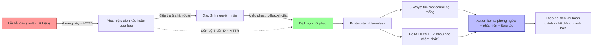

# Postmortem tốt cần trả lời những câu hỏi nào?

## ⚡ Tóm tắt ngắn (30s)
* **Bản chất**: Postmortem (báo cáo sau sự cố) **không phải để tìm người đổ lỗi**, mà để **học và ngăn sự cố tái diễn**. Một postmortem tốt phải **blameless (phi đổ lỗi)** — tập trung vào *hệ thống và quy trình đã cho phép lỗi xảy ra*, không phải *ai đã bấm nút*. Nó phải trả lời rõ năm nhóm câu hỏi: **Chuyện gì đã xảy ra? Ảnh hưởng ra sao? Vì sao xảy ra (root cause)? Ta phát hiện/khắc phục thế nào (timeline + MTTD/MTTR)? Và làm gì để không tái diễn (action items)?**
* **Hướng xử lý Senior**:
  1. **Blameless culture**: con người mắc lỗi là điều tất yếu; lỗi của *một người* mà gây sự cố lớn là lỗi của *hệ thống thiếu lớp bảo vệ*.
  2. **Timeline khách quan + đo lường**: dòng thời gian chính xác, kèm **MTTD** (thời gian phát hiện) và **MTTR** (thời gian khắc phục) để biết cần cải thiện ở khâu nào.
  3. **Root cause bằng "5 Whys" / contributing factors**: đào tới nguyên nhân hệ thống, không dừng ở triệu chứng bề mặt.
  4. **Action items cụ thể, có chủ, có hạn, theo dõi đến cùng**: postmortem không có action item được thực thi là vô giá trị.
* **Quyết định Senior**: Giá trị của postmortem nằm ở **bài học được chuyển thành thay đổi hệ thống** (thêm alert, thêm test, sửa quy trình), không phải ở bản báo cáo đẹp. Câu hỏi quan trọng nhất luôn là: *"Vì sao ta phát hiện muộn / khắc phục lâu, và lần sau làm sao nhanh hơn?"*

---

## 🔍 Chi tiết bản chất thực chiến: Năm nhóm câu hỏi cốt lõi

### 1. Chuyện gì đã xảy ra? (Summary + Timeline)
* Tóm tắt ngắn gọn sự cố cho người không trong cuộc hiểu.
* **Timeline chính xác theo mốc thời gian**: khi nào lỗi bắt đầu, khi nào alert kêu (hoặc khi nào con người phát hiện), khi nào bắt đầu xử lý, khi nào khôi phục. Dựa trên log/trace/alert thật, không phải trí nhớ.

### 2. Ảnh hưởng ra sao? (Impact)
* **Định lượng**: bao nhiêu user/request bị ảnh hưởng, bao lâu, mất bao nhiêu doanh thu, vi phạm SLO/SLA không, đốt bao nhiêu error budget.
* Ảnh hưởng định hướng mức ưu tiên của action items.

### 3. Vì sao xảy ra? (Root Cause + Contributing Factors)
* **5 Whys**: hỏi "tại sao" lặp lại để đào từ triệu chứng xuống nguyên nhân hệ thống.
* **Nhiều yếu tố góp phần (contributing factors)**: sự cố lớn hiếm khi có một nguyên nhân duy nhất — thường là chuỗi lỗi nhỏ trùng hợp (mô hình "Swiss cheese": nhiều lớp bảo vệ cùng thủng).
* **Trigger vs Root cause**: phân biệt cái *kích hoạt* (deploy lúc 2h chiều) với *nguyên nhân gốc* (thiếu canary + thiếu test cho case đó).

### 4. Ta phát hiện và khắc phục thế nào? (Detection & Response — MTTD/MTTR)
* **MTTD (Mean Time To Detect)**: từ lúc lỗi bắt đầu đến lúc *biết* có lỗi. MTTD cao = lỗ hổng alerting (câu hỏi: *vì sao alert không kêu? user phải báo trước?*).
* **MTTR (Mean Time To Recover)**: từ lúc phát hiện đến lúc khôi phục. MTTR cao = lỗ hổng quy trình/runbook/công cụ.
* Phân tích từng pha: phát hiện, chẩn đoán, khắc phục — pha nào tốn thời gian nhất là nơi cần đầu tư.

### 5. Làm gì để không tái diễn? (Action Items)
* **Cụ thể, đo được, có owner, có deadline, được track** (như backlog item, không phải "sẽ cẩn thận hơn").
* Phân loại: **phòng ngừa** (sửa root cause), **giảm thiểu** (giảm impact lần sau), **phát hiện** (thêm alert giảm MTTD), **tăng tốc khắc phục** (runbook giảm MTTR).

### Nguyên tắc xuyên suốt: Blameless
Ngôn ngữ tập trung vào *"hệ thống cho phép X"* thay vì *"người Y làm sai"*. Lý do thực dụng: văn hóa đổ lỗi khiến người ta che giấu sai sót → mất dữ liệu để học → sự cố tái diễn. An toàn tâm lý = báo cáo trung thực = học được nhiều hơn.

---

## 🎨 Sơ đồ trực quan: Vòng đời sự cố và các mốc MTTD/MTTR



---

## 💻 Code thực chiến: BAD vs GOOD

### ❌ BAD: Postmortem đổ lỗi, mơ hồ, không hành động
```markdown
# CÁCH SAI
## Sự cố: Service sập tối qua
- Nguyên nhân: Anh A deploy code lỗi.          <!-- ❌ đổ lỗi cá nhân -> che giấu, không học -->
- Khắc phục: Đã rollback.
- Hành động: Mọi người cẩn thận hơn khi deploy. <!-- ❌ không cụ thể, không owner, không hạn -->
<!-- ❌ Thiếu timeline, thiếu impact định lượng, thiếu MTTD/MTTR, thiếu root cause thật -->
```

### ✅ GOOD: Postmortem blameless, đầy đủ, action items theo dõi được
```markdown
# Postmortem: Checkout 503 — 2026-06-28

## 1. Summary
Từ 14:05–14:38 (33 phút), ~18% request /checkout trả 503 do connection pool DB cạn
sau khi một query thiếu index được deploy, làm transaction giữ connection quá lâu.

## 2. Impact (định lượng)
- ~42.000 request lỗi; ~6.500 user không đặt được hàng.
- Vi phạm SLO availability (99.9%): đốt ~70% error budget tháng.
- Ước tính doanh thu mất: ~X triệu.

## 3. Timeline (mốc thật từ log/alert)
- 14:00  Deploy v2.7.1 (chứa query mới thiếu index).
- 14:05  Pool pending tăng; latency p99 checkout vọt. (lỗi bắt đầu)
- 14:18  Alert "DbPoolSaturated" kêu — user đã báo lỗi từ 14:09. (MTTD ~13' — QUÁ MUỘN)
- 14:25  Xác định nguyên nhân qua slow-query log + trace.
- 14:38  Rollback v2.7.0 xong, dịch vụ khôi phục. (MTTR từ phát hiện ~20')

## 4. Root Cause (5 Whys)
- Vì sao 503? Pool DB cạn. → Vì sao cạn? Transaction giữ connection lâu.
- Vì sao lâu? Query mới full-scan do thiếu index. → Vì sao lọt? Review + test thiếu case dữ liệu lớn.
- Vì sao không bắt sớm? Không có canary + alert pool dựa trên ngưỡng tĩnh, phát hiện muộn.
- **Root cause hệ thống**: thiếu lớp bảo vệ (canary, test tải, alert saturation sớm), KHÔNG phải "ai deploy".

## 5. Action Items (có owner + hạn + track)
| Hành động | Loại | Owner | Hạn | Trạng thái |
| --- | --- | --- | --- | --- |
| Thêm canary deploy + auto-rollback theo error rate | Phòng ngừa | @teamA | 07-05 | Open |
| Alert pool saturation sớm (pending > 3, p99 acquire) giảm MTTD | Phát hiện | @teamB | 07-02 | Open |
| Thêm test tải với dữ liệu lớn trong CI | Phòng ngừa | @teamA | 07-10 | Open |
| Runbook "pool cạn" để giảm MTTR | Tăng tốc | @oncall | 07-03 | Open |
```

---

## 📊 Bảng so sánh: Năm câu hỏi một postmortem tốt phải trả lời

| Nhóm câu hỏi | Trả lời điều gì | Chỉ số / công cụ | Cạm bẫy nếu thiếu |
| :--- | :--- | :--- | :--- |
| **Chuyện gì xảy ra?** | Tóm tắt + timeline khách quan | Log, trace, alert history | Tranh cãi theo trí nhớ |
| **Ảnh hưởng ra sao?** | Định lượng user/doanh thu/SLO | Error budget, business metric | Không biết ưu tiên fix |
| **Vì sao xảy ra?** | Root cause + contributing factors | 5 Whys, Swiss cheese | Dừng ở triệu chứng, tái diễn |
| **Phát hiện/khắc phục thế nào?** | Hiệu quả response | **MTTD, MTTR** | Không biết khâu nào chậm |
| **Làm gì để không tái diễn?** | Action items thực thi | Backlog có owner/hạn | Báo cáo "để đó", vô giá trị |

---

## ⚠️ Common Gotchas & Questions follow-up

### Cạm bẫy thường gặp
1. **Đổ lỗi cá nhân**: "Anh A deploy sai" giết chết văn hóa học hỏi → người ta che giấu sự cố. Luôn blameless: hỏi *hệ thống* nào cho phép lỗi đó.
2. **Dừng ở triệu chứng**: "DB chậm nên sập" — chưa phải root cause. Đào tiếp: vì sao DB chậm? vì sao không phát hiện sớm? bằng 5 Whys.
3. **Action items mơ hồ**: "Cẩn thận hơn", "review kỹ hơn" — không đo được, không ai làm. Phải cụ thể, có owner, có hạn, được track như backlog.
4. **Bỏ qua MTTD/MTTR**: Chỉ phân tích "lỗi gì" mà không hỏi "vì sao phát hiện muộn / khắc phục lâu" → bỏ lỡ phần cải thiện giá trị nhất (observability + quy trình).
5. **Timeline theo trí nhớ**: Không dựa trên log/alert thật → tranh cãi, sai lệch. Dựng timeline từ dữ liệu khách quan.
6. **Viết xong để đó**: Postmortem không theo dõi action items đến khi hoàn thành = chỉ là bài tập văn. Giá trị nằm ở thay đổi được thực thi.

### Câu hỏi đào sâu từ interviewer
* **Interviewer: "Một sự cố nghiêm trọng bị gây ra bởi một kỹ sư chạy nhầm lệnh xóa dữ liệu trên production. Làm sao bạn giữ postmortem blameless mà vẫn đảm bảo trách nhiệm và việc này không tái diễn?"**
* **Trả lời**:
  1. **Blameless ≠ vô trách nhiệm**: Blameless không có nghĩa "không ai chịu trách nhiệm", mà là chuyển trọng tâm từ *trách phạt cá nhân* sang *trách nhiệm cải thiện hệ thống*. Câu hỏi đúng không phải "ai làm sai" mà "**vì sao hệ thống cho phép một người, chỉ với một lệnh, xóa được dữ liệu production?**".
  2. **Đào nguyên nhân hệ thống**: Một cá nhân gõ nhầm lệnh là điều *sẽ luôn xảy ra* với con người — đó là điều bình thường cần thiết kế để chịu đựng. Root cause thật là các lớp bảo vệ bị thiếu: không có xác nhận hai bước, không phân quyền tối thiểu (least privilege), không có dry-run, không có soft-delete/backup khôi phục nhanh, lệnh nguy hiểm không bị rào chắn.
  3. **Action items nhắm vào lớp bảo vệ, không nhắm vào người**: thêm confirmation/guardrail cho lệnh destructive, tách quyền production (chỉ qua công cụ có audit + approval), soft-delete + retention để khôi phục, môi trường staging giống production để thử trước. Đây mới là cái ngăn tái diễn — "sa thải người gõ nhầm" thì người tiếp theo vẫn gõ nhầm.
  4. **An toàn tâm lý tạo dữ liệu trung thực**: Nếu kỹ sư đó sợ bị trừng phạt, lần sau người ta sẽ giấu sự cố hoặc chậm báo cáo → mất thời gian vàng để khắc phục và mất bài học. Văn hóa blameless khuyến khích báo cáo ngay và thành thật, vốn là điều kiện tiên quyết để giảm MTTR và học sâu.
  5. **Phân biệt lỗi trung thực với hành vi cẩu thả lặp lại**: Blameless áp dụng cho lỗi trung thực trong hệ thống thiếu bảo vệ. Trường hợp cố ý vi phạm quy trình an toàn hoặc tái phạm có chủ ý thì thuộc về quản lý hiệu suất — nhưng đó là ngoại lệ hiếm, không phải mặc định. Mặc định luôn là: con người tốt trong hệ thống cần được làm an toàn hơn.
