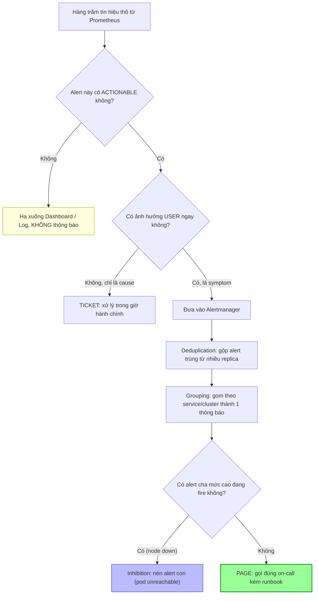

# Alert quá nhiều gây alert fatigue. Bạn xử lý ra sao?

## ⚡ Tóm tắt ngắn (30s)
* **Bản chất**: **Alert fatigue** là trạng thái đội ngũ on-call bị "chai lì" vì nhận quá nhiều cảnh báo không hành động được (non-actionable). Hậu quả tệ hơn cả không có alert: khi mọi thứ đều kêu, người ta tắt thông báo, bỏ qua, và **alert thật sự nghiêm trọng bị chôn vùi** giữa hàng trăm cảnh báo rác. Nguyên nhân gốc gần như luôn là: cảnh báo trên **cause** (CPU cao, disk 80%) thay vì **symptom** (user bị lỗi), không có phân tầng severity, và thiếu cơ chế gom/khử trùng lặp.
* **Hướng xử lý Senior**:
  1. **Mọi alert phải actionable**: Nếu nhận alert mà không có hành động cụ thể để làm ngay → nó không xứng đáng là alert (chuyển thành dashboard hoặc ticket).
  2. **Phân tầng nghiêm ngặt: Page vs Ticket vs Log**: Chỉ symptom ảnh hưởng user mới được **page** (gọi điện); cause chỉ tạo ticket/dashboard.
  3. **Grouping + Inhibition + Deduplication** (Alertmanager): Gom các alert liên quan thành một thông báo, ức chế alert con khi alert cha đã fire (ví dụ: node down thì im lặng tất cả alert pod trên node đó).
* **Quyết định Senior**: Áp dụng kỷ luật **"alert review" định kỳ** — đo lường tỷ lệ alert dẫn tới hành động thật (actionability rate). Mọi alert bị "ack rồi bỏ qua" nhiều lần phải bị xóa hoặc sửa. Mục tiêu: mỗi lần bị page là một sự kiện đáng để thức dậy lúc 3h sáng.

---

## 🔍 Chi tiết bản chất thực chiến: Giải phẫu cơn lũ cảnh báo

### 1. Hai loại nhiễu chính
* **Non-actionable noise**: "Memory 75%", "request latency tăng nhẹ rồi tự hồi phục". Không có gì để làm → chỉ gây mệt.
* **Redundant noise (bão alert)**: Một sự cố gốc (DB primary down) kích hoạt 200 alert con (mọi service phụ thuộc đều báo lỗi cùng lúc). On-call ngập trong 200 thông báo cho **1** vấn đề.

### 2. Nguyên tắc "Page on symptoms, diagnose with causes"
Đây là kim chỉ nam của Google SRE:
* **Page (đánh thức người)**: chỉ dành cho symptom **ảnh hưởng user** và **cần can thiệp ngay** — "checkout error rate > 2%", "p99 latency > SLO".
* **Ticket (xử lý trong giờ)**: vấn đề cần hành động nhưng không khẩn — "disk sẽ đầy trong 3 ngày".
* **Dashboard/Log (không thông báo)**: cause để chẩn đoán khi đã có sự cố — CPU, GC, pool usage.

Một sự cố user-facing thường chỉ cần **một** page (symptom), rồi on-call dùng hàng chục cause-metric trên dashboard để tìm nguyên nhân. Nếu mỗi cause là một page riêng → fatigue.

### 3. Bốn cơ chế giảm nhiễu của Alertmanager
* **Grouping**: gom alert cùng nhãn (ví dụ cùng `cluster`, `service`) vào một thông báo duy nhất.
* **Inhibition**: khi alert mức cao fire (node down), tự động **ức chế** các alert mức thấp liên quan (pod unreachable trên node đó).
* **Deduplication**: nhiều Prometheus replica gửi cùng alert → Alertmanager khử thành một.
* **Silencing/Maintenance window**: tắt alert chủ động khi đang deploy/bảo trì.

### 4. Đo lường để cải tiến
Không thể quản lý cái không đo được. Theo dõi: số page/tuần/người, tỷ lệ alert được hành động (vs ack-and-ignore), MTTA (Mean Time To Acknowledge). Nếu một alert có actionability ~0% → xóa nó.

---

## 🎨 Sơ đồ trực quan: Đường ống giảm nhiễu cảnh báo



---

## 💻 Code thực chiến: BAD vs GOOD

### ❌ BAD: Mỗi metric một page, không phân tầng, không gom
```yaml
# CÁCH SAI — biến on-call thành "máy nhận spam"
groups:
  - name: noisy
    rules:
      - alert: HighCPU
        expr: node_cpu_usage > 0.7          # ❌ cause, không ảnh hưởng user
        labels: { severity: page }          # ❌ page vì CPU cao -> 3h sáng dậy vô ích
      - alert: HighMemory
        expr: node_memory_usage > 0.75       # ❌ cause, lại page
        labels: { severity: page }
      - alert: DiskWarning
        expr: disk_usage > 0.6               # ❌ ngưỡng quá thấp, kêu suốt ngày
        labels: { severity: page }
        # ❌ Không grouping, không inhibition -> 1 node down = 200 page
```

### ✅ GOOD: Phân tầng + grouping + inhibition
```yaml
# prometheus/rules.yml — chỉ symptom mới page
groups:
  - name: slo-symptoms
    rules:
      - alert: CheckoutErrorRateHigh        # ✅ symptom ảnh hưởng user
        expr: |
          sum(rate(http_requests_total{job="checkout",code=~"5.."}[5m]))
          / sum(rate(http_requests_total{job="checkout"}[5m])) > 0.02
        for: 5m
        labels: { severity: page }
        annotations: { runbook: "https://wiki/runbooks/checkout" }
  - name: capacity-tickets
    rules:
      - alert: DiskFillingUp                 # ✅ cause -> chỉ ticket
        expr: predict_linear(node_filesystem_avail_bytes[6h], 3*24*3600) < 0
        for: 30m
        labels: { severity: ticket }         # ✅ không đánh thức ai
```

```yaml
# alertmanager.yml — gom & ức chế để dập bão alert
route:
  receiver: default
  group_by: ['cluster', 'service']           # ✅ gom theo service
  group_wait: 30s                            # ✅ chờ gom các alert phát sinh gần nhau
  group_interval: 5m
  repeat_interval: 4h
  routes:
    - matchers: [ 'severity="page"' ]
      receiver: pagerduty                     # ✅ chỉ page mới gọi điện
    - matchers: [ 'severity="ticket"' ]
      receiver: jira                          # ✅ ticket vào hàng đợi

inhibit_rules:
  - source_matchers: [ 'alertname="NodeDown"' ]
    target_matchers: [ 'severity="page"' ]
    equal: ['node']                           # ✅ node chết -> nén mọi page của pod trên node đó
```

---

## 📊 Bảng so sánh: Phân tầng cảnh báo đúng cách

| Tầng | Ví dụ | Loại metric | Kênh thông báo | Thời điểm xử lý |
| :--- | :--- | :--- | :--- | :--- |
| **Page (P1)** | Checkout error > 2%, p99 vượt SLO | Symptom (user-facing) | Gọi điện / PagerDuty | Ngay lập tức, kể cả 3h sáng |
| **Ticket (P2/P3)** | Disk sẽ đầy trong 3 ngày, cert hết hạn 7 ngày | Cause (dự báo) | Jira / Slack hàng đợi | Trong giờ hành chính |
| **Dashboard** | CPU, GC pause, pool usage | Cause (chẩn đoán) | Không chủ động báo | Khi điều tra sự cố |
| **Log/Audit** | Chi tiết từng request, trace | Diagnostic | Không báo | Khi cần root cause |

---

## ⚠️ Common Gotchas & Questions follow-up

### Cạm bẫy thường gặp
1. **"Cứ alert cho chắc"**: Tâm lý sợ bỏ sót khiến team page mọi thứ. Kết quả ngược lại: page quá nhiều → bị bỏ qua → bỏ sót cái thật. Ít nhưng chất lượng hơn nhiều mà rác.
2. **Severity lạm phát**: Mọi alert đều `critical`. Khi tất cả là critical thì chẳng cái nào critical. Phải có kỷ luật phân tầng.
3. **Thiếu inhibition cho phụ thuộc**: 1 DB down kéo theo 50 service báo lỗi. Không cấu hình inhibition → on-call phải tự lọc 50 thông báo tìm gốc.
4. **Flapping alert**: Metric dao động quanh ngưỡng → fire/resolve liên tục. Dùng `for:` (chờ duy trì) và hysteresis để dập.

### Câu hỏi đào sâu từ interviewer
* **Interviewer: "Team bạn đang nhận ~150 alert/tuần, đa số bị ack rồi bỏ qua. Bạn có 1 sprint để giảm fatigue. Bạn làm gì đầu tiên và đo lường ra sao?"**
* **Trả lời**:
  1. **Đo trước khi sửa**: Xuất lịch sử alert, tính cho mỗi `alertname`: tần suất, **tỷ lệ dẫn tới hành động thật** (có ai sửa gì không vs chỉ ack), và MTTA. Đây là dữ liệu để quyết định, không phán đoán cảm tính.
  2. **Tấn công 20% gây 80% noise**: Thường vài alert chiếm phần lớn lưu lượng. Với mỗi cái: nếu actionability ~0% → **xóa** hoặc chuyển dashboard; nếu hữu ích nhưng ồn → thêm `for:`, dùng tỷ lệ thay ngưỡng tuyệt đối, hoặc gộp grouping.
  3. **Tách page khỏi ticket**: Reroute tất cả cause-metric (CPU/mem/disk) khỏi kênh page sang kênh ticket. Chỉ giữ symptom SLO-based ở kênh page.
  4. **Thêm inhibition**: Khai báo quan hệ phụ thuộc (node→pod, DB→service) để bão alert co lại còn một thông báo gốc.
  5. **Đặt mục tiêu đo được**: ví dụ giảm page xuống < 20/tuần với actionability > 80%, và review lại sau mỗi sprint. Biến giảm fatigue thành quy trình liên tục, không phải một lần.
