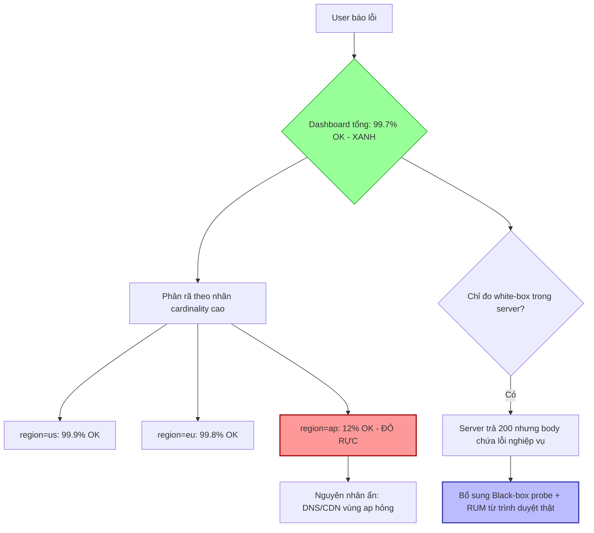

# Dashboard xanh nhưng user vẫn báo lỗi. Vì sao?

## ⚡ Tóm tắt ngắn (30s)
* **Bản chất**: "Dashboard xanh nhưng user báo lỗi" là kinh điển của **monitoring blind spot do tổng hợp (aggregation) che giấu sự thật**. Dashboard hiển thị **trung bình/tổng thể khỏe mạnh**, nhưng một **phân khúc nhỏ** (một region, một tenant, một endpoint, một version client) đang lỗi nặng. Trung bình "dìm chết" tín hiệu của thiểu số. Cộng thêm: ta đang đo **white-box** (server thấy mình OK) nhưng không đo **black-box** (trải nghiệm thật từ phía user) — server trả 200 nhưng response body sai, JS lỗi, CDN hỏng, hoặc DNS một vùng chết.
* **Hướng xử lý Senior**:
  1. **Đo percentile thay vì average**: Trung bình che giấu tail. Dùng p95/p99 và **đừng bao giờ tin avg latency**.
  2. **Phân rã theo chiều (high-cardinality breakdown)**: Tách metric theo route, status, region, tenant, version — để phân khúc lỗi nổi lên thay vì bị hòa tan.
  3. **Bổ sung Black-box & Real User Monitoring (RUM) + Synthetic**: Đo từ góc nhìn người dùng thật, không chỉ từ trong server.
* **Quyết định Senior**: Định nghĩa SLI dựa trên **"good events / total events" theo đúng đường đi của user (user journey)**, không phải theo health nội bộ của tiến trình. Một dashboard tốt phải trả lời được: *"User nào, ở đâu, làm gì đang fail?"* — chứ không chỉ "trung bình hệ thống có ổn không".

---

## 🔍 Chi tiết bản chất thực chiến: Vì sao "xanh" lại lừa dối

### 1. Nghịch lý trung bình (the tyranny of averages)
Giả sử 95% request nhanh 50ms, 5% chậm 5000ms (timeout). Average ≈ 297ms — nhìn "ổn". Nhưng 5% user đó đang trải nghiệm thảm họa. Average **toán học hóa** sự đau khổ của thiểu số thành con số đẹp.
* **Hệ quả**: Luôn ưu tiên **percentile** (p95/p99) và **error ratio theo phân khúc**, không phải mean. Một SLI latency phải là "tỷ lệ request nhanh hơn ngưỡng", không phải "latency trung bình".

### 2. Aggregation che giấu partial outage
Dashboard tổng cho toàn hệ thống: 99.9% thành công. Nhưng:
* `region=ap-southeast` đang 100% lỗi (chiếm 3% traffic).
* Tổng vẫn ~97% → đèn vẫn "xanh" theo ngưỡng 95%.
* User ở region đó thì **mọi thứ đều hỏng**.

Giải pháp: **phân rã theo nhãn cardinality cao** (region, tenant, endpoint, app version). Cảnh báo "có bất kỳ phân khúc nào dưới ngưỡng", không chỉ "tổng dưới ngưỡng".

### 3. White-box vs Black-box: server nói dối một cách thành thật
* **White-box** (Prometheus trong server): "Tôi xử lý request trong 30ms, trả HTTP 200." Đúng từ góc nhìn server.
* Nhưng user vẫn lỗi vì những thứ **ngoài tầm nhìn white-box**: CDN/edge lỗi, DNS một vùng hỏng, TLS sai, response body chứa lỗi nghiệp vụ nhưng status vẫn 200, client-side JS crash, mạng người dùng kém.
* **Black-box / Synthetic** (probe từ ngoài vào, như Blackbox Exporter, Pingdom) và **RUM** (đo từ trình duyệt thật) lấp đúng khoảng này.

### 4. SLI sai chỗ — đo cái dễ thay vì cái đúng
Nhiều team đo "uptime của process" (dễ) thay vì "tỷ lệ giao dịch checkout thành công" (đúng). Process sống ≠ nghiệp vụ chạy. SLI phải bám vào **critical user journey**.

---

## 🎨 Sơ đồ trực quan: Vì sao tổng thể xanh nhưng phân khúc đỏ



---

## 💻 Code thực chiến: BAD vs GOOD

### ❌ BAD: Đo trung bình, không phân rã, chỉ tin white-box
```promql
# CÁCH SAI
# ❌ Latency trung bình -> tail bị che hoàn toàn
avg(rate(http_request_duration_seconds_sum[5m]))
  / avg(rate(http_request_duration_seconds_count[5m]))

# ❌ Tỷ lệ lỗi TỔNG -> partial outage 1 region bị hòa tan
sum(rate(http_requests_total{code=~"5.."}[5m]))
  / sum(rate(http_requests_total[5m]))
```

### ✅ GOOD: Percentile + phân rã theo phân khúc + cảnh báo "any segment"
```promql
# ✅ p99 latency theo từng route -> thấy đúng endpoint chậm
histogram_quantile(0.99,
  sum by (le, route) (rate(http_request_duration_seconds_bucket[5m])))

# ✅ Error ratio PHÂN RÃ theo region & tenant -> partial outage lộ ra
sum by (region, tenant) (rate(http_requests_total{code=~"5.."}[5m]))
  / sum by (region, tenant) (rate(http_requests_total[5m]))

# ✅ Cảnh báo nếu BẤT KỲ phân khúc nào tệ, không chỉ tổng
# (alert rule)
# expr: max by (region) (... error ratio ...) > 0.05
```

```java
// ✅ Instrument metric với nhãn phân khúc + đo cả lỗi nghiệp vụ (không chỉ HTTP status)
@Around("execution(* com.shop.checkout..*(..))")
public Object measure(ProceedingJoinPoint pjp) throws Throwable {
    Timer.Sample s = Timer.start(registry);
    String outcome = "success";
    try {
        CheckoutResult r = (CheckoutResult) pjp.proceed();
        // ✅ HTTP 200 vẫn có thể là lỗi nghiệp vụ -> phải đếm riêng
        if (!r.isPaymentConfirmed()) outcome = "business_error";
        return r;
    } catch (Exception e) {
        outcome = "exception";
        throw e;
    } finally {
        s.stop(Timer.builder("checkout.duration")
            .tag("outcome", outcome)               // ✅ phân biệt success/business_error/exception
            .tag("region", RequestContext.region()) // ✅ phân rã theo region
            .tag("tenant", RequestContext.tenant())
            .register(registry));
    }
}
```

```yaml
# ✅ Black-box probe từ NGOÀI vào (Blackbox Exporter) — bắt cái white-box không thấy
# prometheus.yml
scrape_configs:
  - job_name: blackbox-http
    metrics_path: /probe
    params: { module: [http_2xx_body_check] }   # ✅ kiểm tra cả nội dung body, không chỉ status
    static_configs:
      - targets: ['https://shop.com/health/deep', 'https://shop.com/api/checkout/ping']
```

---

## 📊 Bảng so sánh: Vì sao dashboard "xanh" mà vẫn lỗi

| Nguyên nhân ẩn | Vì sao dashboard không thấy | Cách phát hiện đúng |
| :--- | :--- | :--- |
| **Trung bình che tail** | avg đẹp, p99 thảm | Đo p95/p99 bằng `histogram_quantile` |
| **Partial outage 1 phân khúc** | Tổng vẫn trên ngưỡng | Phân rã theo region/tenant/route, alert "any segment" |
| **Lỗi nghiệp vụ, HTTP vẫn 200** | Status code không phản ánh đúng | Đếm `business_error` riêng từ logic nghiệp vụ |
| **CDN/DNS/edge hỏng** | White-box server không thấy ngoài | Black-box probe + Synthetic monitoring |
| **Client-side JS/render crash** | Server hoàn toàn không biết | Real User Monitoring (RUM) từ trình duyệt |
| **Một app version lỗi** | Trộn chung mọi version | Thêm nhãn `app_version`/`build` |

---

## ⚠️ Common Gotchas & Questions follow-up

### Cạm bẫy thường gặp
1. **Tin vào avg latency**: Sai lầm phổ biến nhất. Average luôn nói dối khi phân phối lệch (skewed). Tail (p99) mới là nơi user đau.
2. **Trung bình hóa các percentile**: KHÔNG được lấy `avg(p99)` qua nhiều instance — phép toán percentile không cộng/trung bình được. Phải gộp **histogram bucket** rồi mới tính quantile một lần.
3. **Cardinality explosion khi phân rã**: Thêm nhãn `user_id` (hàng triệu giá trị) làm nổ Prometheus. Phân rã theo chiều **bounded** (region, route, tenant) — không phải unbounded (user_id, request_id).
4. **Chỉ white-box**: Server khỏe ≠ user khỏe. Thiếu black-box/RUM là điểm mù lớn nhất.

### Câu hỏi đào sâu từ interviewer
* **Interviewer: "Bạn nói nên phân rã theo region/tenant. Nhưng nếu thêm nhiều nhãn thì Prometheus nổ vì cardinality. Bạn cân bằng giữa khả năng nhìn chi tiết và chi phí cardinality thế nào?"**
* **Trả lời**:
  1. **Hiểu cardinality = tích Descartes**: Tổng series ≈ tích số giá trị của mọi nhãn. `route(50) × region(5) × status(6)` = 1500 series — ổn. Nhưng thêm `user_id(1M)` → nổ hàng triệu series, giết Prometheus.
  2. **Chỉ gắn nhãn bounded & hữu ích để cắt lát**: region, tenant-tier, route template (không phải URL thật có ID), app version. Tuyệt đối tránh nhãn unbounded: user_id, order_id, full URL, email.
  3. **Tách tầng theo công cụ**: Metric (Prometheus) chỉ cho chiều cardinality thấp → phát hiện *phân khúc nào* lỗi. Khi cần xuống *user/request cụ thể nào*, chuyển sang **tracing & logs** (high-cardinality store như Tempo/Loki/Elasticsearch) đã được liên kết qua trace_id. Đây chính là sự phân vai giữa 3 trụ observability.
  4. **Dùng exemplars**: Gắn exemplar (trace_id mẫu) vào histogram bucket — từ một điểm p99 cao trên dashboard, nhảy thẳng vào trace của đúng request chậm đó mà không cần nhồi cardinality vào metric.
  5. **Recording rules + giới hạn**: Pre-aggregate các chiều hay dùng, đặt `sample_limit` để bảo vệ Prometheus khỏi nổ ngoài ý muốn.
