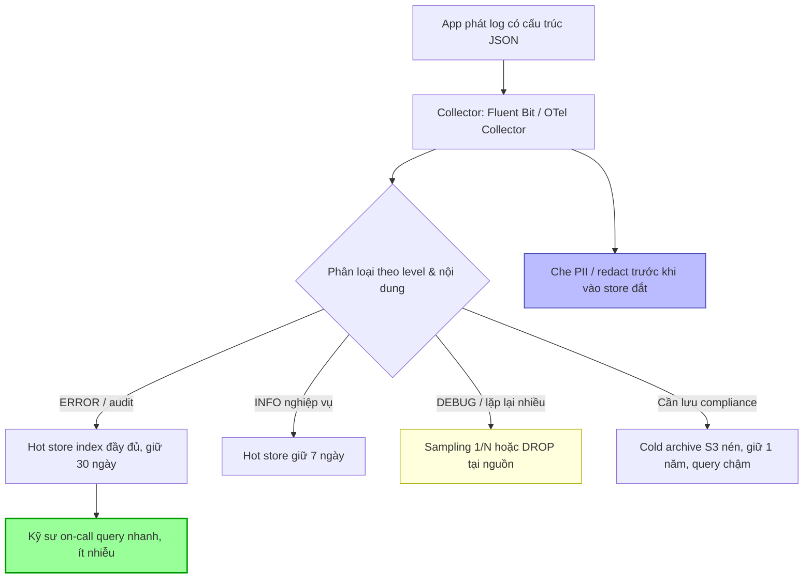

# Log quá nhiều làm tăng cost và khó debug. Bạn làm gì?

## ⚡ Tóm tắt ngắn (30s)
* **Bản chất**: Log "phình to" gây hai nỗi đau: (1) **Chi phí** — ingest + index + lưu trữ log ở quy mô TB/ngày trên Datadog/ELK/Splunk cực đắt, và (2) **Khó debug** — tín hiệu (signal) bị chôn dưới hàng triệu dòng nhiễu (noise), tìm một lỗi như mò kim đáy bể. Nguyên nhân gốc: log mọi thứ ở mức INFO, log không cấu trúc (free-text), log trùng lặp, và dùng log để thay cho metric/trace.
* **Hướng xử lý Senior**:
  1. **Đúng trụ cho đúng việc (3 pillars)**: Metric cho "có vấn đề không" (rẻ, tổng hợp), Trace cho "vấn đề ở đâu trong luồng" (lấy mẫu), Log cho "chi tiết vì sao" (đắt, chỉ giữ cái cần). Đừng dùng log để đếm — đó là việc của metric.
  2. **Structured logging + log levels kỷ luật**: JSON có schema, dùng đúng level (ERROR/WARN/INFO/DEBUG), và **sampling** cho log lặp lại nhiều.
  3. **Tiered storage + retention theo giá trị**: Log nóng (7 ngày, index đầy đủ) vs log lạnh (S3/Glacier, rẻ, query chậm). Giữ ERROR lâu, vứt DEBUG nhanh.
* **Quyết định Senior**: Coi log là một **sản phẩm có chi phí và có người dùng (chính là kỹ sư on-call)**. Tối ưu cho **khả năng debug trên mỗi đồng chi**, không phải "log càng nhiều càng an toàn". Một dòng log tốt đáng giá hơn nghìn dòng rác.

---

## 🔍 Chi tiết bản chất thực chiến: Quản trị log như quản trị chi phí

### 1. Ba trụ cột observability và sự phân vai chi phí
* **Metrics**: Số liệu tổng hợp theo thời gian, cardinality thấp. **Rẻ nhất**. Trả lời "có bao nhiêu lỗi, p99 bao nhiêu". Đừng log từng request rồi `count` — hãy tăng counter.
* **Traces**: Theo dấu một request qua nhiều service. Chi phí trung bình (thường **sampling**). Trả lời "request này chậm ở span nào".
* **Logs**: Sự kiện rời rạc, chi tiết, cardinality cao. **Đắt nhất** khi index. Trả lời "chính xác vì sao lỗi này xảy ra".

Lỗi kinh điển: nhồi mọi thứ vào log rồi dùng log để vẽ chart và đếm → vừa đắt vừa chậm. Việc đó thuộc về metric.

### 2. Kỷ luật log level
* **ERROR**: lỗi cần người xử lý — giữ lâu, đừng sampling.
* **WARN**: bất thường tự hồi phục — giữ vừa.
* **INFO**: mốc nghiệp vụ quan trọng (order created) — không log mỗi bước nhỏ.
* **DEBUG/TRACE**: chi tiết — **tắt ở production**, chỉ bật động (dynamic log level) khi điều tra.

Đa số "log phình to" do INFO/DEBUG bị bật bừa ở production và log trong vòng lặp nóng.

### 3. Sampling log lặp lại
Nếu một lỗi xảy ra 100.000 lần/phút (ví dụ một downstream chết), log cả 100K dòng giống hệt là vô ích và tốn kém. Dùng **sampling**: giữ 1/N, kèm counter "đã nén X dòng tương tự". Logback có `<turboFilter>` / duplicate suppression; nhiều thư viện hỗ trợ rate-limited logging.

### 4. Tiered storage & retention
* **Hot tier** (Elasticsearch/Loki, index đầy đủ): 7–14 ngày, query nhanh, đắt.
* **Cold/Archive** (S3/Glacier, nén, không index): 90+ ngày cho compliance, query chậm & rẻ.
* Định tuyến: ERROR + audit → giữ lâu; DEBUG → drop hoặc TTL ngắn.

### 5. Drop/redact ngay tại nguồn (collector)
Dùng pipeline (Fluent Bit / OTel Collector / Logstash) để **lọc, sample, và che PII** trước khi vào store đắt tiền — cắt chi phí ở đầu vào, không phải sau khi đã trả tiền index.

---

## 🎨 Sơ đồ trực quan: Đường ống log có kiểm soát chi phí



---

## 💻 Code thực chiến: BAD vs GOOD

### ❌ BAD: Log free-text, log trong vòng lặp, dùng log để đếm
```java
// CÁCH SAI
for (Order o : orders) {
    // ❌ Log mỗi vòng lặp ở INFO -> hàng triệu dòng/phút
    log.info("Processing order " + o.getId() + " for user " + o.getUserEmail());
    // ❌ Nối chuỗi -> không parse được, lộ PII (email)
    try {
        process(o);
    } catch (Exception e) {
        // ❌ Log full stacktrace cho lỗi lặp 100K lần -> nổ cost
        log.error("Failed: " + e.getMessage(), e);
    }
}
// ❌ Sau đó dùng query log để "đếm số order" -> việc của METRIC, không phải log
```

### ✅ GOOD: Structured + đúng level + metric cho việc đếm + sampling lỗi
```java
// ✅ Đếm bằng METRIC (rẻ), không bằng log
Counter processed = registry.counter("orders.processed");

for (Order o : orders) {
    try {
        process(o);
        processed.increment();                 // ✅ đếm bằng metric
        // ✅ INFO chỉ cho mốc nghiệp vụ thật sự, có cấu trúc, KHÔNG log PII thô
        log.atInfo()
           .addKeyValue("order_id", o.getId())
           .addKeyValue("trace_id", MDC.get("trace_id"))
           .log("order_processed");            // ✅ event name ổn định, dễ query
    } catch (DownstreamException e) {
        // ✅ Sampling lỗi lặp lại để tránh nổ cost, nhưng vẫn đếm đủ qua metric
        if (errorSampler.shouldLog()) {
            log.atError()
               .addKeyValue("order_id", o.getId())
               .addKeyValue("reason", e.code())
               .setCause(e)
               .log("order_failed");
        }
        registry.counter("orders.failed", "reason", e.code()).increment();
    }
}
```

```xml
<!-- logback-spring.xml: JSON structured + tắt DEBUG ở prod + dynamic level -->
<configuration>
  <appender name="JSON" class="ch.qos.logback.core.ConsoleAppender">
    <encoder class="net.logstash.logback.encoder.LogstashEncoder"/> <!-- ✅ JSON có schema -->
  </appender>
  <!-- ✅ Production mặc định INFO; bật DEBUG động qua actuator khi cần điều tra -->
  <root level="INFO"><appender-ref ref="JSON"/></root>
  <logger name="com.shop.payment" level="INFO"/>
</configuration>
```

```yaml
# OTel Collector / Fluent Bit: drop & sample tại nguồn -> cắt cost đầu vào
processors:
  filter/drop_debug:
    logs:
      exclude:
        match_type: strict
        severity_texts: ["DEBUG", "TRACE"]   # ✅ vứt DEBUG trước khi vào store đắt
  transform/redact:
    log_statements:
      - context: log
        statements:
          - replace_pattern(body, "[\\w.]+@[\\w.]+", "[REDACTED_EMAIL]")  # ✅ che PII
```

---

## 📊 Bảng so sánh: 3 trụ Observability — dùng đúng để tiết kiệm

| Tiêu chí | Metrics | Traces | Logs |
| :--- | :--- | :--- | :--- |
| **Trả lời câu hỏi** | "Có vấn đề không? Bao nhiêu?" | "Vấn đề ở đâu trong luồng?" | "Chính xác vì sao?" |
| **Chi phí lưu/đơn vị** | Rẻ nhất | Trung bình (có sampling) | Đắt nhất (index) |
| **Cardinality** | Thấp (bounded labels) | Cao (per-request) | Rất cao (free-form) |
| **Cách kiểm soát cost** | Giới hạn label cardinality | Tail-based sampling | Level + sampling + tiered + drop tại nguồn |
| **Sai lầm thường gặp** | — | Sample quá thấp (mất lỗi) | Dùng để đếm/vẽ chart (việc của metric) |

---

## ⚠️ Common Gotchas & Questions follow-up

### Cạm bẫy thường gặp
1. **Dùng log thay metric**: Query log để đếm số lỗi → đắt và chậm. Đẩy việc đếm sang counter.
2. **Log trong hot loop / per-request DEBUG ở prod**: Nguyên nhân số một của phình log. Tắt DEBUG mặc định, bật động khi cần.
3. **Log không cấu trúc**: Free-text khiến không filter/aggregate được, mỗi lần debug phải grep regex. JSON có schema giải quyết triệt để.
4. **Lộ PII trong log**: Email, số thẻ, token lọt vào log → vừa rủi ro compliance (GDPR/PCI), vừa tốn dung lượng. Redact tại collector.
5. **Sampling cả ERROR**: Đừng sample mất lỗi hiếm. Sample log lặp lại nhiều, nhưng giữ đủ lỗi độc nhất.

### Câu hỏi đào sâu từ interviewer
* **Interviewer: "Bạn muốn giảm 60% chi phí log nhưng team sợ mất khả năng debug sự cố hiếm. Bạn dung hòa thế nào để cắt cost mà không 'mù' khi cần?"**
* **Trả lời**:
  1. **Phân tích cost theo nguồn trước**: Xác định service/level nào chiếm phần lớn volume. Thường 80% cost đến từ DEBUG/INFO của vài service nóng — cắt đúng chỗ đó, không cào bằng.
  2. **Hạ tầng tiered thay vì xóa**: Không phải "xóa log", mà chuyển log ít giá trị sang **cold archive (S3)** — vẫn còn để truy hồi khi cần điều tra hiếm, nhưng không trả tiền index đắt. ERROR/audit giữ ở hot tier.
  3. **Dynamic sampling theo ngữ cảnh**: Bình thường sample DEBUG xuống thấp; khi một incident bắt đầu (alert fire), tự động **nâng sampling/log level** cho service liên quan trong cửa sổ điều tra (feature flag / actuator). Có chi tiết đúng lúc cần, rẻ lúc bình thường.
  4. **Chuyển "chi tiết debug" sang trace với tail-based sampling**: Giữ 100% trace của request **lỗi/chậm**, drop trace thành công — bắt được sự cố hiếm mà không log toàn bộ.
  5. **Đặt SLO cho chính observability**: Cam kết "debug được 99% sự cố P1/P2 với dữ liệu hiện có". Đo bằng các postmortem: có lần nào thiếu dữ liệu để tìm root cause không? Nếu không → đang cắt đúng. Biến quyết định cost thành dữ liệu, không cảm tính.
