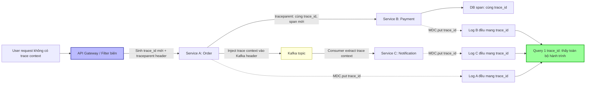

# Không có correlation ID nên không trace được request. Bạn cải thiện thế nào?

## ⚡ Tóm tắt ngắn (30s)
* **Bản chất**: Trong kiến trúc microservices, một request của user đi qua hàng chục service. Không có **correlation ID** (định danh xuyên suốt) thì log của mỗi service là những mảnh rời rạc — khi lỗi xảy ra, ta không thể ghép lại "request này đã đi qua đâu, chết ở đâu". Hệ quả: debug bằng cách đoán mò, đối chiếu timestamp thủ công, MTTR tăng vọt.
* **Hướng xử lý Senior**:
  1. **Sinh ID tại biên (edge) và lan truyền (propagate) xuyên suốt**: API Gateway/filter đầu tiên sinh `trace_id` nếu chưa có, rồi truyền qua mọi hop bằng **chuẩn W3C Trace Context** (header `traceparent`).
  2. **Tự động bơm vào log qua MDC**: Mọi dòng log tự động kèm `trace_id`/`span_id` nhờ MDC (Mapped Diagnostic Context), không cần dev nhớ thêm thủ công.
  3. **Dùng OpenTelemetry thay vì tự chế**: OTel auto-instrument lan truyền context qua HTTP, gRPC, JDBC, Kafka, và auto-inject vào log — chuẩn hóa toàn hệ thống.
* **Quyết định Senior**: Phân biệt rõ **Trace ID (cả hành trình)** vs **Span ID (một chặng)** vs **correlation/request ID nghiệp vụ**. Quan trọng nhất: lan truyền context phải **vượt qua ranh giới async** (thread pool, message queue Kafka) — đây là nơi context hay bị "rớt" nhất.

---

## 🔍 Chi tiết bản chất thực chiến: Lan truyền ngữ cảnh xuyên hệ thống

### 1. Ba khái niệm cần phân biệt
* **Trace ID**: Định danh **toàn bộ** hành trình của một request qua mọi service. Không đổi từ đầu đến cuối.
* **Span ID**: Định danh **một đơn vị công việc** (một chặng) trong trace — ví dụ "gọi DB", "gọi payment service". Mỗi service tạo span con, gắn `parent_span_id` để dựng cây.
* **Correlation/Request ID nghiệp vụ**: Đôi khi cần ID gắn với nghiệp vụ (order_id) để liên kết, nhưng về tracing thì `trace_id` mới là trục chính.

### 2. Context propagation — trái tim của distributed tracing
Khi service A gọi service B, A phải **nhét trace context vào request** để B nối tiếp đúng trace:
* **Chuẩn W3C Trace Context**: header `traceparent: 00-{trace_id}-{span_id}-{flags}`. Đây là chuẩn liên thông giữa các vendor (thay cho B3 của Zipkin cũ).
* B đọc `traceparent`, tạo span con với cùng `trace_id`, `parent_span_id = span_id` của A.
* Nếu request đến **không có** `traceparent` (vào từ ngoài) → biên hệ thống **sinh mới**.

### 3. MDC — cầu nối giữa trace và log
MDC là một `Map` theo thread (bản chất là ThreadLocal) chứa key-value tự động đính vào mọi dòng log. Đặt `MDC.put("trace_id", ...)` ở filter đầu vào → mọi log trong request đó tự mang `trace_id`. Nhờ đó: từ một trace lỗi → nhảy thẳng sang đúng các dòng log của nó, và ngược lại.
* **Cảnh báo**: MDC dùng ThreadLocal → **phải `MDC.clear()`** cuối request (thread pool tái sử dụng thread, nếu không sẽ rò context sang request sau).

### 4. Cái bẫy lớn nhất: ranh giới bất đồng bộ
Context lan truyền tự nhiên trong cùng một thread. Nhưng khi:
* **Thread pool / `@Async` / CompletableFuture**: thread con không có ThreadLocal của thread cha → mất context.
* **Message queue (Kafka/RabbitMQ)**: producer và consumer là hai tiến trình khác nhau → phải **nhét trace context vào message header** và consumer **trích xuất lại**.

OpenTelemetry xử lý phần lớn việc này tự động (context propagators, instrumentation cho executor và Kafka), đó là lý do nên dùng OTel thay vì tự code truyền `X-Request-Id` thủ công.

---

## 🎨 Sơ đồ trực quan: Lan truyền Trace ID qua các service và Kafka



---

## 💻 Code thực chiến: BAD vs GOOD

### ❌ BAD: Mỗi service tự log, không có ID xuyên suốt
```java
// Service A
log.info("Received order request");           // ❌ không biết request nào
restTemplate.postForObject(paymentUrl, body, ...); // ❌ không truyền context gì

// Service B
log.error("Payment failed");                  // ❌ không liên kết được với log của A
// -> Khi lỗi: phải đoán theo timestamp, gần như không thể ghép trace
```

### ✅ GOOD: OpenTelemetry + MDC filter + propagation qua Kafka
```java
// ✅ 1. Filter biên: sinh hoặc kế thừa trace context, bơm vào MDC
@Component
public class TracingMdcFilter extends OncePerRequestFilter {
    @Override
    protected void doFilterInternal(HttpServletRequest req, HttpServletResponse res,
                                    FilterChain chain) throws ServletException, IOException {
        // OTel đã tạo span từ traceparent header (hoặc sinh mới nếu vào từ ngoài)
        Span span = Span.current();
        String traceId = span.getSpanContext().getTraceId();
        MDC.put("trace_id", traceId);             // ✅ mọi log trong request mang trace_id
        MDC.put("span_id", span.getSpanContext().getSpanId());
        res.setHeader("X-Trace-Id", traceId);     // ✅ trả về client để support tra cứu
        try {
            chain.doFilter(req, res);
        } finally {
            MDC.clear();                          // ✅ BẮT BUỘC clear, tránh rò sang request sau
        }
    }
}
```

```java
// ✅ 2. Lan truyền qua Kafka: inject ở producer, extract ở consumer
// Producer
TextMapPropagator propagator = openTelemetry.getPropagators().getTextMapPropagator();
propagator.inject(Context.current(), record.headers(),
    (headers, k, v) -> headers.add(k, v.getBytes(StandardCharsets.UTF_8))); // ✅ nhét context vào header
kafkaTemplate.send(record);

// Consumer
Context extracted = propagator.extract(Context.current(), record.headers(),
    new KafkaHeadersGetter());                    // ✅ nối tiếp đúng trace của producer
try (Scope scope = extracted.makeCurrent()) {
    MDC.put("trace_id", Span.current().getSpanContext().getTraceId());
    process(record);
} finally {
    MDC.clear();
}
```

```xml
<!-- ✅ 3. logback: pattern tự in trace_id/span_id từ MDC -->
<pattern>%d{ISO8601} %-5level [%X{trace_id},%X{span_id}] %logger{36} - %msg%n</pattern>
```

```yaml
# ✅ 4. application.yml — bật W3C propagation (Micrometer Tracing / OTel)
management:
  tracing:
    sampling:
      probability: 0.1          # head sampling 10% (xem câu về sampling)
    propagation:
      type: w3c                 # ✅ chuẩn traceparent, liên thông đa vendor
```

---

## 📊 Bảng so sánh: Trace ID vs Span ID vs Correlation ID nghiệp vụ

| Tiêu chí | Trace ID | Span ID | Correlation/Request ID nghiệp vụ |
| :--- | :--- | :--- | :--- |
| **Phạm vi** | Toàn bộ hành trình request | Một chặng/đơn vị công việc | Một giao dịch nghiệp vụ |
| **Bất biến qua các hop?** | ✅ Không đổi từ đầu đến cuối | ❌ Mỗi service/op tạo span mới | Thường gắn nghiệp vụ (order_id) |
| **Dùng để** | Ghép toàn bộ luồng, liên kết log↔trace | Dựng cây span, đo latency từng chặng | Liên hệ với dữ liệu nghiệp vụ |
| **Chuẩn lan truyền** | W3C `traceparent` | Nằm trong `traceparent` | Header tùy biến (vd `X-Request-Id`) |
| **Sinh ở đâu** | Biên hệ thống nếu chưa có | Mỗi service khi bắt đầu công việc | Tầng nghiệp vụ |

---

## ⚠️ Common Gotchas & Questions follow-up

### Cạm bẫy thường gặp
1. **Quên `MDC.clear()`**: MDC dựa trên ThreadLocal; thread pool tái sử dụng thread → trace_id của request cũ rò sang request mới, gây log sai và rò thông tin. Luôn clear trong `finally` (hoặc dùng interceptor `afterCompletion`).
2. **Mất context qua async**: `@Async`/CompletableFuture/executor tự tạo → ThreadLocal không theo sang. Phải dùng OTel context wrapping hoặc `taskDecorator` để copy context.
3. **Mất context qua Kafka/queue**: Hai tiến trình tách biệt — phải inject/extract qua message header, không tự nhiên có.
4. **Tự chế thay vì dùng chuẩn**: Tự truyền `X-Request-Id` riêng lẻ thì không liên thông với tracing backend (Jaeger/Tempo) và không dựng được cây span. Dùng W3C + OTel.
5. **Sinh ID ở sai chỗ**: Sinh trong từng service → mỗi service một ID khác nhau, vô nghĩa. Phải sinh **một lần ở biên**, rồi truyền đi.

### Câu hỏi đào sâu từ interviewer
* **Interviewer: "Bạn có correlation ID rồi, nhưng request đi qua một hàng đợi Kafka và được xử lý bất đồng bộ sau 2 giờ bởi một consumer khác. Làm sao trace vẫn liên kết được, và việc này khác gì với gọi đồng bộ?"**
* **Trả lời**:
  1. **Vấn đề cốt lõi**: Đồng bộ thì context nằm trong cùng ngăn xếp gọi (ThreadLocal đủ dùng). Bất đồng bộ qua queue thì producer kết thúc trước, consumer chạy ở tiến trình/thời điểm khác → ThreadLocal không thể bắc cầu.
  2. **Giải pháp**: **Inject trace context vào message header** lúc produce (như code trên), và consumer **extract** để tạo span nối tiếp. Trace context chỉ là vài chuỗi text nên lưu trong header rất rẻ và bền qua thời gian/tiến trình.
  3. **Khác biệt về ngữ nghĩa span**: Với async, không nên dùng quan hệ `parent-child` cứng (vì consumer có thể chạy rất lâu sau, đo "duration" cha-con thành vô nghĩa). OTel khuyến nghị dùng **Span Link** (liên kết nhân-quả giữa producer span và consumer span) thay vì parent-child, để biểu diễn đúng "request này đã sinh ra việc xử lý kia" mà không bóp méo thời lượng.
  4. **Vẫn cùng `trace_id`**: Dù dùng link, `trace_id` giữ nguyên nên ta vẫn truy được toàn bộ câu chuyện end-to-end, kể cả khi xử lý cách nhau 2 giờ và retry nhiều lần (mỗi lần xử lý là một span mới trong cùng trace).
  5. **Lưu ý retry & fan-out**: Một message có thể được nhiều consumer xử lý hoặc retry — mỗi lần là span riêng có cùng trace_id, giúp thấy rõ một sự kiện gốc đã khuếch tán thành bao nhiêu việc downstream.
