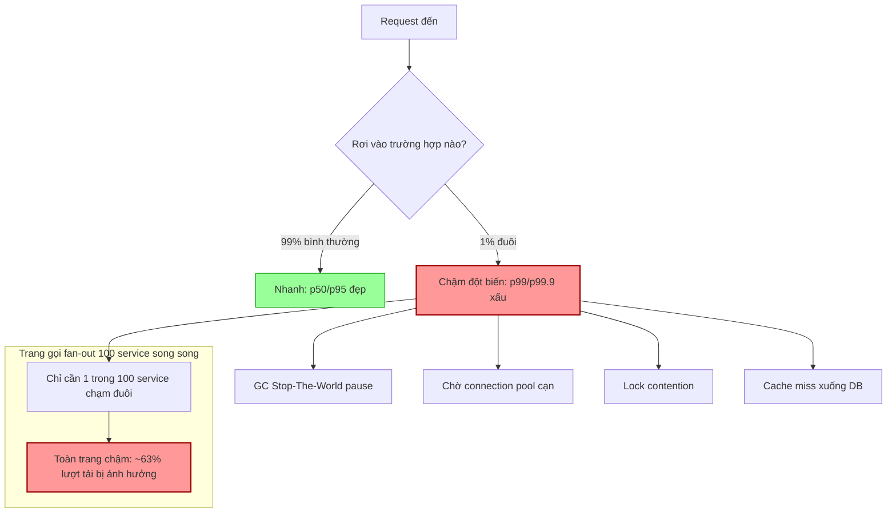

# Metric p95 tốt nhưng p99 rất xấu. Có đáng lo không?

## ⚡ Tóm tắt ngắn (30s)
* **Bản chất**: **Rất đáng lo.** p95 đo "95% request nhanh hơn X", p99 đo "99% nhanh hơn Y". Khi p95 tốt nhưng p99 xấu, nghĩa là **1% request đuôi (tail) đang chậm nghiêm trọng**. 1% nghe nhỏ, nhưng ở quy mô lớn nó là hàng nghìn user/phút, và tệ hơn — do hiệu ứng **tail amplification** trong kiến trúc fan-out, một user thực hiện nhiều request thì xác suất "dính ít nhất một request chậm" tăng vọt.
* **Hướng xử lý Senior**:
  1. **Coi tail latency là tín hiệu sức khỏe hệ thống**: p99/p99.9 phản ánh các vấn đề mà p50/p95 che giấu: **GC pause (stop-the-world), lock contention, connection pool cạn, cold cache, queueing, noisy neighbor, retry storm**.
  2. **Điều tra theo nguyên nhân đuôi**: Phân rã p99 theo route/dependency, soi GC log, đo thời gian chờ pool, kiểm tra fan-out.
  3. **Thiết kế chống tail**: hedged requests, timeout + retry budget, bulkhead, tách tài nguyên, giảm fan-out đồng bộ.
* **Quyết định Senior**: Ở quy mô lớn, **p99 mới là trải nghiệm thật**, không phải trung bình. "Một service mà p99 xấu là service mà người dùng nặng nhất (và thường giá trị nhất) đang khổ nhất."

---

## 🔍 Chi tiết bản chất thực chiến: Vì sao cái đuôi 1% lại nguy hiểm

### 1. Percentile nói gì
* **p50 (median)**: trải nghiệm điển hình.
* **p95**: 5% chậm nhất bắt đầu lộ ra — thường vẫn là dao động bình thường.
* **p99 / p99.9**: **cái đuôi** — nơi các sự kiện hiếm nhưng đắt giá hiện ra. Đây là nơi **GC pause, contention, queueing** trú ngụ.

p95 đẹp nhưng p99 xấu = "đa số ổn, nhưng có một lớp request gặp sự cố có hệ thống ở đuôi". Đó không phải nhiễu — đó là triệu chứng.

### 2. Những nguyên nhân kinh điển của tail latency
* **GC pause (Stop-The-World)**: Major/Full GC dừng toàn bộ JVM vài chục–vài trăm ms. Request không may rơi đúng lúc GC → chậm đột biến. Chỉ ảnh hưởng % nhỏ request → đúng đặc trưng p99.
* **Lock contention**: Phần lớn request không tranh khóa (nhanh), nhưng khi va vào nhau ở synchronized/`ReentrantLock` nóng → một số phải chờ.
* **Connection pool / thread pool cạn**: Khi pool đầy, request phải **xếp hàng chờ** lấy connection — queueing tạo đuôi dài.
* **Cold cache / cache miss**: Đa số hit cache (nhanh), thiểu số miss phải xuống DB (chậm).
* **Noisy neighbor**: Trên hạ tầng chia sẻ, một tenant/pod ngốn CPU/IO làm chậm số ít request khác.
* **Retry & queueing**: Một downstream chậm → retry → khuếch đại tải → đuôi càng dài.

### 3. Tail amplification — vì sao p99 quan trọng hơn bạn nghĩ
Nếu một trang user cần gọi $n$ service song song (fan-out) và mỗi service có xác suất chậm là $p$, thì xác suất **toàn trang chậm** (chỉ cần một service chậm là đủ) là:

$$P(\text{trang chậm}) = 1 - (1-p)^n$$

Với $p = 0.01$ (p99) và fan-out $n = 100$ service:

$$P = 1 - (0.99)^{100} \approx 1 - 0.366 = 0.634 \approx 63\%$$

Nghĩa là **63% lượt tải trang sẽ chạm phải ít nhất một service ở đuôi p99** — cái "1%" tưởng nhỏ hóa ra chi phối đa số trải nghiệm. Đây là lý do Google nhấn mạnh tail latency (bài "The Tail at Scale").

### 4. Đừng trung bình hóa percentile
Sai lầm phổ biến: lấy `avg(p99)` qua nhiều instance. Percentile **không cộng tuyến tính**. Phải gộp **histogram bucket** rồi tính `histogram_quantile` một lần trên tổng.

---

## 🎨 Sơ đồ trực quan: Đuôi p99 và hiệu ứng khuếch đại fan-out



---

## 💻 Code thực chiến: BAD vs GOOD

### ❌ BAD: Chỉ nhìn average, trung bình hóa percentile, không có timeout
```promql
# ❌ Trung bình che hoàn toàn cái đuôi
avg(rate(http_request_duration_seconds_sum[5m]))
  / avg(rate(http_request_duration_seconds_count[5m]))

# ❌ SAI VỀ TOÁN: không được avg các p99 đã tính sẵn
avg(http_request_p99)
```
```java
// ❌ Gọi downstream không timeout -> 1 downstream treo kéo p99 lên vô hạn
String r = restTemplate.getForObject(slowServiceUrl, String.class); // treo mãi
```

### ✅ GOOD: Đo p99 đúng cách + timeout + hedging chống tail
```promql
# ✅ Gộp bucket rồi tính quantile MỘT LẦN, phân rã theo route để soi đuôi
histogram_quantile(0.99,
  sum by (le, route) (rate(http_request_duration_seconds_bucket[5m])))

# ✅ Theo dõi cả p99.9 cho service quy mô lớn
histogram_quantile(0.999,
  sum by (le) (rate(http_request_duration_seconds_bucket[5m])))
```
```java
// ✅ Timeout chặt + retry budget + (tùy chọn) hedged request chống tail
WebClient client = WebClient.builder().build();

Mono<Resp> primary = client.get().uri(url).retrieve().bodyToMono(Resp.class)
    .timeout(Duration.ofMillis(200));                 // ✅ cắt đuôi: không chờ vô hạn

// ✅ Hedged request: nếu sau 50ms chưa có kết quả, bắn thêm 1 request song song,
//    lấy cái nào về trước -> giảm p99 do GC pause/noisy neighbor ngẫu nhiên
Mono<Resp> hedged = Mono.firstWithValue(
    primary,
    Mono.delay(Duration.ofMillis(50))
        .then(client.get().uri(url).retrieve().bodyToMono(Resp.class)));
```
```yaml
# ✅ Cấu hình pool đủ rộng + giám sát thời gian chờ pool (nguồn đuôi phổ biến)
spring:
  datasource:
    hikari:
      maximum-pool-size: 30
      connection-timeout: 250          # ✅ fail nhanh thay vì xếp hàng tạo đuôi dài
# Đo hikaricp_connections_acquire_seconds (p99) để phát hiện queueing ở pool
```

---

## 📊 Bảng so sánh: Các percentile và nguyên nhân đuôi tương ứng

| Percentile | Ý nghĩa | Nguyên nhân điển hình khi xấu | Mức độ quan tâm |
| :--- | :--- | :--- | :--- |
| **p50 (median)** | Trải nghiệm điển hình | Nghẽn cơ bản (DB chậm chung, code chậm) | Cao — nếu xấu là vấn đề toàn cục |
| **p95** | 5% chậm nhất | Tải cao nhẹ, một số cache miss | Trung bình |
| **p99** | Đuôi rõ rệt | **GC pause, lock contention, pool cạn, noisy neighbor** | Cao ở quy mô lớn |
| **p99.9** | Đuôi cực hạn | Full GC, failover, retry storm, fan-out amplification | Rất cao với hệ thống lớn / SLA chặt |
| **avg** | Trung bình | Bị tail kéo lệch, **che giấu phân phối** | Thấp — không nên dùng làm SLI |

---

## ⚠️ Common Gotchas & Questions follow-up

### Cạm bẫy thường gặp
1. **Coi nhẹ 1%**: "Chỉ 1% thôi mà". Ở 10K req/s, 1% = 100 req/s = 6.000 user/phút khổ; cộng fan-out amplification thì ảnh hưởng còn lớn hơn nhiều.
2. **Average hóa percentile**: Lỗi toán học nghiêm trọng — `avg(p99)` qua các instance là vô nghĩa. Luôn gộp histogram bucket trước.
3. **Histogram bucket sai phân giải**: Nếu bucket boundaries quá thưa quanh vùng quan tâm, `histogram_quantile` ước lượng sai. Chọn bucket hợp lý quanh SLO.
4. **Bỏ qua coordinated omission**: Công cụ benchmark/đo có thể "bỏ sót" các mẫu chậm khi hệ thống treo, làm p99 đẹp giả tạo. Cần công cụ đo đúng (HdrHistogram).
5. **Sửa p99 bằng cách tăng timeout**: Nới timeout chỉ giấu vấn đề; phải tìm nguồn đuôi (GC, pool, contention).

### Câu hỏi đào sâu từ interviewer
* **Interviewer: "p95 ổn nhưng p99 tăng đột biến mỗi ~30 giây một nhịp. Bạn nghi ngờ gì đầu tiên và xác nhận thế nào?"**
* **Trả lời**:
  1. **Nghi ngờ số một: GC pause theo chu kỳ**. Đột biến p99 đều đặn theo nhịp thời gian là chữ ký kinh điển của **Stop-The-World GC** (hoặc một cron/flush nội bộ chạy định kỳ). Major GC dừng JVM → các request rơi đúng cửa sổ đó bị kéo dài, chỉ ảnh hưởng % nhỏ → đẩy p99 chứ không đẩy p50.
  2. **Xác nhận bằng cách tương quan thời gian**: Chồng biểu đồ p99 lên **GC pause time** (`jvm_gc_pause_seconds`) và nhịp GC. Nếu đỉnh p99 trùng khít với pause GC → đã tìm ra.
  3. **Đào nguyên nhân GC**: allocation rate cao (tạo rác nhanh), heap nhỏ, hoặc collector không phù hợp. Kiểm tra GC log để biết Young/Mixed/Full.
  4. **Khắc phục theo hướng**: chuyển sang **collector low-pause** như G1 (tinh chỉnh `MaxGCPauseMillis`) hoặc **ZGC/Shenandoah** (pause sub-millisecond) cho dịch vụ nhạy độ trễ; giảm allocation (object pooling, tránh tạo rác trong hot path); tăng heap hợp lý để giãn nhịp GC.
  5. **Loại trừ giả thuyết khác**: nếu không trùng GC, soi tiếp cron flush cache, batch nội bộ, scrape metric nặng, hoặc connection pool refresh định kỳ — tất cả đều có thể tạo nhịp p99 đều đặn.
