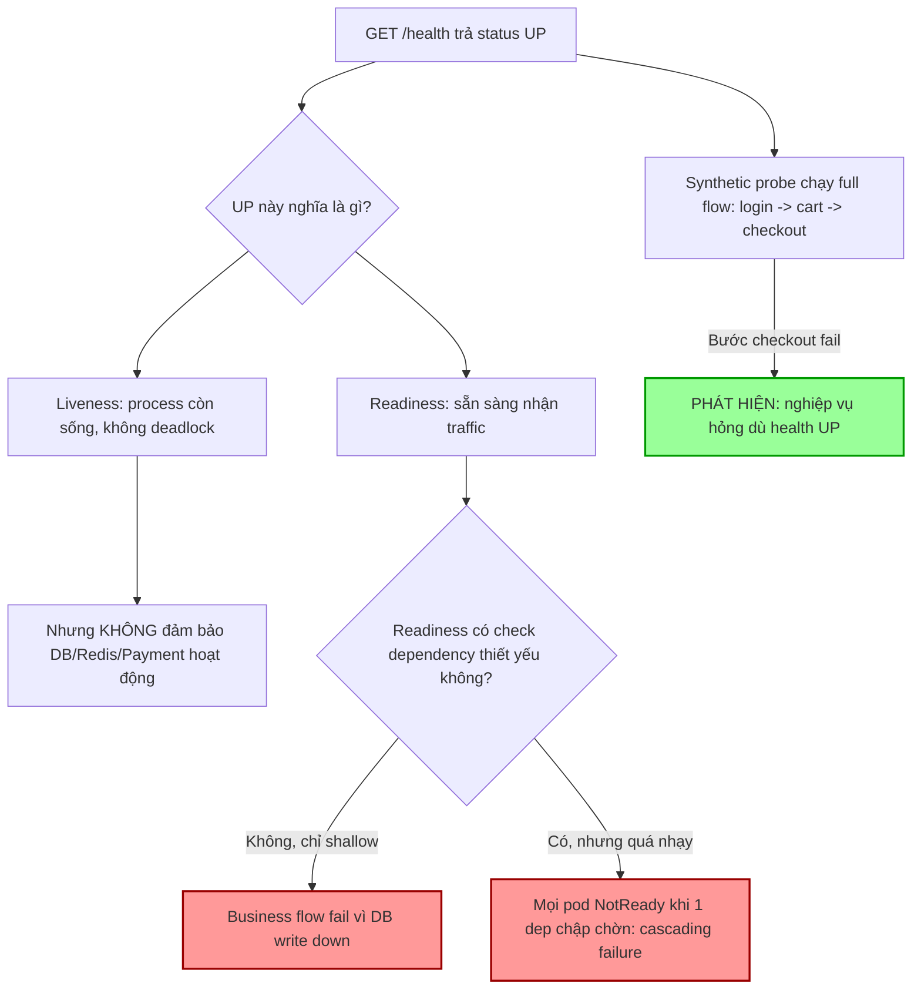

# Health check OK nhưng business flow fail. Vì sao?

## ⚡ Tóm tắt ngắn (30s)
* **Bản chất**: Health check "OK" chỉ chứng minh **tiến trình còn sống và cổng còn mở** — nó là một phép kiểm tra **nông (shallow)**. Nhưng **business flow** (đăng nhập → thêm giỏ → thanh toán) đòi hỏi mọi mắt xích phụ thuộc (DB, Redis, payment gateway, message queue) và logic nghiệp vụ đều hoạt động. Health check `/health` trả `{"status":"UP"}` chỉ vì controller chạy được, trong khi DB đã mất kết nối hoặc payment gateway đang lỗi → user vẫn fail.
* **Hướng xử lý Senior**:
  1. **Phân biệt rõ Liveness vs Readiness vs Startup vs Deep health**: mỗi loại trả lời một câu hỏi khác nhau, không gộp làm một.
  2. **Readiness phải kiểm tra phụ thuộc thiết yếu** (DB, cache, broker) — nhưng **cẩn thận với cascading failure**: nếu deep check quá nhạy, một dependency chập chờn làm toàn bộ pod bị rút khỏi load balancer.
  3. **Synthetic monitoring cho business flow**: chạy giả lập giao dịch end-to-end định kỳ để bắt cái mà health check không thấy.
* **Quyết định Senior**: Health check là tín hiệu cho **orchestrator (K8s/LB)** quyết định route traffic — KHÔNG phải bằng chứng nghiệp vụ chạy đúng. Bằng chứng nghiệp vụ phải đến từ **SLI dựa trên giao dịch thật + synthetic probe**. "Pod healthy" và "user mua được hàng" là hai câu hỏi khác nhau.

---

## 🔍 Chi tiết bản chất thực chiến: Các tầng "khỏe mạnh" khác nhau

### 1. Bốn loại health check và mục đích riêng
* **Liveness probe**: "Tiến trình có cần restart không?" Chỉ kiểm tra process không bị deadlock/treo. Nếu fail → K8s **kill & restart** pod. **Phải nông** — không kiểm tra dependency, vì nếu DB down mà liveness fail thì K8s restart pod vô ích (restart không sửa được DB), gây crash loop.
* **Readiness probe**: "Pod có sẵn sàng nhận traffic không?" Nếu fail → K8s **rút pod khỏi Service/LB** nhưng không kill. Đây là nơi **có thể** kiểm tra dependency thiết yếu (DB, broker).
* **Startup probe**: "App đã khởi động xong chưa?" Cho app khởi động chậm (JVM warmup) thời gian trước khi liveness bắt đầu soi.
* **Deep health / dependency check**: kiểm tra sâu các phụ thuộc — hữu ích cho dashboard/diagnostic, nhưng **nguy hiểm** nếu nối thẳng vào readiness mà không có degradation logic.

### 2. Vì sao "UP" mà nghiệp vụ vẫn fail
* **Shallow check**: `/health` chỉ trả 200 vì Spring context chạy — không chạm DB.
* **Kiểm tra sai phụ thuộc**: check ping DB OK, nhưng nghiệp vụ cần một bảng/feature đang lỗi, hoặc payment gateway (third-party) đang down mà health check không gọi tới.
* **Logic nghiệp vụ lỗi nhưng hạ tầng OK**: bug code, config sai, feature flag tắt nhầm — hạ tầng "xanh" hoàn toàn nhưng flow vẫn hỏng.
* **Trạng thái nửa vời (partial degradation)**: DB read-replica OK (health check đọc) nhưng primary (write) down → đọc được, ghi/đặt hàng thất bại.

### 3. Cạm bẫy ngược: Deep health check gây cascading failure
Nếu readiness kiểm tra **mọi** dependency và **bất kỳ** cái nào chập chờn → **tất cả** pod đồng loạt báo NotReady → K8s rút hết khỏi LB → **toàn service sập** chỉ vì một dependency phụ rung lắc nhẹ. Đây là "tự gây DoS". Nguyên tắc: readiness chỉ fail khi pod **thực sự không phục vụ được**; với dependency không thiết yếu, hãy **degrade gracefully** thay vì báo NotReady.

### 4. Synthetic monitoring lấp khoảng nghiệp vụ
Health check kiểm tra "thành phần". Synthetic check kiểm tra **"hành trình"**: một bot định kỳ thực hiện full flow (login test account → add to cart → checkout với thẻ test) và báo động nếu bước nào fail. Đây là cách duy nhất đảm bảo "user mua được hàng".

---

## 🎨 Sơ đồ trực quan: Các tầng health và khoảng trống nghiệp vụ



---

## 💻 Code thực chiến: BAD vs GOOD

### ❌ BAD: Health check luôn UP, không phản ánh nghiệp vụ
```java
// CÁCH SAI
@RestController
public class HealthController {
    @GetMapping("/health")
    public Map<String, String> health() {
        return Map.of("status", "UP");   // ❌ luôn UP, không kiểm tra gì
        // ❌ DB có thể đã down, payment gateway có thể đang lỗi -> vẫn UP
    }
}
```

### ✅ GOOD: Tách liveness/readiness + dependency check có degradation + synthetic
```java
// ✅ Readiness: kiểm tra phụ thuộc THIẾT YẾU, phân biệt thiết yếu vs phụ
@Component
public class DatabaseReadinessIndicator implements HealthIndicator {
    private final JdbcTemplate jdbc;
    @Override
    public Health health() {
        try {
            jdbc.queryForObject("SELECT 1", Integer.class);  // ✅ thật sự chạm DB
            return Health.up().build();
        } catch (Exception e) {
            return Health.down(e).build();                   // ✅ DB chết -> NotReady, rút khỏi LB
        }
    }
}

// ✅ Dependency KHÔNG thiết yếu -> degrade, KHÔNG làm pod NotReady (tránh cascading)
@Component
public class RecommendationHealthIndicator implements HealthIndicator {
    @Override
    public Health health() {
        if (!recommendationClient.isReachable()) {
            // ✅ chỉ báo DEGRADED trên dashboard, KHÔNG fail readiness
            return Health.status("DEGRADED").build();
        }
        return Health.up().build();
    }
}
```

```yaml
# ✅ K8s: liveness nông, readiness có dependency, startup cho JVM warmup
livenessProbe:
  httpGet: { path: /actuator/health/liveness, port: 8080 }   # ✅ chỉ "process còn sống"
  periodSeconds: 10
readinessProbe:
  httpGet: { path: /actuator/health/readiness, port: 8080 }  # ✅ gồm DB check
  periodSeconds: 5
  failureThreshold: 3            # ✅ chịu đựng chập chờn ngắn, tránh rút pod vội
startupProbe:
  httpGet: { path: /actuator/health/liveness, port: 8080 }
  failureThreshold: 30          # ✅ cho JVM thời gian khởi động
  periodSeconds: 5
```

```yaml
# ✅ Synthetic monitoring: chạy full business flow định kỳ (vd Blackbox/k6/Checkly)
# k6 synthetic checkout test (chạy mỗi 1 phút, alert nếu fail)
# login -> add to cart -> checkout với thẻ test -> assert order_id trả về
# Đây là thứ DUY NHẤT chứng minh "user mua được hàng", health check không làm được
```

---

## 📊 Bảng so sánh: Bốn loại kiểm tra sức khỏe

| Loại | Câu hỏi trả lời | Kiểm tra dependency? | Hành động khi fail | Mức "nông/sâu" |
| :--- | :--- | :--- | :--- | :--- |
| **Liveness** | "Process có cần restart?" | ❌ KHÔNG (tránh crash loop) | K8s kill & restart pod | Nông |
| **Readiness** | "Sẵn sàng nhận traffic?" | ✅ Có, dep thiết yếu | Rút pod khỏi LB (không kill) | Vừa |
| **Startup** | "Khởi động xong chưa?" | ❌ Không | Hoãn liveness | Nông |
| **Deep/Dependency** | "Phụ thuộc nào đang lỗi?" | ✅ Tất cả | Dashboard/diagnostic | Sâu (cẩn thận cascading) |
| **Synthetic** | "User dùng được không?" | ✅ End-to-end thật | Alert nghiệp vụ | Sâu nhất (góc nhìn user) |

---

## ⚠️ Common Gotchas & Questions follow-up

### Cạm bẫy thường gặp
1. **Gộp liveness = readiness = deep check**: Để liveness kiểm tra DB → DB down làm K8s restart pod liên tục (crash loop) dù restart chẳng sửa được DB. Liveness phải nông.
2. **Deep readiness quá nhạy → cascading failure**: Một dependency phụ rung lắc làm toàn bộ pod NotReady, sập cả service. Phân biệt thiết yếu vs phụ; degrade thay vì fail.
3. **Health check không chạm dependency thật**: `SELECT 1` qua connection pool có thể trả OK từ connection cache cũ; cần kiểm tra đúng đường nghiệp vụ quan trọng.
4. **Thiếu synthetic monitoring**: Không có bot chạy full flow → chỉ biết nghiệp vụ hỏng khi user phàn nàn.
5. **Health check nặng**: Mỗi probe gọi hết mọi dependency, chạy mỗi 5s × hàng trăm pod → tự tạo tải lên dependency. Cache kết quả health ngắn hạn.

### Câu hỏi đào sâu từ interviewer
* **Interviewer: "Bạn muốn readiness phản ánh đúng khả năng phục vụ, nhưng lại sợ một dependency chập chờn kéo sập cả service vì mọi pod cùng NotReady. Bạn thiết kế readiness thế nào để cân bằng?"**
* **Trả lời**:
  1. **Phân loại dependency theo mức thiết yếu**: Chia thành **hard dependency** (không có thì không phục vụ được — DB primary cho service ghi) và **soft dependency** (thiếu thì degrade — recommendation, analytics). Readiness chỉ fail vì hard dependency.
  2. **Graceful degradation cho soft dependency**: Khi soft dep down, pod vẫn Ready và phục vụ chức năng cốt lõi, chỉ tắt phần phụ (vd ẩn gợi ý sản phẩm) — báo DEGRADED lên dashboard chứ không rút khỏi LB.
  3. **Tránh đồng loạt fail**: Thêm `failureThreshold` và độ trễ để chịu đựng chập chờn ngắn; cân nhắc jitter để các pod không cùng check một lúc. Mục tiêu: dependency rung lắc 5 giây không làm rút sạch pod.
  4. **Circuit breaker thay vì readiness flapping**: Với hard dependency có lúc chậm, dùng circuit breaker ở tầng client để fail-fast và tự phục hồi, thay vì để readiness bật/tắt liên tục (flapping) gây xáo trộn routing.
  5. **Tách "service down toàn cục" khỏi "pod này down"**: Nếu DB down thì **mọi** pod đều mất khả năng — rút hết khỏi LB cũng vô nghĩa (không còn pod nào phục vụ). Lúc này readiness fail không giúp gì; cái cần là **alert cấp service** + degrade nghiệp vụ. Hiểu điều này tránh việc thiết kế readiness "tự bắn vào chân".
