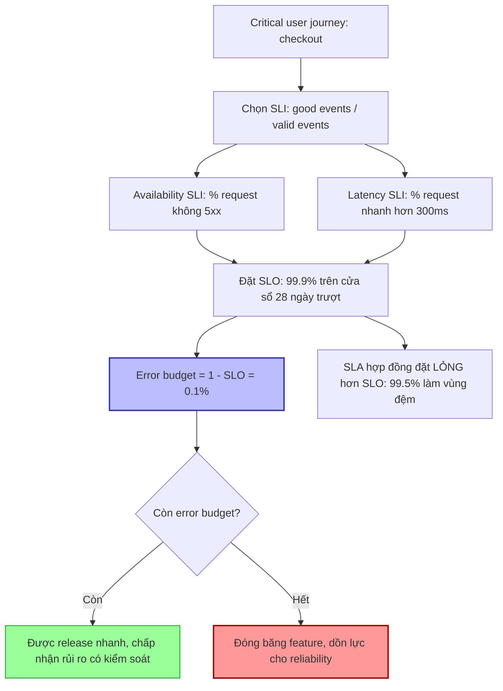

# Bạn chọn SLI/SLO cho backend service như thế nào?

## ⚡ Tóm tắt ngắn (30s)
* **Bản chất**: **SLI (Service Level Indicator)** là một **phép đo định lượng** chất lượng dịch vụ từ góc nhìn user (vd: tỷ lệ request thành công). **SLO (Service Level Objective)** là **mục tiêu** cho SLI đó trong một cửa sổ thời gian (vd: 99.9% trong 30 ngày). **SLA** là **cam kết hợp đồng** với khách hàng kèm hậu quả (đền bù) nếu vi phạm. Chọn SLI/SLO đúng nghĩa là chọn cái **phản ánh nỗi đau thật của user**, không phải cái dễ đo.
* **Hướng xử lý Senior**:
  1. **SLI bám critical user journey**: Chọn theo công thức `good events / valid events` cho các luồng quan trọng (đăng nhập, thanh toán), thường là **Availability** (tỷ lệ thành công) và **Latency** (tỷ lệ đủ nhanh).
  2. **SLO đặt theo thực tế + nhu cầu nghiệp vụ**, không phải "100% cho oai": mỗi "số 9" thêm vào đắt theo cấp số nhân.
  3. **Error budget điều phối tốc độ**: `Error budget = 1 − SLO`. Còn budget → được release nhanh, chấp nhận rủi ro; hết budget → đóng băng tính năng, dồn vào ổn định.
* **Quyết định Senior**: SLO không phải mục tiêu kỹ thuật thuần — nó là **công cụ ra quyết định kinh doanh**: cân bằng giữa tốc độ ra tính năng và độ tin cậy. "100% là SLO sai" — vì nó cấm mọi rủi ro, chặn đứng đổi mới, và bất khả thi về chi phí.

---

## 🔍 Chi tiết bản chất thực chiến: Thiết kế SLI/SLO bài bản

### 1. Phân biệt SLI / SLO / SLA
* **SLI**: con số đo được. Ví dụ: "tỷ lệ HTTP request thành công trong 5 phút".
* **SLO**: ngưỡng mục tiêu nội bộ. Ví dụ: "SLI ≥ 99.9% trong 28 ngày trượt".
* **SLA**: hợp đồng pháp lý với khách hàng + hậu quả. Thường **lỏng hơn SLO** (vd SLA 99.5% nhưng SLO nội bộ 99.9%) để có vùng đệm cảnh báo trước khi vi phạm hợp đồng.

### 2. Công thức SLI chuẩn: good / valid events
$$\text{SLI} = \frac{\text{số sự kiện tốt}}{\text{số sự kiện hợp lệ}} \times 100\%$$
* **Availability SLI**: `requests không lỗi (không 5xx) / tổng requests hợp lệ`. Lưu ý: thường **loại 4xx** khỏi "lỗi" vì đó là lỗi phía client, không phải lỗi server (trừ khi 429/401 do hệ thống).
* **Latency SLI**: `requests nhanh hơn ngưỡng / tổng requests`. Ví dụ "tỷ lệ request < 300ms ≥ 99%". (Đây là **dạng tỷ lệ ngưỡng**, tốt hơn là "p99 < 300ms" vì dễ ghép thành error budget.)
* **Các SLI khác**: Quality (tỷ lệ response đúng/không suy giảm), Freshness (dữ liệu mới đến mức nào — cho pipeline), Correctness, Coverage (cho batch).

### 3. Đặt SLO bao nhiêu là đủ
* **Bắt đầu từ thực tế đo được**: nhìn dữ liệu lịch sử, đừng đặt SLO cao hơn hiện trạng rồi vi phạm ngay.
* **Mỗi số 9 đắt theo cấp số nhân**: thời gian downtime cho phép/30 ngày:
  * 99% → ~7.2 giờ; 99.9% → ~43.2 phút; 99.99% → ~4.32 phút; 99.999% → ~26 giây.
* **Đủ tốt cho user, không hơn**: nếu user không phân biệt được 99.9% và 99.99% nhưng chi phí gấp 10 → chọn 99.9%. SLO phục vụ user, không phục vụ cái đẹp của con số.

### 4. Error budget — linh hồn của SLO
$$\text{Error budget} = 1 - \text{SLO}$$
Với SLO 99.9% → budget = 0.1% số request được phép lỗi/tháng. Budget là "ngân sách rủi ro":
* **Còn budget**: team được phép release nhanh, thử nghiệm, chấp nhận rủi ro có kiểm soát.
* **Hết budget**: kích hoạt **error budget policy** — đóng băng feature mới, ưu tiên reliability work cho tới khi hồi budget. Đây là cách SLO biến độ tin cậy thành quyết định có dữ liệu, gỡ tranh cãi "dev muốn ship vs ops muốn ổn định".

### 5. Đo trên cửa sổ trượt (rolling window)
SLO thường tính trên **28–30 ngày trượt**, không reset theo lịch — để một sự cố lớn không bị "xóa nợ" lúc nửa đêm đầu tháng.

---

## 🎨 Sơ đồ trực quan: Từ user journey đến error budget policy



---

## 💻 Code thực chiến: BAD vs GOOD

### ❌ BAD: SLO viển vông, SLI đo sai cái user quan tâm
```yaml
# CÁCH SAI
slo:
  availability: 100%            # ❌ bất khả thi, cấm mọi rủi ro, chặn đổi mới
  metric: cpu_usage < 80%       # ❌ CPU không phải trải nghiệm user
  latency: avg < 500ms          # ❌ average che giấu tail; user đau ở p99
```

### ✅ GOOD: SLI theo good/valid + error budget burn rate alert
```yaml
# ✅ Định nghĩa SLO theo user-facing SLI
slo:
  service: checkout
  window: 28d                   # ✅ cửa sổ trượt
  objectives:
    - name: availability
      sli: "non_5xx_requests / valid_requests"
      target: 99.9%             # ✅ error budget = 0.1%
    - name: latency
      sli: "requests_under_300ms / valid_requests"
      target: 99.0%             # ✅ dạng tỷ lệ ngưỡng, ghép được vào budget
```

```promql
# ✅ Recording rule: SLI availability (good/valid), loại 4xx khỏi "lỗi server"
# checkout:sli_availability:ratio_rate5m
sum(rate(http_requests_total{job="checkout", code!~"5.."}[5m]))
  / sum(rate(http_requests_total{job="checkout"}[5m]))

# ✅ Error budget còn lại trên cửa sổ 28 ngày (1 = đầy budget, 0 = cạn)
1 - (
  (1 - sum(rate(http_requests_total{job="checkout",code!~"5.."}[28d]))
       / sum(rate(http_requests_total{job="checkout"}[28d])))
  / 0.001                       # 0.001 = 1 - SLO(99.9%)
)
```

```yaml
# ✅ Multi-burn-rate alert (Google SRE): page khi đốt budget nhanh
- alert: CheckoutBudgetBurnFast
  expr: |
    (1 - checkout:sli_availability:ratio_rate1h) > (14.4 * 0.001)
    and
    (1 - checkout:sli_availability:ratio_rate5m) > (14.4 * 0.001)
  labels: { severity: page }    # ✅ 14.4x: cạn budget tháng trong ~2 ngày -> page ngay
```

---

## 📊 Bảng so sánh: Các loại SLI phổ biến cho backend

| Loại SLI | Đo cái gì | Công thức good/valid | Khi nào quan trọng |
| :--- | :--- | :--- | :--- |
| **Availability** | Tỷ lệ request thành công | non-5xx / tổng request hợp lệ | Mọi service request-driven |
| **Latency** | Tỷ lệ request đủ nhanh | request < ngưỡng / tổng | Service nhạy trải nghiệm |
| **Quality/Correctness** | Tỷ lệ response đúng, không degrade | response đúng / tổng | Service có fallback/degradation |
| **Freshness** | Dữ liệu mới đến mức nào | bản ghi cập nhật đúng hạn / tổng | Pipeline, replication, cache |
| **Throughput/Coverage** | Tỷ lệ công việc xử lý đủ | item xử lý / item nhận | Batch, async, stream |
| **Durability** | Dữ liệu không mất | data còn nguyên / data ghi | Storage, message queue |

---

## ⚠️ Common Gotchas & Questions follow-up

### Cạm bẫy thường gặp
1. **SLO 100%**: Sai cơ bản — cấm mọi rủi ro, bất khả thi, và đắt vô hạn. Luôn chừa error budget để đổi lấy tốc độ.
2. **Đo cái dễ thay vì cái đúng**: CPU/memory là cause, không phải SLI. SLI phải là trải nghiệm user (success rate, latency).
3. **Tính cả 4xx vào "lỗi"**: 4xx thường là lỗi client (input sai) → không nên trừ vào budget availability của server (trừ 429/503 do hệ thống).
4. **Average latency làm SLI**: Average che tail. Dùng "% request dưới ngưỡng".
5. **SLO = SLA**: Đặt SLO nội bộ bằng đúng SLA hợp đồng → không có vùng đệm cảnh báo, vi phạm hợp đồng mới biết. SLO phải chặt hơn SLA.
6. **Quá nhiều SLO**: Đặt SLO cho mọi metric → loãng, không ai theo dõi. Chọn vài SLI quan trọng nhất theo user journey.

### Câu hỏi đào sâu từ interviewer
* **Interviewer: "Team bạn đặt SLO 99.99% nhưng thực tế chỉ đạt 99.9% và liên tục vi phạm, gây báo động giả triền miên. Bạn xử lý mâu thuẫn giữa kỳ vọng và thực tế thế nào?"**
* **Trả lời**:
  1. **Nhận diện gốc rễ**: SLO đặt cao hơn năng lực thật → vi phạm liên tục → alert mất ý nghĩa, team chai lì (chính là alert fatigue dạng SLO). SLO sai còn tệ hơn không có SLO.
  2. **Quyết định dựa trên user, không sĩ diện con số**: Hỏi "user có thực sự cảm nhận khác biệt giữa 99.9% và 99.99% không?". Nếu không, và chi phí đạt 99.99% gấp 10 lần (thêm redundancy, multi-region, kỹ thuật phức tạp) → **hạ SLO về 99.9%** cho đúng thực tế và nhu cầu.
  3. **Nếu nghiệp vụ THỰC SỰ cần 99.99%**: thì đây không phải vấn đề con số mà là **thiếu đầu tư reliability** — cần kế hoạch kỹ thuật (loại bỏ SPOF, multi-AZ, giảm tail latency, chaos testing) và lộ trình tăng dần SLO khi năng lực cải thiện, thay vì áp số trên giấy.
  4. **Dùng error budget làm bằng chứng đàm phán**: Trình bày dữ liệu budget burn cho stakeholder: "với 99.99%, mỗi tháng chỉ được lỗi 4.3 phút; hiện ta lỗi 43 phút. Để đạt được cần X người-tháng đầu tư". Biến tranh luận cảm tính thành quyết định kinh doanh có số liệu.
  5. **Lặp lại định kỳ**: SLO không bất biến — review hằng quý theo dữ liệu thực tế và phản hồi user, điều chỉnh cho khớp giữa kỳ vọng, năng lực và chi phí.
