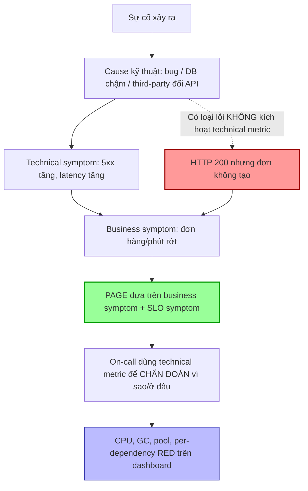

# Alert nên dựa trên technical metrics hay business metrics?

## ⚡ Tóm tắt ngắn (30s)
* **Bản chất**: Câu trả lời Senior không phải "chọn một", mà là **phân vai theo mục đích**: **Page (đánh thức người) dựa trên symptom — thường là business/user-facing metric**; còn **technical metrics dùng để chẩn đoán (diagnose)** sau khi đã có alert. Triết lý Google SRE: *"Alert on symptoms, not causes"* — và symptom gần user nhất chính là business metric (đơn hàng/phút, tỷ lệ thanh toán thành công), vì nó bắt được **mọi** nguyên nhân, kể cả những lỗi mà technical metric hoàn toàn "xanh".
* **Hướng xử lý Senior**:
  1. **Business metric là lưới bắt cuối cùng, không thể lừa dối**: "Đơn hàng/phút rớt 80%" báo động đúng kể cả khi CPU, memory, error rate đều bình thường (vd: bug logic, third-party đổi API, feature flag tắt nhầm).
  2. **Technical metric cho độ phân giải & cảnh báo sớm cause**: latency, error rate, saturation giúp **định vị** và đôi khi cảnh báo trước khi business bị ảnh hưởng.
  3. **Kết hợp: page on business symptom + một số technical leading indicator có chọn lọc**.
* **Quyết định Senior**: Business metric trả lời *"user có đang đau không"* (cái quan trọng nhất), technical metric trả lời *"vì sao và ở đâu"*. Hệ thống alert tốt page theo cái thứ nhất, điều tra bằng cái thứ hai.

---

## 🔍 Chi tiết bản chất thực chiến: Vì sao business metric bắt được cái technical bỏ lỡ

### 1. "Symptom-based alerting" và vị trí của business metric
Một sự cố lan từ cause → technical symptom → business symptom:
```
[Cause: bug/config/DB chậm] → [Technical symptom: 5xx, latency] → [Business symptom: đơn hàng rớt]
```
Business symptom là **điểm cuối, gần user nhất**. Cảnh báo ở đây bắt được:
* Lỗi đi qua technical metric mà không kích hoạt (HTTP 200 nhưng logic sai → đơn không tạo).
* Lỗi ngoài hệ thống (payment gateway third-party đổi response → ta vẫn 200 nhưng user không trả tiền được).
* Lỗi do con người (deploy tắt nhầm feature, đổi giá sai → traffic OK nhưng doanh thu rớt).

Technical metric **không thấy** những cái này; business metric thì **không thể bị lừa** — vì nó đo chính kết quả nghiệp vụ.

### 2. Nhưng business metric một mình là chưa đủ
* **Độ trễ phát hiện**: "Đơn hàng/phút" có thể cần vài phút tích lũy mới thấy rớt rõ; technical error rate phản ứng nhanh hơn.
* **Thiếu độ phân giải để chẩn đoán**: "Đơn rớt" không cho biết *vì sao*. Cần technical metric (service nào 5xx, DB nào chậm) để định vị.
* **Nhiễu theo mùa**: Business metric biến động theo giờ/ngày/khuyến mãi → cần baseline động (so với cùng giờ tuần trước) thay vì ngưỡng tĩnh.

### 3. Mô hình kết hợp tối ưu
* **Page (P1)**: business symptom (đơn hàng, đăng nhập thành công, doanh thu/phút) **so với baseline động** + một vài technical symptom SLO-based (checkout error rate, p99 latency).
* **Diagnose (dashboard, không page)**: technical cause — CPU, GC, pool, per-dependency RED, để on-call tìm gốc nhanh.
* **Leading indicator có chọn lọc**: vài technical metric **dự báo sớm** (queue depth tăng, consumer lag tăng) đáng để ticket/cảnh báo sớm trước khi business bị ảnh hưởng.

### 4. Baseline động cho business metric
Business metric không dùng ngưỡng tĩnh. Dùng:
* So sánh **cùng kỳ** (week-over-week): `orders_now / orders_same_time_last_week < 0.5`.
* Anomaly detection / dải dự đoán (Holt-Winters, z-score) để bắt sụt giảm bất thường mà không báo nhầm vào giờ thấp điểm tự nhiên.

---

## 🎨 Sơ đồ trực quan: Phân vai business vs technical metric



---

## 💻 Code thực chiến: BAD vs GOOD

### ❌ BAD: Chỉ page trên technical metric, bỏ lỡ lỗi nghiệp vụ
```yaml
# CÁCH SAI — page trên cause, mù với lỗi business-level
- alert: HighCPU
  expr: avg(node_cpu_usage) > 0.8     # ❌ CPU cao chưa chắc user đau
  labels: { severity: page }
# ❌ Nếu bug khiến đơn không tạo nhưng CPU/error đều bình thường -> KHÔNG có alert nào
#    Doanh thu rớt hàng giờ mà không ai biết, chỉ phát hiện khi sales phàn nàn
```

### ✅ GOOD: Page trên business symptom (baseline động) + technical để diagnose
```promql
# ✅ Business metric: instrument đơn hàng thành công như một counter nghiệp vụ
# orders_created_total{status="success"}  (tăng trong code khi đơn tạo thật sự)

# ✅ Alert: đơn hàng rớt mạnh SO VỚI cùng giờ tuần trước (baseline động)
- alert: OrdersDroppedAnomaly
  expr: |
    sum(rate(orders_created_total{status="success"}[10m]))
    <
    0.5 * sum(rate(orders_created_total{status="success"}[10m] offset 7d))
  for: 5m
  labels: { severity: page }
  annotations:
    summary: "Đơn hàng/phút < 50% so với cùng giờ tuần trước — nghi sự cố nghiệp vụ"
```
```java
// ✅ Instrument business event ở đúng nơi nghiệp vụ HOÀN TẤT (không phải khi HTTP 200)
public Order placeOrder(OrderRequest req) {
    Order order = orderService.create(req);
    paymentService.charge(order);                 // chỉ tính "success" khi đã thanh toán
    registry.counter("orders.created",
        "status", "success",
        "channel", req.channel()).increment();    // ✅ business metric đáng tin
    return order;
}
```
```promql
# ✅ Technical metrics để DIAGNOSE (dashboard, không page) khi business alert fire
# Per-dependency RED: tìm nhanh service/dependency nào gây ra
sum by (dependency) (rate(downstream_requests_total{outcome="error"}[5m]))
  / sum by (dependency) (rate(downstream_requests_total[5m]))
```

---

## 📊 Bảng so sánh: Business vs Technical metrics trong alerting

| Tiêu chí | Business metrics | Technical metrics |
| :--- | :--- | :--- |
| **Ví dụ** | Đơn hàng/phút, tỷ lệ thanh toán, đăng nhập thành công, doanh thu | CPU, memory, 5xx rate, latency, GC, queue depth |
| **Trả lời câu hỏi** | "User có đang đau không?" | "Vì sao và ở đâu?" |
| **Bắt được lỗi logic/HTTP-200?** | ✅ Có (đo kết quả thật) | ❌ Thường không |
| **Bắt lỗi third-party ngoài hệ thống?** | ✅ Có | ❌ Thường không |
| **Tốc độ phát hiện** | Chậm hơn (cần tích lũy) | Nhanh hơn |
| **Độ phân giải chẩn đoán** | Thấp (không biết vì sao) | Cao (định vị được) |
| **Vai trò khuyến nghị** | **Page** (symptom cuối) | **Diagnose** + leading indicator chọn lọc |
| **Cách đặt ngưỡng** | Baseline động (so cùng kỳ) | Tỷ lệ / burn rate / ngưỡng |

---

## ⚠️ Common Gotchas & Questions follow-up

### Cạm bẫy thường gặp
1. **Chỉ alert technical**: Mù với lỗi nghiệp vụ mà technical metric không phản ánh (HTTP 200 nhưng đơn không tạo). Đây là khoảng mù nguy hiểm nhất.
2. **Ngưỡng tĩnh cho business metric**: "đơn < 100/phút" sai bét vì lưu lượng dao động theo giờ/khuyến mãi. Phải dùng baseline động (so cùng kỳ).
3. **Business metric đặt sai chỗ**: Đếm "đơn" lúc nhận request thay vì lúc thanh toán hoàn tất → vẫn xanh khi payment fail. Phải instrument ở điểm nghiệp vụ thật sự hoàn thành.
4. **Page trên cause**: CPU/memory page lúc 3h sáng nhưng user không bị ảnh hưởng → fatigue. Cause → dashboard.
5. **Bỏ qua leading indicators**: Một số technical metric (consumer lag, queue depth) dự báo sự cố sớm — đáng cảnh báo trước khi business rớt.

### Câu hỏi đào sâu từ interviewer
* **Interviewer: "Bạn page dựa trên 'đơn hàng/phút rớt'. Nhưng lúc 3h sáng traffic thấp tự nhiên, hoặc khi có sự kiện marketing thì lại tăng vọt. Làm sao alert business metric mà không báo nhầm liên tục?"**
* **Trả lời**:
  1. **Bỏ ngưỡng tuyệt đối, dùng baseline tương đối**: So với **cùng giờ cùng thứ trong tuần trước** (`offset 7d`) thay vì con số cố định — tự động thích nghi với chu kỳ ngày/đêm và cuối tuần.
  2. **Volume guard cho giờ thấp điểm**: Khi lưu lượng nền quá thấp (đêm khuya), một dao động nhỏ thành % lớn. Chỉ kích hoạt alert khi baseline đủ cao, hoặc nới cửa sổ thời gian để tích lũy đủ mẫu trước khi kết luận.
  3. **Anomaly detection thay vì ngưỡng cứng**: Dùng dải dự đoán (Holt-Winters/seasonal decomposition) hoặc z-score trên chuỗi đã khử mùa vụ — báo khi lệch bất thường so với hành vi kỳ vọng, không phải khi chạm số tĩnh.
  4. **Xử lý sự kiện đã biết trước**: Với marketing/flash sale theo lịch, dùng **silence/maintenance window** hoặc baseline riêng cho ngày sự kiện để tránh báo nhầm khi tăng đột biến hợp lệ.
  5. **Kết hợp xác nhận chéo**: Yêu cầu business anomaly **đồng thời** với một technical symptom (5xx tăng hoặc latency tăng) trước khi page — giảm false positive do dao động tự nhiên, vì sự cố thật thường để lại dấu vết ở cả hai tầng. Khi business rớt mà technical sạch hoàn toàn thì hạ xuống cảnh báo điều tra thay vì page gấp.
