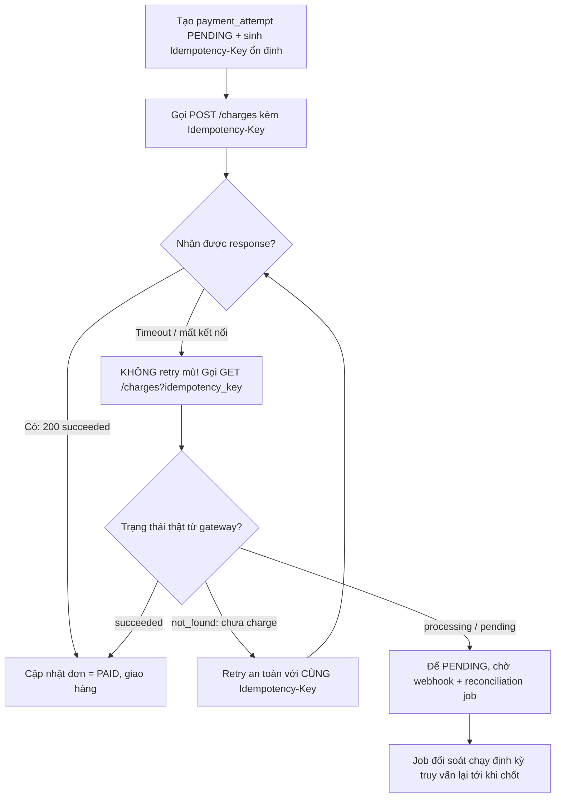

# Payment gateway timeout nhưng sau đó vẫn charge tiền. Bạn xử lý thế nào?

## ⚡ Tóm tắt ngắn (30s)
* **Bản chất**: Đây là bài toán kinh điển **"Timeout không đồng nghĩa với Thất bại" (Timeout ≠ Failure)**. Khi service của bạn gọi sang payment gateway và nhận về `SocketTimeoutException`, kết nối HTTP chỉ bị ngắt **ở phía client của bạn**. Trên thực tế, lệnh charge có thể đã **đến đích, được xử lý thành công và trừ tiền khách hàng** — chỉ có gói response (`200 OK`) là bị mất trên đường về do mạng hoặc gateway phản hồi trễ. Giao dịch lúc này rơi vào trạng thái **"in-doubt" (bất định / unknown)**, KHÔNG phải `FAILED`.
* **Thảm họa thực chiến**:
  1. **Double charge (trừ tiền 2 lần)**: Dev bắt được Timeout, mặc định coi là lỗi rồi **retry mù (blind retry)** một request charge mới. Vì lần đầu thực ra đã thành công, khách hàng bị trừ tiền 2 lần → khiếu nại, chargeback, mất uy tín.
  2. **Mất tiền / lệch sổ (money leak)**: Ngược lại, dev coi Timeout là `FAILED`, báo khách "thanh toán thất bại" và không giao hàng, nhưng tiền đã bị trừ thật → khách mất tiền mà không nhận hàng.
* **Quyết định Senior**:
  1. **Idempotency Key bắt buộc**: Mọi request charge phải đính kèm `Idempotency-Key` duy nhất (sinh ổn định từ `orderId`). Gateway dùng key này khử trùng lặp — retry bao nhiêu lần cũng chỉ charge **đúng 1 lần**.
  2. **Không retry mù — phải truy vấn trạng thái (Reconcile)**: Khi gặp Timeout, KHÔNG tạo charge mới một cách vô tội vạ. Gọi **API truy vấn trạng thái** (`GET /charges?idempotency_key=...`) để hỏi gateway "lệnh này cuối cùng thành công chưa?".
  3. **Write-Ahead State + Reconciliation Job**: Ghi giao dịch trạng thái `PENDING` vào DB **trước khi** gọi gateway, kết hợp webhook xác nhận và job đối soát định kỳ để chốt trạng thái cuối cùng.

---

## 🔍 Chi tiết bản chất thực chiến: Trạng thái "in-doubt" và bài toán Two Generals

### 1. Vì sao Timeout là trạng thái bất định, không phải thất bại
Một lời gọi mạng đi qua nhiều chặng: `App → Network → Gateway → Bank`. Timeout chỉ cho bạn biết **"tôi không nhận được trả lời trong X giây"**, nó KHÔNG nói cho bạn biết request đã đi được tới đâu. Có 3 khả năng khi timeout:
* **(A)** Request chưa từng tới gateway → giao dịch chưa xảy ra → an toàn để thử lại.
* **(B)** Request tới gateway, charge thành công, nhưng response mất → **tiền đã bị trừ**.
* **(C)** Request tới gateway, đang xử lý dở (`PENDING`) → chưa chốt.

Bạn **không có cách nào phân biệt 3 trường hợp này chỉ từ exception**. Đây chính là biểu hiện thực tế của **Two Generals Problem**: trên một kênh truyền không tin cậy, hai bên không thể đạt được sự đồng thuận tuyệt đối chỉ bằng việc gửi tin. Hệ quả: **"exactly-once" thực sự là bất khả thi**; ta chỉ có thể *mô phỏng* nó bằng **Idempotency + Reconciliation**.

### 2. Idempotency Key — vũ khí chống double charge
* Client sinh một key ổn định, ví dụ `idem_key = "order-" + orderId` (KHÔNG dùng `UUID.randomUUID()` mỗi lần retry, vì như vậy mỗi retry sẽ thành một charge mới!).
* Gateway lưu mapping `idempotency_key → kết quả charge` trong vài giờ/ngày. Lần gọi đầu thực thi thật; các lần gọi sau với **cùng key** chỉ trả lại **kết quả đã lưu**, không charge lại.
* Nhờ đó, dù bạn retry sau timeout, gateway nhận diện đây là cùng một ý định thanh toán và trả về charge cũ thay vì tạo charge mới.

### 3. Truy vấn trạng thái (Status Query) để giải trạng thái in-doubt
Khi timeout, hành động đúng là **hỏi lại gateway**:
* Gọi `GET /v1/charges?idempotency_key=order-123` hoặc `GET /v1/payment_intents/{id}`.
* Nếu trả về `succeeded` → đánh dấu đơn `PAID`, giao hàng.
* Nếu trả về `not_found` → charge chưa từng xảy ra → an toàn để retry (với **cùng** idempotency key).
* Nếu trả về `processing/pending` → chờ và để **reconciliation job** xử lý sau, không vội kết luận.

### 4. Write-Ahead State — không bao giờ "fire-and-forget"
Trước khi gọi gateway, ghi một bản ghi `payment_attempt(orderId, idem_key, status=INITIATED)` vào DB. Nhờ đó, kể cả khi app crash giữa chừng, job đối soát vẫn biết "có một lệnh đang treo" để đi truy vấn lại, không có giao dịch nào bị "bốc hơi".

### 5. Khi không kết luận được ngay: Outbox + worker bền bỉ
Đôi khi chính status query cũng trả `processing` (đối tác đang sự cố kéo dài). Lúc này KHÔNG giữ user chờ và KHÔNG đoán bừa:
* Ghi giao dịch vào **outbox** với trạng thái `PENDING` + idempotency key, trả user trạng thái "đang xử lý".
* Một **worker nền** poll lại trạng thái theo lịch (backoff tăng dần) cho tới khi đạt trạng thái cuối (`succeeded`/`failed`), hoặc bàn giao cho reconciliation cuối ngày.
* Nếu sau ngưỡng thời gian vẫn treo → đẩy vào **dead-letter / hàng đợi cần người xử lý** kèm đủ context.

Nhờ vậy, mọi giao dịch in-doubt đều **chắc chắn được chốt**, không cái nào "bốc hơi" khỏi sổ sách.

---

## 🎨 Sơ đồ trực quan: Luồng xử lý Timeout an toàn bằng Idempotency + Status Query

Sơ đồ dưới đây mô tả cách biến một timeout bất định thành quyết định an toàn nhờ idempotency key và truy vấn trạng thái thật, thay vì retry mù:



---

## 💻 Code thực chiến: BAD vs GOOD

Hai đoạn dưới tương phản trực tiếp cách xử lý timeout:
* **BAD**: sinh idempotency key ngẫu nhiên mỗi lần và retry mù → vô hiệu hóa idempotency, double charge.
* **GOOD**: key ổn định theo `orderId`, gặp timeout thì truy vấn trạng thái thật trước khi quyết định.

### ❌ BAD: Bắt timeout rồi retry mù với key mới → double charge
```java
public PaymentResult charge(Order order) {
    for (int i = 0; i < 3; i++) {
        try {
            // ❌ Mỗi lần retry sinh idempotency key MỚI -> gateway coi là 3 charge khác nhau
            String idemKey = UUID.randomUUID().toString();
            return gateway.charge(order.getAmount(), idemKey);
        } catch (SocketTimeoutException e) {
            // ❌ Coi timeout = thất bại và retry ngay -> nếu lần trước đã charge, giờ charge thêm lần nữa
            log.warn("Timeout, retrying...");
        }
    }
    // ❌ Cuối cùng báo FAILED dù có thể tiền đã bị trừ ở một trong các lần trên
    return PaymentResult.failed();
}
```

### ✅ GOOD: Idempotency key ổn định + truy vấn trạng thái khi timeout
```java
@Service
public class PaymentService {

    public PaymentResult charge(Order order) {
        // ✅ Key ổn định theo orderId: retry bao nhiêu lần vẫn là 1 ý định thanh toán
        String idemKey = "order-" + order.getId();
        attemptRepo.upsertPending(order.getId(), idemKey); // write-ahead state

        try {
            ChargeResponse res = gateway.charge(order.getAmount(), idemKey);
            return finalize(order, res);
        } catch (SocketTimeoutException | ConnectException e) {
            // ✅ Timeout = IN-DOUBT, KHÔNG kết luận FAILED. Đi hỏi lại gateway.
            return resolveInDoubt(order, idemKey);
        }
    }

    private PaymentResult resolveInDoubt(Order order, String idemKey) {
        ChargeResponse actual = gateway.queryByIdempotencyKey(idemKey); // GET status
        return switch (actual.status()) {
            case "succeeded" -> finalize(order, actual);          // đã charge -> PAID
            case "not_found" -> charge(order);                    // chưa charge -> retry CÙNG key
            default -> {                                          // processing/pending
                attemptRepo.keepPending(order.getId());           // ✅ để job đối soát chốt sau
                yield PaymentResult.pending();
            }
        };
    }
}
```

Bổ sung schema write-ahead + truy vấn của job đối soát để chốt các giao dịch in-doubt còn treo:
```sql
CREATE TABLE payment_attempt (
    order_id        BIGINT NOT NULL,
    idempotency_key VARCHAR(80) PRIMARY KEY,   -- tra cứu trạng thái + chống trùng
    status          VARCHAR(16) NOT NULL,       -- INITIATED/PENDING/PAID/FAILED
    created_at      TIMESTAMP NOT NULL
);
-- Job đối soát: quét các lệnh treo quá lâu để query lại provider
SELECT idempotency_key FROM payment_attempt
 WHERE status IN ('INITIATED','PENDING')
   AND created_at < now() - INTERVAL '5 minutes';
```

---

## 📊 Bảng so sánh cách xử lý khi gặp Timeout thanh toán

Bảng dưới đối chiếu các cách phản ứng với timeout theo hai rủi ro chí mạng song song: double charge và mất tiền/lệch sổ.

| Cách tiếp cận | Cơ chế | Rủi ro double charge | Rủi ro mất tiền | Đánh giá Senior |
| :--- | :--- | :--- | :--- | :--- |
| **Retry mù, key ngẫu nhiên** | Tạo charge mới mỗi lần | **Rất cao** | Trung bình | ❌ Cấm tuyệt đối |
| **Coi timeout = FAILED** | Không retry, báo lỗi luôn | Thấp | **Rất cao** (tiền trừ, không giao hàng) | ❌ Lệch sổ nghiêm trọng |
| **Idempotency key ổn định + retry** | Gateway khử trùng lặp | Thấp | Trung bình (vẫn cần đối soát) | ⚠️ Tốt nhưng chưa đủ |
| **Idempotency + Status Query + Reconcile** | Hỏi lại trạng thái thật rồi mới quyết | **Rất thấp** | **Rất thấp** | ✅ Chuẩn production |

---

## ⚠️ Common Gotchas & Questions follow-up

### 1. Cạm bẫy "Idempotency key sinh sai chỗ"
* **Vấn đề**: Nhiều dev đặt `UUID.randomUUID()` ngay bên trong vòng lặp retry hoặc trong interceptor của HTTP client. Hậu quả: mỗi lần retry mang một key khác nhau, **vô hiệu hóa hoàn toàn** cơ chế idempotency của gateway → vẫn double charge.
* **Giải pháp**: Key phải được sinh **một lần duy nhất ở tầng nghiệp vụ** (gắn với `orderId` hoặc một bản ghi `payment_attempt`), được lưu lại, và **tái sử dụng nguyên vẹn** cho mọi lần retry/status-query của cùng giao dịch đó.

### 2. Cạm bẫy "Timeout đọc quá ngắn so với thời gian xử lý của bank"
* Nếu set `readTimeout = 2s` nhưng bank thường mất 5–8s để authorize, bạn sẽ liên tục timeout dù giao dịch vẫn thành công ngầm → tỉ lệ in-doubt cao bất thường. Cần đặt timeout phù hợp với P99 của gateway và **luôn** có nhánh reconcile.

### 3. Câu hỏi đào sâu từ interviewer
* **Interviewer: "Bạn nói exactly-once là bất khả thi. Vậy làm sao hệ thống thanh toán vẫn đảm bảo khách chỉ bị trừ tiền đúng 1 lần?"**
* **Trả lời**: Đúng, ở mức truyền tin trên mạng không tin cậy thì **true exactly-once delivery là bất khả thi (Two Generals)**. Cái ta đạt được là **exactly-once *effect* (hiệu ứng)**, không phải exactly-once *delivery*. Công thức là **at-least-once delivery + idempotent processing**: client cứ thử lại đến khi chắc chắn (at-least-once), còn phía nhận dùng idempotency key để **gộp mọi lần thử trùng thành đúng một hiệu ứng trừ tiền**. Phần "in-doubt" còn lại được dọn bằng **status query + reconciliation job đối soát với báo cáo settlement của provider** vào cuối ngày — đó là lưới an toàn cuối cùng đảm bảo sổ sách của ta và của bank luôn khớp.
