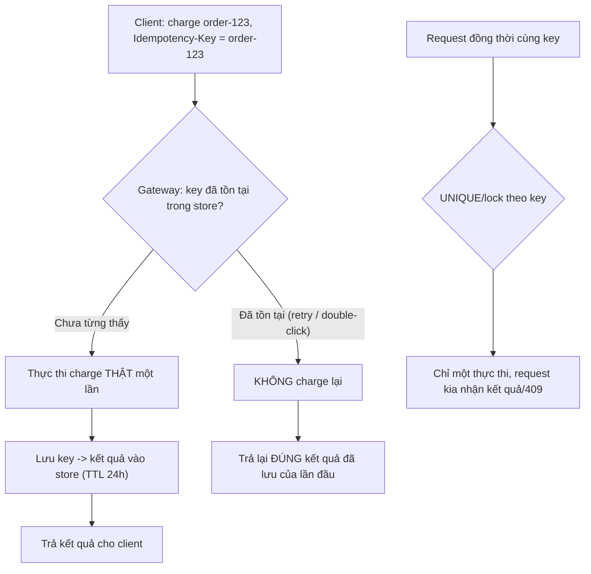

# Idempotency key trong payment dùng để làm gì?

## ⚡ Tóm tắt ngắn (30s)
* **Bản chất**: Idempotency key là một **định danh duy nhất do client sinh ra cho một "ý định thực hiện hành động"** (ví dụ một lần trả tiền cho đơn hàng X), được gửi kèm request tới payment gateway. Gateway dùng key này để đảm bảo: **dù request được gửi/retry bao nhiêu lần, hành động chỉ được thực thi đúng MỘT lần**, các lần gọi sau với cùng key chỉ nhận lại **kết quả đã lưu của lần đầu**. Nó là cơ chế biến một mạng **không tin cậy (at-least-once)** thành một hiệu ứng **"đúng một lần" (exactly-once *effect*)**.
* **Vấn đề nó giải quyết**:
  1. **Chống double charge khi retry/timeout**: response bị mất → client retry → nếu không có key sẽ charge 2 lần; có key thì gateway gộp lại thành 1.
  2. **An toàn khi user double-click / mạng chập chờn**: hai request giống hệt cùng key → chỉ 1 lần trừ tiền.
* **Điểm cốt lõi cần nói trong phỏng vấn**: Idempotency **KHÔNG phải là "true exactly-once delivery"** (điều bất khả thi trên mạng — Two Generals). Nó là cách **phía nhận khử trùng lặp** để đạt **exactly-once về *hiệu ứng***, kết hợp với việc phía gửi cứ thử lại cho chắc (at-least-once).

---

## 🔍 Chi tiết bản chất thực chiến: Cơ chế và quy tắc đúng

### 1. Vòng đời của một idempotency key tại gateway
1. Client sinh key ổn định (vd `order-12345`), gửi kèm header `Idempotency-Key`.
2. Gateway tra trong store: **chưa từng thấy key này** → thực thi charge thật, **lưu lại (key → kết quả + trạng thái)**, trả kết quả.
3. Request sau với **cùng key**: gateway thấy đã tồn tại → **không charge lại**, trả về **đúng kết quả đã lưu** (kể cả mã lỗi đã lưu).
4. Sau một thời gian (TTL, vd 24h), key hết hạn để dọn store.

### 2. Quy tắc sinh key — nơi dev hay sai nhất
* **Key phải ổn định theo Ý ĐỊNH, không theo lần gọi**: gắn với `orderId`/`paymentAttemptId`, sinh **một lần** và lưu lại, tái dùng cho mọi retry. ❌ Sai phổ biến: `UUID.randomUUID()` mỗi lần retry → mỗi retry thành charge mới → mất hết tác dụng.
* **Đủ duy nhất để không đụng nhầm**: hai ý định thanh toán khác nhau (kể cả cùng số tiền) phải có key khác nhau, nếu không gateway sẽ coi giao dịch thứ hai là "trùng" và **không trừ tiền lần hai** (mất tiền).

### 3. Key xử lý đồng thời (concurrency) ra sao
Hai request cùng key đến **đồng thời** (double-click): gateway phải xử lý nguyên tử — thường lock theo key hoặc dựa vào **UNIQUE constraint** trên store. Một request thực thi, request kia hoặc chờ rồi nhận kết quả của request đầu, hoặc nhận `409 Conflict`/"đang xử lý". Quan trọng: **không bao giờ thực thi hai lần**.

### 4. Idempotency phía CLIENT (không chỉ ở gateway)
Khái niệm này đối xứng: chính **service của bạn**, khi nhận webhook/callback từ provider, cũng phải idempotent theo `event.id` (xem câu webhook duplicate). Idempotency là một **nguyên tắc hai chiều** trong tích hợp thanh toán: bạn gửi với key, và bạn nhận với dedup.

### 5. Vì sao đây chỉ là "ảo giác exactly-once"
Trên mạng không tin cậy, **không thể đảm bảo một message được giao đúng một lần** (Two Generals Problem). Idempotency không loại bỏ việc message bị gửi trùng — nó chỉ làm cho **việc xử lý trùng trở nên vô hại**. Đó là lý do mô hình chuẩn là **"at-least-once delivery + idempotent receiver = exactly-once effect"**, chứ không phải exactly-once delivery thực sự.

### 6. Triển khai idempotency phía SERVER (thuật toán chuẩn)
Nếu chính API của bạn cần idempotent (bạn đóng vai provider), thuật toán an toàn:
1. Nhận `Idempotency-Key`; thử `INSERT (key, status=IN_PROGRESS)` dựa trên UNIQUE constraint.
2. **Insert thành công** → thực thi nghiệp vụ thật, lưu `response_body`, set `status=COMPLETED`, trả kết quả.
3. **Đụng key đã `COMPLETED`** → trả lại **đúng `response_body` đã lưu** (kể cả mã lỗi đã lưu), không thực thi lại.
4. **Đụng key đang `IN_PROGRESS`** (request đồng thời) → trả `409 Conflict`/"đang xử lý" để client thử lại sau.

Lưu ý **scope của key**: thường gắn theo *từng endpoint* (key `X` cho `/charge` khác key `X` cho `/refund`) để tránh đụng nhầm giữa hai thao tác khác nhau.

---

## 🎨 Sơ đồ trực quan: Gateway khử trùng lặp bằng idempotency key

Sơ đồ mô tả cách gateway dùng idempotency key để gộp mọi lần gửi trùng (retry, double-click) thành đúng một lần charge:



---

## 💻 Code thực chiến: BAD vs GOOD

Hai đoạn dưới tương phản trực tiếp cách sinh idempotency key:
* **BAD**: sinh key mới mỗi lần gọi → gateway coi là giao dịch khác nhau → double charge.
* **GOOD**: key ổn định theo `orderId`, lưu lại, tái dùng cho mọi retry; phía server dùng UNIQUE để ép một-lần.

### ❌ BAD: Key sinh mới mỗi lần gọi → vô hiệu hóa idempotency
```java
public void pay(Order o) {
    // ❌ Mỗi lần gọi/retry sinh key mới -> gateway coi là giao dịch khác nhau -> double charge
    gateway.charge(o.getAmount(), UUID.randomUUID().toString());
}
```

### ✅ GOOD: Key ổn định theo orderId, lưu lại, tái dùng cho retry
```java
@Service
public class PaymentService {

    @Transactional
    public PaymentResult pay(Order o) {
        // ✅ Sinh & LƯU key một lần cho mỗi ý định thanh toán
        PaymentAttempt attempt = attemptRepo.findOrCreate(o.getId(),
            () -> new PaymentAttempt(o.getId(), "order-" + o.getId() + "-" + o.getPaymentSeq()));

        // ✅ Tái dùng đúng key đó cho lần đầu lẫn mọi lần retry/timeout-query
        return gateway.charge(o.getAmount(), attempt.getIdempotencyKey());
    }
}
```

### ✅ GOOD: Phía gateway/server tự triển khai idempotency store
```sql
-- ✅ UNIQUE đảm bảo cùng key chỉ thực thi một lần (chống cả request đồng thời)
CREATE TABLE idempotency_keys (
    idem_key     VARCHAR(80) PRIMARY KEY,
    status       VARCHAR(16) NOT NULL,   -- IN_PROGRESS / COMPLETED
    response_body JSONB,                  -- kết quả đã lưu để trả lại
    created_at   TIMESTAMP NOT NULL
);
```

Thuật toán phía server: chèn IN_PROGRESS, lưu response để trả lại khi trùng, trả 409 khi đang xử lý:
```java
@Transactional
public Response handle(String idemKey, Request req) {
    try { store.insert(idemKey, "IN_PROGRESS"); }
    catch (DuplicateKeyException dup) {
        Idem rec = store.get(idemKey);
        if (rec.completed()) return rec.response();   // ✅ trả lại kết quả đã lưu
        throw new ConflictException("đang xử lý");      // ✅ IN_PROGRESS -> 409
    }
    Response res = execute(req);
    store.complete(idemKey, res);                     // lưu để lần sau trả lại
    return res;
}
```

---

## 📊 Bảng so sánh: có vs không có idempotency key

Bảng dưới đối chiếu trực tiếp hệ quả của việc có và không có idempotency key trong từng tình huống thực tế:

| Tình huống | Không có idempotency key | Có idempotency key (ổn định) |
| :--- | :--- | :--- |
| **Timeout rồi retry** | ❌ Double charge | ✅ Charge đúng 1 lần |
| **User double-click** | ❌ Trừ tiền 2 lần | ✅ Trừ 1 lần, lần 2 trả kết quả cũ |
| **Mạng gửi trùng request** | ❌ Nhiều charge | ✅ Gộp thành 1 |
| **Đảm bảo đạt được** | Tùy may rủi | **Exactly-once effect** |
| **Bản chất delivery** | At-least-once (nguy hiểm) | At-least-once + idempotent = an toàn |

---

## ⚠️ Common Gotchas & Questions follow-up

### 1. Cạm bẫy "Key trùng cho hai giao dịch khác nhau"
* Nếu vô tình dùng cùng key cho hai ý định thanh toán khác nhau (vd hardcode, hoặc key chỉ theo `userId`), gateway sẽ coi giao dịch thứ hai là "trùng" và **không trừ tiền** → mất doanh thu. Key phải duy nhất theo **từng ý định**, thường gắn `orderId` + một sequence nếu cho phép thanh toán lại đơn.

### 2. Cạm bẫy "TTL của idempotency store quá ngắn"
* Nếu store quên key trước khi client kịp retry (vd retry sau vài giờ do đối tác down lâu), gateway sẽ coi retry là giao dịch mới → double charge. TTL phải **dài hơn cửa sổ retry tối đa** của hệ thống.

### 3. Cạm bẫy "Phạm vi key quá rộng hoặc quá hẹp"
* Key gắn quá hẹp (vd kèm cả timestamp) → mỗi lần gọi là key mới → mất tác dụng. Key gắn quá rộng (vd chỉ theo `userId`) → hai giao dịch khác nhau của cùng user bị coi là trùng → **mất tiền**. Phạm vi đúng là **đúng một ý định thanh toán**: thường `orderId` (+ sequence nếu cho thanh toán lại), và nên kèm scope endpoint để `/charge` và `/refund` không đụng nhau.

### 4. Câu hỏi đào sâu từ interviewer
* **Interviewer: "Idempotency key có biến hệ thống thành 'exactly-once' không? Giải thích chính xác."**
* **Trả lời**: Không, và đây là điểm tôi luôn nói rõ. Idempotency key **không** mang lại **exactly-once *delivery*** — điều đó là **bất khả thi** trên một kênh mạng không tin cậy, đúng theo Two Generals Problem: bên gửi không bao giờ chắc chắn tuyệt đối rằng bên nhận đã nhận. Cái idempotency key mang lại là **exactly-once *effect* (hiệu ứng)**: phía gửi được tự do **gửi trùng/retry thoải mái (at-least-once)** để không bao giờ bỏ lỡ, còn phía nhận dùng key để **nhận diện và gộp mọi bản trùng thành đúng một lần thực thi**. Nói cách khác, ta không ngăn được message đến hai lần — ta chỉ làm cho lần thứ hai **vô hại**. Công thức chuẩn là **at-least-once delivery + idempotent processing = exactly-once effect**, và đó chính xác là điều một hệ thống thanh toán nghiêm túc đảm bảo cho khách hàng: bị trừ tiền **đúng một lần** về mặt hiệu ứng, dù bên dưới có bao nhiêu lần retry.
