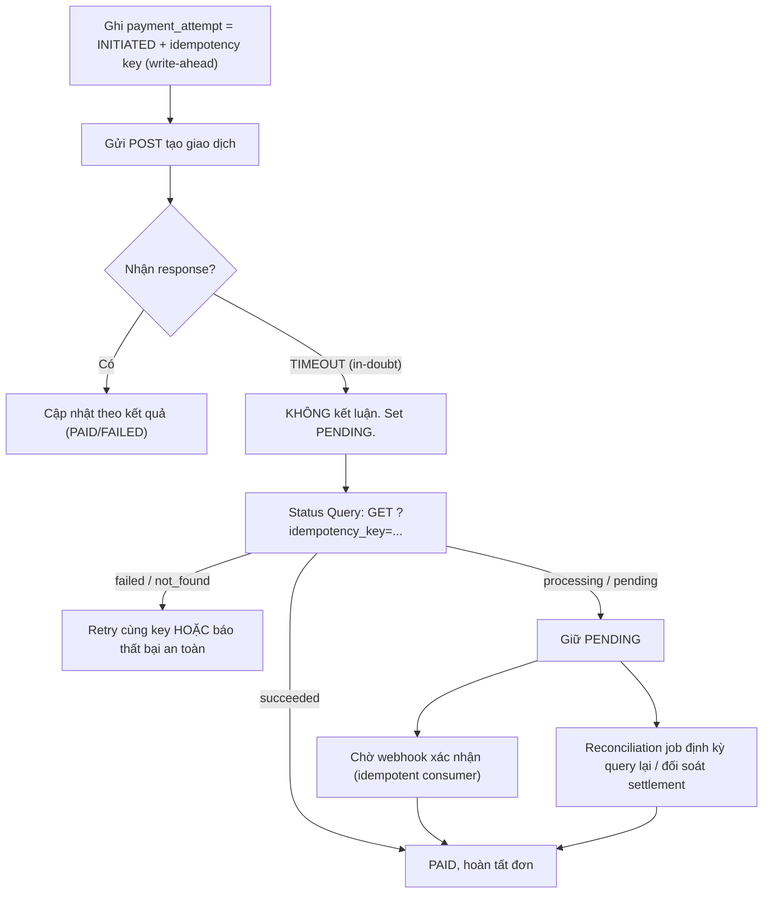

# Timeout xảy ra sau khi gửi request tạo giao dịch. Làm sao biết giao dịch thành công hay thất bại?

## ⚡ Tóm tắt ngắn (30s)
* **Bản chất**: Đây là trạng thái **"in-doubt" (bất định)** kinh điển. Timeout **chỉ cho biết bạn không nhận được trả lời**, nó KHÔNG cho biết giao dịch ở đối tác đã thành công, thất bại, hay đang xử lý dở. Bạn **không thể suy ra kết quả từ chính cái exception timeout** — phải đi **hỏi lại nguồn sự thật** (provider). Tuyệt đối không đoán mò "timeout = thất bại" rồi báo lỗi, cũng không "timeout = thành công" rồi giao hàng.
* **Cách biết kết quả thật (theo thứ tự ưu tiên)**:
  1. **Status Query API**: gọi `GET /transactions?idempotency_key=...` hoặc `GET /payment/{id}` để hỏi trạng thái hiện tại. Đây là cách trực tiếp và nhanh nhất.
  2. **Webhook xác nhận**: lắng nghe event `payment.succeeded`/`failed` mà provider sẽ gửi khi giao dịch chốt (cần idempotent consumer).
  3. **Reconciliation định kỳ**: job đối soát với báo cáo settlement của provider — lưới an toàn cuối cùng cho các ca treo lâu.
* **Quyết định Senior**: **Write-ahead** (ghi `PENDING` trước khi gọi) + **idempotency key** (để query/retry an toàn) + **không bao giờ kết luận từ timeout** mà luôn chuyển sang trạng thái `PENDING` và để 3 cơ chế trên giải quyết.

---

## 🔍 Chi tiết bản chất thực chiến: Giải trạng thái in-doubt

### 1. Ba khả năng sau một timeout — và vì sao không phân biệt được
Khi timeout xảy ra **sau** khi đã gửi lệnh tạo giao dịch:
* **(A) Request chưa tới provider** → giao dịch chưa xảy ra (thất bại thật).
* **(B) Tới provider, xử lý thành công, response mất trên đường về** → **tiền đã trừ**.
* **(C) Tới provider, đang xử lý dở** → chưa chốt (`PENDING`).

Từ phía bạn, cả ba đều biểu hiện y hệt: một `SocketTimeoutException`. Không có thông tin nào trong exception giúp phân biệt. **Kết luận: phải hỏi provider.**

### 2. Write-Ahead State — điều kiện để có thể truy vấn lại
Bạn chỉ query lại được nếu **biết mình đã gửi gì**. Vì vậy, **trước khi** gọi provider, ghi vào DB một bản ghi:
```
payment_attempt(orderId, idempotency_key, status = INITIATED, created_at)
```
Nếu app crash ngay sau khi gửi, bản ghi này vẫn còn → reconciliation job biết "có một lệnh treo với key X" để đi truy vấn. Không có write-ahead, giao dịch in-doubt sẽ **biến mất khỏi tầm theo dõi**.

### 3. Status Query — dùng idempotency key làm "mã tra cứu"
Idempotency key không chỉ chống double charge — nó còn là **chìa khóa để tra cứu** trạng thái: `GET /charges?idempotency_key=order-123`. Kết quả:
* `succeeded` → cập nhật `PAID`, hoàn tất đơn.
* `failed`/`not_found` → giao dịch chưa thành; an toàn để **retry với cùng key** hoặc báo thất bại.
* `processing`/`pending` → chưa chốt; **giữ PENDING**, để webhook/reconcile xử lý, không kết luận vội.

### 4. Webhook + Reconciliation — lưới an toàn nhiều lớp
* **Webhook**: provider chủ động báo khi chốt. Nhanh nhưng có thể trễ/mất → không phụ thuộc duy nhất vào nó.
* **Reconciliation job**: quét các `payment_attempt` còn `PENDING`/`INITIATED` quá lâu, query lại provider hoặc đối chiếu file settlement cuối ngày để chốt trạng thái cuối cùng. Đây là **nguồn sự thật tối hậu** đảm bảo không giao dịch nào kẹt mãi mãi.

### 5. Bàn giao cho Outbox + Reconciliation khi không chốt được ngay
Nếu status query cũng không kết luận (đối tác sự cố kéo dài), KHÔNG chặn user và KHÔNG đoán:
* Giữ `payment_attempt = PENDING` (đã write-ahead) và để một **worker bền bỉ** poll lại theo lịch backoff cho tới khi đạt trạng thái cuối.
* **Reconciliation cuối ngày** đối chiếu với settlement file của provider là **nguồn sự thật tối hậu** — bắt mọi ca còn treo.
* Trả user trạng thái **"đang xử lý"** trung thực; gửi thông báo (email/push) khi đã chốt. Không bao giờ khẳng định succeeded/failed khi chưa chắc chắn.

---

## 🎨 Sơ đồ trực quan: Giải in-doubt sau timeout

Sơ đồ mô tả cách giải trạng thái in-doubt sau timeout bằng status query, bổ trợ bởi webhook và reconciliation, mà không kết luận vội:



---

## 💻 Code thực chiến: BAD vs GOOD

Hai đoạn dưới tương phản trực tiếp cách xử lý timeout khi tạo giao dịch:
* **BAD**: coi timeout là thất bại và kết luận luôn → khách mất tiền, lệch sổ.
* **GOOD**: write-ahead, set PENDING, truy vấn trạng thái thật, để reconciliation chốt nếu chưa rõ.

### ❌ BAD: Coi timeout là thất bại, kết luận luôn
```java
public PaymentResult create(Order o) {
    try {
        return gateway.create(o.getAmount());
    } catch (SocketTimeoutException e) {
        // ❌ Kết luận thất bại dù tiền có thể đã bị trừ -> lệch sổ, khách mất tiền
        order.markFailed();
        return PaymentResult.failed();
    }
}
```

### ✅ GOOD: Write-ahead + set PENDING + status query + để reconcile chốt
```java
@Transactional
public PaymentResult create(Order o) {
    String idemKey = "order-" + o.getId();
    attemptRepo.save(new PaymentAttempt(o.getId(), idemKey, Status.INITIATED)); // ✅ write-ahead

    try {
        ChargeResponse res = gateway.create(o.getAmount(), idemKey);
        attemptRepo.update(idemKey, res.isSucceeded() ? Status.PAID : Status.FAILED);
        return PaymentResult.from(res);
    } catch (SocketTimeoutException | ConnectException e) {
        // ✅ KHÔNG kết luận. Đánh dấu PENDING và đi hỏi trạng thái thật.
        attemptRepo.update(idemKey, Status.PENDING);
        return resolve(idemKey, o);
    }
}

private PaymentResult resolve(String idemKey, Order o) {
    ChargeStatus s = gateway.queryByKey(idemKey); // ✅ hỏi nguồn sự thật
    return switch (s) {
        case SUCCEEDED -> { attemptRepo.update(idemKey, Status.PAID); yield PaymentResult.paid(); }
        case NOT_FOUND, FAILED -> { attemptRepo.update(idemKey, Status.FAILED); yield PaymentResult.failedSafe(); }
        // ✅ pending -> để webhook + reconciliation job chốt sau, trả trạng thái trung thực
        case PROCESSING -> PaymentResult.pending();
    };
}
```

Worker bền bỉ poll lại trạng thái cho các giao dịch còn PENDING (lưới an toàn cho ca treo lâu):
```java
@Scheduled(fixedDelay = 30000)
void resolvePending() {
    for (PaymentAttempt a : attemptRepo.findPendingOlderThan(Duration.ofMinutes(2))) {
        ChargeStatus s = gateway.queryByKey(a.getIdempotencyKey()); // hỏi nguồn sự thật
        if (s.isTerminal()) attemptRepo.update(a.getIdempotencyKey(), s.toStatus());
    }
}
```

---

## 📊 Bảng so sánh cách xác định kết quả sau timeout

Bảng dưới so sánh các cách xác định kết quả sau timeout theo tốc độ phản hồi và độ tin cậy:

| Cách | Tốc độ | Độ tin cậy | Khi nào dùng |
| :--- | :--- | :--- | :--- |
| **Đoán "timeout = failed"** | Tức thì | ❌ Sai, gây lệch sổ | Không bao giờ |
| **Status Query API** | Nhanh (giây) | ✅ Cao | Ngay sau timeout |
| **Webhook xác nhận** | Trung bình (giây–phút) | ✅ Cao (cần idempotent) | Bổ trợ, push từ provider |
| **Reconciliation job** | Chậm (phút–cuối ngày) | ✅✅ Tối hậu | Lưới an toàn cho ca treo lâu |

---

## ⚠️ Common Gotchas & Questions follow-up

### 1. Cạm bẫy "Không write-ahead nên mất dấu giao dịch in-doubt"
* Nếu chỉ ghi DB **sau khi** nhận response, thì khi timeout (và nhất là khi app crash), bạn **không có bản ghi nào** để biết "đã gửi lệnh này" → giao dịch treo biến mất khỏi radar, reconciliation không có gì để dò. Phải ghi `INITIATED` **trước** khi gọi.

### 2. Cạm bẫy "Status query cũng timeout"
* Provider đang sự cố thì query cũng có thể timeout. Đừng chặn user chờ vô hạn — sau vài lần query nhanh không xong, **giữ PENDING** và bàn giao cho reconciliation job bền bỉ; trả user trạng thái "đang xử lý" thay vì khẳng định sai.

### 3. Câu hỏi đào sâu từ interviewer
* **Interviewer: "Một junior nói 'timeout nghĩa là request thất bại, cứ báo lỗi cho khách'. Bạn phản biện thế nào?"**
* **Trả lời**: Đó là một ngộ nhận nguy hiểm trong thanh toán. Timeout chỉ nói rằng **tôi không nhận được phản hồi trong khoảng thời gian chờ**, nó hoàn toàn **không nói** request đã đi tới đâu trong chuỗi `App → Network → Gateway → Bank`. Rất có thể lệnh đã tới gateway, **tiền đã bị trừ thật**, chỉ là gói response bị mất trên đường về. Nếu tôi mù quáng báo "thất bại" và không giao hàng, khách **mất tiền mà không nhận hàng** — và sổ sách của tôi sẽ lệch so với báo cáo của ngân hàng. Cách đúng là coi timeout là trạng thái **in-doubt**, **không kết luận**, mà chuyển giao dịch sang `PENDING` rồi **đi hỏi nguồn sự thật** bằng status query (dùng idempotency key làm mã tra cứu), bổ trợ bằng webhook và reconciliation. Chỉ khi provider **xác nhận rõ ràng** failed/not_found tôi mới báo khách thất bại; còn nếu họ xác nhận succeeded thì tôi hoàn tất đơn. Nguyên tắc là **để nguồn sự thật quyết định, không để một cái exception quyết định**.
