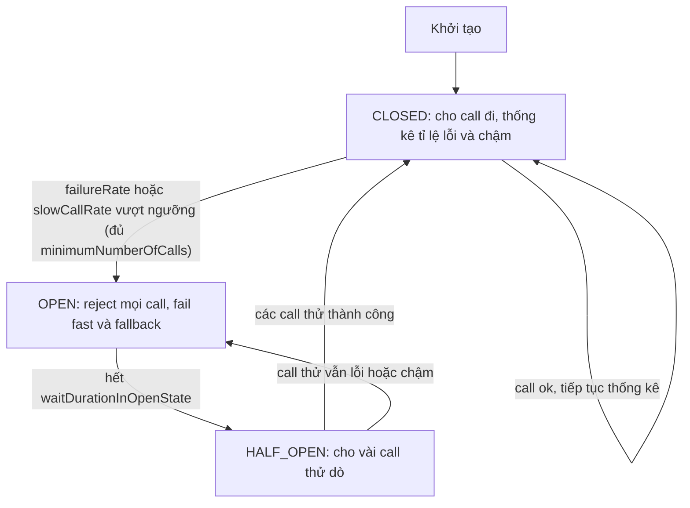

# Circuit breaker với external API nên cấu hình thế nào?

## ⚡ Tóm tắt ngắn (30s)
* **Bản chất**: Circuit breaker là **cầu dao tự động** cho lời gọi external API: khi đối tác lỗi/chậm vượt ngưỡng, nó **"ngắt mạch" (OPEN)** để mọi call tiếp theo **fail fast tức thì** thay vì tiếp tục treo thread chờ một thằng đang chết. Sau một khoảng nghỉ, nó **thử dò (HALF_OPEN)** vài call để xem đối tác hồi phục chưa, rồi đóng lại (CLOSED) nếu ổn. Mục tiêu: **ngừng chảy máu tài nguyên của mình** và **cho đối tác thời gian hồi phục**.
* **Các tham số cốt lõi phải cấu hình đúng**:
  1. **`slidingWindowSize` + loại window (count/time)**: cửa sổ thống kê đủ lớn để không nhạy quá (mở mạch oan vì 1–2 lỗi lẻ).
  2. **`failureRateThreshold` & `slowCallRateThreshold` + `slowCallDurationThreshold`**: ngưỡng mở mạch theo **cả tỉ lệ lỗi LẪN tỉ lệ call chậm** — vì "chậm" cũng nguy hiểm như "lỗi".
  3. **`waitDurationInOpenState`**: thời gian giữ mạch mở trước khi thử lại.
  4. **`permittedNumberOfCallsInHalfOpenState`** + **`minimumNumberOfCalls`**: số call thử khi dò, và số mẫu tối thiểu trước khi tính tỉ lệ.
* **Quyết định Senior**: Circuit breaker phải đi **kèm timeout (nền móng) + bulkhead (cô lập) + fallback (degrade)**; cấu hình **per-dependency** (mỗi đối tác một breaker riêng), và **đừng để 429 hay lỗi nghiệp vụ 4xx làm mở mạch oan**.

---

## 🔍 Chi tiết bản chất thực chiến: Ba trạng thái và cách chọn tham số

### 1. Máy trạng thái CLOSED → OPEN → HALF_OPEN
* **CLOSED**: cho call đi bình thường, thống kê tỉ lệ lỗi/chậm trong cửa sổ trượt.
* **OPEN**: khi tỉ lệ vượt ngưỡng → ngắt; mọi call bị **reject ngay** (`CallNotPermittedException`) → chuyển fallback. Giữ trong `waitDurationInOpenState`.
* **HALF_OPEN**: hết thời gian nghỉ → cho **một số ít call thử**. Nếu chúng ổn → CLOSED; nếu vẫn lỗi → quay lại OPEN. Đây là cơ chế **tự dò hồi phục** mà không cần can thiệp tay.

### 2. Chọn cửa sổ thống kê (sliding window)
* **COUNT_BASED** (vd 20 call gần nhất): ổn định, dễ suy luận; hợp với traffic đều.
* **TIME_BASED** (vd 10 giây gần nhất): phản ánh theo thời gian thực; hợp với traffic biến động.
* **`minimumNumberOfCalls`**: chỉ bắt đầu tính tỉ lệ khi đã có đủ mẫu (vd ≥10), tránh mở mạch chỉ vì 1/1 call đầu tiên lỗi.

### 3. Ngưỡng lỗi VÀ ngưỡng chậm — đừng quên slow call
Nhiều người chỉ cấu hình `failureRateThreshold` mà quên **`slowCallRateThreshold`**. Nhưng như đã phân tích, một đối tác **chậm** (chưa lỗi hẳn) vẫn làm cạn thread pool. Cấu hình:
* `slowCallDurationThreshold: 2s` → call >2s tính là "chậm".
* `slowCallRateThreshold: 50` → >50% call chậm cũng **mở mạch**, không cần chờ tới khi chúng timeout/lỗi.

### 4. `waitDurationInOpenState` — cân bằng hồi phục vs phục vụ
* Quá ngắn (vd 1s): liên tục thử lại vào đối tác chưa kịp hồi → mạch dao động đóng/mở (flapping).
* Quá dài (vd 5 phút): đối tác đã hồi phục mà mình vẫn từ chối phục vụ → mất khách oan.
* Thực tế thường 10–30s, có thể kết hợp **exponential** (mở lâu dần nếu liên tục thất bại).

### 5. Phân loại exception: cái gì tính là "failure"?
* **Tính là failure**: `5xx`, timeout, network error.
* **KHÔNG nên tính**: `429` (đối tác khỏe, chỉ là rate limit — xử lý bằng backoff riêng), `4xx` nghiệp vụ (declined). Dùng `ignoreExceptions`/`recordExceptions` để breaker không **mở mạch oan** vì những lỗi không phản ánh sức khỏe đối tác.

### 6. Quan sát, cảnh báo & chuỗi fallback
* **Metric trạng thái breaker**: phát sự kiện mỗi lần chuyển CLOSED↔OPEN↔HALF_OPEN; dashboard hóa và **alert khi breaker OPEN** — đó là tín hiệu sớm cho thấy đối tác đang sự cố.
* **Đừng để breaker che bệnh mãn tính**: nếu một breaker liên tục mở/đóng (flapping), đó là dấu hiệu cần điều tra gốc rễ (đối tác yếu kinh niên / timeout cấu hình sai), không chỉ chỉnh tham số cho qua.
* **Fallback chain**: khi mạch mở, fallback có thể **xếp tầng** — thử cache → thử provider dự phòng → giá trị mặc định — thay vì chỉ một mức duy nhất.

---

## 🎨 Sơ đồ trực quan: Máy trạng thái circuit breaker

Sơ đồ mô tả máy trạng thái ba pha CLOSED, OPEN, HALF_OPEN và điều kiện chuyển đổi giữa chúng:



---

## 💻 Code thực chiến: BAD vs GOOD

Hai đoạn dưới tương phản trực tiếp cấu hình circuit breaker:
* **BAD**: chỉ cấu hình `failureRate` cao, cửa sổ nhỏ, không slow-call, không timeout, không fallback.
* **GOOD**: đủ bộ ngưỡng lỗi + chậm, cửa sổ hợp lý, half-open, fallback, timeout và bulkhead đi kèm.

### ❌ BAD: Chỉ cấu hình failureRate, không có slow-call, không timeout, không fallback
```yaml
resilience4j:
  circuitbreaker.instances.partner:
    failureRateThreshold: 90        # ❌ quá cao, gần như không bao giờ mở
    slidingWindowSize: 5            # ❌ quá nhỏ -> nhạy thất thường
    # ❌ thiếu slowCallRateThreshold -> đối tác CHẬM vẫn nuốt hết thread
    # ❌ thiếu minimumNumberOfCalls -> mở mạch vì 1 lỗi lẻ
```
```java
@CircuitBreaker(name = "partner") // ❌ không fallbackMethod -> mở mạch là ném exception thẳng cho user
public String call() { return restTemplate.getForObject(url, String.class); } // ❌ không timeout
```

### ✅ GOOD: Đủ bộ failure + slow + window + half-open + fallback + timeout + bulkhead
```yaml
resilience4j:
  circuitbreaker.instances.partner:
    slidingWindowType: COUNT_BASED
    slidingWindowSize: 20
    minimumNumberOfCalls: 10           # ✅ đủ mẫu mới tính tỉ lệ
    failureRateThreshold: 50           # ✅ >50% lỗi -> mở
    slowCallRateThreshold: 50          # ✅ >50% call chậm -> mở
    slowCallDurationThreshold: 2s      # ✅ call >2s là "chậm"
    waitDurationInOpenState: 15s       # ✅ nghỉ 15s rồi dò
    permittedNumberOfCallsInHalfOpenState: 3
    recordExceptions:                  # ✅ chỉ tính lỗi phản ánh sức khỏe đối tác
      - java.io.IOException
      - org.springframework.web.client.HttpServerErrorException
    ignoreExceptions:                  # ✅ 429 & lỗi nghiệp vụ KHÔNG mở mạch
      - com.example.RateLimitedException
      - com.example.PaymentDeclinedException
  timelimiter.instances.partner:
    timeoutDuration: 3s
  bulkhead.instances.partner:
    maxConcurrentCalls: 20
```
```java
@CircuitBreaker(name = "partner", fallbackMethod = "fallback")
@Bulkhead(name = "partner")
@TimeLimiter(name = "partner")
public CompletableFuture<String> call() {
    return CompletableFuture.supplyAsync(() ->
        client.get().uri("/data").retrieve().body(String.class));
}
private CompletableFuture<String> fallback(Throwable ex) {     // ✅ degrade khi mạch mở
    return CompletableFuture.completedFuture(cache.lastKnown());
}
```

Nâng cấp: fallback xếp tầng (cache → provider dự phòng → mặc định) thay cho một mức duy nhất:
```java
private CompletableFuture<String> fallbackChained(Throwable ex) {
    String cached = cache.lastKnown();
    if (cached != null) return completedFuture(cached);          // 1) cache
    if (backupBreaker.tryAcquire()) return backupProvider.get(); // 2) provider dự phòng
    return completedFuture(DEFAULT_VALUE);                        // 3) mặc định an toàn
}
```

---

## 📊 Bảng so sánh tham số: cấu hình sai vs đúng

Bảng dưới đối chiếu từng tham số giữa cấu hình sai thường gặp và cấu hình đúng kèm lý do:

| Tham số | Cấu hình sai thường gặp | Cấu hình đúng & lý do |
| :--- | :--- | :--- |
| **slidingWindowSize** | Quá nhỏ (3–5) → thất thường | 20–50 / 10s: đủ mẫu, ổn định |
| **minimumNumberOfCalls** | Bỏ trống → mở vì 1 lỗi | ≥10: tránh mở mạch oan |
| **slowCallRateThreshold** | Bỏ qua hoàn toàn | Có, 50%: bắt cả "chậm" |
| **failureRateThreshold** | 90% (gần như vô hiệu) | ~50%: phản ứng kịp |
| **waitDurationInOpenState** | 1s (flapping) hoặc 5m (mất khách) | 10–30s, cân bằng |
| **record/ignoreExceptions** | Tính cả 429/4xx → mở oan | Chỉ tính 5xx/timeout/IO |

---

## ⚠️ Common Gotchas & Questions follow-up

### 1. Cạm bẫy "Circuit breaker mà không có timeout"
* Breaker cần thống kê **đủ call lỗi/chậm** mới mở. Nếu mỗi call treo vô hạn (không timeout), thread bị giam **trước khi** breaker kịp mở → vẫn cạn pool. **Timeout là nền móng**; breaker chỉ phát huy khi mỗi call có biên thời gian.

### 2. Cạm bẫy "Một breaker dùng chung cho nhiều đối tác"
* Gộp nhiều dependency vào một breaker khiến lỗi của đối tác A làm ngắt luôn call tới đối tác B (vốn vẫn khỏe). Phải **per-dependency**: mỗi external API một breaker riêng để cô lập.

### 3. Câu hỏi đào sâu từ interviewer
* **Interviewer: "Vì sao cấu hình `slowCallRateThreshold` lại quan trọng ngang `failureRateThreshold`? Nhiều người chỉ cấu hình cái sau."**
* **Trả lời**: Vì đối với service của tôi, một đối tác **chậm còn nguy hiểm hơn một đối tác lỗi hẳn**. Khi đối tác trả lỗi `5xx` nhanh, call của tôi **fail tức thì** và thread được nhả ngay — `failureRateThreshold` sẽ bắt được và mở mạch. Nhưng khi đối tác **chậm mà chưa lỗi** (mỗi call mất 8s rồi mới trả 200), thì xét theo tỉ lệ *lỗi* mọi thứ vẫn "thành công" — `failureRateThreshold` **không bao giờ kích hoạt** — trong khi từng thread của tôi bị **giam giữ nhiều giây**, và theo Little's Law số request đồng thời bùng nổ làm cạn thread pool. Nếu chỉ cấu hình ngưỡng lỗi, breaker sẽ **ngồi im nhìn hệ thống chết vì chậm**. `slowCallRateThreshold` kết hợp `slowCallDurationThreshold` cho phép breaker coi **"chậm vượt ngưỡng" cũng là một dạng thất bại** và mở mạch kịp thời, biến tình huống "treo chờ" thành "fail fast + fallback". Đó là lý do tôi luôn cấu hình **cả hai ngưỡng**, và đặt nền bằng timeout bên dưới.
