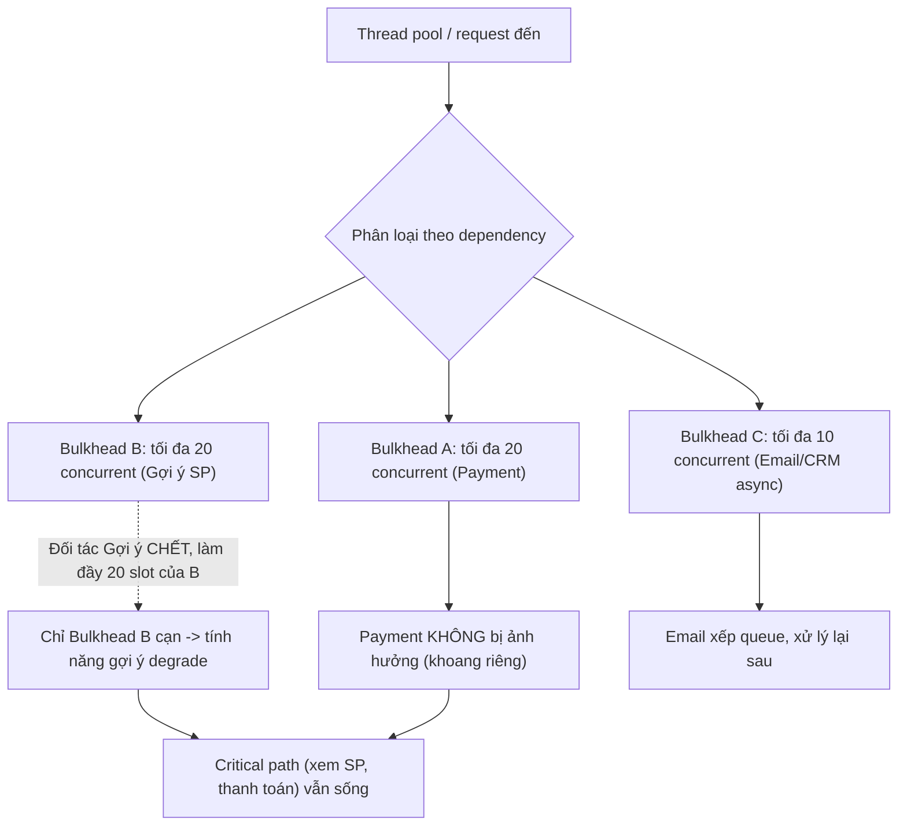

# Làm sao giới hạn blast radius khi third-party lỗi?

## ⚡ Tóm tắt ngắn (30s)
* **Bản chất**: "Blast radius" (bán kính sát thương) là **phạm vi mà một sự cố lan ra**. Khi một third-party lỗi, mục tiêu là đảm bảo nó chỉ làm hỏng **đúng cái tính năng phụ thuộc nó**, chứ KHÔNG kéo sập **toàn bộ service** (cascading failure). Bản chất là **cô lập (isolation) + cách ly tài nguyên (resource partitioning) + suy giảm có kiểm soát (graceful degradation)** để biến "một dependency chết" thành "một tính năng giảm cấp" thay vì "cả hệ thống sập".
* **Các vũ khí giới hạn blast radius**:
  1. **Bulkhead (vách ngăn khoang tàu)**: tách thread pool / connection pool riêng cho mỗi dependency → một thằng chết không nuốt hết tài nguyên của cả app.
  2. **Timeout + Circuit Breaker**: fail fast, ngắt mạch để ngừng treo thread vào thằng đang chết.
  3. **Tách tính năng cốt lõi vs phụ**: dependency phụ (gợi ý, đánh giá) lỗi không được chặn luồng cốt lõi (xem sản phẩm, thanh toán).
  4. **Async hóa + degrade**: chuyển phụ thuộc không-bắt-buộc-đồng-bộ sang hàng đợi; có fallback cho phần degrade được.
* **Quyết định Senior**: Thiết kế theo nguyên tắc **"failure containment"** — mỗi external call là một khoang kín có biên (timeout + bulkhead + breaker + fallback), và **phân tầng tính năng** để lỗi của thằng phụ không bao giờ chạm tới đường sống còn.

---

## 🔍 Chi tiết bản chất thực chiến: Các tầng cô lập

### 1. Bulkhead — vách ngăn khoang tàu (quan trọng nhất)
Tên gọi lấy từ tàu thủy: thân tàu chia thành nhiều khoang kín; thủng một khoang, nước không tràn sang khoang khác, tàu không chìm. Áp dụng:
* **Thread/semaphore bulkhead**: giới hạn số call đồng thời tới mỗi dependency (vd đối tác A tối đa 20, đối tác B tối đa 20). Khi A treo và làm đầy 20 slot của nó, slot của B và thread phục vụ nghiệp vụ khác **vẫn còn nguyên**.
* Không có bulkhead, một dependency chậm sẽ **hút sạch** thread pool dùng chung → mọi tính năng chết theo.

### 2. Timeout + Circuit Breaker — ngừng chảy máu
* **Timeout**: biến "treo vô hạn" thành "fail nhanh", trả thread về pool.
* **Circuit breaker**: sau khi đủ lỗi/chậm, ngắt mạch để **ngừng cả việc thử gọi** vào thằng đang chết, vừa bảo vệ mình vừa cho đối tác nghỉ.

### 3. Phân tầng tính năng: critical path vs non-critical
Vẽ rõ **đường sống còn (critical path)** — ví dụ "xem sản phẩm → thêm giỏ → thanh toán" — và **các tính năng phụ** bám vào nó (gợi ý cá nhân hóa, đánh giá, điểm thưởng, đề xuất ship). Nguyên tắc: **lỗi của tính năng phụ KHÔNG được nằm chặn trên critical path**. Trang sản phẩm vẫn phải tải được dù service "gợi ý" chết.

### 4. Async hóa các phụ thuộc không bắt buộc đồng bộ
Những việc như đồng bộ CRM, gửi email marketing, ghi analytics... không cần hoàn thành ngay trong request. Đẩy qua **hàng đợi**; nếu đối tác đó chết, message tồn trong queue và xử lý lại sau, **không ảnh hưởng response của user**.

### 5. Cô lập ở tầng hạ tầng (defense in depth)
* **Tách connection pool / DB pool** cho luồng phụ thuộc nặng.
* **Cell-based / shard isolation**: với quy mô lớn, chia hệ thống thành các "cell" sao cho lỗi liên quan một nhóm khách/đối tác chỉ giới hạn trong một cell.
* **Rate limit egress**: giới hạn lưu lượng đi ra một đối tác để retry storm của một phần không làm hỏng phần khác.

### 6. Load shedding theo ưu tiên & graceful degradation tiers
* **Priority load shedding**: khi tài nguyên căng, **drop request ưu tiên thấp trước** (vd prefetch, analytics) để dành chỗ cho luồng cốt lõi (thanh toán). Phân loại request theo độ quan trọng ngay từ đầu vào.
* **Degradation tiers**: định nghĩa sẵn các mức suy giảm để bật khi sự cố — *đầy đủ → ẩn tính năng phụ → read-only → trang tĩnh*.
* **Backpressure**: dùng hàng đợi có giới hạn + từ chối sớm (reject) khi đầy, thay vì để hàng đợi phình làm sập cả cụm.

---

## 🎨 Sơ đồ trực quan: Bulkhead cô lập blast radius

Sơ đồ minh họa cách bulkhead phân khoang tài nguyên để lỗi của một đối tác chỉ làm degrade đúng tính năng của nó, không lan ra critical path:



---

## 💻 Code thực chiến: BAD vs GOOD

Hai đoạn dưới tương phản trực tiếp cách giới hạn blast radius:
* **BAD**: mọi dependency chia chung một thread pool → một đối tác treo hút cạn pool, cả trang sập.
* **GOOD**: bulkhead riêng cho từng dependency + fallback cho tính năng phụ, bảo vệ critical path.

### ❌ BAD: Mọi dependency chia chung 1 thread pool, không cô lập
```java
// ❌ Cùng một executor/HTTP pool cho mọi external call
ExecutorService shared = Executors.newFixedThreadPool(50);

public ProductPage load(String id) {
    var product = shared.submit(() -> productApi.get(id));
    var recos   = shared.submit(() -> recommendationApi.get(id)); // ❌ nếu treo, hút hết 50 thread
    var reviews = shared.submit(() -> reviewApi.get(id));
    // ❌ recommendationApi chết -> shared pool cạn -> productApi cũng không có thread -> cả trang sập
    return new ProductPage(get(product), get(recos), get(reviews));
}
```

### ✅ GOOD: Bulkhead riêng + degrade tính năng phụ, bảo vệ critical path
```java
@Service
public class ProductPageService {

    // ✅ Critical: phải có, bulkhead + timeout riêng
    @Bulkhead(name = "productApi") @TimeLimiter(name = "productApi")
    public CompletableFuture<Product> product(String id) { ... }

    // ✅ Non-critical: bulkhead riêng + fallback rỗng, lỗi KHÔNG chặn trang
    @Bulkhead(name = "recoApi")
    @CircuitBreaker(name = "recoApi", fallbackMethod = "noRecos")
    public CompletableFuture<List<Reco>> recommendations(String id) { ... }
    private CompletableFuture<List<Reco>> noRecos(String id, Throwable ex) {
        return CompletableFuture.completedFuture(List.of()); // ✅ degrade: ẩn block gợi ý
    }

    public ProductPage load(String id) {
        Product p = product(id).join();                 // critical: nếu lỗi -> báo lỗi trang
        List<Reco> r = recommendations(id).join();      // ✅ lỗi -> [] , trang vẫn render
        return new ProductPage(p, r);
    }
}
```

Load shedding theo ưu tiên kèm backpressure: bỏ tải thấp, từ chối sớm khi hàng đợi đầy:
```java
// Phân loại ưu tiên ngay đầu vào để biết cái gì được hi sinh trước
if (systemLoadHigh() && req.priority() == Priority.LOW) {
    metrics.inc("shed.low_priority");
    throw new ServiceBusyException("tạm bỏ tải ưu tiên thấp"); // ✅ giữ chỗ cho critical
}
// Backpressure: hàng đợi có giới hạn, đầy thì reject sớm thay vì phình vô hạn
if (!boundedQueue.offer(task)) throw new ServiceBusyException("hàng đợi đầy, thử lại sau");
```

---

## 📊 Bảng so sánh cơ chế giới hạn blast radius

Bảng dưới so sánh từng cơ chế giới hạn blast radius theo kiểu lan tỏa mà nó ngăn và phạm vi bảo vệ:

| Cơ chế | Ngăn lan tỏa kiểu gì | Phạm vi bảo vệ | Khi nào dùng |
| :--- | :--- | :--- | :--- |
| **Bulkhead** | Một dep không nuốt hết thread/conn pool | Tài nguyên runtime | Mọi external call |
| **Timeout + Circuit Breaker** | Ngừng treo/ngừng gọi thằng chết | Thread + đối tác | Mọi external call |
| **Phân tầng critical/non-critical** | Lỗi phụ không chặn đường sống còn | Luồng nghiệp vụ | Trang/luồng nhiều dependency |
| **Async hóa (queue)** | Phụ thuộc không-đồng-bộ tách khỏi request | Trải nghiệm user | Email, CRM, analytics |
| **Cell/shard isolation** | Lỗi giới hạn trong một cell | Toàn hệ thống/khách hàng | Quy mô lớn, multi-tenant |

---

## ⚠️ Common Gotchas & Questions follow-up

### 1. Cạm bẫy "Có circuit breaker nhưng vẫn dùng chung thread pool"
* Circuit breaker giảm số call **sau khi** mạch đã mở, nhưng trong **giai đoạn trước khi mở** (đang tích lũy lỗi), nếu mọi dependency chung một pool thì pool vẫn có thể cạn vì call treo. **Bulkhead bù đắp đúng khoảng trống này** — cô lập tài nguyên ngay từ đầu, độc lập với việc breaker đã mở hay chưa.

### 2. Cạm bẫy "Coi mọi dependency là critical"
* Nếu không phân loại, một lỗi ở service đánh giá/gợi ý sẽ được xử lý nghiêm trọng như lỗi thanh toán → chặn cả trang. Phải **chủ động phân tầng** và chấp nhận degrade cho phần phụ.

### 3. Cạm bẫy "Retry chồng tầng khuếch đại blast radius"
* Nếu mỗi tầng (client → gateway → service) đều tự retry 3 lần, một lỗi gốc bị nhân lên **3×3×3 = 27 lần** request — biến một sự cố nhỏ của third-party thành bão tải tự gây. Phải **chọn một tầng duy nhất chịu trách nhiệm retry** (thường tầng gần đối tác nhất), các tầng trên fail fast, kết hợp **retry budget** để chặn khuếch đại.

### 4. Câu hỏi đào sâu từ interviewer
* **Interviewer: "Bạn đã có timeout và circuit breaker rồi, vì sao còn cần bulkhead? Chúng không thừa nhau sao?"**
* **Trả lời**: Chúng giải quyết **các giai đoạn khác nhau** của cùng một thất bại nên bổ sung cho nhau, không thừa. **Timeout** giới hạn thời gian *một* call bị treo. **Circuit breaker** chỉ mở **sau khi** đã quan sát đủ call lỗi/chậm trong cửa sổ thống kê — tức là tồn tại một **"cửa sổ tổn thương" ban đầu** khi đối tác vừa chậm đi nhưng breaker chưa kịp mở. Trong cửa sổ đó, nếu mọi dependency dùng **chung một thread pool**, hàng loạt call treo (dù mỗi cái rồi sẽ timeout sau vài giây) có thể **đồng thời chiếm sạch pool**, khiến cả những tính năng *không liên quan* cũng hết thread để chạy. **Bulkhead** đóng đúng lỗ hổng này: nó **phân vùng tài nguyên trước, ngay lập tức, không cần chờ thống kê** — đối tác A chỉ được mượn tối đa N slot của riêng nó, nên dù A treo đầy N slot thì B và critical path vẫn còn nguyên tài nguyên. Nói ngắn gọn: timeout giới hạn *thời lượng*, breaker giới hạn *tần suất gọi thằng chết*, còn bulkhead giới hạn *lượng tài nguyên một thằng được phép tiêu* — phải có cả ba thì blast radius mới thực sự được khóa.
