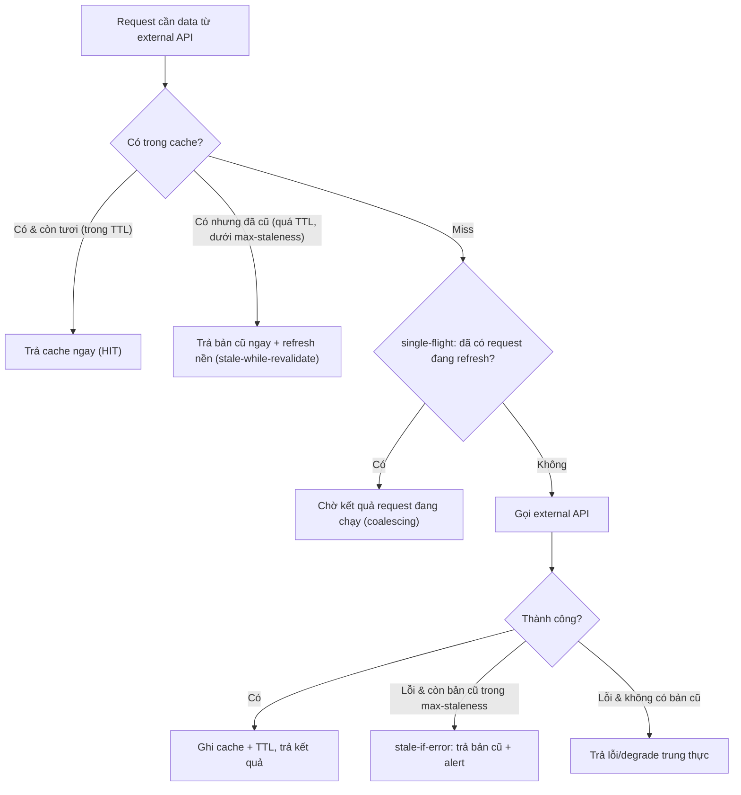

# Có nên cache response từ external API không?

## ⚡ Tóm tắt ngắn (30s)
* **Bản chất**: Cache response external API là **con dao hai lưỡi**. Nó mang lại lợi ích lớn (giảm latency, giảm chi phí gọi API tính tiền theo request, tăng khả năng chịu lỗi khi đối tác down nhờ stale data), nhưng cũng tạo rủi ro **phục vụ dữ liệu cũ/sai** nếu cache nhầm loại dữ liệu. Quyết định **không phải "có hay không" mà là "cache CÁI GÌ, trong BAO LÂU, và xử lý INVALIDATION thế nào"**.
* **Khung quyết định "cache được hay không"**:
  1. **NÊN cache mạnh**: dữ liệu **ít đổi, không nhạy cảm, đọc nhiều** — danh mục sản phẩm, tỉ giá hiển thị, metadata, danh sách quốc gia, cấu hình công khai.
  2. **Cache ngắn / có điều kiện**: dữ liệu đổi vừa phải — tồn kho gần đúng, gợi ý. Dùng TTL ngắn + chấp nhận sai số nhỏ.
  3. **KHÔNG cache (hoặc cực kỳ thận trọng)**: dữ liệu **giao dịch, theo người dùng, nhạy cảm, thay đổi liên tục** — số dư tài khoản, kết quả thanh toán, trạng thái đơn real-time, quyền/authorization.
* **Quyết định Senior**: Cache để **giảm tải + tăng resilience**, nhưng phải gắn **TTL hợp lý, invalidation rõ ràng, và max-staleness** cho từng loại dữ liệu; đặc biệt với fallback dùng stale-cache khi đối tác down, phải kiểm soát "được cũ tới mức nào".

---

## 🔍 Chi tiết bản chất thực chiến: Cache đúng chỗ, đúng cách

### 1. Lợi ích chính của caching external response
* **Latency**: tránh round-trip mạng tới đối tác (vài chục–vài trăm ms mỗi call).
* **Chi phí**: nhiều API tính tiền **theo số request**; cache giảm trực tiếp hóa đơn.
* **Resilience**: khi đối tác **down**, stale cache cho phép **degrade** (xem câu fallback) thay vì sập tính năng.
* **Chống rate limit**: ít gọi hơn → ít chạm `429` hơn.

### 2. Phân loại dữ liệu để quyết định TTL
| Tính chất dữ liệu | Ví dụ | Chiến lược |
| --- | --- | --- |
| Tĩnh/ít đổi, công khai | Danh mục, mã quốc gia | Cache dài (giờ–ngày) |
| Đổi vừa, sai số chấp nhận được | Tỉ giá hiển thị, gợi ý | TTL ngắn (giây–phút) |
| Theo user, nhạy cảm, real-time | Số dư, trạng thái thanh toán | Không cache / TTL rất ngắn + invalidation chủ động |

### 3. Các pattern cache quan trọng
* **TTL (time-to-live)**: đơn giản nhất; chấp nhận dữ liệu cũ tối đa = TTL.
* **Stale-While-Revalidate**: trả ngay bản cache (kể cả hơi cũ) cho user, **đồng thời refresh nền** → vừa nhanh vừa tươi dần. Rất hợp cho read non-critical.
* **Stale-If-Error (fallback)**: khi đối tác lỗi, cho phép phục vụ bản cache cũ **trong giới hạn max-staleness** → tăng resilience.
* **Negative caching**: cache cả kết quả "not found"/lỗi trong thời gian ngắn để tránh dội request vào đối tác đang lỗi (cẩn thận để không cache lỗi quá lâu).

### 4. Invalidation — "thứ khó thứ hai trong khoa học máy tính"
* **TTL-based**: hết hạn tự nhiên. Đơn giản nhưng có cửa sổ cũ.
* **Event-based**: nếu đối tác có webhook báo thay đổi → **chủ động xóa/làm mới** cache khi nhận event → tươi hơn nhiều.
* **Versioned key**: nhúng version/etag vào key để đổi dữ liệu là đổi key, tránh phục vụ nhầm.
* Tránh **thundering herd khi cache hết hạn**: nhiều request cùng miss một lúc và cùng đập vào đối tác → dùng **request coalescing / single-flight** (chỉ một request đi refresh, số còn lại chờ kết quả).

### 5. Cảnh báo về dữ liệu nhạy cảm và per-user
* Cache dữ liệu **theo user** phải **key theo userId/scope**, tránh rò rỉ chéo (user A thấy data user B).
* Không cache thông tin nhạy cảm (token, PII) ở nơi không được mã hóa/kiểm soát; tuân thủ yêu cầu bảo mật/compliance.

### 6. Thiết kế cache key & chống rò rỉ chéo user
* **Scope key đúng**: dữ liệu theo user phải nhúng `userId`/tenant vào key; sai scope → user A đọc nhầm cache của user B (lỗi bảo mật nghiêm trọng).
* **Versioned key / ETag**: nhúng version hoặc dùng `ETag`/`If-None-Match` để "đổi dữ liệu là đổi key", tránh phục vụ nhầm bản cũ.
* **Cache-aside vs write-through**: cache-aside (miss thì nạp) đơn giản và phổ biến nhất cho external read; write-through hợp khi ta cũng kiểm soát việc ghi nguồn.
* **Bảo mật**: không cache PII/token ở store không mã hóa; tuân thủ yêu cầu compliance.

---

## 🎨 Sơ đồ trực quan: Cache với Stale-While-Revalidate và Stale-If-Error

Sơ đồ mô tả luồng cache kết hợp stale-while-revalidate và stale-if-error để vừa nhanh, vừa tươi dần, vừa chịu lỗi khi đối tác down:



---

## 💻 Code thực chiến: BAD vs GOOD

Hai đoạn dưới tương phản trực tiếp cách caching external response:
* **BAD**: cache cả số dư và trạng thái thanh toán real-time → hiển thị dữ liệu sai.
* **GOOD**: chỉ cache read ít đổi, stale-if-error có giới hạn độ cũ, dữ liệu giao dịch luôn lấy nguồn sự thật.

### ❌ BAD: Cache nhầm dữ liệu nhạy cảm, không phân loại
```java
@Cacheable("balance")   // ❌ cache SỐ DƯ tài khoản -> user thấy số dư cũ sau khi đã chi tiêu
public BigDecimal getBalance(String userId) {
    return bankApi.getBalance(userId);
}

@Cacheable("paymentStatus") // ❌ cache trạng thái thanh toán real-time -> hiển thị sai trạng thái
public String getPaymentStatus(String txnId) {
    return paymentApi.getStatus(txnId);
}
```

### ✅ GOOD: Chỉ cache read ít đổi; stale-if-error; không cache giao dịch
```java
// ✅ Dữ liệu ít đổi, công khai -> cache dài
@Cacheable(value = "productCatalog", key = "#categoryId")
public List<Product> catalog(String categoryId) {
    return catalogApi.list(categoryId);
}

// ✅ Tỉ giá hiển thị -> TTL ngắn + fallback stale-if-error khi đối tác down
public BigDecimal displayRate(String pair) {
    Cached<BigDecimal> c = cache.get("fx:" + pair);
    if (c != null && c.isFresh(Duration.ofSeconds(30))) return c.value();    // fresh
    try {
        BigDecimal fresh = fxApi.getRate(pair);
        cache.put("fx:" + pair, fresh);
        return fresh;
    } catch (Exception ex) {
        if (c != null && c.age().compareTo(Duration.ofMinutes(10)) < 0) {     // ✅ stale-if-error có giới hạn
            metrics.inc("fx.stale_served");
            return c.value();
        }
        throw ex; // ✅ quá cũ -> không phục vụ số sai lệch lớn
    }
}

// ✅ Số dư / trạng thái thanh toán -> KHÔNG cache, luôn lấy nguồn sự thật
public BigDecimal balance(String userId) { return bankApi.getBalance(userId); }
```

Chống cache stampede bằng single-flight và đặt trần độ cũ tối đa cho stale-if-error:
```java
// Single-flight: nhiều request cùng miss key nóng -> chỉ MỘT cái gọi external
BigDecimal rate = singleFlight.call("fx:" + pair, () -> fxApi.getRate(pair));

// Stale-if-error có trần độ cũ: quá cũ thì thà báo lỗi còn hơn dùng số sai lệch lớn
Duration MAX_STALE = Duration.ofMinutes(10);
if (cached != null && cached.age().compareTo(MAX_STALE) > 0)
    throw new RateUnavailableException("cache quá cũ, không phục vụ");
```

---

## 📊 Bảng so sánh: nên/không nên cache theo loại dữ liệu

Bảng dưới phân loại từng loại dữ liệu theo tần suất đổi và mức nhạy cảm để quyết định nên hay không nên cache:

| Loại dữ liệu | Tần suất đổi | Nhạy cảm? | Cache? | Chiến lược |
| :--- | :--- | :--- | :--- | :--- |
| Danh mục, metadata, mã quốc gia | Rất thấp | Không | ✅ Mạnh | TTL dài + event invalidation |
| Tỉ giá hiển thị, gợi ý | Vừa | Không | ✅ Có | TTL ngắn + SWR + stale-if-error |
| Tồn kho gần đúng | Vừa–cao | Ít | ⚠️ Ngắn | TTL rất ngắn, chấp nhận sai số |
| Số dư, hạn mức | Cao | Cao | ❌ Hạn chế | Không cache / TTL cực ngắn + invalidation |
| Trạng thái thanh toán real-time | Cao | Cao | ❌ Không | Luôn lấy nguồn sự thật |
| Token/PII | — | Rất cao | ❌ Không (trừ khi mã hóa, đúng compliance) | Tránh |

---

## ⚠️ Common Gotchas & Questions follow-up

### 1. Cạm bẫy "Stale-if-error không giới hạn độ cũ"
* Dùng stale cache khi đối tác down là tốt, nhưng nếu **không đặt max-staleness**, bạn có thể phục vụ tỉ giá của **3 ngày trước** trong khi thị trường đã biến động mạnh → tổn thất thật. Luôn đặt **ngưỡng độ cũ tối đa**; vượt ngưỡng thì thà báo "không khả dụng" còn hơn dùng số sai.

### 2. Cạm bẫy "Cache stampede khi key hết hạn"
* Một key nóng hết hạn đúng lúc traffic cao → hàng nghìn request cùng miss và cùng đập vào đối tác (có thể gây `429` hoặc làm đối tác sập). Dùng **single-flight/request coalescing** hoặc **early/probabilistic refresh** để chỉ một request đi làm mới.

### 3. Câu hỏi đào sâu từ interviewer
* **Interviewer: "Khi nào caching external response từ một lợi ích trở thành một rủi ro nghiêm trọng?"**
* **Trả lời**: Cache trở thành rủi ro khi tôi cache **nhầm loại dữ liệu** — cụ thể là dữ liệu **mang tính giao dịch, theo người dùng, hoặc làm cơ sở cho quyết định nhạy cảm**. Ví dụ kinh điển là cache **số dư tài khoản** hoặc **trạng thái thanh toán real-time**: nếu tôi trả một bản cache cũ, người dùng có thể thấy mình "còn tiền" trong khi thực tế đã chi tiêu hết, hoặc thấy đơn "chưa thanh toán" trong khi đã trả — dẫn tới quyết định sai và lệch sổ. Rủi ro càng nghiêm trọng nếu cache **theo user mà key sai scope**, gây rò rỉ dữ liệu chéo giữa các user — một lỗi bảo mật. Nguyên tắc của tôi là phân loại theo hai trục: **dữ liệu đổi nhanh tới đâu** và **chi phí của việc phục vụ bản cũ lớn tới đâu**. Read ít đổi, không nhạy cảm (danh mục, tỉ giá hiển thị) thì cache mạnh, thậm chí dùng stale-if-error để tăng khả năng chịu lỗi. Còn dữ liệu giao dịch/nhạy cảm thì tôi **lấy thẳng từ nguồn sự thật**, và nếu buộc phải cache thì TTL cực ngắn kèm **invalidation chủ động qua webhook** khi đối tác báo thay đổi. Cache là để giảm tải và tăng resilience cho cái *được phép cũ*, không phải để tăng tốc cái *phải luôn đúng*.
