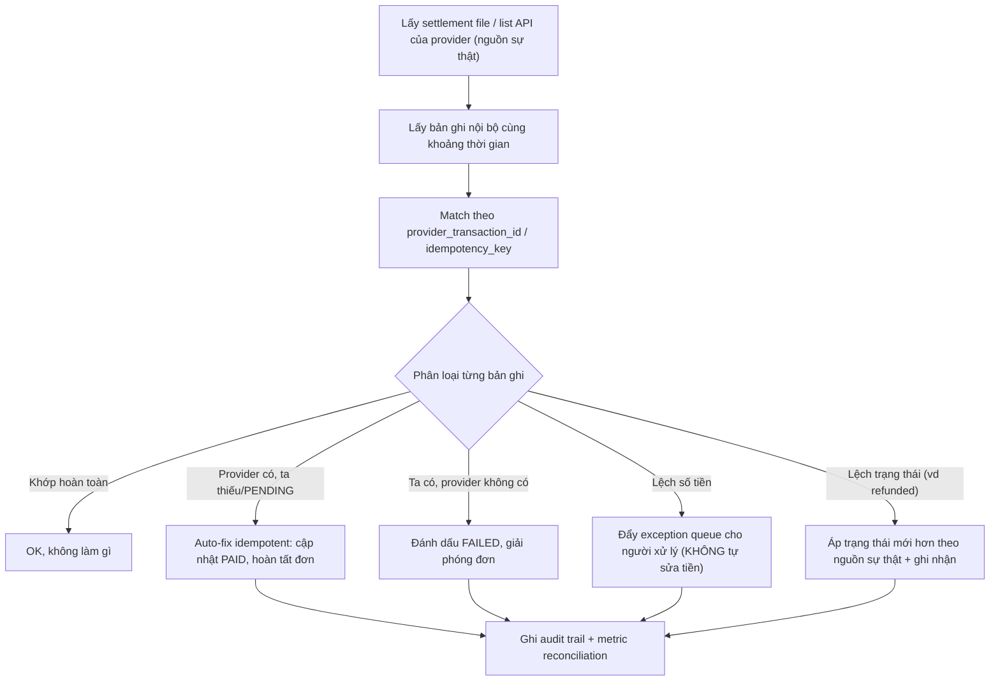

# Làm sao reconcile dữ liệu với external provider?

## ⚡ Tóm tắt ngắn (30s)
* **Bản chất**: Reconciliation (đối soát) là quá trình **định kỳ so khớp dữ liệu của bạn với dữ liệu của provider** để phát hiện và sửa các sai lệch (discrepancy). Đây là **lưới an toàn cuối cùng** của mọi tích hợp thanh toán/giao dịch: dù bạn đã có idempotency, retry, webhook, status query — vẫn **luôn còn** một tỉ lệ nhỏ giao dịch rơi vào trạng thái không khớp (timeout in-doubt, webhook mất, lỗi bất đồng bộ). Reconciliation là cái đảm bảo **sổ sách của bạn cuối cùng luôn khớp với sổ của provider** (eventual consistency về tài chính).
* **Vì sao bắt buộc phải có**: Webhook có thể **mất**, status query có thể **timeout**, hệ thống có thể **crash giữa chừng**. Không có cơ chế nào real-time đảm bảo 100%. Reconciliation chấp nhận "không thể nhất quán tức thì" và **đảm bảo nhất quán cuối cùng** bằng cách đối chiếu nguồn sự thật theo lô.
* **Quyết định Senior**: Lấy **settlement report / API liệt kê giao dịch** của provider làm **nguồn sự thật**, so khớp theo `transaction_id`/`idempotency_key`, phân loại sai lệch (thiếu bên mình / thiếu bên họ / lệch số tiền / lệch trạng thái), **tự động sửa cái sửa được** và **đẩy cái còn lại cho con người xử lý**; mọi thao tác sửa phải **idempotent và có audit trail**.

---

## 🔍 Chi tiết bản chất thực chiến: Quy trình đối soát

### 1. Nguồn dữ liệu để đối soát
* **Settlement/statement file**: nhiều provider (cổng thanh toán, ngân hàng) phát file đối soát cuối ngày (CSV/JSON) liệt kê mọi giao dịch đã chốt + phí. Đây là **nguồn sự thật tài chính** chuẩn nhất.
* **List/Search API**: gọi `GET /transactions?from=...&to=...` để lấy danh sách giao dịch trong khoảng thời gian.
* So sánh với **bản ghi nội bộ** của bạn (bảng `payment_attempt`/`transactions`).

### 2. Khóa đối soát (matching key)
Match theo định danh **ổn định và chung** giữa hai bên: thường là `provider_transaction_id` hoặc chính `idempotency_key` mà bạn đã gửi (nếu provider lưu lại). Tránh match bằng cặp (số tiền + thời gian) vì dễ trùng/nhầm.

### 3. Phân loại sai lệch (discrepancy types)
* **Missing on our side (provider có, ta không có)**: provider đã charge nhưng bản ghi của ta không phản ánh → thường là **webhook mất + status query trượt**. Hành động: cập nhật trạng thái nội bộ thành PAID, hoàn tất nghiệp vụ (idempotent).
* **Missing on their side (ta có PENDING/INITIATED, provider không có)**: lệnh của ta chưa từng tới provider (request fail trước khi tới) → đánh dấu FAILED, giải phóng đơn.
* **Amount mismatch (lệch số tiền)**: phí, làm tròn, đổi đơn vị, hoặc lỗi → cần điều tra, không tự sửa số tiền.
* **Status mismatch (lệch trạng thái)**: ta nói PAID, họ nói REFUNDED (hoặc ngược lại) → áp dụng trạng thái mới hơn theo nguồn sự thật, ghi nhận.

### 4. Tự động vs thủ công
* **Auto-fix** các ca **rõ ràng và an toàn**: ví dụ "provider succeeded, ta đang PENDING" → cập nhật PAID. Phải **idempotent** (chạy lại job không nhân đôi tác động).
* **Manual/exception queue**: các ca **mơ hồ hoặc liên quan tiền lệch** (amount mismatch, lệch lớn) → đẩy vào **hàng đợi ngoại lệ** cho đội vận hành/tài chính xử lý, kèm đầy đủ context.

### 5. Tần suất và phạm vi
* **Real-time/near-real-time**: job quét các `payment_attempt` còn PENDING quá X phút → status query ngay (đã nói ở câu in-doubt).
* **Batch cuối ngày (T+1)**: đối soát toàn bộ với settlement file — bắt các sai lệch còn sót.
* Lưu **kết quả mỗi lần đối soát + audit trail** mọi thao tác sửa để truy vết và kiểm toán.

### 6. Đối soát ba bên & cảnh báo tỉ lệ lệch
* **Three-way reconciliation**: với thanh toán, đối soát không chỉ *ta ↔ gateway* mà còn *gateway ↔ ngân hàng/settlement*. Ba nguồn phải khớp; lệch ở cặp nào chỉ ra đúng mắt xích lỗi.
* **Discrepancy-rate SLO + alert**: theo dõi **tỉ lệ sai lệch** mỗi kỳ đối soát như một chỉ số sức khỏe; alert khi vượt ngưỡng (vd >0.1%) hoặc khi exception queue tăng đột biến.
* **Trend & financial close**: lưu lịch sử đối soát phục vụ kiểm toán và **chốt sổ (financial close)** cuối kỳ; sai lệch tồn đọng phải được giải quyết trước khi chốt.

---

## 🎨 Sơ đồ trực quan: Luồng reconciliation theo lô

Sơ đồ mô tả luồng đối soát theo lô: lấy nguồn sự thật của provider, so khớp, phân loại sai lệch và xử lý tương ứng:



---

## 💻 Code thực chiến: BAD vs GOOD

Hai đoạn dưới tương phản trực tiếp cách đối soát dữ liệu:
* **BAD**: chỉ tin webhook, không đối soát → webhook mất là đơn kẹt PENDING vĩnh viễn.
* **GOOD**: job đối soát so khớp settlement, auto-fix idempotent ca an toàn, đẩy ca lệch tiền cho người xử lý.

### ❌ BAD: Tin webhook là đủ, không đối soát
```java
// ❌ Chỉ cập nhật trạng thái khi nhận webhook, không có lưới an toàn
@PostMapping("/webhook")
public void onWebhook(PaymentEvent e) {
    orderRepo.markPaid(e.getOrderId());
    // ❌ Webhook mất -> đơn kẹt PENDING vĩnh viễn, tiền đã trừ mà không ai phát hiện
}
```

### ✅ GOOD: Job đối soát so khớp settlement, auto-fix an toàn + exception queue
```java
@Component
public class ReconciliationJob {

    @Scheduled(cron = "0 0 2 * * *")   // ✅ chạy T+1 hằng đêm
    public void reconcile(LocalDate day) {
        List<ProviderTxn> theirs = provider.fetchSettlement(day);        // nguồn sự thật
        Map<String, LocalTxn> ours = txnRepo.findByDate(day).stream()
            .collect(toMap(LocalTxn::providerTxnId, identity()));

        for (ProviderTxn t : theirs) {
            LocalTxn o = ours.remove(t.id());
            if (o == null) {
                // ✅ Provider có, ta không -> webhook mất; auto-fix idempotent
                txnRepo.upsertPaidIdempotent(t.id(), t.orderId(), t.amount());
                orderService.fulfilIfNotYet(t.orderId());
            } else if (o.amount().compareTo(t.amount()) != 0) {
                // ✅ Lệch tiền -> KHÔNG tự sửa, đẩy người xử lý
                exceptionQueue.raise("AMOUNT_MISMATCH", t.id(), o.amount(), t.amount());
            } else if (!o.status().equals(t.status())) {
                txnRepo.applyAuthoritativeStatus(t.id(), t.status());     // ✅ theo nguồn sự thật
            }
            audit.record("RECON", t.id(), o, t);                          // ✅ audit trail
        }
        // ✅ Còn sót bên ta mà provider không có -> lệnh chưa tới provider
        ours.values().forEach(o -> { txnRepo.markFailed(o.id()); orderService.release(o.orderId()); });
        metrics.gauge("recon.mismatches", exceptionQueue.size());
    }
}
```

Theo dõi tỉ lệ sai lệch như một SLO và cảnh báo, kèm auto-fix idempotent:
```java
double rate = (double) mismatches / Math.max(1, totalChecked);
metrics.gauge("recon.discrepancy_rate", rate);          // SLO sức khỏe đối soát
if (rate > 0.001) alerting.warn("Tỉ lệ lệch đối soát cao: " + rate); // ✅ alert sớm

// Auto-fix phải idempotent: SET trạng thái tuyệt đối, KHÔNG cộng dồn
txnRepo.upsertPaidIdempotent(t.id(), t.orderId(), t.amount());
```

---

## 📊 Bảng so sánh các loại sai lệch và cách xử lý

Bảng dưới liệt kê từng loại sai lệch kèm nguyên nhân thường gặp và mức độ có thể tự động hóa khi xử lý:

| Loại sai lệch | Nguyên nhân thường gặp | Xử lý | Tự động được? |
| :--- | :--- | :--- | :--- |
| **Provider có, ta thiếu** | Webhook mất, status query trượt | Cập nhật PAID, hoàn tất đơn | ✅ Có (idempotent) |
| **Ta có PENDING, provider không có** | Request fail trước khi tới provider | Đánh dấu FAILED, giải phóng đơn | ✅ Có |
| **Lệch số tiền** | Phí, làm tròn, đổi đơn vị, lỗi | Điều tra thủ công | ❌ Không tự sửa tiền |
| **Lệch trạng thái** | Refund/chargeback đến sau | Áp trạng thái mới hơn theo provider | ⚠️ Có điều kiện |
| **Trùng bên ta** | Double-charge lọt lưới | Hoàn tiền + sửa root cause | ❌ Cần người |

---

## ⚠️ Common Gotchas & Questions follow-up

### 1. Cạm bẫy "Đối soát không idempotent"
* Job reconciliation thường **chạy lại nhiều lần** (retry, chạy tay, trùng lịch). Nếu thao tác sửa không idempotent (vd "cộng tiền vào ví" thay vì "set trạng thái = PAID"), chạy lại sẽ **nhân đôi tác động** → tạo ra chính sai lệch mà nó định sửa. Mọi auto-fix phải idempotent (set trạng thái tuyệt đối, upsert theo khóa).

### 2. Cạm bẫy "Tự động sửa cả ca lệch tiền"
* Lệch số tiền có thể là phí hợp lệ, làm tròn, hoặc dấu hiệu lỗi/gian lận nghiêm trọng. **Không bao giờ để job tự ý điều chỉnh số tiền** — luôn đưa vào exception queue cho con người. Auto-fix chỉ áp dụng cho các ca trạng thái rõ ràng, an toàn.

### 3. Cạm bẫy "Lệch múi giờ / cut-off time"
* Settlement file của provider chốt theo **múi giờ và giờ cut-off của họ** (vd 23:59 UTC), khác với ngày theo giờ địa phương của bạn → một giao dịch "biên ngày" có thể nằm ở file ngày khác, gây báo sai lệch giả. Phải đối chiếu theo **đúng cửa sổ thời gian và timezone của provider**, và xử lý vùng giao biên.

### 4. Câu hỏi đào sâu từ interviewer
* **Interviewer: "Đã có idempotency key, retry, webhook và status query rồi, vì sao vẫn cần reconciliation? Nó có thừa không?"**
* **Trả lời**: Không thừa — reconciliation giải quyết đúng **phần rủi ro còn lại mà các cơ chế real-time không thể đóng kín**. Idempotency key chống double charge, retry xử lý transient, webhook và status query giải phần lớn ca in-doubt — nhưng **không cơ chế nào trong số đó đảm bảo 100%**: webhook có thể **mất hẳn** (provider gửi nhưng không bao giờ tới), status query có thể **timeout đúng lúc đối tác sự cố**, app có thể **crash** ngay giữa lúc cập nhật, hoặc một bug logic làm lệch trạng thái. Đó là bản chất của hệ phân tán trên mạng không tin cậy: ta chỉ đạt được **nhất quán cuối cùng (eventual consistency)**, không phải nhất quán tức thời. Reconciliation chính là cơ chế **hiện thực hóa "eventual"**: nó định kỳ lấy **nguồn sự thật tài chính** (settlement file của provider) và **so khớp toàn bộ** để phát hiện mọi giao dịch đã trôi lệch, rồi sửa hoặc báo người xử lý. Nói cách khác, các cơ chế real-time **giảm tỉ lệ sai lệch xuống rất thấp**, còn reconciliation **đảm bảo tỉ lệ đó cuối cùng về 0** và sổ sách của tôi luôn khớp với ngân hàng. Trong tài chính, đây không phải tính năng "có thì tốt" — nó là **yêu cầu kiểm toán bắt buộc**.
