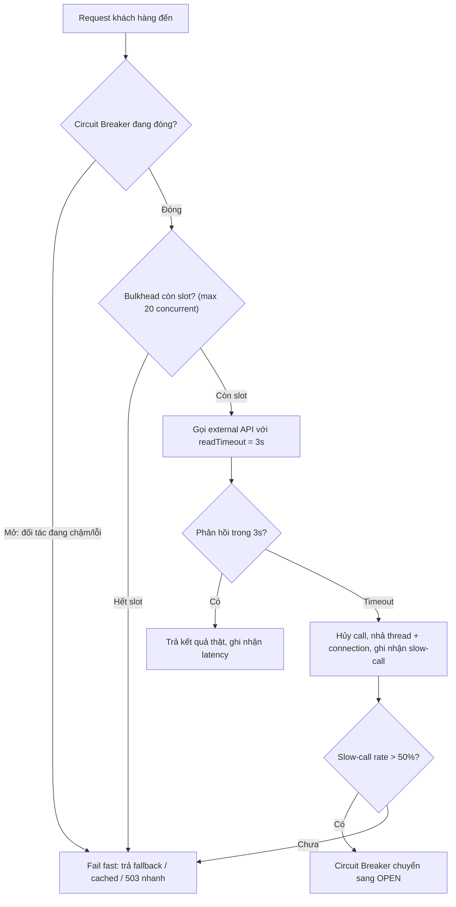

# External API trả response chậm bất thường. Service của bạn nên làm gì?

## ⚡ Tóm tắt ngắn (30s)
* **Bản chất**: Một external API chậm bất thường (latency tăng vọt) là mối nguy **lan truyền (cascading failure)** nguy hiểm hơn cả việc nó chết hẳn. Khi nó **chết hẳn**, bạn fail nhanh. Khi nó **chậm**, mỗi request của bạn giữ một thread + một connection nằm chờ. Dưới tải cao, toàn bộ thread pool / connection pool của bạn bị **cạn kiệt vì ngồi chờ một thằng khác** → service của BẠN sập theo dù code của bạn không có lỗi. Đây là hiện tượng **resource exhaustion do slow dependency**.
* **Thảm họa thực chiến**:
  1. **Thread pool starvation**: API đối tác tăng từ 200ms lên 8s. Tomcat có 200 worker thread, tất cả đều đang `block` chờ response → request mới không có thread phục vụ → **health check fail → cả cluster bị kill rolling**.
  2. **Connection pool cạn**: HTTP client pool 50 connection bị giữ hết bởi các call đang treo → các call khác xếp hàng → timeout dây chuyền.
* **Quyết định Senior**:
  1. **Timeout chặt ở mọi tầng**: `connectTimeout` + `readTimeout` hữu hạn, NEVER để mặc định vô hạn. "Không có timeout" = "chờ mãi mãi".
  2. **Circuit Breaker + Bulkhead (Resilience4j)**: Cách ly lời gọi dependency vào một pool riêng (bulkhead) để slow dependency không nuốt thread của nghiệp vụ khác; circuit breaker ngắt mạch khi slow rate vượt ngưỡng.
  3. **Fail fast + Fallback/Degrade**: Khi vượt timeout/ngắt mạch → trả về nhanh (cached value, giá trị mặc định, hoặc xếp vào hàng đợi async) thay vì để khách chờ.

---

## 🔍 Chi tiết bản chất thực chiến: Vì sao "chậm" nguy hiểm hơn "chết"

### 1. Cơ chế cạn kiệt tài nguyên (Little's Law)
Theo **Định luật Little**, số request đồng thời nằm trong hệ thống:
$$L = \lambda \times W$$
trong đó $\lambda$ là tốc độ request đến (req/s) và $W$ là thời gian xử lý mỗi request (s). Nếu external API khiến $W$ tăng từ `0.2s` lên `8s` (gấp 40 lần) trong khi $\lambda$ không đổi ở `50 req/s`, thì số request đồng thời cần phục vụ nhảy từ $L = 50 \times 0.2 = 10$ lên $L = 50 \times 8 = 400$. Nếu thread pool chỉ có 200, hệ thống **vỡ trận** — hàng đợi phình vô hạn, latency tiến tới vô cực, OOM.

### 2. Tách biệt connectTimeout và readTimeout
* **connectTimeout**: thời gian tối đa để thiết lập kết nối TCP. Đặt ngắn (1–2s) vì nếu không bắt tay được nhanh thì thường là mạng/đối tác có vấn đề.
* **readTimeout**: thời gian tối đa chờ dữ liệu sau khi đã gửi request. Đây là cái cứu bạn khỏi slow response — đặt theo P99 thực tế của đối tác cộng biên (ví dụ P99 = 1.5s → set 3s).
* **Tổng timeout cho cả retry**: nếu có retry, tổng thời gian = `(readTimeout + backoff) × số lần`. Phải đảm bảo nó nhỏ hơn timeout của tầng gọi bạn, nếu không bạn lại làm tầng trên timeout.

### 3. Bulkhead — vách ngăn khoang tàu
Như khoang kín trên tàu thủy: thủng một khoang không làm chìm cả tàu. Dùng `@Bulkhead` của Resilience4j giới hạn số lời gọi đồng thời tới một dependency cụ thể (ví dụ tối đa 20 concurrent calls). Khi slow dependency làm đầy 20 slot này, các call mới tới nó bị **từ chối ngay (fail fast)**, nhưng thread phục vụ các nghiệp vụ KHÁC vẫn còn nguyên → cô lập thiệt hại.

### 4. Circuit Breaker nhạy với latency, không chỉ với lỗi
Cấu hình circuit breaker tính cả **slow call rate**: ví dụ "nếu >50% call vượt 2s trong cửa sổ 20 call gần nhất → mở mạch". Khi mạch mở, mọi call tới đối tác bị reject tức thì trong `waitDurationInOpenState` (ví dụ 10s), cho đối tác thời gian hồi phục và cho service của bạn ngừng chảy máu tài nguyên.

### 5. Load shedding & adaptive concurrency
Khi dependency xuống cấp, ngoài việc cô lập, ta còn chủ động **giảm tải (load shedding)**:
* **Ưu tiên (priority)**: từ chối sớm các request không quan trọng để dành tài nguyên cho luồng cốt lõi.
* **Adaptive concurrency limit**: tự động siết số call đồng thời khi latency tăng (cơ chế giống TCP congestion control) thay vì để hàng đợi phình vô hạn.
* **Hedged request (thận trọng)**: với read **idempotent**, nếu call đầu vượt P95, gửi thêm một call song song và lấy cái về trước để giảm đuôi latency. TUYỆT ĐỐI không hedged cho write (sẽ nhân đôi tác động).

---

## 🎨 Sơ đồ trực quan: Slow dependency làm cạn thread pool và cách Bulkhead cô lập

Sơ đồ mô tả cách timeout, circuit breaker và bulkhead phối hợp chặn một slow dependency trước khi nó kịp nuốt cạn thread pool của service:



---

## 💻 Code thực chiến: BAD vs GOOD

Hai đoạn dưới tương phản trực tiếp cách chống slow dependency:
* **BAD**: `RestTemplate` không timeout, dùng chung pool → một đối tác treo kéo sập cả service.
* **GOOD**: timeout chặt + `TimeLimiter` + `CircuitBreaker` + `Bulkhead` + fallback degrade.

### ❌ BAD: RestTemplate không timeout, không cách ly
```java
@Service
public class PricingService {
    private final RestTemplate restTemplate = new RestTemplate(); // ❌ timeout mặc định = vô hạn

    public BigDecimal getRate(String pair) {
        // ❌ Nếu đối tác treo, thread này chờ MÃI MÃI, giữ luôn worker thread của Tomcat
        return restTemplate.getForObject("https://fx.partner.com/rate/" + pair, BigDecimal.class);
    }
}
```

### ✅ GOOD: Timeout + TimeLimiter + CircuitBreaker + Bulkhead + Fallback
```java
@Service
public class PricingService {

    private final RestClient client = RestClient.builder()
        .requestFactory(clientHttpRequestFactory()) // connectTimeout 1s, readTimeout 3s
        .baseUrl("https://fx.partner.com")
        .build();

    @CircuitBreaker(name = "fxApi", fallbackMethod = "rateFallback")
    @Bulkhead(name = "fxApi")            // ✅ giới hạn concurrent calls tới đối tác
    @TimeLimiter(name = "fxApi")         // ✅ chặn cứng thời gian xử lý
    public CompletableFuture<BigDecimal> getRate(String pair) {
        return CompletableFuture.supplyAsync(() ->
            client.get().uri("/rate/{p}", pair).retrieve().body(BigDecimal.class));
    }

    // ✅ Khi chậm/ngắt mạch -> trả tỉ giá cache gần nhất, KHÔNG để khách chờ 8s
    private CompletableFuture<BigDecimal> rateFallback(String pair, Throwable ex) {
        log.warn("fxApi degraded ({}), dùng cached rate", ex.toString());
        return CompletableFuture.completedFuture(cache.lastKnownRate(pair));
    }
}
```
```yaml
resilience4j:
  circuitbreaker.instances.fxApi:
    slidingWindowSize: 20
    slowCallRateThreshold: 50        # ✅ >50% call chậm -> mở mạch
    slowCallDurationThreshold: 2s    # ✅ call >2s tính là "chậm"
    failureRateThreshold: 50
    waitDurationInOpenState: 10s
  bulkhead.instances.fxApi:
    maxConcurrentCalls: 20           # ✅ vách ngăn khoang tàu
  timelimiter.instances.fxApi:
    timeoutDuration: 3s
```

Cấu hình factory timeout cụ thể cho RestClient — nền móng chống slow trước cả circuit breaker:
```java
ClientHttpRequestFactory clientHttpRequestFactory() {
    var f = new SimpleClientHttpRequestFactory();
    f.setConnectTimeout(1000);  // ✅ bắt tay TCP tối đa 1s
    f.setReadTimeout(3000);     // ✅ chờ dữ liệu tối đa 3s (theo P99 + biên)
    return f;
}
```

---

## 📊 Bảng so sánh các lá chắn chống slow dependency

Bốn cơ chế dưới đây không thay thế nhau mà xếp lớp; bảng so sánh theo loại thiệt hại mà mỗi lớp ngăn chặn:

| Cơ chế | Bảo vệ khỏi điều gì | Khi nào kích hoạt | Hệ quả khi kích hoạt |
| :--- | :--- | :--- | :--- |
| **Timeout (read/connect)** | Một call treo vô hạn | Vượt ngưỡng giây cấu hình | Hủy call đó, nhả tài nguyên |
| **Bulkhead** | Một dependency nuốt hết thread pool | Vượt số concurrent calls | Reject call mới tới dependency đó |
| **Circuit Breaker** | Liên tục gọi vào thằng đang chết/chậm | Slow/failure rate vượt ngưỡng | Mở mạch, fail fast trong N giây |
| **Fallback / Degrade** | Khách phải chờ / thấy lỗi | Khi 3 cơ chế trên chặn call | Trả cached/default/async value |

---

## ⚠️ Common Gotchas & Questions follow-up

### 1. Cạm bẫy "Có circuit breaker nhưng quên timeout"
* Circuit breaker chỉ mở **sau khi** đã có đủ call chậm/lỗi để thống kê. Nếu mỗi call lại treo vô hạn (không timeout), thread bị giữ trước cả khi breaker kịp mở → vẫn cạn pool. **Timeout là nền móng, circuit breaker là lớp trên** — thiếu timeout thì breaker gần như vô dụng.

### 2. Cạm bẫy "Retry làm trầm trọng thêm slow"
* Khi đối tác đang quá tải, việc retry tự động **đổ thêm dầu vào lửa** (retry storm). Phải kết hợp retry với circuit breaker và **không retry khi mạch đang mở**; ưu tiên fail fast.

### 3. Câu hỏi đào sâu từ interviewer
* **Interviewer: "Tại sao một dependency CHẬM lại nguy hiểm hơn một dependency CHẾT HẲN đối với service của bạn?"**
* **Trả lời**: Khi dependency **chết hẳn** (connection refused), call của tôi **fail tức thì** — thread được nhả về pool ngay lập tức, tài nguyên không bị giữ, tôi fail fast và chuyển sang fallback. Nhưng khi nó **chậm**, mỗi call trở thành một thread + connection **bị giam giữ trong nhiều giây**. Theo Little's Law, số request đồng thời trong hệ thống bùng nổ tỉ lệ thuận với thời gian chờ, làm cạn kiệt thread pool và connection pool. Kết quả là **lỗi của họ biến thành sự sập đổ của tôi** dù code tôi đúng. Vì vậy tôi luôn coi "slow" là kịch bản thiết kế chính: timeout chặt để biến "slow" thành "fast-fail", rồi bulkhead + circuit breaker để cô lập và ngắt mạch trước khi nó lan ra toàn hệ thống.
