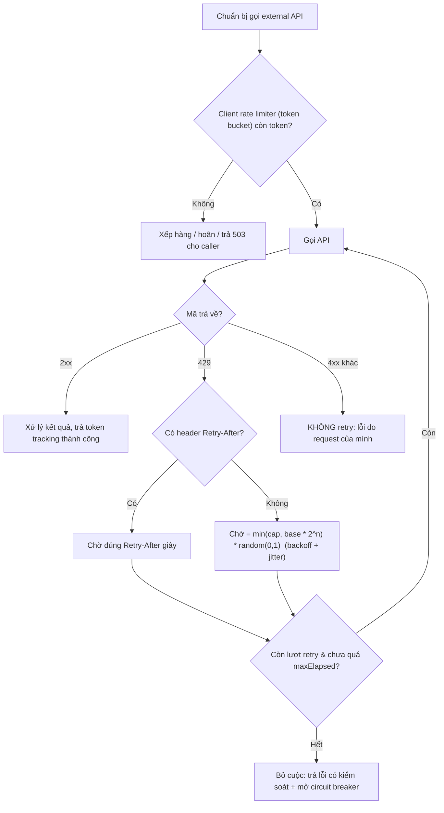

# External API trả lỗi 429 rate limit. Bạn xử lý ra sao?

## ⚡ Tóm tắt ngắn (30s)
* **Bản chất**: `HTTP 429 Too Many Requests` là tín hiệu **backpressure** từ đối tác: "bạn đang gọi quá hạn ngạch (quota) cho phép, hãy chậm lại". Đây KHÔNG phải lỗi của đối tác mà là **giao kèo (contract)** bạn phải tôn trọng. Xử lý sai 429 (retry ngay lập tức, dồn dập) sẽ khiến bạn bị **block lâu hơn, thậm chí bị ban API key**.
* **Thảm họa thực chiến**:
  1. **Retry storm tự khuếch đại**: Gặp 429, dev retry ngay tức thì 3 lần → mỗi instance × N instance × 3 retry = bão request → đối tác siết quota chặt hơn → toàn bộ tính năng phụ thuộc API chết cứng.
  2. **Bỏ qua `Retry-After`**: Đối tác đã nói rõ "chờ 30s" trong header `Retry-After`, nhưng client tự retry sau 1s → tiếp tục bị 429 vô hạn.
* **Quyết định Senior**:
  1. **Tôn trọng `Retry-After`**: Đọc header `Retry-After` (giây hoặc HTTP-date) và chờ ĐÚNG khoảng đó trước khi thử lại. Đây là chỉ dẫn ưu tiên cao nhất.
  2. **Exponential Backoff + Jitter**: Nếu không có `Retry-After`, lùi theo cấp số nhân kèm nhiễu ngẫu nhiên để tránh **thundering herd** (nhiều client retry đồng pha).
  3. **Client-side Rate Limiter chủ động**: Đặt một bộ giới hạn (token bucket) NGAY phía mình để không bao giờ vượt quota của đối tác → phòng bệnh hơn chữa bệnh. Kết hợp circuit breaker và hàng đợi để san tải.

---

## 🔍 Chi tiết bản chất thực chiến: Tôn trọng quota và chống retry storm

### 1. 429 khác hẳn 5xx — phải xử lý riêng
* **5xx (500, 502, 503)**: lỗi phía server đối tác → retry với backoff thường hợp lý.
* **429**: bạn bị giới hạn → retry **phải có kỷ luật**, ưu tiên đọc `Retry-After`. Retry vô kỷ luật với 429 chỉ làm tình hình tệ hơn.
* **4xx khác (400, 401, 403)**: lỗi do request của bạn → **KHÔNG retry**, retry vô nghĩa.

### 2. Đọc và tôn trọng header `Retry-After`
Đối tác có thể trả `Retry-After` ở 2 dạng:
* Số giây: `Retry-After: 30` → chờ 30 giây.
* HTTP-date: `Retry-After: Wed, 21 Oct 2025 07:28:00 GMT` → chờ tới mốc đó.

Đây là "lời nói thẳng" của đối tác, luôn ưu tiên hơn công thức backoff tự tính.

### 3. Exponential Backoff + Full Jitter
Khi không có `Retry-After`, công thức thời gian chờ cho lần thử thứ $n$:
$$delay_n = \min(cap,\ base \times 2^{n}) \times random(0, 1)$$
* `base` (ví dụ 200ms), `cap` (ví dụ 20s) chặn trên để không chờ quá lâu.
* **Jitter** (nhân với một số ngẫu nhiên) là phần **bắt buộc**: nếu 1000 client cùng gặp 429 và cùng chờ đúng `2^n` giây rồi cùng retry một lúc → tạo ra **đợt sóng đồng pha** đập vào đối tác. Jitter rải các lần retry ra ngẫu nhiên, phá vỡ sự đồng pha đó.

### 4. Client-side Rate Limiter — phòng bệnh
Thay vì để bị 429 rồi mới chữa, đặt một **token bucket** phía mình khớp với quota đối tác (ví dụ đối tác cho 100 req/s → ta tự giới hạn 90 req/s, chừa biên). Request vượt mức được **xếp hàng** hoặc từ chối sớm. Trong môi trường nhiều instance, rate limit phải **tập trung** (Redis) để tổng tải toàn cluster không vượt quota chung.

### 5. Đọc header quota để điều tiết CHỦ ĐỘNG (đừng đợi bị 429)
Nhiều provider trả các header cho biết hạn ngạch còn lại:
* `X-RateLimit-Limit`, `X-RateLimit-Remaining`, `X-RateLimit-Reset` (hoặc tương đương).
* Khi `Remaining` về thấp, **chủ động giãn nhịp (throttle)** trước khi chạm 0 — phòng bệnh thay vì chữa bệnh.
* Trong cụm nhiều instance, tổng hợp hạn ngạch qua một bộ điều tiết **tập trung (Redis)** để cả cluster cùng tôn trọng một quota chung, tránh tình trạng mỗi instance tưởng còn quota nhưng tổng đã vượt.

---

## 🎨 Sơ đồ trực quan: Luồng xử lý 429 với Retry-After và Backoff+Jitter

Sơ đồ thể hiện trình tự ưu tiên khi xử lý 429: rate limiter chủ động chặn trước, rồi tôn trọng `Retry-After`, cuối cùng mới tới backoff kèm jitter:



---

## 💻 Code thực chiến: BAD vs GOOD

Hai đoạn dưới tương phản trực tiếp cách phản ứng với 429:
* **BAD**: gặp 429 retry tức thì, bỏ qua `Retry-After` → retry storm, càng bị siết.
* **GOOD**: tôn trọng `Retry-After`, fallback backoff+jitter, có rate limiter chặn chủ động.

### ❌ BAD: Gặp 429 retry ngay lập tức, bỏ qua Retry-After
```java
public String call() {
    for (int i = 0; i < 5; i++) {
        ResponseEntity<String> res = restTemplate.getForEntity(url, String.class);
        if (res.getStatusCode() == HttpStatus.TOO_MANY_REQUESTS) {
            // ❌ Retry tức thì, không chờ, không jitter -> retry storm, càng bị siết
            continue;
        }
        return res.getBody();
    }
    throw new RuntimeException("failed");
}
```

### ✅ GOOD: Tôn trọng Retry-After + backoff jitter + rate limiter chủ động
```java
@Service
public class PartnerClient {

    private final RateLimiter limiter; // Resilience4j: chủ động không vượt quota đối tác
    private final RestClient client;

    public String call(String path) {
        long base = 200, cap = 20_000;
        for (int attempt = 0; attempt < 5; attempt++) {
            limiter.acquirePermission(); // ✅ chặn chủ động trước khi gọi
            try {
                return client.get().uri(path).retrieve().body(String.class);
            } catch (HttpClientErrorException.TooManyRequests e) {
                // ✅ Ưu tiên Retry-After do đối tác chỉ định
                long waitMs = e.getResponseHeaders().containsKey("Retry-After")
                    ? Long.parseLong(e.getResponseHeaders().getFirst("Retry-After")) * 1000
                    // ✅ fallback: exponential backoff + full jitter
                    : (long) (Math.min(cap, base * Math.pow(2, attempt)) * ThreadLocalRandom.current().nextDouble());
                sleep(waitMs);
            } catch (HttpClientErrorException e) {
                throw e; // ✅ 4xx khác -> không retry
            }
        }
        throw new PartnerUnavailableException("429 sau nhiều lần thử");
    }
}
```

Rate limiter tập trung (Redis) để cả cluster cùng tôn trọng một quota chung, không vượt khi scale out:
```java
// Token bucket dùng Redis: INCR theo cửa sổ giây, chia hạn ngạch cho TOÀN cluster
boolean tryAcquire(String partner, int perSec) {
    String key = "rl:" + partner + ":" + Instant.now().getEpochSecond();
    Long n = redis.opsForValue().increment(key);
    if (n != null && n == 1L) redis.expire(key, Duration.ofSeconds(2));
    return n != null && n <= perSec;   // vượt -> hoãn / từ chối sớm
}
```

---

## 📊 Bảng so sánh chiến lược phản ứng với 429

Bảng dưới xếp hạng các chiến lược phản ứng với 429 theo mức độ tôn trọng quota và khả năng chống thundering herd:

| Chiến lược | Tôn trọng quota đối tác | Chống thundering herd | Phòng ngừa chủ động | Đánh giá |
| :--- | :--- | :--- | :--- | :--- |
| **Retry tức thì, không chờ** | Không | Không | Không | ❌ Làm tệ hơn, dễ bị ban |
| **Fixed delay retry** | Một phần | Không (đồng pha) | Không | ⚠️ Vẫn tạo sóng đồng pha |
| **Backoff + Jitter** | Có | **Có** | Không | ✅ Tốt cho phản ứng |
| **Client Rate Limiter + Backoff + Jitter** | Có | Có | **Có** | ✅✅ Chuẩn production |

---

## ⚠️ Common Gotchas & Questions follow-up

### 1. Cạm bẫy "Rate limit cục bộ trong cụm nhiều instance"
* **Vấn đề**: Mỗi instance tự giới hạn 90 req/s, nhưng có 10 instance → tổng 900 req/s đập vào đối tác chỉ cho phép 100 req/s → vẫn 429 ngập mặt.
* **Giải pháp**: Rate limiter phải **tập trung** (distributed) qua Redis, chia hạn ngạch chung cho toàn cluster, hoặc đặt một egress gateway/proxy duy nhất làm điểm kiểm soát quota.

### 2. Cạm bẫy "Coi 429 như 5xx và đếm vào circuit breaker failure"
* 429 không có nghĩa đối tác "hỏng" — họ vẫn khỏe, chỉ là bạn gọi nhiều. Nếu để 429 làm mở circuit breaker theo `failureRate`, bạn có thể ngắt mạch sai. Nên xử lý 429 bằng **rate limiter/backoff** riêng, và cân nhắc kỹ trước khi để nó kích hoạt breaker.

### 3. Câu hỏi đào sâu từ interviewer
* **Interviewer: "Vì sao jitter lại quan trọng đến mức bắt buộc trong backoff? Không có nó thì sao?"**
* **Trả lời**: Nếu không có jitter, mọi client gặp 429 tại cùng thời điểm sẽ tính ra **cùng một khoảng chờ** ($base \times 2^n$) và do đó cùng thức dậy retry **đúng cùng một mili-giây**. Điều này tạo ra các **đợt sóng đồng pha (synchronized retries / thundering herd)** đập vào đối tác theo nhịp, khiến họ liên tục quá tải và liên tục trả 429 — hệ thống rơi vào dao động không hồi phục. Jitter (nhân khoảng chờ với một hệ số ngẫu nhiên) **rải các lần retry ra đều trên trục thời gian**, phá vỡ sự đồng pha, làm phẳng đỉnh tải và cho đối tác cơ hội tiêu hóa dần. Đây là lý do AWS khuyến nghị **"full jitter"** như mặc định cho mọi cơ chế retry.
