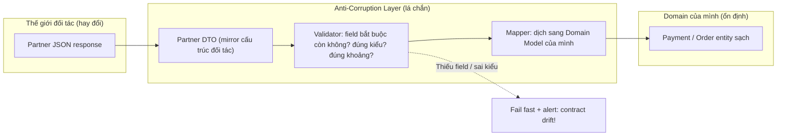

# API provider thay đổi contract không báo trước. Bạn phòng tránh thế nào?

## ⚡ Tóm tắt ngắn (30s)
* **Bản chất**: Đây là rủi ro **"breaking change ngầm" (silent contract drift)**: đối tác đổi tên field, đổi kiểu dữ liệu, bỏ field, đổi enum, đổi format ngày... mà không thông báo. Code của bạn **biên dịch vẫn xanh** nhưng **runtime vỡ trận** vì parse sai, NPE, hoặc tệ hơn là **âm thầm hiểu sai dữ liệu** (ví dụ đổi đơn vị tiền từ đồng sang xu). Bản chất phòng tránh là **không tin tưởng mù quáng (defensive integration)** và **phát hiện sớm thay vì để khách hàng phát hiện hộ**.
* **Thảm họa thực chiến**:
  1. **Strict deserialization làm sập toàn bộ**: Jackson cấu hình `FAIL_ON_UNKNOWN_PROPERTIES=true`; đối tác thêm 1 field mới → mọi response parse fail → tính năng chết hàng loạt dù field mới đó bạn không dùng.
  2. **Đổi đơn vị ngầm**: Đối tác đổi `amount` từ VND sang cent mà không báo → hệ thống tính sai gấp 100 lần, lệch sổ tiền thật.
* **Quyết định Senior**:
  1. **Anti-Corruption Layer (ACL)**: Không để DTO của đối tác rò rỉ vào domain. Có một lớp dịch (mapper) cô lập, mọi thay đổi của đối tác chỉ ảnh hưởng một chỗ duy nhất.
  2. **Tolerant Reader + Schema Validation**: Đọc khoan dung (bỏ qua field lạ) nhưng **validate nghiêm ngặt các field bắt buộc** mình thực sự dùng; fail rõ ràng khi field thiết yếu biến mất.
  3. **Contract Test + Version pinning + Monitoring**: Chạy contract test (Pact) định kỳ với sandbox của đối tác, ghim API version, và giám sát tỉ lệ parse-error/giá trị bất thường để báo động sớm.

---

## 🔍 Chi tiết bản chất thực chiến: Defensive Integration nhiều lớp

### 1. Anti-Corruption Layer (ACL) — biên giới chống lây nhiễm
Khái niệm từ DDD: dựng một **lớp dịch** giữa "thế giới bên ngoài" (DTO của đối tác) và "thế giới của mình" (domain model). Domain của bạn KHÔNG bao giờ import trực tiếp class JSON của đối tác. Lợi ích: khi đối tác đổi `customer_name` → `customerFullName`, bạn chỉ sửa **một dòng trong mapper**, toàn bộ business logic không hề hay biết.

### 2. Tolerant Reader Pattern — đọc khoan dung
Nguyên tắc của Postel: *"hãy bảo thủ với cái mình gửi, khoan dung với cái mình nhận"*.
* **Khoan dung với field thừa**: cấu hình `FAIL_ON_UNKNOWN_PROPERTIES=false` để đối tác thêm field mới không làm sập bạn.
* **Nghiêm khắc với field thiếu**: validate rằng các field **bạn thực sự phụ thuộc** vẫn tồn tại và đúng kiểu; nếu mất → fail nhanh, rõ ràng, có cảnh báo — chứ không âm thầm gán `null`.

### 3. Phân biệt "thêm field" (tương thích) và "đổi/xóa field" (phá vỡ)
* **An toàn (backward compatible)**: thêm field mới, thêm giá trị enum mới (nếu bạn xử lý default).
* **Phá vỡ (breaking)**: đổi tên/xóa field, đổi kiểu (`string`→`number`), đổi đơn vị/format, đổi nghĩa enum cũ. Những cái này contract test phải bắt được.

### 4. Lưới phát hiện sớm
* **Contract Testing (Pact / Spring Cloud Contract)**: định nghĩa kỳ vọng về response của đối tác; chạy CI hằng ngày với mock/sandbox để phát hiện drift trước khi lên production.
* **Schema pinning & versioning**: dùng endpoint có version (`/v2/...`), ghim version, theo dõi changelog của đối tác.
* **Monitoring giá trị bất thường**: alert khi tỉ lệ `deserialization error` tăng, hoặc khi giá trị vượt khoảng hợp lý (ví dụ `amount` đột nhiên nhỏ đi 100 lần → nghi đổi đơn vị).

### 5. Consumer-Driven Contract Test & rollout an toàn
* **Pact / Spring Cloud Contract**: bên tiêu thụ (bạn) định nghĩa kỳ vọng về response; chạy CI hằng ngày đối chiếu với provider stub để **bắt drift trước khi lên production**.
* **Schema registry / versioned endpoint**: ghim version (`/v2`), theo dõi changelog; ưu tiên provider hỗ trợ versioning rõ ràng và có chính sách deprecation.
* **Canary phát hiện thay đổi**: cho một tỉ lệ nhỏ traffic chạy qua tích hợp mới kèm giám sát parse-error/giá trị bất thường; nếu lệch → tự rollback hoặc tắt qua feature-flag.

---

## 🎨 Sơ đồ trực quan: Anti-Corruption Layer cô lập thay đổi của đối tác

Sơ đồ minh họa Anti-Corruption Layer đứng giữa, hấp thụ và kiểm chứng mọi thay đổi của đối tác trước khi dữ liệu chạm vào domain ổn định của mình:



---

## 💻 Code thực chiến: BAD vs GOOD

Hai đoạn dưới tương phản trực tiếp cách tích hợp external API:
* **BAD**: map thẳng JSON đối tác vào domain + strict parsing → thêm field là sập, đổi đơn vị là tính sai.
* **GOOD**: DTO riêng tolerant với field lạ, validate nghiêm field thiết yếu, đơn vị tường minh.

### ❌ BAD: Map thẳng JSON đối tác vào domain, strict parsing
```java
// ❌ Dùng thẳng class này khắp nơi trong business logic
public class PartnerOrder {
    public long amount;       // ❌ không biết đơn vị; đối tác đổi sang cent là toang
    public String status;     // ❌ map thẳng enum đối tác vào domain
}

@Configuration
class JacksonCfg {
    // ❌ Thêm 1 field lạ từ đối tác -> parse fail toàn bộ
    ObjectMapper om = new ObjectMapper()
        .configure(DeserializationFeature.FAIL_ON_UNKNOWN_PROPERTIES, true);
}
```

### ✅ GOOD: ACL + tolerant reader + validate field thiết yếu
```java
// ✅ DTO chỉ sống trong tầng integration, tolerant với field lạ
@JsonIgnoreProperties(ignoreUnknown = true)
record PartnerOrderDto(
    @JsonProperty("amount_minor") Long amountMinor,   // ✅ tên rõ đơn vị (minor unit = xu)
    @JsonProperty("currency") String currency,
    @JsonProperty("status") String status) {}

@Component
public class PartnerOrderMapper {
    private static final Set<String> KNOWN = Set.of("CREATED", "PAID", "CANCELLED");

    public Order toDomain(PartnerOrderDto dto) {
        // ✅ Validate nghiêm các field MÌNH PHỤ THUỘC
        if (dto.amountMinor() == null || dto.currency() == null)
            throw new ContractDriftException("Thiếu field thiết yếu: amount/currency");
        if (!KNOWN.contains(dto.status()))
            // ✅ Enum lạ -> không đoán bừa, báo động để con người xem xét
            alerting.warn("Status lạ từ đối tác: " + dto.status());

        Money money = Money.ofMinor(dto.amountMinor(), dto.currency()); // ✅ đơn vị tường minh
        return new Order(money, mapStatus(dto.status()));
    }
}
```

Contract test (consumer-driven) bắt drift trước khi lên production:
```java
@Test  // Spring Cloud Contract / Pact: cố định kỳ vọng về response đối tác
void partnerOrder_contract() {
    var dto = client.getOrder("ord-1");          // gọi stub theo contract
    assertThat(dto.amountMinor()).isNotNull();   // field thiết yếu phải còn
    assertThat(dto.currency()).isNotNull();
    // Nếu provider đổi tên / bỏ field -> test đỏ ngay trong CI, không đợi khách báo
}
```

---

## 📊 Bảng so sánh chiến lược tích hợp external API

Bảng dưới đối chiếu hai cách tích hợp khi đối tác âm thầm đổi contract, theo từng kịch bản thay đổi cụ thể:

| Tiêu chí | Map thẳng + strict parse | Anti-Corruption Layer + Tolerant Reader |
| :--- | :--- | :--- |
| **Đối tác thêm field mới** | ❌ Parse fail, sập tính năng | ✅ Bỏ qua an toàn |
| **Đối tác đổi tên field dùng** | ❌ NPE rải rác khắp code | ✅ Sửa 1 chỗ trong mapper, fail rõ ràng |
| **Đối tác đổi đơn vị ngầm** | ❌ Tính sai âm thầm | ✅ Đơn vị tường minh + alert khoảng bất thường |
| **Phạm vi ảnh hưởng thay đổi** | Toàn codebase | Cô lập trong tầng ACL |
| **Phát hiện sớm** | Khi khách báo lỗi | Contract test + monitoring bắt trước |

---

## ⚠️ Common Gotchas & Questions follow-up

### 1. Cạm bẫy "Tolerant Reader quá khoan dung thành nuốt lỗi"
* Khoan dung với field **thừa** là tốt, nhưng nếu cũng "khoan dung" luôn với field **thiếu** (âm thầm gán `null`/`0`), bạn sẽ xử lý dữ liệu rác mà không hề biết. Nguyên tắc: **khoan dung cái mình không dùng, nghiêm khắc cái mình phụ thuộc**.

### 2. Cạm bẫy "Tin sandbox giống production"
* Đối tác có thể deploy thay đổi lên production trước sandbox (hoặc ngược lại). Contract test trên sandbox không bảo chứng 100%. Vì vậy vẫn cần monitoring giá trị bất thường ở production làm lưới cuối.

### 3. Câu hỏi đào sâu từ interviewer
* **Interviewer: "Loại thay đổi contract nào nguy hiểm hơn: một thay đổi làm code crash, hay một thay đổi không làm crash?"**
* **Trả lời**: Thay đổi **không làm crash mới đáng sợ hơn nhiều**. Khi đối tác đổi tên field và code tôi ném NPE, tôi **biết ngay lập tức** — lỗi to, rõ, có stack trace, tôi sửa trong vài phút. Nhưng khi đối tác **đổi đơn vị tiền từ VND sang xu** hoặc **đổi nghĩa một enum cũ**, code tôi vẫn chạy "thành công", chỉ là nó **âm thầm hiểu sai** và ghi dữ liệu sai vào DB suốt nhiều ngày trước khi ai đó phát hiện sổ sách lệch. Đây là lý do tôi không chỉ dựa vào việc "code có chạy không", mà còn dựng **validation theo miền giá trị hợp lý** (range/semantic validation) và **monitoring số liệu nghiệp vụ** (ví dụ doanh thu trung bình/đơn) để bắt những thay đổi *im lặng* mà parser không thể bắt.
