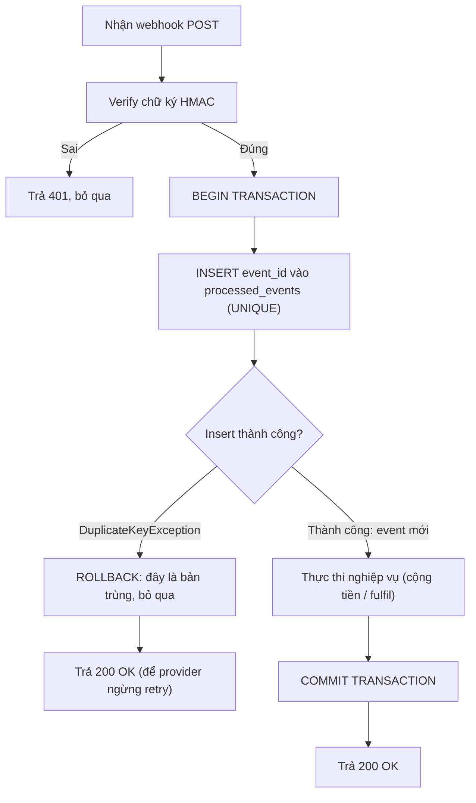

# Webhook từ third-party gửi duplicate event. Bạn xử lý thế nào?

## ⚡ Tóm tắt ngắn (30s)
* **Bản chất**: Hầu hết các nhà cung cấp webhook (Stripe, PayPal, GitHub...) cam kết **"at-least-once delivery"** chứ KHÔNG phải exactly-once. Nghĩa là họ **sẽ gửi trùng** event trong các tình huống: response của bạn về chậm/timeout nên họ retry, network glitch, hoặc họ deploy lại. Đây là **hành vi đúng theo thiết kế**, không phải bug. Trách nhiệm khử trùng lặp (deduplication) thuộc về **phía nhận — tức là bạn**.
* **Thảm họa thực chiến**:
  1. **Cộng tiền 2 lần**: Webhook `payment.succeeded` gửi trùng → bạn cộng số dư ví/đơn hàng 2 lần → khách được cộng tiền gấp đôi hoặc đơn hàng được fulfil 2 lần.
  2. **Gửi mail/giao hàng trùng**: Xử lý event không idempotent → khách nhận 2 email xác nhận, kho xuất 2 lần hàng.
* **Quyết định Senior**:
  1. **Idempotent consumer dựa trên event ID**: Mỗi event có ID duy nhất từ provider (`evt_xxx`). Lưu ID đã xử lý vào bảng `processed_events` với **UNIQUE constraint**; nếu insert đụng khóa → đây là bản trùng → bỏ qua.
  2. **Atomic: dedup + business trong CÙNG một transaction**: Việc "đánh dấu đã xử lý" và "thực thi nghiệp vụ" phải nằm trong **một DB transaction** để không có khe hở crash giữa chừng.
  3. **Phản hồi 2xx nhanh, xử lý nặng async**: Trả `200` ngay sau khi ghi nhận an toàn để provider ngừng retry; logic nặng đẩy vào hàng đợi (cũng idempotent).

---

## 🔍 Chi tiết bản chất thực chiến: Idempotent Consumer

### 1. Vì sao duplicate là điều CHẮC CHẮN xảy ra
Provider không thể biết bạn đã nhận thành công hay chưa nếu response bị mất. Để đảm bảo bạn **không bỏ lỡ** event (at-least-once), họ chọn **thà gửi thừa còn hơn gửi thiếu**. Cụ thể, nếu bạn xử lý mất 6s nhưng provider timeout ở 5s, họ kết luận "thất bại" và retry — dù bạn đã xử lý xong. Kết quả: cùng một event tới 2 lần. Vì vậy **mọi webhook handler phải được thiết kế idempotent từ đầu**, coi duplicate là mặc định.

### 2. Khóa khử trùng lặp: chọn ID nào?
* **Tốt nhất**: `event.id` do provider cấp (`evt_1J...`) — ổn định qua các lần retry của *cùng* một event.
* **Cẩn trọng**: KHÔNG dùng `payment.id` hay `order.id` làm khóa dedup nếu một đối tượng có thể phát sinh **nhiều event khác loại** (ví dụ `payment.authorized` rồi `payment.captured` cùng `payment_id`) — như vậy bạn sẽ nuốt nhầm event hợp lệ. Khóa nên phản ánh **"đã xử lý đúng event này chưa"**, thường là `event.id` (hoặc tổ hợp `event.id + event.type`).

### 3. Dedup phải nguyên tử với nghiệp vụ
Sai lầm phổ biến: "check tồn tại trước, rồi xử lý sau" theo 2 bước rời (check-then-act) → có **race condition**: hai bản trùng tới đồng thời, cả hai cùng thấy "chưa xử lý", cả hai cùng xử lý. Cách đúng:
* Dựa vào **UNIQUE constraint của DB** trên `event_id`: lệnh `INSERT` là điểm đồng bộ nguyên tử. Bản nào insert được thì xử lý; bản nào đụng `DuplicateKeyException` thì bỏ qua.
* Bọc cả **insert event_id + thực thi nghiệp vụ** trong **một transaction**. Nếu nghiệp vụ rollback thì event_id cũng rollback theo → lần retry sau có cơ hội xử lý lại (an toàn).

### 4. ACK nhanh để cắt vòng retry
Provider thường retry nếu bạn không trả `2xx` trong vài giây. Nên: validate chữ ký → ghi nhận/dedup → trả `200` ngay → xử lý phần nặng bất đồng bộ. Tránh giữ kết nối webhook trong lúc gọi DB nặng/gọi service khác.

### 5. Transactional Outbox cho side-effect NGOÀI database
Dedup theo `event_id` chỉ bảo vệ những gì nằm trong DB transaction. Nhưng nếu handler còn gửi email/đẩy Kafka, rollback DB **không rút lại được email đã gửi**:
* Ghi **"ý định gửi"** (outbox row) trong **cùng transaction** với dedup + nghiệp vụ.
* Một worker riêng (cũng idempotent theo outbox id) mới thực sự gửi email/đẩy event → side-effect ngoài cũng được kiểm soát bởi trạng thái DB, retry không nhân đôi.
* **Retention**: bảng `processed_events` cần TTL/partition (giữ ~30–90 ngày, dài hơn cửa sổ retry của provider) để không phình mãi mà cũng không xóa sớm làm lọt một retry muộn.

---

## 🎨 Sơ đồ trực quan: Idempotent webhook consumer chống duplicate

Sơ đồ mô tả luồng idempotent consumer dùng UNIQUE constraint của database làm điểm khử trùng lặp nguyên tử, nằm trong cùng transaction với nghiệp vụ:



---

## 💻 Code thực chiến: BAD vs GOOD

Hai đoạn dưới tương phản trực tiếp cách chống duplicate webhook:
* **BAD**: xử lý mọi webhook không dedup (hoặc check-then-act) → double credit khi provider gửi trùng.
* **GOOD**: `INSERT` event_id có UNIQUE trong cùng transaction với nghiệp vụ → idempotent tuyệt đối.

### ❌ BAD: Xử lý mọi webhook không kiểm tra trùng
```java
@PostMapping("/webhook")
public ResponseEntity<Void> handle(@RequestBody StripeEvent event) {
    if ("payment.succeeded".equals(event.getType())) {
        // ❌ Không dedup -> provider retry -> cộng số dư NHIỀU LẦN
        walletService.credit(event.getUserId(), event.getAmount());
    }
    return ResponseEntity.ok().build();
}
```

### ❌ BAD: check-then-act (vẫn race condition)
```java
if (!processedRepo.existsById(event.getId())) { // ❌ hai bản trùng cùng thấy "chưa có"
    walletService.credit(...);                   // ❌ cùng chạy -> double credit
    processedRepo.save(new Processed(event.getId()));
}
```

### ✅ GOOD: UNIQUE constraint + transaction nguyên tử
```java
@PostMapping("/webhook")
public ResponseEntity<Void> handle(@RequestHeader("Stripe-Signature") String sig,
                                   @RequestBody String rawBody) {
    StripeEvent event = signatureVerifier.verifyAndParse(rawBody, sig); // ✅ verify trước
    webhookService.process(event);
    return ResponseEntity.ok().build(); // luôn 200 nếu đã xử lý/đã trùng
}

@Service
public class WebhookService {
    @Transactional
    public void process(StripeEvent event) {
        try {
            // ✅ UNIQUE(event_id): điểm đồng bộ nguyên tử chống mọi race
            processedRepo.insert(new ProcessedEvent(event.getId(), Instant.now()));
        } catch (DuplicateKeyException dup) {
            log.info("Event trùng {} -> bỏ qua", event.getId()); // ✅ idempotent
            return;
        }
        // ✅ Cùng transaction: nếu credit fail, insert event_id cũng rollback -> retry an toàn
        if ("payment.succeeded".equals(event.getType()))
            walletService.credit(event.getUserId(), event.getAmount());
    }
}
```
```sql
CREATE TABLE processed_events (
    event_id   VARCHAR(64) PRIMARY KEY,   -- ✅ khóa khử trùng lặp
    processed_at TIMESTAMP NOT NULL
);
```

Transactional Outbox để side-effect ngoài DB (email/Kafka) cũng idempotent theo trạng thái DB:
```java
@Transactional
public void process(StripeEvent e) {
    processedRepo.insert(new ProcessedEvent(e.getId())); // dedup (UNIQUE)
    walletService.credit(e.getUserId(), e.getAmount());
    outboxRepo.save(new Outbox("EMAIL", e.getUserId())); // ✅ ý định gửi, cùng tx
}
// Worker riêng đọc outbox và gửi email idempotent theo outbox id -> retry không nhân đôi
```

---

## 📊 Bảng so sánh cơ chế chống duplicate webhook

Bảng dưới so sánh các cơ chế chống duplicate theo khả năng chống race condition và tính nguyên tử với nghiệp vụ:

| Cơ chế | Chống race condition | Nguyên tử với nghiệp vụ | Phức tạp | Đánh giá |
| :--- | :--- | :--- | :--- | :--- |
| **Không dedup** | — | — | Thấp | ❌ Double credit |
| **check-then-act (existsById rồi save)** | ❌ Không | Không | Thấp | ❌ Còn race |
| **UNIQUE constraint + catch DuplicateKey** | ✅ Có (DB ép) | ✅ Trong 1 tx | Thấp | ✅ Chuẩn, đơn giản |
| **Distributed lock (Redis) theo event_id** | ✅ Có | Cần cẩn thận | Cao | ⚠️ Dùng khi không có DB chung |

---

## ⚠️ Common Gotchas & Questions follow-up

### 1. Cạm bẫy "Nghiệp vụ có side-effect ngoài DB"
* Nếu handler vừa ghi DB vừa gửi email/đẩy Kafka, thì rollback DB **không rút lại được email đã gửi**. Khi retry, DB làm lại nhưng email gửi thêm lần nữa. Giải pháp: dùng **Transactional Outbox** — ghi "ý định gửi email" vào DB trong cùng transaction, một worker riêng (cũng idempotent) mới thực sự gửi, để side-effect ngoài cũng được kiểm soát bởi trạng thái DB.

### 2. Cạm bẫy "Bảng processed_events phình vô hạn"
* Cần TTL/partition dọn các event cũ (ví dụ giữ 30–90 ngày, đủ dài hơn cửa sổ retry của provider) để bảng không phình mãi, đồng thời không xóa quá sớm khiến một retry muộn lọt lưới.

### 3. Câu hỏi đào sâu từ interviewer
* **Interviewer: "Tại sao bạn dựa vào UNIQUE constraint của DB thay vì kiểm tra `existsById` rồi mới `save`?"**
* **Trả lời**: Vì `existsById` rồi `save` là một thao tác **check-then-act gồm hai bước rời nhau**, và giữa hai bước đó tồn tại **khe hở thời gian (race window)**. Khi provider gửi trùng và hai request đến **gần như đồng thời** (rất phổ biến khi họ retry ngay sau timeout), cả hai cùng chạy `existsById` và **cùng nhận về `false`**, rồi cả hai cùng thực hiện nghiệp vụ → double credit. UNIQUE constraint biến việc dedup thành **một thao tác nguyên tử do chính database đảm bảo**: chỉ **một** trong hai lệnh `INSERT` thành công, lệnh còn lại chắc chắn ném `DuplicateKeyException`. Database đóng vai trò điểm tuần tự hóa (serialization point) duy nhất, loại bỏ hoàn toàn race condition mà không cần lock thủ công hay phối hợp ứng dụng phức tạp.
