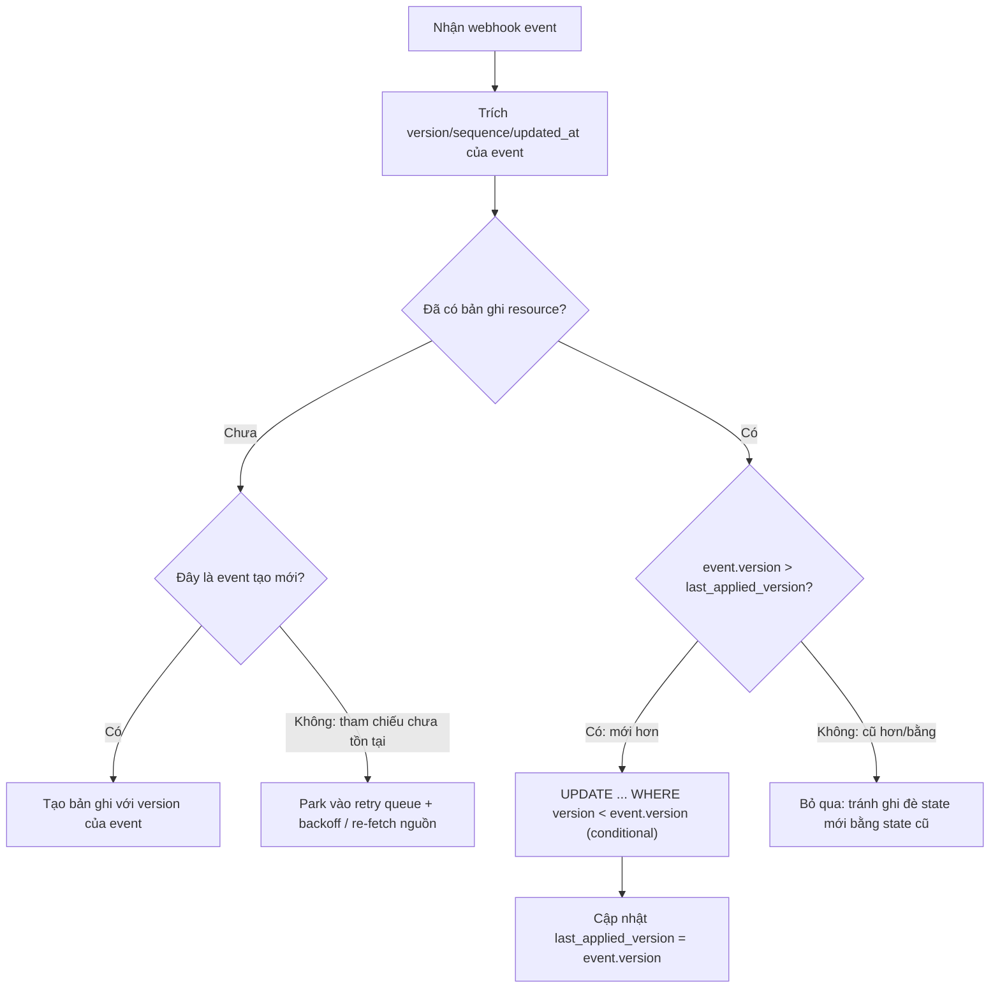

# Webhook đến trễ hoặc out-of-order. Bạn thiết kế ra sao?

## ⚡ Tóm tắt ngắn (30s)
* **Bản chất**: Webhook đi qua mạng và qua cơ chế retry của provider, nên **không có gì đảm bảo về thứ tự (ordering) và độ trễ (latency)**. Event `order.updated` có thể tới **trước** `order.created`; event `payment.refunded` có thể tới **sau** khi bạn đã đọc trạng thái mới hơn. Thiết kế sai sẽ khiến **state cũ ghi đè state mới (lost update / stale overwrite)** hoặc xử lý một event tham chiếu tới thứ chưa tồn tại.
* **Thảm họa thực chiến**:
  1. **Stale overwrite**: Event `status=PAID` (timestamp 10:00:05) đến sau nhưng được xử lý trước; rồi event `status=PENDING` (timestamp 10:00:01) đến trễ lại ghi đè PAID về PENDING → đơn đã trả tiền bị quay về chưa trả.
  2. **Dangling reference**: `invoice.payment_succeeded` tới trước `invoice.created` → handler không tìm thấy invoice → ném lỗi/bỏ event.
* **Quyết định Senior**:
  1. **Không tin thứ tự — dùng version/timestamp để bảo vệ**: So sánh `event_version`/`sequence`/`updated_at` của event với bản ghi hiện tại; **chỉ áp dụng nếu event MỚI HƠN** (conditional update / optimistic concurrency). Bỏ qua event cũ hơn.
  2. **Thiết kế theo trạng thái, không theo bước chuyển**: Webhook nên mang **trạng thái cuối** (idempotent state) để áp dụng được bất kể thứ tự, thay vì delta cộng dồn.
  3. **Buffer/parking + re-fetch nguồn sự thật**: Nếu event tham chiếu thứ chưa có, **giữ tạm và xử lý lại sau**, hoặc gọi API provider để **lấy trạng thái mới nhất** (reconcile) thay vì tin mỗi payload webhook.

---

## 🔍 Chi tiết bản chất thực chiến: Ordering không đảm bảo và cách phòng vệ

### 1. Vì sao out-of-order là mặc định
Provider thường gửi webhook **song song** qua nhiều worker, và cơ chế **retry** làm một event thất bại lần đầu được gửi lại **sau** các event sinh sau nó. Thêm nữa, network không đảm bảo FIFO. Vì vậy **đừng bao giờ giả định thứ tự nhận = thứ tự sự kiện xảy ra**.

### 2. Last-Write-Wins theo version, không theo thời điểm nhận
Mỗi event nghiệp vụ thường có một mốc thứ tự đáng tin từ provider: `sequence_number`, `event.created` (timestamp gốc), hoặc `resource.version`. Quy tắc:
* Lưu `last_applied_version` trên bản ghi.
* Khi event tới: **chỉ apply nếu `event.version > last_applied_version`**; nếu nhỏ hơn/bằng → đây là event cũ hoặc trùng → bỏ qua.
* Thực hiện bằng **conditional update** nguyên tử trong SQL (`WHERE version < :incoming`) để chống cả race lẫn out-of-order trong một câu lệnh.

### 3. State-based thay vì delta-based
Nếu webhook nói *"trạng thái hiện là PAID"*, ta có thể áp dụng an toàn bất kể thứ tự (chỉ cần version mới hơn). Nhưng nếu webhook nói *"+10 vào số dư"* (delta), thì thứ tự và trùng lặp trở nên chí mạng. Khi có thể, hãy thiết kế xử lý theo **trạng thái tuyệt đối**; nếu buộc phải dùng delta, phải kết hợp dedup theo event_id (xem q5) rất nghiêm ngặt.

### 4. Re-fetch nguồn sự thật (pull thay vì chỉ push)
Payload webhook có thể đã **cũ** ngay khi bạn đọc nó. Mẫu an toàn cho dữ liệu nhạy cảm (tiền): coi webhook chỉ là **"tiếng chuông báo có thay đổi"**, rồi gọi `GET /resource/{id}` để lấy **trạng thái mới nhất** từ provider làm nguồn sự thật. Cách này tự nhiên miễn nhiễm với out-of-order vì luôn lấy ảnh chụp mới nhất.

### 5. Parking cho dangling reference
Nếu event tham chiếu tới thực thể chưa tồn tại (event cha đến trễ), thay vì vứt bỏ: đẩy vào **hàng đợi chờ (parking/retry queue)** với backoff, xử lý lại sau khi event cha kịp tới; có giới hạn số lần và dead-letter cuối cùng.

### 6. State machine guard: chặn chuyển trạng thái LÙI
Ngay cả khi event không kèm version, bản chất nghiệp vụ vẫn định nghĩa các phép chuyển hợp lệ:
* Một đơn `REFUNDED`/`CANCELLED` **không thể** quay lại `PAID`; `PAID` không thể về `PENDING`.
* Định nghĩa một **máy trạng thái** với tập phép chuyển hợp lệ và **từ chối mọi phép chuyển lùi** ngay tại tầng domain → biến chính state machine thành lá chắn chống stale overwrite.
* Để giảm đảo thứ tự nội bộ, có thể **phân vùng (partition) xử lý theo entity_id** (vd Kafka key = orderId) sao cho các event của cùng một đơn được xử lý tuần tự bởi cùng một consumer.

---

## 🎨 Sơ đồ trực quan: Conditional update theo version chống stale overwrite

Sơ đồ thể hiện cách conditional update theo version từ chối mọi event đến trễ hoặc đảo thứ tự, và park lại event tham chiếu tới thực thể chưa tồn tại:



---

## 💻 Code thực chiến: BAD vs GOOD

Hai đoạn dưới tương phản trực tiếp cách xử lý out-of-order:
* **BAD**: ghi đè mù theo thứ tự nhận → event cũ đến trễ ghi đè state mới, NPE với dangling reference.
* **GOOD**: conditional update theo version + park event mồ côi để xử lý lại sau.

### ❌ BAD: Ghi đè mù theo thứ tự nhận
```java
@Transactional
public void onOrderEvent(OrderEvent e) {
    Order order = orderRepo.findById(e.getOrderId()).orElseThrow(); // ❌ NPE nếu event cha đến trễ
    order.setStatus(e.getStatus());  // ❌ event cũ đến trễ sẽ ghi đè status mới
    orderRepo.save(order);
}
```

### ✅ GOOD: Conditional update theo version + xử lý dangling
```java
@Transactional
public void onOrderEvent(OrderEvent e) {
    // ✅ Cập nhật có điều kiện: chỉ áp dụng nếu event MỚI HƠN bản đang lưu
    int updated = orderRepo.applyIfNewer(e.getOrderId(), e.getStatus(), e.getVersion());
    if (updated == 0) {
        boolean exists = orderRepo.existsById(e.getOrderId());
        if (!exists) {
            // ✅ Event cha chưa tới -> park lại, xử lý sau (không vứt bỏ)
            parkingQueue.enqueueWithBackoff(e);
        } else {
            // ✅ updated==0 do version cũ hơn -> đây là event đến trễ, bỏ qua an toàn
            log.info("Bỏ qua event cũ cho order {} (v{})", e.getOrderId(), e.getVersion());
        }
    }
}
```
```sql
-- ✅ Một câu lệnh nguyên tử: chống cả out-of-order lẫn race
UPDATE orders
   SET status = :status,
       last_applied_version = :version
 WHERE id = :orderId
   AND last_applied_version < :version;   -- chỉ ghi nếu event mới hơn
```

Cột version trên entity và câu lệnh repository conditional update (chống out-of-order ngay ở tầng DB):
```java
@Entity class Order {
    @Id Long id;
    String status;
    long lastAppliedVersion;   // ✅ mốc thứ tự đã áp dụng
}

@Modifying
@Query("UPDATE Order o SET o.status=:s, o.lastAppliedVersion=:v " +
       "WHERE o.id=:id AND o.lastAppliedVersion < :v")  // ✅ chỉ ghi nếu mới hơn
int applyIfNewer(@Param("id") Long id, @Param("s") String s, @Param("v") long v);
```

---

## 📊 Bảng so sánh chiến lược xử lý out-of-order

Bảng dưới so sánh các chiến lược xử lý out-of-order theo độ tin cậy dữ liệu và khả năng xử lý dangling reference:

| Chiến lược | Chống stale overwrite | Xử lý dangling reference | Độ tin cậy dữ liệu | Ghi chú |
| :--- | :--- | :--- | :--- | :--- |
| **Ghi theo thứ tự nhận** | ❌ Không | ❌ Crash/bỏ event | Thấp | Sai về bản chất |
| **Conditional update theo version** | ✅ Có | Cần thêm parking | Cao | ✅ Mặc định nên dùng |
| **Re-fetch nguồn sự thật (pull)** | ✅ Có (luôn mới nhất) | ✅ Tự nhiên | **Rất cao** | Tốn 1 call API/lần |
| **Park + retry queue** | Bổ trợ | ✅ Có | Cao | Kết hợp với 2 cái trên |

---

## ⚠️ Common Gotchas & Questions follow-up

### 1. Cạm bẫy "Dùng thời điểm NHẬN làm version"
* Nếu lấy `Instant.now()` lúc nhận webhook làm mốc thứ tự, bạn đo **độ trễ mạng** chứ không phải thứ tự sự kiện thật. Event xảy ra trước nhưng đến trễ sẽ có "now" lớn hơn → ghi đè sai. Phải dùng mốc thứ tự **do provider sinh tại thời điểm sự kiện** (`event.created`/`sequence`/`version`).

### 2. Cạm bẫy "Giả định clock của provider và của mình đồng bộ"
* So sánh timestamp giữa hệ thống khác nhau có rủi ro lệch đồng hồ (clock skew). Khi có `sequence_number`/`version` đơn điệu tăng do provider cấp, ưu tiên dùng nó thay cho timestamp.

### 3. Cạm bẫy "Chống out-of-order nhưng quên chống duplicate"
* Conditional update theo version chặn ghi đè ngược, nhưng nếu **cùng một event** (cùng version) đến hai lần thì câu lệnh `WHERE version < :v` tự nhiên bỏ qua lần hai — trừ khi nghiệp vụ là **delta cộng dồn**. Với delta, vẫn phải dedup theo `event_id` song song với version. Hai cơ chế giải hai bài toán khác nhau: version chống *đảo thứ tự*, dedup chống *trùng lặp*.

### 4. Câu hỏi đào sâu từ interviewer
* **Interviewer: "Nếu webhook không kèm version hay sequence, bạn làm sao để không ghi đè trạng thái mới bằng trạng thái cũ?"**
* **Trả lời**: Khi payload không tự mang mốc thứ tự đáng tin, tôi **không tin payload làm nguồn sự thật**. Tôi coi webhook chỉ là **tín hiệu "có gì đó vừa thay đổi"** và phản ứng bằng cách gọi ngược lại API của provider (`GET /resource/{id}`) để **lấy ảnh chụp trạng thái mới nhất** — bản thân provider luôn trả về trạng thái hiện tại, nên thao tác này **tự miễn nhiễm với out-of-order**: dù tín hiệu đến trễ hay đảo thứ tự, cái tôi đọc về luôn là mới nhất. Nếu cũng không có API query, tôi rút thứ tự từ **bản chất nghiệp vụ của state machine** — ví dụ một đơn đã `REFUNDED` thì không thể quay lại `PAID`, nên tôi định nghĩa các phép chuyển trạng thái hợp lệ và **từ chối những phép chuyển lùi** ngay ở tầng domain, biến chính máy trạng thái thành lá chắn chống stale overwrite.
