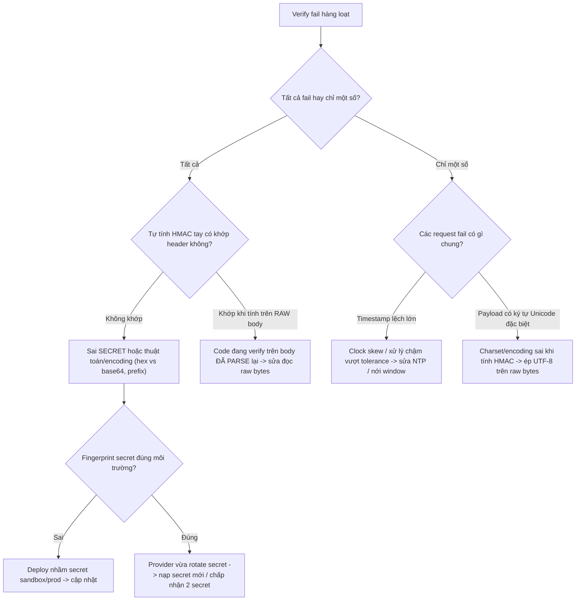

# Chữ ký webhook verify fail hàng loạt. Bạn debug thế nào?

## ⚡ Tóm tắt ngắn (30s)
* **Bản chất**: Webhook signature (thường là **HMAC-SHA256** của raw body với một shared secret) là cách bạn xác minh request **thực sự đến từ provider** chứ không phải kẻ giả mạo. Khi verify **fail hàng loạt đột ngột**, gần như chắc chắn KHÔNG phải bị tấn công, mà do **một mắt xích trong chuỗi tính chữ ký bị thay đổi** — phổ biến nhất là **raw body bị biến dạng** (framework parse rồi serialize lại JSON, đổi encoding, trim khoảng trắng) hoặc **secret bị xoay (rotate) mà chưa cập nhật**.
* **Nguyên nhân gốc thường gặp (xếp theo tần suất)**:
  1. **Verify trên body đã được parse lại** thay vì raw bytes gốc → thứ tự field/escape/whitespace đổi → HMAC khác.
  2. **Secret rotation**: provider đổi signing secret, hoặc bạn deploy nhầm secret môi trường (sandbox vs production).
  3. **Sai thuật toán/encoding**: hex vs base64, thiếu prefix `sha256=`, sai charset (UTF-8 vs ASCII).
  4. **Timestamp window**: provider ký kèm timestamp chống replay; clock lệch hoặc xử lý chậm vượt tolerance → fail.
* **Quyết định Senior**: Verify trên **raw body nguyên bản** (đọc trước mọi parsing), so sánh bằng **constant-time compare**, log **chi tiết chẩn đoán không lộ secret** (expected vs computed prefix, độ dài body, timestamp lệch), và có quy trình **rotate secret zero-downtime** (chấp nhận đồng thời 2 secret trong giai đoạn chuyển tiếp).

---

## 🔍 Chi tiết bản chất thực chiến: Vì sao HMAC fail và cách truy vết

### 1. "Raw body" là vua — lỗi #1 của mọi vụ verify fail
HMAC được tính trên **chính xác từng byte** của body mà provider đã gửi. Nếu ở phía bạn, framework (Spring) đã **deserialize JSON thành object rồi serialize lại** để verify, thì:
* Thứ tự key có thể đổi, khoảng trắng bị nén, ký tự Unicode bị escape khác (`\u00e9` vs `é`), số `1.0` thành `1`...
* → byte khác → HMAC khác → **fail 100%** dù secret đúng.

**Cách đúng**: đọc raw body bytes **trước khi** bất kỳ message converter nào chạm vào (dùng `byte[]`/`String` raw, hoặc một filter cache request body), verify trên đó, **rồi mới** parse.

### 2. Quy trình debug có hệ thống (loại trừ từng tầng)
1. **Có phải TẤT CẢ đều fail, hay chỉ một số?** Tất cả fail → nghi raw-body hoặc secret. Một số fail → nghi timestamp window/payload đặc biệt (ký tự lạ).
2. **Mới deploy gì gần đây?** Đổi framework version, thêm filter/gateway (Nginx, WAF) có thể **chỉnh sửa body** (ví dụ re-compress, đổi charset).
3. **Tự tính HMAC bằng tay** trên một payload mẫu (dùng `openssl`/script) với secret đang cấu hình, so với header `X-Signature`. Khớp → lỗi ở code đọc body; không khớp → sai secret/thuật toán.
4. **Kiểm tra secret môi trường**: in ra **fingerprint** của secret (ví dụ `sha256(secret)[:8]`, KHÔNG in secret thật) để xác nhận đúng giá trị, đúng môi trường.
5. **Kiểm tra timestamp tolerance**: log độ lệch `now - event.timestamp`; nếu vượt ngưỡng (vd 5 phút) do clock skew/xử lý chậm → chỉnh NTP hoặc nới tolerance hợp lý.

### 3. Constant-time compare — đúng cả về bảo mật
So sánh chữ ký phải dùng **constant-time** (`MessageDigest.isEqual`), không dùng `String.equals` (thoát sớm tại byte đầu khác nhau → lộ thông tin qua timing side-channel). Đây vừa là chuẩn bảo mật vừa tránh nhầm lẫn khi debug.

### 4. Replay protection và rotation
* Provider thường ký `timestamp + "." + payload`. Bạn phải verify cả timestamp nằm trong cửa sổ cho phép để chống **replay attack**.
* **Rotation an toàn**: khi đổi secret, cấu hình hệ thống **chấp nhận cả secret cũ và mới** trong giai đoạn giao thời; verify pass nếu khớp **bất kỳ secret nào** đang active → tránh fail hàng loạt lúc xoay khóa.

### 5. Quy trình rotate secret zero-downtime & quarantine
* **Rotate không gãy**: khi đổi signing secret, cấu hình hệ thống **chấp nhận đồng thời secret cũ và mới** trong giai đoạn giao thời; verify pass nếu khớp **bất kỳ** secret đang active. Chỉ gỡ secret cũ sau khi provider xác nhận đã chuyển hẳn.
* **Quản lý qua vault**: lưu secret trong secret manager, nạp nóng (hot reload) không cần redeploy.
* **Quarantine thay vì tắt verify**: khi đang debug fail hàng loạt, **không bao giờ tắt verify**. Thay vào đó nhận event và đưa vào kho **chờ xác thực (quarantine)** — chưa chạy nghiệp vụ — rồi xử lý lại sau khi sửa xong, tránh mở cửa cho event giả mạo.

---

## 🎨 Sơ đồ trực quan: Cây quyết định debug verify-fail

Sơ đồ là cây quyết định loại trừ từng tầng để truy ra nguyên nhân gốc của hiện tượng verify-fail hàng loạt:



---

## 💻 Code thực chiến: BAD vs GOOD

Hai đoạn dưới tương phản trực tiếp cách verify chữ ký:
* **BAD**: verify trên object đã parse lại + so sánh chuỗi thường → fail 100% và lộ timing side-channel.
* **GOOD**: verify trên raw bytes, constant-time compare, hỗ trợ nhiều secret khi rotate, kiểm tra timestamp.

### ❌ BAD: Verify trên object đã parse + so sánh thường
```java
@PostMapping("/webhook")
public ResponseEntity<Void> handle(@RequestBody WebhookPayload payload,  // ❌ đã parse mất raw bytes
                                   @RequestHeader("X-Signature") String sig) {
    // ❌ Serialize LẠI để tính HMAC -> byte khác body gốc -> fail hàng loạt
    String body = new ObjectMapper().writeValueAsString(payload);
    String computed = hmacSha256(body, secret);
    if (!computed.equals(sig)) {            // ❌ equals: timing side-channel + dễ lệch format
        return ResponseEntity.status(401).build();
    }
    process(payload);
    return ResponseEntity.ok().build();
}
```

### ✅ GOOD: Raw bytes + constant-time + multi-secret + timestamp check
```java
@PostMapping(value = "/webhook")
public ResponseEntity<Void> handle(HttpServletRequest req,
                                   @RequestHeader("X-Signature") String sigHeader,
                                   @RequestHeader("X-Timestamp") long ts) throws IOException {
    // ✅ Đọc RAW bytes nguyên bản, trước mọi parsing
    byte[] rawBody = req.getInputStream().readAllBytes();

    // ✅ Chống replay: timestamp phải trong cửa sổ cho phép
    if (Math.abs(Instant.now().getEpochSecond() - ts) > 300)
        return ResponseEntity.status(401).build();

    String signedPayload = ts + "." + new String(rawBody, StandardCharsets.UTF_8);
    boolean ok = activeSecrets.stream().anyMatch(secret -> {   // ✅ chấp nhận nhiều secret khi rotate
        byte[] computed = hmacSha256(signedPayload, secret);
        byte[] provided = HexFormat.of().parseHex(stripPrefix(sigHeader)); // ✅ đúng encoding
        return MessageDigest.isEqual(computed, provided);      // ✅ constant-time compare
    });
    if (!ok) {
        // ✅ Log chẩn đoán KHÔNG lộ secret: độ dài body, fingerprint secret, lệch thời gian
        log.warn("Sig fail: bodyLen={}, secretFp={}, tsSkew={}s",
                 rawBody.length, fingerprint(activeSecrets), Instant.now().getEpochSecond() - ts);
        return ResponseEntity.status(401).build();
    }
    process(rawBody);
    return ResponseEntity.ok().build();
}
```

Hàm HMAC-SHA256 trên raw bytes và so sánh constant-time chuẩn:
```java
byte[] hmacSha256(String data, String secret) {
    Mac mac = Mac.getInstance("HmacSHA256");
    mac.init(new SecretKeySpec(secret.getBytes(StandardCharsets.UTF_8), "HmacSHA256"));
    return mac.doFinal(data.getBytes(StandardCharsets.UTF_8)); // ✅ raw bytes, UTF-8 tường minh
}
// So sánh: MessageDigest.isEqual(a, b) -> constant-time, chống timing side-channel
```

---

## 📊 Bảng so sánh các nguyên nhân gốc verify-fail

Bảng dưới liệt kê các nguyên nhân gốc kèm dấu hiệu nhận biết và cách xác minh nhanh từng giả thuyết:

| Nguyên nhân | Dấu hiệu nhận biết | Cách xác minh nhanh | Cách sửa |
| :--- | :--- | :--- | :--- |
| **Verify trên body đã parse lại** | Fail 100% ngay sau khi đổi code/framework | HMAC tay khớp khi tính trên raw bytes | Đọc raw bytes trước parsing |
| **Sai/đổi secret** | Fail 100%, đột ngột | Fingerprint secret sai môi trường | Nạp secret đúng / multi-secret rotation |
| **Sai encoding (hex/base64/prefix)** | Fail 100% từ lúc tích hợp | HMAC tay đúng nhưng so sánh lệch format | Chuẩn hóa encoding theo doc provider |
| **Timestamp window** | Fail một phần, rải rác | Log thấy tsSkew lớn | Sửa NTP / xử lý nhanh / nới tolerance |
| **Gateway/WAF chỉnh body** | Fail sau khi thêm proxy | So byte body trước/sau proxy | Tắt body rewrite / verify tại edge |

---

## ⚠️ Common Gotchas & Questions follow-up

### 1. Cạm bẫy "Tắt verify cho nhanh khi đang cháy"
* Khi production fail hàng loạt, có người đề xuất tạm tắt verify để "thông" webhook. **Cực kỳ nguy hiểm**: bạn mở toang cửa cho kẻ giả mạo bơm event `payment.succeeded` giả → cộng tiền khống. Thay vào đó, hãy nhận và **lưu event vào "quarantine"** (chưa xử lý nghiệp vụ) trong lúc fix verify, rồi xử lý lại sau khi đã xác thực.

### 2. Cạm bẫy "Log cả chữ ký/secret để debug"
* In secret hoặc full signature ra log là lỗ hổng bảo mật. Chỉ log **fingerprint/prefix** đủ để đối chiếu, không bao giờ log giá trị nhạy cảm đầy đủ.

### 3. Câu hỏi đào sâu từ interviewer
* **Interviewer: "Vì sao verify chữ ký bắt buộc phải làm trên raw body, và tại sao đây là nguyên nhân số một gây fail hàng loạt?"**
* **Trả lời**: HMAC là một hàm băm có khóa được tính trên **chính xác từng byte** mà provider đã gửi đi. Provider tính chữ ký trên **dòng byte gốc** trước khi nó rời máy chủ của họ. Nếu phía tôi để Spring deserialize JSON thành object rồi **serialize lại** để verify, thì quá trình round-trip đó gần như chắc chắn làm **đổi byte** — đổi thứ tự key, nén khoảng trắng, escape Unicode khác đi, chuẩn hóa số... Chỉ cần **một byte khác**, giá trị HMAC đã hoàn toàn khác (tính chất avalanche của hàm băm), nên **mọi** request đều fail cùng lúc — đó là lý do nó gây fail *hàng loạt* chứ không lác đác. Cách phòng đúng là tách bạch: **đọc và đệm raw bytes ngay tại tầng filter/servlet input stream, verify HMAC trên đúng dòng byte đó, rồi mới cho phép parse JSON** ở bước sau. Tôi không bao giờ để message converter chạm vào body trước khi chữ ký được xác thực.
