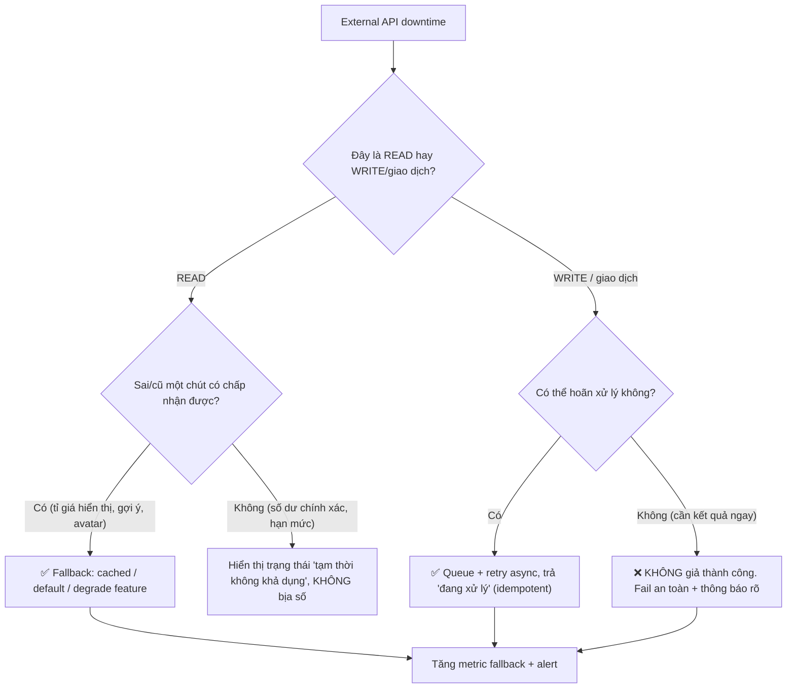

# External API downtime, có nên fallback không?

## ⚡ Tóm tắt ngắn (30s)
* **Bản chất**: "Có nên fallback không" **không có câu trả lời chung** — nó phụ thuộc hoàn toàn vào việc API đó nằm trên đường **đọc (read)** hay **ghi/giao dịch (write)**, và **chi phí của một câu trả lời sai** so với chi phí của việc **không trả lời được**. Nguyên tắc Senior: **fallback để giữ trải nghiệm với dữ liệu KHÔNG nhạy cảm, nhưng TUYỆT ĐỐI không bịa kết quả cho hành động nhạy cảm như thanh toán/authorization**.
* **Khung quyết định**:
  1. **Read không nhạy cảm (gợi ý, tỉ giá hiển thị, ảnh đại diện, danh mục)** → **NÊN fallback**: trả cached value, giá trị mặc định, hoặc degrade tính năng. Sai số nhỏ, lợi ích trải nghiệm lớn.
  2. **Write/giao dịch nhạy cảm (charge tiền, trừ kho, cấp quyền)** → **KHÔNG fallback "giả thành công"**. Một fallback kiểu "cứ coi như thanh toán OK" là thảm họa kế toán. Thay vào đó: **fail an toàn**, hoặc chuyển sang **xử lý bất đồng bộ (queue + retry)** để hoàn tất khi đối tác hồi phục.
  3. **Fail open vs fail closed**: với cổng bảo mật/fraud check, downtime nên **fail closed** (từ chối) hay **fail open** (cho qua) là một quyết định rủi ro phải cân nhắc theo nghiệp vụ.
* **Quyết định Senior**: Phân loại từng dependency theo trục **"sai có chấp nhận được không"** và **"đây là read hay write"**, rồi gắn chiến lược degrade phù hợp; mọi fallback đều phải **quan sát được** (metric, alert) để không che giấu sự cố.

---

## 🔍 Chi tiết bản chất thực chiến: Fallback có chủ đích, không bừa bãi

### 1. Phân loại dependency để chọn chiến lược
* **Critical & non-substitutable (cốt lõi, không thể thay)**: ví dụ chính cái payment authorization. Không có dữ liệu thay thế hợp lệ → không "giả lập" được → chỉ có thể fail an toàn hoặc hoãn (async).
* **Important but degradable (quan trọng nhưng có thể giảm cấp)**: ví dụ gợi ý sản phẩm cá nhân hóa → khi sập, fallback về danh sách "bán chạy" tĩnh.
* **Cosmetic (trang trí)**: avatar, badge → khi sập, ẩn đi hoặc dùng placeholder, không ảnh hưởng nghiệp vụ.

### 2. Các kiểu fallback hợp lệ
* **Cached/stale data**: trả dữ liệu cũ gần nhất (kèm nhãn "cập nhật lúc ...") — hợp cho read.
* **Default/empty**: trả giá trị mặc định an toàn (ví dụ "không có khuyến mãi" thay vì lỗi).
* **Degrade feature**: tắt mềm tính năng phụ thuộc, phần còn lại của trang vẫn chạy.
* **Queue & retry (deferred)**: với write, nhận yêu cầu, đưa vào hàng đợi, xử lý khi đối tác sống lại; trả cho user trạng thái "đang xử lý".

### 3. Anti-pattern: fallback "giả thành công" cho write
Fallback kiểu *"payment API sập thì cứ coi như trả tiền thành công và cho giao hàng"* tạo ra **doanh thu ảo** và lệch sổ không thể đối soát. Tương tự, *"fraud service sập thì cứ duyệt hết"* (fail open) có thể mở cửa cho gian lận. Những quyết định này phải do **nghiệp vụ** chấp thuận một cách tường minh, không phải lập trình viên tự ý.

### 4. Fallback phải quan sát được
Một fallback âm thầm sẽ **giấu sự cố**: hệ thống "vẫn chạy" nên không ai biết đối tác đã chết, đến khi dữ liệu sai tích lũy đủ lớn. Mỗi lần fallback kích hoạt phải tăng một **counter/metric** và bắn alert khi tỉ lệ fallback vượt ngưỡng.

### 5. Fail-open vs fail-closed & các cấp độ degrade
* **Fail-closed (từ chối khi dependency chết)**: dùng cho cổng bảo mật/authorization — thà chặn còn hơn cho qua sai. An toàn nhưng giảm khả dụng.
* **Fail-open (cho qua khi dependency chết)**: chỉ dùng cho các kiểm tra **làm giàu, không sống còn** (vd chấm điểm gợi ý). Tăng khả dụng nhưng có rủi ro — phải được **nghiệp vụ chấp thuận tường minh**.
* **Các cấp độ degrade**: thiết kế nhiều mức — *đầy đủ → giảm tính năng phụ → chỉ-đọc (read-only) → trang bảo trì* — để hệ thống "tụt cấp" mượt mà thay vì sập đột ngột.

---

## 🎨 Sơ đồ trực quan: Cây quyết định "có nên fallback?"

Sơ đồ là cây quyết định phân nhánh theo bản chất read hay write/giao dịch để chọn chiến lược degrade phù hợp:



---

## 💻 Code thực chiến: BAD vs GOOD

Hai đoạn dưới tương phản trực tiếp cách fallback:
* **BAD**: fallback 'giả thành công' cho thanh toán → doanh thu ảo, lệch sổ.
* **GOOD**: read thì degrade (cached/default), write thì hoãn (queue) hoặc fail trung thực, không bịa kết quả.

### ❌ BAD: Fallback giả thành công cho thanh toán
```java
@CircuitBreaker(name = "payment", fallbackMethod = "paymentFallback")
public PaymentResult pay(Order o) { return paymentApi.charge(o); }

private PaymentResult paymentFallback(Order o, Throwable ex) {
    // ❌ THẢM HỌA: coi như đã trả tiền dù chưa charge -> doanh thu ảo, lệch sổ
    return PaymentResult.success("FAKE-OK");
}
```

### ✅ GOOD: Read thì degrade, Write thì hoãn (queue) hoặc fail an toàn
```java
// READ không nhạy cảm: fallback cached/default
@CircuitBreaker(name = "fxRate", fallbackMethod = "rateFallback")
public BigDecimal displayRate(String pair) { return fxApi.getRate(pair); }
private BigDecimal rateFallback(String pair, Throwable ex) {
    return cache.lastKnownRate(pair); // ✅ tỉ giá cũ kèm nhãn "cập nhật lúc ..."
}

// WRITE nhạy cảm: KHÔNG giả OK; chuyển async hoặc fail an toàn
public PaymentResult pay(Order o) {
    try {
        return paymentApi.charge(o, "order-" + o.getId()); // idempotency key
    } catch (PaymentUnavailableException ex) {
        if (o.allowsDeferredCapture()) {
            outbox.enqueuePayment(o); // ✅ hoãn, xử lý lại khi đối tác hồi phục (idempotent)
            return PaymentResult.pending("Đang xử lý thanh toán");
        }
        // ✅ Không bịa kết quả: báo rõ ràng để user/khâu sau quyết định
        return PaymentResult.failedSafe("Cổng thanh toán tạm gián đoạn, vui lòng thử lại");
    }
}
```

Khai báo các cấp độ degrade và logic hạ cấp tự động theo sức khỏe phụ thuộc:
```java
enum ServiceMode { FULL, REDUCED, READ_ONLY, MAINTENANCE } // ✅ tụt cấp có kiểm soát

// Health-driven: bật mức suy giảm theo tình trạng phụ thuộc
ServiceMode decide(double fallbackRate, boolean writeDepDown) {
    if (writeDepDown)       return ServiceMode.READ_ONLY;  // write dep chết -> chỉ đọc
    if (fallbackRate > 0.8) return ServiceMode.REDUCED;    // phụ thuộc xuống cấp nặng
    return ServiceMode.FULL;
}
// Mỗi lần đổi mode -> phát metric + alert để vận hành biết hệ thống đang degrade
```

---

## 📊 Bảng so sánh: khi nào fallback, khi nào không

Bảng dưới phân loại từng loại dependency và chiến lược fallback tương ứng theo mức nhạy cảm của dữ liệu:

| Loại dependency | Ví dụ | Nên fallback? | Kiểu fallback phù hợp |
| :--- | :--- | :--- | :--- |
| **Read trang trí** | Avatar, badge | ✅ Có | Placeholder / ẩn |
| **Read quan trọng, sai số chấp nhận được** | Gợi ý SP, tỉ giá hiển thị | ✅ Có | Cached / default / degrade |
| **Read cần chính xác tuyệt đối** | Số dư, hạn mức tín dụng | ⚠️ Hạn chế | "Tạm không khả dụng", không bịa số |
| **Write có thể hoãn** | Gửi email, đồng bộ CRM | ✅ Có | Queue + retry async |
| **Write giao dịch tiền/quyền** | Charge, authorize, trừ kho | ❌ Không giả OK | Fail an toàn hoặc async có idempotency |

---

## ⚠️ Common Gotchas & Questions follow-up

### 1. Cạm bẫy "Fallback im lặng che giấu downtime"
* Fallback làm hệ thống "trông vẫn khỏe", khiến không ai biết đối tác đã sập hàng giờ. Phải có **metric `fallback_triggered_total`** và alert; coi tỉ lệ fallback cao là một sự cố cần điều tra, không phải trạng thái bình thường.

### 2. Cạm bẫy "Fallback trả cached data đã hết hạn nghiêm trọng"
* Trả tỉ giá cached là ổn nếu nó chỉ cũ vài phút, nhưng nguy hiểm nếu cũ vài ngày (tỉ giá biến động mạnh). Fallback nên kèm **giới hạn độ cũ (max staleness)**: quá cũ thì thà báo "không khả dụng" còn hơn dùng số sai lệch lớn.

### 3. Cạm bẫy "Không kiểm thử nhánh fallback"
* Fallback chỉ chạy khi đối tác lỗi — một kịch bản hiếm khi xảy ra lúc dev, nên rất dễ có **bug nằm im trong nhánh fallback** (NPE, trả sai kiểu, cache rỗng). Phải **chủ động test** nhánh degrade bằng fault injection / chaos engineering; nếu không, "lưới an toàn" lại rách đúng lúc cần nhất.

### 4. Câu hỏi đào sâu từ interviewer
* **Interviewer: "Cùng là downtime, vì sao bạn cho phép fallback cho API tỉ giá hiển thị nhưng cấm fallback cho API thanh toán?"**
* **Trả lời**: Vì **chi phí của một câu trả lời sai khác nhau một trời một vực**. Với tỉ giá hiển thị, nếu tôi trả giá trị cached cũ vài phút, hậu quả tệ nhất là người dùng thấy con số lệch chút ít — có thể chấp nhận, và đổi lại trang vẫn dùng được thay vì hiện lỗi. Đây là read, **không tạo ra hệ quả không thể đảo ngược**. Nhưng thanh toán là một **write tạo side-effect tiền thật và không thể đảo ngược dễ dàng**: nếu tôi "fallback giả thành công", tôi đã ghi nhận một khoản doanh thu **chưa hề tồn tại**, cho giao hàng mà chưa thu được tiền, và tạo ra một khoản lệch sổ mà khâu đối soát cuối ngày sẽ không thể giải thích. Nguyên tắc của tôi là: **fallback được phép làm dữ liệu *kém chính xác hơn*, nhưng không bao giờ được phép *bịa ra một sự thật giao dịch chưa xảy ra***. Với write nhạy cảm, lựa chọn đúng là **hoãn lại (queue + retry idempotent)** để hoàn tất khi đối tác hồi phục, hoặc **fail một cách trung thực** và để nghiệp vụ quyết định.
