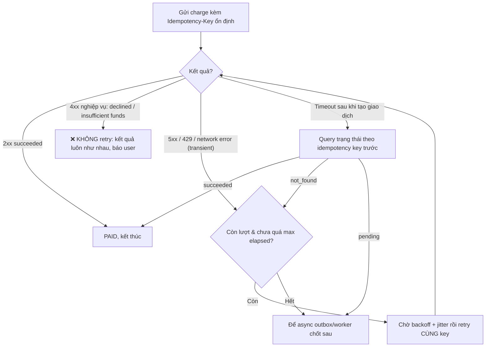

# Làm sao thiết kế retry cho API thanh toán?

## ⚡ Tóm tắt ngắn (30s)
* **Bản chất**: Retry cho API thanh toán là chủ đề **dễ làm sai nhất** vì nó đụng tới tiền thật. Nguyên tắc tối thượng: **retry thanh toán CHỈ an toàn khi có idempotency key**. Không có idempotency key, mỗi retry là một lệnh charge mới → **double charge**. Ngoài ra, không phải lỗi nào cũng được retry: chỉ retry các lỗi **transient (thoáng qua)**, tuyệt đối không retry các lỗi **dứt khoát (deterministic)** như "thẻ bị từ chối", "số dư không đủ".
* **5 trụ cột của một retry policy thanh toán đúng**:
  1. **Idempotency key ổn định**: cùng một key cho mọi lần thử của cùng một giao dịch → gateway gộp thành 1 lần charge.
  2. **Phân loại lỗi retryable vs non-retryable**: chỉ retry `5xx`, timeout, `429`, network error. KHÔNG retry `4xx` nghiệp vụ (card declined, insufficient funds, invalid card).
  3. **Exponential backoff + jitter** + **giới hạn số lần & tổng thời gian** (max attempts, max elapsed).
  4. **Xử lý trạng thái in-doubt**: timeout sau khi tạo giao dịch → **truy vấn trạng thái** trước khi retry, không retry mù.
  5. **Async/durable retry cho lỗi kéo dài**: lưu vào outbox/queue để worker retry bền bỉ, không giữ thread của user.

---

## 🔍 Chi tiết bản chất thực chiến: Retry đúng cho tiền

### 1. Idempotency key là điều kiện TIÊN QUYẾT
Trước khi nói đến backoff hay số lần, phải khẳng định: **không có idempotency key thì không được retry charge**. Key phải:
* Ổn định theo **ý định thanh toán** (gắn `orderId`/`paymentAttemptId`), sinh **một lần** và tái dùng cho mọi retry.
* Được gateway lưu để khử trùng lặp. Nhờ đó "at-least-once delivery + idempotent processing = exactly-once *effect*".

### 2. Phân loại lỗi: cái gì được retry?
* **Retryable (transient)**: `HTTP 5xx`, `408/timeout`, `429` (kèm backoff), lỗi mạng (`ConnectException`, reset). Đây là lỗi **không do nội dung request**, thử lại có cơ hội thành công.
* **Non-retryable (deterministic / business decline)**: `400 invalid request`, `401/403` (sai credential/quyền), và đặc biệt các quyết định nghiệp vụ như **card declined, insufficient funds, expired card, do_not_honor**. Retry những cái này **vô ích** (kết quả luôn như nhau) và còn có thể bị coi là **lạm dụng** (một số ngân hàng phạt/khóa nếu retry lệnh đã bị từ chối nhiều lần).

### 3. Backoff + Jitter + giới hạn
Thời gian chờ lần thử thứ $n$:
$$delay_n = \min(cap,\ base \times 2^{n}) \times random(0, 1)$$
* Có **max attempts** (vd 3–5) và **max elapsed time** (vd 2 phút) để không retry vô hạn.
* Tổng thời gian retry phải **nhỏ hơn timeout của tầng gọi** để không làm caller timeout theo.

### 4. In-doubt: query trước, retry sau
Như đã nói ở câu "timeout nhưng vẫn charge": nếu timeout xảy ra **sau khi đã gửi lệnh tạo giao dịch**, retry mù rất nguy hiểm. Đúng quy trình: **gọi API truy vấn trạng thái** theo idempotency key; chỉ retry nếu trạng thái là "chưa tồn tại/chưa charge".

### 5. Sync retry vs async durable retry
* **Sync (trong request của user)**: chỉ 1–2 lần nhanh cho transient ngắn, để user không chờ lâu.
* **Async/durable (outbox + worker)**: khi đối tác down lâu, lưu lệnh vào DB (outbox) và để worker retry theo lịch (kèm idempotency key) cho tới khi chốt; user nhận trạng thái "đang xử lý". Đây mới là cách chịu được downtime dài mà không double charge.

### 6. Retry budget & Dead Letter Queue
* **Retry budget**: giới hạn **tổng** tỉ lệ retry toàn hệ thống (vd retry chỉ được chiếm ≤10% lưu lượng) bằng một token bucket chung. Khi đối tác lỗi diện rộng, budget cạn → ngừng retry để **không tự tạo retry storm** đánh sập đối tác đang gượng dậy.
* **Dead Letter Queue (DLQ)**: lệnh đã hết lượt retry mà chưa chốt → đẩy vào DLQ (vẫn kèm idempotency key) cho worker bền bỉ hoặc người vận hành xử lý, thay vì âm thầm báo `failed`.
* Phối hợp với circuit breaker: **không retry khi mạch đang OPEN** để tránh dội vào thằng đang chết.

---

## 🎨 Sơ đồ trực quan: Retry policy thanh toán an toàn

Sơ đồ tổng hợp toàn bộ retry policy an toàn cho thanh toán, từ phân loại lỗi retryable/non-retryable tới xử lý trạng thái in-doubt:



---

## 💻 Code thực chiến: BAD vs GOOD

Hai đoạn dưới tương phản trực tiếp chiến lược retry thanh toán:
* **BAD**: retry mọi lỗi (kể cả declined), key ngẫu nhiên mỗi lần → vô ích và double charge.
* **GOOD**: key ổn định, phân loại lỗi retryable/non-retryable, query khi in-doubt, hết lượt thì chuyển async.

### ❌ BAD: Retry mọi lỗi, key mới mỗi lần, retry cả declined
```java
public PaymentResult pay(Order o) {
    for (int i = 0; i < 3; i++) {
        try {
            return gateway.charge(o.getAmount(), UUID.randomUUID().toString()); // ❌ key mới -> double charge
        } catch (Exception e) {
            // ❌ Retry cả "card declined" (vô ích) lẫn timeout (nguy hiểm)
        }
    }
    return PaymentResult.failed();
}
```

### ✅ GOOD: Idempotency + phân loại lỗi + backoff + query in-doubt
```java
public PaymentResult pay(Order o) {
    String idemKey = "order-" + o.getId();      // ✅ ổn định, tái dùng mọi retry
    long base = 200, cap = 10_000;
    for (int attempt = 0; attempt < 4; attempt++) {
        try {
            return gateway.charge(o.getAmount(), idemKey);
        } catch (PaymentDeclinedException e) {
            return PaymentResult.declined(e.getReason()); // ✅ non-retryable: dừng ngay
        } catch (SocketTimeoutException e) {
            // ✅ in-doubt: hỏi trạng thái thật trước khi quyết định retry
            ChargeStatus s = gateway.queryByKey(idemKey);
            if (s.isSucceeded()) return PaymentResult.paid();
            if (s.isPending())  { outbox.enqueue(o, idemKey); return PaymentResult.pending(); }
            // not_found -> rơi xuống backoff retry
        } catch (TransientGatewayException e) {
            // 5xx/429/network -> retry
        }
        sleep((long) (Math.min(cap, base * Math.pow(2, attempt)) * ThreadLocalRandom.current().nextDouble()));
    }
    outbox.enqueue(o, idemKey);  // ✅ hết lượt sync -> chuyển durable async, KHÔNG báo failed vội
    return PaymentResult.pending();
}
```

Retry budget chặn retry storm khi đối tác lỗi diện rộng:
```java
// Chỉ cho retry nếu còn 'ngân sách' (vd retry <=10% tổng lưu lượng toàn hệ thống)
if (!retryBudget.tryConsume()) {
    outbox.enqueue(o, idemKey);   // hết budget -> chuyển durable async, không dội
    return PaymentResult.pending();
}
// Không retry khi circuit breaker đang OPEN để tránh dội vào thằng đang chết
if (breaker.getState() == State.OPEN) { outbox.enqueue(o, idemKey); return PaymentResult.pending(); }
```

---

## 📊 Bảng so sánh lỗi: retry hay không retry

Bảng dưới phân loại từng loại lỗi theo việc có nên retry hay không, kèm lý do kỹ thuật:

| Loại lỗi | Ví dụ | Retry? | Ghi chú |
| :--- | :--- | :--- | :--- |
| **Timeout sau tạo giao dịch** | `SocketTimeoutException` | ⚠️ Query trước | In-doubt: phải reconcile, không retry mù |
| **5xx server lỗi** | `502/503` | ✅ Có | Backoff + jitter |
| **429 rate limit** | Too Many Requests | ✅ Có | Tôn trọng `Retry-After` |
| **Network error** | `ConnectException`, reset | ✅ Có | Thường an toàn để thử lại |
| **Card declined / insufficient funds** | `402`, do_not_honor | ❌ Không | Kết quả tất định, retry vô ích/bị phạt |
| **Invalid request / auth** | `400/401/403` | ❌ Không | Lỗi do request, retry không đổi |

---

## ⚠️ Common Gotchas & Questions follow-up

### 1. Cạm bẫy "Retry làm tổn hại quan hệ với ngân hàng"
* Một số acquirer/ngân hàng theo dõi tỉ lệ retry lệnh đã bị từ chối; retry liên tục một thẻ bị `declined` có thể bị gắn cờ gian lận, tăng phí, hoặc bị siết. Vì vậy non-retryable phải **thực sự dừng**, không "thử thêm cho chắc".

### 2. Cạm bẫy "Sync retry giữ thread quá lâu"
* Retry nhiều lần với backoff trong request đồng bộ làm user chờ và **giữ worker thread** (gặp lại bài toán thread starvation). Giới hạn sync retry ở mức tối thiểu, đẩy phần kéo dài sang **outbox/worker bất đồng bộ**.

### 3. Câu hỏi đào sâu từ interviewer
* **Interviewer: "Đâu là điều kiện TIÊN QUYẾT để được phép retry một lệnh thanh toán, và vì sao?"**
* **Trả lời**: Điều kiện tiên quyết là **idempotency key**. Lý do nằm ở bản chất bất định của mạng: khi tôi retry, tôi **không bao giờ chắc chắn 100%** rằng lần gửi trước đã thất bại hay chỉ là response bị mất — như Two Generals Problem. Nếu không có idempotency key, mỗi lần retry bị gateway hiểu là **một ý định thanh toán mới và độc lập**, nên nếu lần trước thực ra đã charge thành công, lần retry sẽ charge **thêm một lần nữa** → khách bị trừ tiền kép. Idempotency key biến chuỗi "at-least-once delivery" (cứ thử lại cho chắc) thành "exactly-once *effect*": gateway dùng key để **nhận diện mọi lần thử trùng là cùng một giao dịch** và chỉ thực thi đúng một lần, trả lại kết quả đã lưu cho các lần sau. Vì vậy với tôi, thứ tự là: **trước tiên đảm bảo idempotency, sau đó mới bàn tới backoff, phân loại lỗi và giới hạn số lần** — không có idempotency thì mọi cơ chế retry còn lại đều nguy hiểm.
