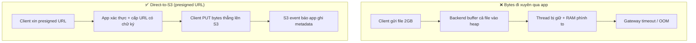

# User upload file lớn làm service timeout. Bạn xử lý thế nào?

## ⚡ Tóm tắt ngắn (30s)
* **Bản chất**: Timeout khi upload file lớn gần như luôn bắt nguồn từ hai lỗi kiến trúc: (1) app **buffer toàn bộ file vào RAM/heap** rồi mới xử lý, và (2) **toàn bộ bytes phải đi xuyên qua backend** (browser → app → object storage). Một file 2GB nhân với vài chục user upload đồng thời = hàng chục GB RAM → OOM, hoặc thread xử lý request bị giữ quá lâu cho tới khi proxy/gateway cắt kết nối ở mốc timeout. Đây **không phải** lỗi "tăng timeout là xong".
* **Hướng xử lý**:
  1. **Direct-to-S3 bằng presigned URL** (giải pháp gốc rễ): app chỉ cấp URL có chữ ký, client upload bytes **thẳng lên S3**, không đi qua app → app không tốn RAM/băng thông/thread.
  2. **Nếu buộc phải đi qua app**: dùng **streaming** (`InputStream` → S3 multipart), tuyệt đối không `readAllBytes()` cả file vào memory.
  3. **Multipart / resumable upload** cho file rất lớn: chia thành các part, upload song song, retry từng part, nối lại ở S3.
* **Quyết định Senior**: Mặc định đẩy bytes **bypass app** (presigned URL). Tăng `timeout` chỉ là băng dán; gốc rễ là **không để file lớn chiếm tài nguyên của tiến trình xử lý request**.

---

## 🔍 Chi tiết bản chất thực chiến

### 1. Vì sao "tăng timeout" là sai hướng
Tăng timeout của Tomcat/Nginx/ALB từ 30s lên 300s chỉ kéo dài thời gian một thread bị "treo" giữ kết nối. Trong lúc đó:
* Thread pool cạn dần → các request **bình thường** (không liên quan upload) cũng bị xếp hàng, cả service chậm theo.
* Nếu app buffer file vào heap, RAM vẫn nổ ở vài upload đồng thời. Timeout dài hơn chỉ làm OOM đến **muộn hơn**, không tránh được.

### 2. Đừng buffer cả file vào memory — hãy stream
Code kiểu `byte[] data = file.getBytes()` hoặc `IOUtils.toByteArray(inputStream)` nạp **toàn bộ** file vào heap. Cách đúng là đọc **theo luồng** (`InputStream`) và đẩy thẳng sang S3, bộ nhớ chỉ giữ một buffer nhỏ tại một thời điểm. Với Spring, cấu hình `spring.servlet.multipart.max-file-size` và xử lý qua streaming thay vì `MultipartFile.getBytes()`.

### 3. Multipart Upload của S3 — chuẩn cho file lớn
S3 Multipart Upload chia object thành nhiều **part** (mỗi part tối thiểu 5MB, trừ part cuối; tối đa 10.000 part, object tối đa 5TB). Lợi ích:
* **Upload song song** nhiều part → nhanh hơn, tận dụng băng thông.
* **Retry từng part** khi lỗi mạng, không phải upload lại từ đầu — đây chính là nền tảng của **resumable upload**.
* Chỉ khi gọi `CompleteMultipartUpload`, object mới "xuất hiện" → tránh đọc phải file dở.

### 4. Giải pháp gốc rễ: đẩy bytes bypass app (presigned URL)
Tốt nhất là **bytes không bao giờ chạm vào app**. App chỉ đóng vai control plane: xác thực user, sinh **presigned URL** (hoặc presigned POST có ràng buộc kích thước), client upload trực tiếp lên S3. App không tốn một byte RAM nào cho dữ liệu file, không có thread nào bị giữ. Đây là lý do mọi hệ thống lớn (ảnh, video, tài liệu) đều dùng direct-to-storage. (Chi tiết ở câu hỏi về presigned URL.)

---

## 🎨 Sơ đồ trực quan: Bytes đi qua app (xấu) vs direct-to-S3 (tốt)

Sơ đồ so sánh hai luồng: file đi xuyên qua backend gây timeout, và file đi thẳng lên object storage:



---

## 💻 Code thực chiến: BAD vs GOOD

Hai đoạn dưới tương phản cách nhận file lớn: buffer cả file vào memory rồi đi qua app, và cấp presigned URL để client upload thẳng.

### ❌ BAD: Buffer cả file vào heap, bytes đi qua app
```java
@PostMapping("/upload")
public String upload(@RequestParam MultipartFile file) throws IOException {
    // ❌ Nạp TOÀN BỘ file vào RAM -> vài upload đồng thời là OOM
    byte[] data = file.getBytes();
    // ❌ Thread xử lý request bị giữ suốt thời gian đẩy data lên S3
    s3.putObject(PutObjectRequest.builder().bucket("docs").key(file.getOriginalFilename()).build(),
                 RequestBody.fromBytes(data));
    return "ok"; // file lớn + chậm mạng -> gateway timeout trước khi tới đây
}
```

### ✅ GOOD: Cấp presigned URL để client upload thẳng lên S3 (AWS SDK v2)
```java
@PostMapping("/upload-url")
public UploadTicket createUploadUrl(@RequestBody UploadMeta meta, Principal user) {
    authz.assertCanUpload(user);                       // ✅ app chỉ làm control plane
    String key = "docs/" + user.getName() + "/" + UUID.randomUUID();

    PutObjectRequest objectReq = PutObjectRequest.builder()
        .bucket("docs").key(key)
        .contentType(meta.contentType())               // ✅ ràng buộc kiểu nội dung
        .build();

    PresignedPutObjectRequest presigned = s3Presigner.presignPutObject(
        PutObjectPresignRequest.builder()
            .signatureDuration(Duration.ofMinutes(15)) // ✅ TTL vừa đủ cho thao tác
            .putObjectRequest(objectReq)
            .build());

    // ✅ Bytes đi THẲNG client -> S3, không chạm app. Không OOM, không giữ thread.
    return new UploadTicket(presigned.url().toString(), key);
}
```

Nếu **buộc** phải đi qua app (vd cần biến đổi nội dung), hãy **stream** thay vì buffer:
```java
// ✅ Đẩy theo luồng: chỉ giữ một buffer nhỏ, không nạp cả file vào heap
try (InputStream in = file.getInputStream()) {
    s3.putObject(PutObjectRequest.builder().bucket("docs").key(key).build(),
                 RequestBody.fromInputStream(in, file.getSize())); // SDK tự chia part khi cần
}
```

---

## 📊 Bảng so sánh các hướng xử lý upload file lớn

Bảng dưới so sánh các phương án theo mức tiêu tốn tài nguyên app và độ phù hợp:

| Phương án | Tải lên app | Chống timeout | Độ phức tạp | Khi nào dùng |
| :--- | :--- | :--- | :--- | :--- |
| **Tăng timeout** | Cao (vẫn buffer) | ❌ Chỉ trì hoãn OOM | Thấp | Không nên dùng đơn lẻ |
| **Stream qua app** | Trung bình (1 buffer nhỏ) | ✅ Tránh OOM | Trung bình | Khi cần xử lý/biến đổi nội dung |
| **S3 Multipart qua app** | Trung bình | ✅✅ Retry từng part | Cao | File rất lớn, mạng chập chờn |
| **Presigned URL direct-to-S3** | **Gần như 0** | ✅✅✅ Bytes bypass app | Trung bình | Mặc định cho hầu hết hệ thống |

---

## ⚠️ Common Gotchas & Questions follow-up

### 1. Cạm bẫy "max-file-size lớn nhưng vẫn buffer ra đĩa/heap"
* Nâng `spring.servlet.multipart.max-file-size=2GB` mà vẫn dùng `MultipartFile.getBytes()` thì chỉ chuyển từ "chặn upload" sang "cho phép OOM". Cấu hình kích thước **không** thay cho việc streaming. Ngoài ra `max-request-size` phải ≥ `max-file-size`, nếu không multipart bị chặn ở tầng khác.

### 2. Cạm bẫy "proxy timeout ẩn ở nhiều tầng"
* Một request upload đi qua nhiều mốc timeout: ALB/Nginx `proxy_read_timeout`, Cloudflare 100s, Tomcat `connectionTimeout`. Tăng mỗi một tầng vẫn bị tầng khác cắt. Đây là lý do nên **bỏ hẳn** đường đi qua app cho file lớn thay vì rượt theo từng timeout.

### 3. Câu hỏi đào sâu từ interviewer
* **Interviewer: "Vì sao presigned URL lại giải quyết được timeout, trong khi việc upload file lớn thực ra vẫn chậm như cũ?"**
* **Trả lời**: Vì presigned URL tách **data plane** khỏi **control plane**. Việc upload 2GB vẫn mất chừng đó thời gian, nhưng giờ thời gian đó nằm giữa **client và S3** — một dịch vụ được thiết kế để nuốt hàng petabyte và chịu kết nối dài. App của tôi chỉ thực hiện một call nhỏ, nhanh để cấp URL rồi nhả thread ngay; nó **không giữ kết nối** suốt 2GB, **không buffer** byte nào, nên thread pool và heap không bị bào mòn. Timeout của app vốn để bảo vệ tài nguyên app; khi app không còn gánh bytes thì không còn gì để timeout. Phần "chậm" được dời sang nơi có khả năng resume (multipart) và scale đàn hồi, thay vì đặt lên tiến trình xử lý request vốn quý và hữu hạn.
