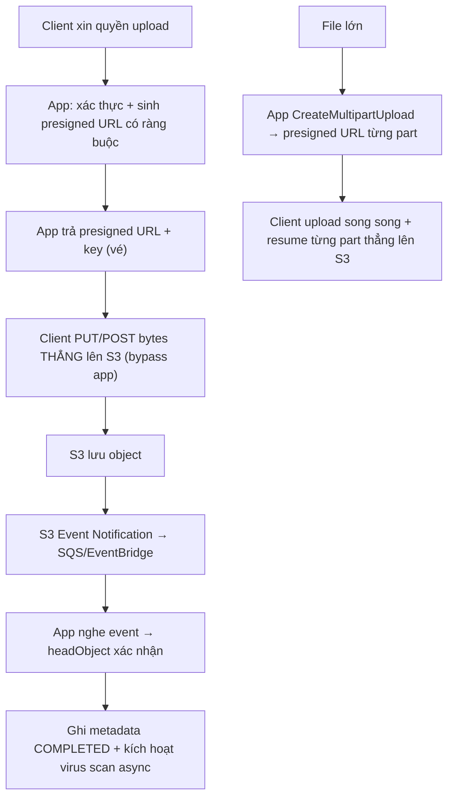

# Làm sao thiết kế upload không đi qua backend app quá nhiều?

## ⚡ Tóm tắt ngắn (30s)
* **Bản chất**: Để bytes **không** dồn lên backend, ta tách **control plane** (app) khỏi **data plane** (object storage). App **không** nhận/đẩy bytes; nó chỉ **cấp phép**: sinh **presigned URL** (hoặc presigned POST) có ràng buộc, client **upload thẳng lên S3**. App chỉ làm việc nhẹ: xác thực, ràng buộc (kích thước/kiểu/key), và **ghi metadata khi nhận S3 event** xác nhận object đã lên. Kết quả: app không tốn RAM/băng thông/thread cho file, scale upload độc lập với app.
* **Hướng xử lý**:
  1. **Presigned PUT/POST** cho file thường; **multipart với presigned URL từng part** cho file lớn.
  2. **Ràng buộc trong chữ ký**: `content-length-range`, content-type, key prefix, TTL ngắn → client **không** vượt giới hạn được.
  3. **Xác nhận bằng S3 Event Notification**, **không** tin client báo "đã xong".
* **Quyết định Senior**: App = **người gác cổng cấp vé**, S3 = **người nhận hàng**. Mọi ràng buộc nhét vào **chữ ký**, mọi xác nhận lấy từ **event của storage**, không từ lời client.

---

## 🔍 Chi tiết bản chất thực chiến

### 1. Vì sao đẩy bytes qua app là một phản mẫu
Khi file đi qua app, mỗi upload **giữ một thread**, **chiếm băng thông** ingress/egress của app, và (nếu buffer) **ăn RAM**. Upload là tác vụ **chậm và to** — đặt nó lên tiến trình xử lý request (vốn quý, hữu hạn) làm cạn thread pool, OOM, timeout, và buộc phải scale app theo lượng byte thay vì theo logic nghiệp vụ. Direct-to-storage gỡ bỏ toàn bộ gánh này.

### 2. Presigned URL (PUT) vs Presigned POST
* **Presigned PUT**: app ký một URL cho thao tác `PutObject` một object/một key; client `PUT` bytes thẳng. Đơn giản, hợp upload từng file.
* **Presigned POST (form)**: ký một **policy** cho phép `POST` form-data, hỗ trợ điều kiện mạnh như **`content-length-range`** (chặn kích thước **trước khi** nhận), giới hạn prefix key, content-type. Hợp upload từ trình duyệt với ràng buộc chặt.

### 3. Multipart cho file lớn — vẫn direct
File rất lớn không nên một-PUT. Mô hình:
* App `CreateMultipartUpload` → trả `uploadId` + **presigned URL cho từng part**.
* Client upload **song song** các part thẳng lên S3, retry/​resume **từng part**.
* Client (hoặc app) `CompleteMultipartUpload`. App **không** chạm byte nào; chỉ điều phối.

### 4. Ràng buộc nằm trong chữ ký, không trông chờ client tử tế
Vì client upload thẳng, app mất khả năng kiểm tra **trong lúc** nhận byte. Bù lại, **nhét ràng buộc vào chính chữ ký/policy**:
* **`content-length-range`** (presigned POST) chặn file quá lớn ngay tại S3.
* **Cố định key/prefix** theo user → client không ghi đè file người khác.
* **TTL ngắn** → vé hết hạn nhanh.
* Sau upload, app vẫn **verify** (sniff content-type thật, checksum, virus scan async) — vì content-type/đuôi file client khai **không đáng tin**.

### 5. Xác nhận bằng S3 Event, không bằng lời client
Client báo "tôi upload xong rồi" **không** đáng tin: client có thể nói dối, hoặc upload hỏng giữa chừng. Nguồn sự thật là **S3 Event Notification** (S3 → SQS/SNS/EventBridge/Lambda) bắn khi object **thực sự** xuất hiện. App nghe event → mới `headObject` xác nhận → ghi metadata `COMPLETED`. Đây cũng là móc nối để kích hoạt scan và đảm bảo consistency DB↔storage.

---

## 🎨 Sơ đồ trực quan: Control plane (app) tách khỏi data plane (S3)

Sơ đồ mô tả app chỉ cấp vé và nhận event, còn bytes đi thẳng client ↔ S3:



---

## 💻 Code thực chiến: BAD vs GOOD

Hai đoạn dưới tương phản: bytes đi qua app, và app chỉ cấp presigned URL có ràng buộc + xác nhận bằng event.

### ❌ BAD: Mọi byte đi qua app rồi app forward lên S3
```java
@PostMapping("/upload")
public String upload(@RequestParam MultipartFile file) throws IOException {
    byte[] data = file.getBytes();                 // ❌ app gánh toàn bộ bytes + buffer RAM
    s3.putObject(putReq("docs", file.getOriginalFilename()), RequestBody.fromBytes(data));
    metaRepo.markCompleted(file.getOriginalFilename()); // ❌ app vừa là control vừa là data plane
    return "ok"; // ❌ thread bị giữ suốt upload, scale app theo byte, dễ OOM/timeout
}
```

### ✅ GOOD: App cấp presigned POST có ràng buộc; xác nhận qua S3 event
```java
// 1) Control plane: app chỉ sinh vé upload có ràng buộc, KHÔNG chạm bytes
@PostMapping("/upload-url")
public PresignedPost createUploadUrl(@RequestBody UploadMeta meta, Principal user) {
    authz.assertCanUpload(user);
    String key = user.getName() + "/" + UUID.randomUUID();
    metaRepo.save(new FileMeta(key, Status.PENDING));   // ✅ ghi PENDING trước (consistency)

    return s3Presigner.presignPost(PostObjectPresignRequest.builder()
        .signatureDuration(Duration.ofMinutes(10))      // ✅ TTL ngắn
        .conditions(c -> c
            .contentLengthRange(1, 50 * 1024 * 1024)    // ✅ chặn kích thước NGAY tại S3 (<=50MB)
            .startsWith("$Content-Type", "image/")      // ✅ ràng buộc content-type khai báo
            .key(key))                                  // ✅ cố định key theo user, chống ghi đè
        .bucket("docs").build());
    // Client dùng form-data POST thẳng lên S3 -> bytes KHÔNG qua app
}

// 2) Xác nhận bằng S3 EVENT, không tin client báo "xong"
@SqsListener("s3-upload-events")
public void onObjectCreated(S3Event event) {
    String key = event.objectKey();
    HeadObjectResponse head = s3.headObject(headReq("docs", key)); // ✅ object THỰC SỰ tồn tại
    String realType = tika.detect(s3.getObjectRange("docs", key, 0, 512)); // ✅ sniff type thật
    if (!realType.startsWith("image/")) {              // ✅ không tin content-type client khai
        s3.deleteObject(delReq("docs", key));
        metaRepo.updateStatus(key, Status.FAILED);
        return;
    }
    metaRepo.complete(key, head.contentLength(), realType); // ✅ giờ mới COMPLETED
    scanQueue.send(key);                                // ✅ kích hoạt virus scan async
}
```

Multipart cho file lớn (app điều phối, không chạm byte):
```java
public MultipartTicket initMultipart(String key, int parts) {
    String uploadId = s3.createMultipartUpload(mpuReq("docs", key)).uploadId();
    List<String> urls = IntStream.rangeClosed(1, parts).mapToObj(p ->
        s3Presigner.presignUploadPart(uploadPartReq("docs", key, uploadId, p,
            Duration.ofMinutes(15))).url().toString()).toList(); // ✅ presigned từng part
    return new MultipartTicket(uploadId, urls);
}
```

---

## 📊 Bảng so sánh: bytes qua app vs direct-to-storage

Bảng dưới đối chiếu hai kiến trúc theo tải lên app và đặc tính vận hành:

| Tiêu chí | Bytes qua app | Direct-to-S3 (presigned) |
| :--- | :--- | :--- |
| **RAM/băng thông app** | Cao (gánh mọi byte) | ✅ Gần như 0 |
| **Thread giữ khi upload** | ✅ Có (dễ cạn pool) | ✅ Không |
| **Scale upload** | Theo byte, kéo theo app | ✅ Độc lập, S3 lo |
| **Kiểm tra trong lúc nhận** | Có (nhưng tốn tài nguyên) | Qua ràng buộc chữ ký + verify sau |
| **Nguồn xác nhận hoàn tất** | Response nội bộ | ✅ S3 Event (đáng tin hơn lời client) |
| **Độ phức tạp** | Thấp | Trung bình (event, multipart) |

---

## ⚠️ Common Gotchas & Questions follow-up

### 1. Cạm bẫy "tin content-type/đuôi file client gửi khi ký URL"
* Presigned chỉ ràng buộc được content-type **client khai báo**, không phải nội dung **thật**. Client có thể khai `image/png` rồi upload một file thực thi. Vì vậy sau khi object lên, app **bắt buộc** sniff magic bytes (Tika) để xác minh và **virus scan async**; nếu lệch thì xóa + `FAILED`. Direct-to-S3 không miễn cho ta khâu kiểm định — chỉ dời nó sang **sau** upload.

### 2. Cạm bẫy "không chặn kích thước nên client upload file khổng lồ"
* Nếu presigned PUT không kèm ràng buộc, client có thể upload file bao nhiêu cũng được → tốn dung lượng/tiền, hoặc DoS storage. Dùng **presigned POST với `content-length-range`** để S3 **từ chối ngay** file vượt ngưỡng, thay vì phát hiện sau khi đã nuốt hàng GB.

### 3. Câu hỏi đào sâu từ interviewer
* **Interviewer: "Nếu client upload thẳng lên S3 và app không thấy bytes, làm sao bạn vẫn kiểm soát được kích thước, định dạng, và biết chắc upload đã hoàn tất?"**
* **Trả lời**: Tôi chuyển từ "kiểm soát **trong lúc** nhận byte" sang "kiểm soát qua **ràng buộc chữ ký** và **xác minh sau**". Về **kích thước và content-type khai báo**: tôi dùng **presigned POST** nhúng `content-length-range` và điều kiện content-type vào **policy đã ký**, nên S3 **tự từ chối** file vượt giới hạn ngay tại nguồn — app không cần thấy byte vẫn chặn được. Về **định dạng thật**: vì client có thể khai gian content-type, sau khi object xuất hiện tôi sniff **magic bytes** (đọc vài trăm byte đầu qua range GET) và đẩy vào **virus scan async**; lệch hoặc nhiễm thì xóa và đánh dấu `FAILED`. Về **biết chắc đã hoàn tất**: tôi **không tin** client báo "xong" — nguồn sự thật là **S3 Event Notification**; khi S3 bắn event object-created, app `headObject` xác nhận object thực sự tồn tại với kích thước hợp lệ rồi mới ghi metadata `COMPLETED` và cho phép serve. Như vậy app vẫn là **người gác cổng** đầy đủ quyền kiểm soát — nó chỉ không còn là **đường ống** mà mọi byte phải chui qua. Ràng buộc nằm ở **chữ ký**, xác nhận đến từ **event của storage**, và kiểm định nội dung diễn ra **bất đồng bộ sau upload** — đủ ba lớp để vừa nhẹ app vừa an toàn.
