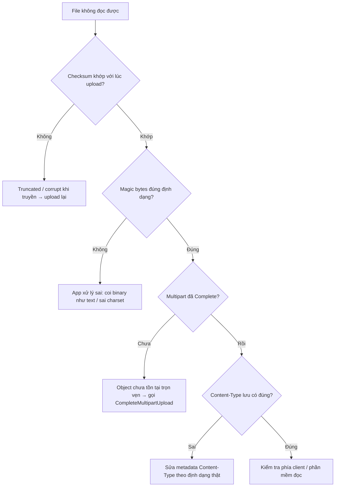

# Upload thành công nhưng file không đọc được. Nguyên nhân có thể là gì?

## ⚡ Tóm tắt ngắn (30s)
* **Bản chất**: "Upload thành công" theo nghĩa HTTP `200` **không** đảm bảo bytes trên storage **nguyên vẹn và đúng định dạng**. File hỏng khi đọc thường do: (1) **truncated** — kết nối đứt giữa chừng nhưng không có kiểm tra toàn vẹn; (2) **corrupt do xử lý sai** — coi binary như text, sai charset/encoding, nén/giải nén lệch; (3) **multipart chưa complete** — object thực ra chưa tồn tại trọn vẹn; (4) **sai Content-Type** khiến trình đọc hiểu nhầm định dạng.
* **Hướng xử lý**:
  1. **Kiểm tra toàn vẹn bằng checksum**: client gửi MD5/SHA-256, so với ETag/checksum của S3 sau khi upload. Lệch → coi như thất bại, không ghi `COMPLETED`.
  2. **Không bao giờ tin Content-Type của client**: sniff magic bytes (Apache Tika) để biết định dạng thật.
  3. **Đảm bảo `CompleteMultipartUpload`** thực sự chạy và đọc thử/validate trước khi đánh dấu file khả dụng.
* **Quyết định Senior**: Coi mỗi upload là **chưa tin được** cho đến khi **verify toàn vẹn + định dạng**. Storage chỉ lưu bytes — trách nhiệm đảm bảo "đọc được" thuộc về tầng ứng dụng.

---

## 🔍 Chi tiết bản chất thực chiến

### 1. Truncated upload — nguyên nhân số một
Mạng đứt giữa chừng, client gửi thiếu bytes nhưng app vẫn `200` vì không đối chiếu kích thước/checksum. File `.zip`/`.pdf` thiếu mấy KB cuối là hỏng hoàn toàn. Phòng tránh: gửi `Content-Length` chính xác, và **đối chiếu checksum** sau upload. S3 hỗ trợ `Content-MD5` header và trailing checksum (`x-amz-checksum-sha256`) để **chính S3 từ chối** part lệch.

### 2. Corrupt do xử lý sai phía app
* **Coi binary như text**: đọc file bằng `Reader`/`new String(bytes)` rồi ghi lại làm hỏng bytes (mọi byte không hợp lệ UTF-8 bị thay bằng ký tự thay thế). Ảnh/PDF/zip phải xử lý ở mức **byte**, không phải `String`.
* **Sai charset**: đọc CSV/text bằng charset khác lúc ghi (UTF-8 vs Windows-1258) → ký tự tiếng Việt vỡ. Phải cố định charset hai đầu.
* **Nén/giải nén lệch**: bật `Content-Encoding: gzip` nhưng lưu nội dung đã giải nén (hoặc ngược lại) → trình đọc giải nén nhầm.

### 3. Multipart chưa complete hoặc đọc khi đang ghi
Với S3 Multipart Upload, object **chưa tồn tại** cho đến khi `CompleteMultipartUpload`. Nếu app đánh dấu "xong" ngay sau khi upload part cuối mà chưa complete, hoặc một worker đọc file **trong khi** đang ghi (read-after-write trên đường ghi dở), sẽ ra file thiếu/không có. S3 đảm bảo **read-after-write** cho object mới, nhưng chỉ **sau khi** ghi hoàn tất.

### 4. Sai Content-Type / metadata
File bytes đúng nhưng `Content-Type` lưu sai (vd ảnh PNG gắn `application/octet-stream` hoặc `text/plain`) khiến browser/loader từ chối render. Đây không phải hỏng bytes mà là **hỏng metadata** — vẫn làm "không đọc được" từ góc người dùng. **Không tin** Content-Type client gửi; sniff magic bytes để xác định và lưu đúng.

---

## 🎨 Sơ đồ trực quan: Cây chẩn đoán "file không đọc được"

Sơ đồ giúp khoanh vùng nguyên nhân theo từng nhánh kiểm tra:



---

## 💻 Code thực chiến: BAD vs GOOD

Hai đoạn dưới tương phản: nhận file rồi tin tưởng mù quáng, và verify toàn vẹn + định dạng trước khi đánh dấu khả dụng.

### ❌ BAD: Tin "200 là xong", đọc binary như text
```java
public void store(MultipartFile file) throws IOException {
    // ❌ Đọc ảnh/pdf thành String -> hỏng mọi byte không hợp lệ UTF-8
    String content = new String(file.getBytes());
    s3.putObject(req("docs", file.getOriginalFilename(),
                     file.getContentType()),               // ❌ tin Content-Type của client
                 RequestBody.fromString(content));
    metaRepo.markCompleted(file.getOriginalFilename());    // ❌ chưa verify gì đã COMPLETED
}
```

### ✅ GOOD: Verify checksum + sniff định dạng + chỉ đánh dấu khi nguyên vẹn
```java
public void store(MultipartFile file, String clientSha256) throws IOException {
    byte[] bytes = file.getBytes(); // (file nhỏ; file lớn thì stream + checksum theo luồng)

    // ✅ 1) Toàn vẹn: tự tính SHA-256, đối chiếu giá trị client khai báo
    String actual = Hashing.sha256().hashBytes(bytes).toString();
    if (!actual.equalsIgnoreCase(clientSha256)) {
        throw new IntegrityException("Checksum lệch -> truncated/corrupt, từ chối lưu");
    }

    // ✅ 2) Định dạng thật: sniff magic bytes, KHÔNG tin Content-Type client
    String detected = tika.detect(bytes);                  // vd "image/png"
    if (!allowedTypes.contains(detected)) {
        throw new UnsupportedTypeException("Định dạng thật không cho phép: " + detected);
    }

    // ✅ 3) Ghi ở mức byte + lưu Content-Type ĐÚNG đã sniff được
    s3.putObject(req("docs", key, detected), RequestBody.fromBytes(bytes));

    // ✅ 4) Chỉ COMPLETED sau khi nguyên vẹn & đúng định dạng
    metaRepo.markCompleted(key, detected, actual);
}
```

Trên đường truyền, để **S3 tự bắt** part lệch bằng checksum:
```java
PutObjectRequest req = PutObjectRequest.builder()
    .bucket("docs").key(key)
    .checksumAlgorithm(ChecksumAlgorithm.SHA256) // ✅ S3 từ chối nếu bytes nhận được không khớp
    .build();
```

---

## 📊 Bảng so sánh các nguyên nhân & cách phát hiện

Bảng dưới ánh xạ từng nguyên nhân tới dấu hiệu và cách xử lý:

| Nguyên nhân | Dấu hiệu | Cách phát hiện | Cách xử lý |
| :--- | :--- | :--- | :--- |
| **Truncated** | File thiếu bytes cuối, lỗi khi mở | Checksum/size lệch | Bắt buộc checksum, upload lại |
| **Coi binary như text** | Ảnh/pdf vỡ, kích thước đổi | So sánh hash trước/sau khi app xử lý | Xử lý ở mức byte, không dùng `String` |
| **Sai charset** | Tiếng Việt vỡ trong text/CSV | Mở bằng nhiều charset | Cố định charset cả hai đầu |
| **Multipart chưa Complete** | Object không tồn tại / 0 byte | Kiểm tra trạng thái upload | Gọi `CompleteMultipartUpload`, dọn part dở |
| **Sai Content-Type** | Bytes đúng nhưng không render | Sniff magic bytes vs metadata | Sửa Content-Type theo định dạng thật |

---

## ⚠️ Common Gotchas & Questions follow-up

### 1. Cạm bẫy "ETag = MD5 nên cứ so ETag là xong"
* Với object **single-part**, ETag thường là MD5 và so sánh được. Nhưng với **multipart upload**, ETag là hash-của-các-hash kèm hậu tố `-<số part>`, **không** bằng MD5 của cả file. Đem MD5 toàn file so với ETag multipart sẽ luôn "lệch" sai. Khi dùng multipart, hãy dùng checksum **SHA-256 do S3 hỗ trợ** hoặc tự verify theo cùng cách S3 tính, đừng giả định ETag = MD5.

### 2. Cạm bẫy "tin phần mở rộng tên file"
* `report.pdf` có thể thực chất là một file `.exe` đổi tên. Dựa vào đuôi file để quyết định cách đọc/serve là vừa sai vừa rủi ro bảo mật. Luôn **sniff magic bytes** để xác định định dạng thật.

### 3. Câu hỏi đào sâu từ interviewer
* **Interviewer: "Hệ thống của bạn thỉnh thoảng có file PDF không mở được, nhưng không tái hiện được. Bạn điều tra thế nào?"**
* **Trả lời**: Tôi bắt đầu bằng việc xác định lỗi nằm ở **bytes** hay ở **cách đọc**. Đầu tiên đối chiếu **checksum** lưu lúc upload với checksum tính lại từ object trên storage: nếu lệch → bytes đã hỏng (truncated/corrupt khi truyền), tôi truy log xem có ngắt kết nối, có dùng multipart mà thiếu `Complete`, hay đường ghi không kiểm tra `Content-MD5`. Nếu checksum **khớp** mà vẫn không mở được, vấn đề ở tầng app: tôi kiểm tra có đoạn nào đọc file qua `String`/`Reader` làm hỏng byte, charset có bị đổi, `Content-Type` lưu có đúng không. Vì lỗi "thỉnh thoảng" thường là **race** — đọc file khi đang ghi dở hoặc trước khi multipart complete — nên tôi soát kỹ luồng đánh dấu `COMPLETED`: phải đảm bảo chỉ đánh dấu **sau** khi verify toàn vẹn. Cuối cùng tôi thêm checksum bắt buộc và bước verify định dạng vào pipeline để biến lỗi "thỉnh thoảng, không tái hiện" thành lỗi **bị chặn ngay tại cổng** với log rõ nguyên nhân.
