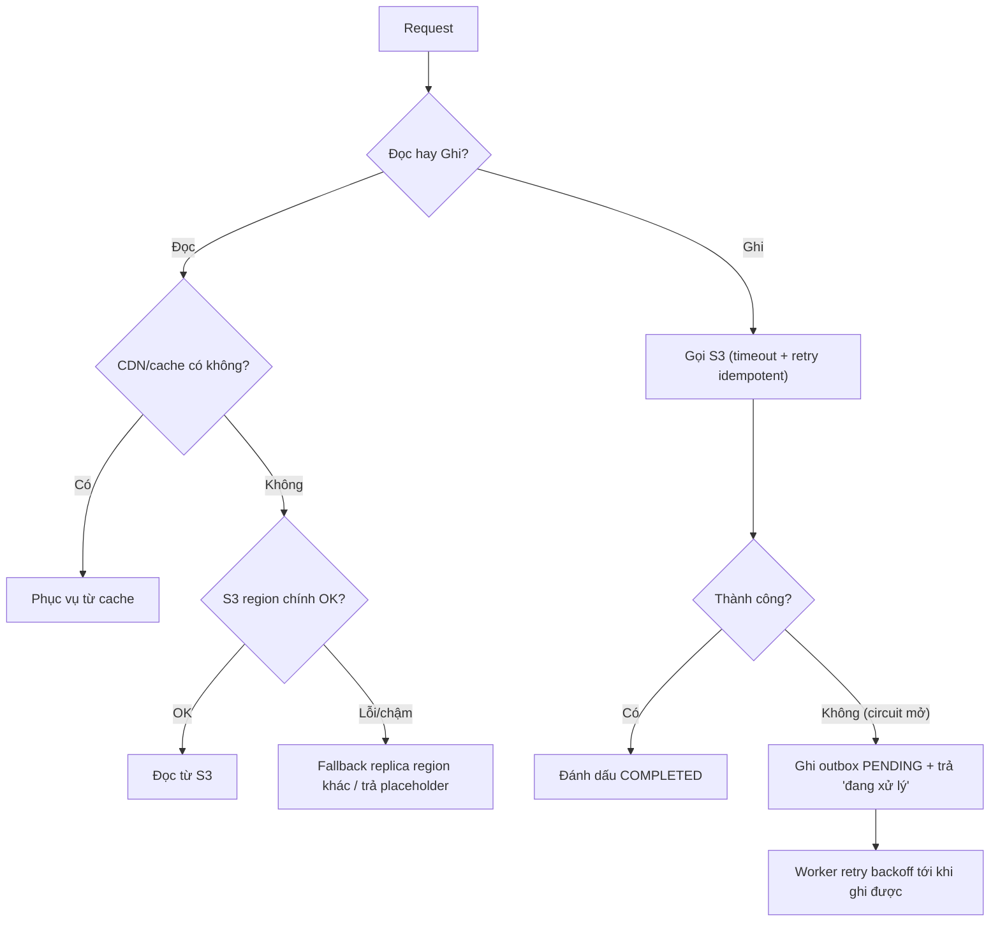

# Object storage chậm hoặc lỗi. Service nên fallback thế nào?

## ⚡ Tóm tắt ngắn (30s)
* **Bản chất**: Object storage (S3/GCS) là dependency mạng — nó **sẽ** có lúc chậm (p99 tăng vọt) hoặc lỗi (5xx, throttling `503 SlowDown`). Fallback đúng **không phải** một chiêu duy nhất, mà phải **tách đường đọc và đường ghi** vì chúng có ràng buộc khác nhau: đọc cần *có dữ liệu để trả*, ghi cần *không mất dữ liệu*.
* **Hướng xử lý**:
  1. **Đường ĐỌC**: phục vụ qua **CDN/cache** (giảm phụ thuộc trực tiếp), fallback sang **replica/region khác**, hoặc trả **placeholder/degraded** thay vì để user chờ.
  2. **Đường GHI**: **không chặn user vô hạn** — đẩy vào **queue/outbox** để retry bất đồng bộ với backoff, trả trạng thái "đang xử lý"; tuyệt đối không "im lặng nuốt lỗi".
  3. **Timeout + retry có giới hạn + circuit breaker**: fail-fast khi storage đang sự cố để không kéo sập cả service theo.
* **Quyết định Senior**: Bọc mọi call storage bằng **timeout ngắn + retry idempotent + circuit breaker**; **đọc** thì degrade graceful, **ghi** thì bền bỉ hóa qua queue. Mục tiêu: storage lỗi ⇒ **suy giảm cục bộ**, không **sập dây chuyền**.

---

## 🔍 Chi tiết bản chất thực chiến

### 1. Vì sao phải tách đọc/ghi
* **Đọc** một file đang lỗi: user chỉ cần *một bản nào đó* — có thể lấy từ CDN cache, từ region replica, hoặc tệ nhất là báo "tạm thời không tải được" rồi cho retry. Mất mát chấp nhận được là **tạm thời không thấy**.
* **Ghi** một file đang lỗi: nếu nuốt lỗi, dữ liệu **mất vĩnh viễn**. Mất mát ở đây **không** chấp nhận được → phải bền bỉ hóa (queue/outbox) để chắc chắn ghi lại được sau.

### 2. Timeout + retry + circuit breaker — bộ ba bắt buộc
* **Timeout ngắn**: không để một call S3 treo 60s giữ thread. Đặt connect/read timeout ở mức giây.
* **Retry có giới hạn + exponential backoff + jitter**: lỗi `503 SlowDown`/`500` thường thoáng qua; retry 2–3 lần với backoff. Nhưng retry phải **idempotent** (cùng key) để không tạo bản trùng.
* **Circuit breaker**: khi tỉ lệ lỗi vượt ngưỡng, "mở mạch" để **fail-fast** trong một khoảng — tránh hàng nghìn request cùng chờ timeout làm cạn thread pool và sập cả service (cascading failure).

### 3. Fallback đường đọc
* **CDN/cache trước S3**: CloudFront/Cache đứng trước bucket → phần lớn read không chạm S3; khi S3 chậm, nội dung đã cache vẫn phục vụ được.
* **Multi-region / replica**: bật cross-region replication, đọc fallback sang bucket region khác khi region chính lỗi.
* **Degraded response**: ảnh đại diện → trả ảnh placeholder; tài liệu → báo "đang tải lại", không để spinner quay vô hạn.

### 4. Fallback đường ghi: queue/outbox, không chặn
Khi ghi S3 lỗi sau vài retry, **đừng** trả lỗi cứng cho user nếu nghiệp vụ cho phép trễ. Thay vào đó:
* Ghi một bản ghi **outbox** (`PENDING_UPLOAD`) vào DB (hoặc message vào queue) làm "ý định ghi".
* Một **worker** poll lại và retry đẩy lên S3 với backoff cho tới khi thành công, rồi cập nhật `COMPLETED`.
* Trả user trạng thái "đang xử lý" trung thực. Đây cũng chính là nền tảng để **reconcile** và dọn orphan sau này.

---

## 🎨 Sơ đồ trực quan: Fallback tách đường đọc và đường ghi

Sơ đồ mô tả cách bọc storage bằng circuit breaker và rẽ nhánh fallback theo loại thao tác:



---

## 💻 Code thực chiến: BAD vs GOOD

Hai đoạn dưới tương phản: gọi storage trần trụi không bảo vệ, và bọc bằng circuit breaker với fallback theo đường đọc/ghi.

### ❌ BAD: Gọi S3 trần, không timeout, nuốt lỗi khi ghi
```java
public byte[] read(String key) {
    return s3.getObjectAsBytes(req(key)).asByteArray(); // ❌ không timeout, S3 chậm -> treo thread
}

public void write(String key, byte[] data) {
    try {
        s3.putObject(putReq(key), RequestBody.fromBytes(data));
    } catch (Exception e) {
        log.warn("upload failed");  // ❌ nuốt lỗi -> dữ liệu MẤT vĩnh viễn, không ai biết
    }
}
```

### ✅ GOOD: Circuit breaker + fallback đọc, outbox cho ghi (Resilience4j)
```java
@CircuitBreaker(name = "s3", fallbackMethod = "readFallback")
@TimeLimiter(name = "s3")
public CompletableFuture<byte[]> read(String key) {
    return CompletableFuture.supplyAsync(() -> s3.getObjectAsBytes(req(key)).asByteArray());
}

// ✅ Đường ĐỌC: degrade graceful thay vì để user chờ vô hạn
private CompletableFuture<byte[]> readFallback(String key, Throwable ex) {
    byte[] cached = cdnCache.get(key);                 // thử cache/replica trước
    return CompletableFuture.completedFuture(
        cached != null ? cached : placeholderBytes);   // cùng lắm trả placeholder
}

@CircuitBreaker(name = "s3", fallbackMethod = "writeFallback")
public WriteResult write(String key, byte[] data) {
    s3.putObject(putReq(key), RequestBody.fromBytes(data)); // SDK đã retry idempotent theo cùng key
    return WriteResult.completed(key);
}

// ✅ Đường GHI: KHÔNG nuốt lỗi -> bền bỉ hóa qua outbox để retry sau
private WriteResult writeFallback(String key, byte[] data, Throwable ex) {
    outbox.save(new PendingUpload(key, data, Status.PENDING)); // worker sẽ retry với backoff
    return WriteResult.pending(key); // trả 'đang xử lý' trung thực, dữ liệu không mất
}
```

Cấu hình Resilience4j (YAML):
```yaml
resilience4j:
  circuitbreaker:
    instances:
      s3:
        slidingWindowSize: 20
        failureRateThreshold: 50      # >50% lỗi -> mở mạch, fail-fast
        waitDurationInOpenState: 10s  # nghỉ 10s rồi thử half-open
  timelimiter:
    instances:
      s3:
        timeoutDuration: 3s           # không để call S3 treo lâu
```

---

## 📊 Bảng so sánh chiến lược fallback theo loại thao tác

Bảng dưới đối chiếu fallback cho đường đọc và đường ghi:

| Tiêu chí | Đường ĐỌC | Đường GHI |
| :--- | :--- | :--- |
| **Mất mát chấp nhận được** | Tạm thời không thấy nội dung | ❌ Không được mất dữ liệu |
| **Fallback chính** | CDN/cache → replica → placeholder | Outbox/queue retry bất đồng bộ |
| **Trả về user** | Nội dung cũ / placeholder / "thử lại" | "Đang xử lý" (rồi báo khi xong) |
| **Vai trò circuit breaker** | Fail-fast, tránh treo thread | Fail-fast, rồi rớt sang outbox |
| **Rủi ro nếu làm sai** | Spinner quay mãi, UX kém | Nuốt lỗi → mất file vĩnh viễn |

---

## ⚠️ Common Gotchas & Questions follow-up

### 1. Cạm bẫy "retry mà không idempotent → ghi trùng/đốt tiền"
* Storage chậm khiến nhiều request retry; nếu mỗi retry tạo một **key mới** (vd gắn timestamp), một file sẽ thành nhiều bản trên S3 → tốn dung lượng, lệch metadata, khó dọn. Retry phải dùng **cùng object key** (idempotent) để lần ghi sau ghi đè đúng chỗ.

### 2. Cạm bẫy "retry bão hòa khi S3 đang throttle"
* Khi S3 trả `503 SlowDown`, retry **dồn dập không backoff** càng làm nó throttle nặng hơn (retry storm). Phải **exponential backoff + jitter**, và để **circuit breaker** mở mạch khi lỗi diện rộng, nhường thời gian cho storage hồi phục.

### 3. Câu hỏi đào sâu từ interviewer
* **Interviewer: "User upload một hợp đồng quan trọng, đúng lúc S3 đang sự cố. Bạn fallback ra sao mà không mất file cũng không bắt user ngồi chờ?"**
* **Trả lời**: Tôi tách rõ "nhận dữ liệu" khỏi "ghi xong dữ liệu". Trước hết, lý tưởng nhất là client upload **thẳng lên S3 qua presigned URL** với retry/backoff phía client — nhưng nếu S3 đang lỗi cả đường đó, tôi nhận bytes vào một **bộ đệm bền** (vd ghi tạm vào một queue/outbox có persistence, hoặc một storage phụ ở region khác) và **xác nhận đã nhận** cho user với trạng thái "đang lưu". Lúc này dữ liệu **đã an toàn**, không phụ thuộc S3 còn sống hay không. Một worker bền bỉ retry đẩy lên S3 với exponential backoff cho tới khi `COMPLETED`, rồi mới đánh dấu file khả dụng và (nếu cần) thông báo cho user. Tôi bọc toàn bộ bằng **circuit breaker** để fail-fast trong lúc S3 chập chờn, tránh giữ thread. Điểm mấu chốt là **không bao giờ nuốt lỗi ghi** và **không bao giờ bắt user đồng bộ chờ một dependency đang sự cố** — tôi biến thao tác ghi thành **bất đồng bộ, có bảo đảm**, để đúng lúc S3 hồi phục thì file tự được đẩy lên mà không mất mát.
