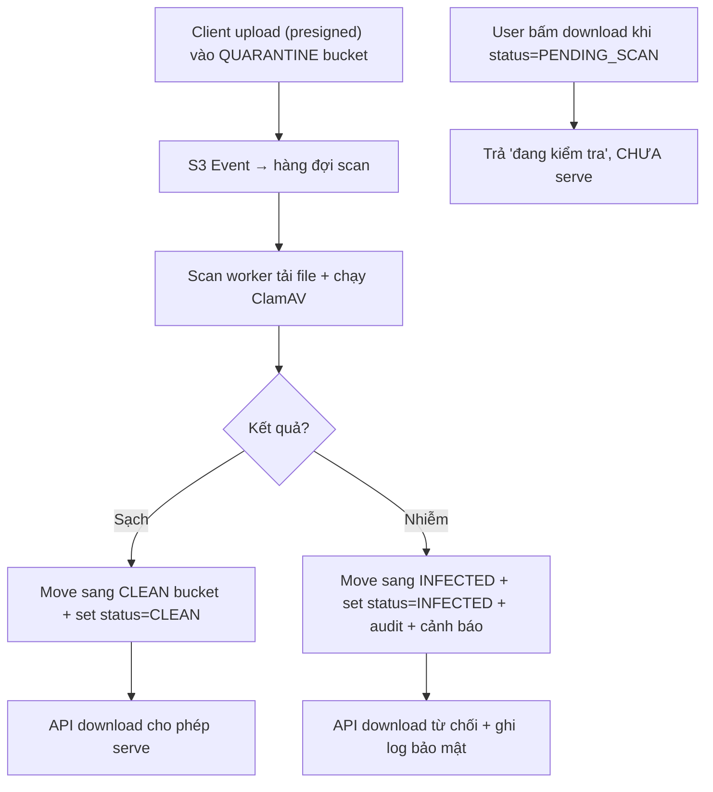

# Virus scan file upload nên đặt ở đâu trong flow?

## ⚡ Tóm tắt ngắn (30s)
* **Bản chất**: Virus scan **không được** đặt **đồng bộ trên đường upload** (chặn request, ClamAV quét vài trăm MB mất hàng giây → timeout, cạn thread). Cũng **không được** để file "scan dở" lọt ra cho người khác tải. Mô hình đúng là **quarantine + scan bất đồng bộ theo event**: file vào **bucket cách ly**, một event kích hoạt worker quét, **sạch thì chuyển sang bucket sạch** và mới cho phép truy cập.
* **Hướng xử lý**:
  1. Upload vào **quarantine bucket** (private tuyệt đối, không ai serve được từ đây).
  2. **S3 event → worker scan** (ClamAV/GuardDuty Malware Protection) **bất đồng bộ**.
  3. **State machine**: `PENDING_SCAN → CLEAN | INFECTED`. **Chặn download** tới khi `CLEAN`. Nhiễm thì cách ly/xóa + cảnh báo.
* **Quyết định Senior**: Scan là **gate bất đồng bộ giữa "đã upload" và "được phép dùng"**, không phải bước chặn trên request. Quy tắc bất biến: **không bao giờ serve file chưa CLEAN**.

---

## 🔍 Chi tiết bản chất thực chiến

### 1. Vì sao không scan đồng bộ trong request upload
* Quét virus là tác vụ **CPU/IO nặng**, thời gian phụ thuộc kích thước file → không xác định. Nhét vào request đồng bộ làm **timeout**, giữ thread, và phá vỡ mô hình **direct-to-S3** (khi dùng presigned URL, bytes còn **không đi qua app** thì lấy gì để app scan inline).
* Quét đồng bộ cũng khiến mỗi lần đổi engine/định nghĩa virus đều ảnh hưởng latency đường nóng. Tách ra async giúp scan **co giãn độc lập**.

### 2. Mô hình Quarantine (cách ly) — trái tim của giải pháp
* **Quarantine bucket**: nơi nhận mọi upload. Bucket này **không** được gắn vào CDN, **không** cấp presigned GET cho người dùng khác — chỉ worker scan đọc được.
* Sau khi scan:
  * **CLEAN** → **copy/move** sang **clean bucket** (nơi mới được phép serve), cập nhật trạng thái khả dụng.
  * **INFECTED** → xóa hoặc chuyển sang **infected bucket** để điều tra, ghi audit, cảnh báo bảo mật, **không bao giờ** chuyển sang clean.
* Việc tách bucket khiến "đã scan sạch" trở thành **bất biến vật lý**: chỉ cần file ở clean bucket nghĩa là đã qua gate.

### 3. Kích hoạt bằng event, không poll
S3 **Event Notification** (qua SQS/SNS/EventBridge/Lambda) bắn khi có object mới ở quarantine → đẩy vào hàng đợi scan. Worker tiêu thụ, tải file (stream, không buffer cả file lớn vào RAM), chạy ClamAV, ghi kết quả. Dùng queue giúp **đệm tải**, **retry** khi worker lỗi, và **scale** số worker theo lượng upload.

### 4. State machine & quy tắc serve
Mỗi file có trạng thái: `PENDING_SCAN` (vừa upload) → `CLEAN` / `INFECTED`. **Mọi** API download/serve phải kiểm tra `status == CLEAN`; `PENDING_SCAN` trả "đang kiểm tra", `INFECTED` trả từ chối + audit. Đây là điểm sống còn: kể cả khi UI lỡ hiện link, backend **vẫn chặn** file chưa sạch.

### 5. Managed scanning
Nếu không tự vận hành ClamAV, có thể dùng dịch vụ managed (vd **GuardDuty Malware Protection for S3**) tự quét object mới và gắn tag kết quả — nhưng **nguyên tắc kiến trúc không đổi**: quarantine, async, chặn-tới-khi-sạch.

---

## 🎨 Sơ đồ trực quan: Quarantine + scan bất đồng bộ theo event

Sơ đồ mô tả vòng đời file từ lúc upload vào quarantine tới khi được phép serve:



---

## 💻 Code thực chiến: BAD vs GOOD

Hai đoạn dưới tương phản: scan đồng bộ chặn request, và scan bất đồng bộ theo event với quy tắc chặn-tới-khi-sạch.

### ❌ BAD: Scan đồng bộ ngay trong request upload
```java
@PostMapping("/upload")
public String upload(@RequestParam MultipartFile file) throws IOException {
    byte[] data = file.getBytes();              // ❌ buffer cả file vào RAM
    ScanResult r = clamav.scan(data);           // ❌ quét đồng bộ -> giữ thread vài giây, timeout
    if (r.isInfected()) return "rejected";
    s3.putObject(putReq("docs", file.getOriginalFilename()), RequestBody.fromBytes(data));
    return "ok"; // ❌ phá vỡ direct-to-S3; không scale; mỗi upload nặng đường nóng
}
```

### ✅ GOOD: Vào quarantine, scan theo event, chặn tới khi CLEAN
```java
// 1) Cấp presigned URL trỏ vào QUARANTINE bucket; bytes không qua app
@PostMapping("/upload-url")
public UploadTicket uploadUrl(@RequestBody UploadMeta meta, Principal user) {
    String key = user.getName() + "/" + UUID.randomUUID();
    fileRepo.save(new FileRecord(key, Status.PENDING_SCAN));   // ✅ trạng thái chờ scan
    var url = presigner.presignPutObject(/* bucket = QUARANTINE */ ...);
    return new UploadTicket(url, key);
}

// 2) Worker tiêu thụ S3 event, scan bất đồng bộ
@SqsListener("file-scan-queue")
public void onUploaded(S3Event e) {
    String key = e.objectKey();
    try (InputStream in = s3.getObject(quarantineReq(key))) { // ✅ stream, không nạp cả file
        ScanResult r = clamav.scanStream(in);
        if (r.isClean()) {
            s3.copyObject(quarantine(key), clean(key));         // ✅ chỉ file sạch sang clean bucket
            s3.deleteObject(quarantineReq(key));
            fileRepo.updateStatus(key, Status.CLEAN);
        } else {
            s3.copyObject(quarantine(key), infected(key));
            fileRepo.updateStatus(key, Status.INFECTED);        // ✅ cách ly + audit
            alerts.securityAlert("Malware: " + key);
        }
    }
}

// 3) Cổng download: KHÔNG bao giờ serve file chưa CLEAN
@GetMapping("/files/{id}")
public ResponseEntity<?> download(@PathVariable String id) {
    FileRecord f = fileRepo.get(id);
    if (f.getStatus() != Status.CLEAN) {                        // ✅ bất biến: chỉ serve CLEAN
        return ResponseEntity.status(425).body("Đang kiểm tra an toàn, thử lại sau");
    }
    return ResponseEntity.ok(presigner.presignGetObject(cleanReq(f.getKey())).url().toString());
}
```

---

## 📊 Bảng so sánh vị trí đặt virus scan

Bảng dưới đối chiếu các vị trí đặt scan trong flow:

| Vị trí scan | Ảnh hưởng latency | Hợp direct-to-S3? | Rủi ro serve file bẩn | Khả năng scale |
| :--- | :--- | :--- | :--- | :--- |
| **Đồng bộ trong request** | ❌ Cao, dễ timeout | ❌ Không (bytes phải qua app) | Thấp | ❌ Kém |
| **Async theo event + quarantine** | ✅ Không ảnh hưởng đường nóng | ✅ Có | ✅ Thấp (chặn tới CLEAN) | ✅ Tốt |
| **Managed (GuardDuty Malware)** | ✅ Không ảnh hưởng | ✅ Có | ✅ Thấp | ✅ Tự scale |
| **Không scan, scan khi download** | Tăng latency lúc tải | Một phần | Trung bình (quét lại mỗi lần) | Trung bình |

---

## ⚠️ Common Gotchas & Questions follow-up

### 1. Cạm bẫy "serve file ngay sau upload, scan sau"
* Lỗi phổ biến: upload xong là cấp link tải ngay, scan chạy nền nhưng **không chặn** download. Trong khoảng `PENDING_SCAN`, người khác đã có thể tải file nhiễm. Quy tắc bất biến phải là **chặn download cho tới khi `CLEAN`** — UI có thể hiện "đang kiểm tra", nhưng **backend là nơi cưỡng chế**, không phụ thuộc UI ẩn link.

### 2. Cạm bẫy "TOCTOU — quét rồi đường khác đọc bản chưa quét"
* Nếu để file ở **cùng một bucket** và chỉ đổi một cờ `is_clean`, vẫn có đường đọc bỏ qua cờ (presigned URL cũ, CDN cache). Tách **quarantine vs clean bucket** biến "đã sạch" thành ranh giới vật lý: file ở clean bucket nghĩa là đã qua gate, không có đường tắt.

### 3. Câu hỏi đào sâu từ interviewer
* **Interviewer: "Bạn dùng presigned URL cho client upload thẳng lên S3 — vậy đặt virus scan ở đâu, vì app đâu còn thấy bytes?"**
* **Trả lời**: Chính vì bytes bypass app nên scan **phải** là một bước bất đồng bộ **sau** khi object đã nằm trên storage, chứ không thể inline trong request. Tôi cho presigned URL trỏ vào **quarantine bucket** — một bucket private hoàn toàn, không gắn CDN, không cấp GET cho ai ngoài scan worker. Khi object xuất hiện, **S3 Event Notification** bắn ra một message; một fleet **scan worker** tiêu thụ, stream file từ quarantine, chạy ClamAV (hoặc dùng managed malware scanning), rồi cập nhật **state machine** của file. Chỉ khi `CLEAN`, tôi mới copy object sang **clean bucket** và từ đó mới cấp presigned GET cho người dùng. Mọi API download đều kiểm tra trạng thái và **từ chối phục vụ bất cứ thứ gì chưa `CLEAN`**. Như vậy tôi vừa giữ được lợi ích của direct-to-S3 (không gánh bytes, không timeout), vừa đảm bảo không một file chưa quét nào lọt ra ngoài — scan trở thành **cổng giữa "đã tải lên" và "được phép dùng"**, đúng chỗ của nó.
