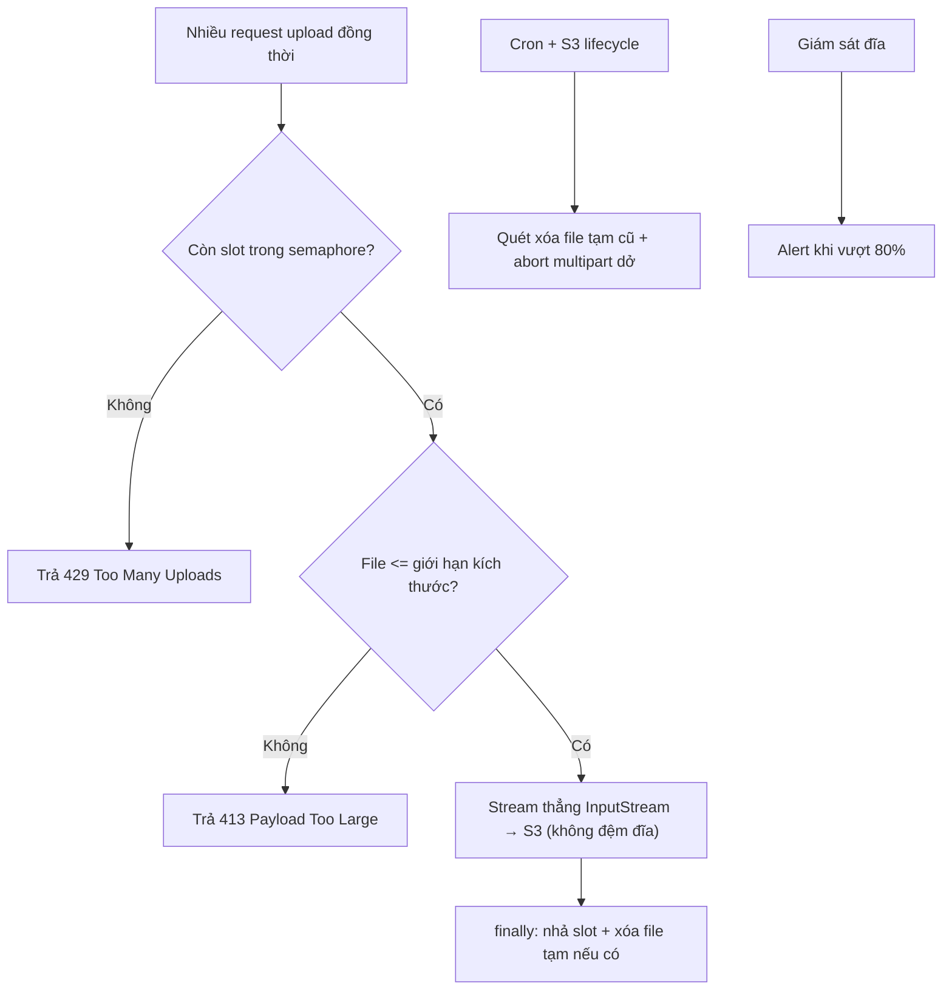

# Upload nhiều file cùng lúc làm đầy disk tạm. Bạn xử lý ra sao?

## ⚡ Tóm tắt ngắn (30s)
* **Bản chất**: Disk tạm đầy là hệ quả của việc app **đệm mỗi upload xuống đĩa local** (`/tmp`, thư mục multipart của Tomcat) **trước khi** đẩy đi nơi khác. Khi có nhiều upload đồng thời (mỗi file vài trăm MB) hoặc khi **không dọn file tạm**, đĩa cạn → app, log, thậm chí cả OS lăn ra lỗi (`No space left on device`), ảnh hưởng **mọi** request chứ không riêng upload.
* **Hướng xử lý**:
  1. **Đừng đệm xuống đĩa local**: stream thẳng lên object storage, hoặc tốt nhất là **direct-to-S3** (bytes không qua app).
  2. **Chặn nguồn**: giới hạn **kích thước file** + **số upload đồng thời** (semaphore/bulkhead) để bound dung lượng tạm theo công thức rõ ràng.
  3. **Dọn dẹp bảo đảm**: xóa file tạm trong `finally`, đặt **TTL/cron** quét file tạm cũ, và **giám sát + cảnh báo** ngưỡng đĩa.
* **Quyết định Senior**: Coi disk tạm là **tài nguyên hữu hạn phải bound**, không phải kho vô hạn. Mặc định **không chạm đĩa local**; nếu buộc phải, thì **giới hạn + cleanup + alert** thành ba lớp bắt buộc.

---

## 🔍 Chi tiết bản chất thực chiến

### 1. Vì sao đĩa tạm đầy lại nguy hiểm hơn vẻ ngoài
Khi `/tmp` hoặc volume chứa thư mục tạm đầy, **không chỉ upload hỏng**: ghi log thất bại, DB embedded/temp table lỗi, session file không tạo được,健康 check fail → pod bị kill. Một sự cố tưởng cục bộ ở tính năng upload **lan ra toàn service**. Đây là lý do phải xử lý từ gốc, không chỉ "thêm đĩa".

### 2. Nguồn gốc: app đệm file xuống đĩa
* Spring `MultipartResolver` mặc định ghi phần file lớn ra thư mục tạm (`fileSizeThreshold`). Mỗi request upload tạo một file tạm; nếu không dọn, chúng tích tụ.
* Pattern "tải file về `/tmp` để xử lý rồi mới đẩy lên S3" nhân đôi dung lượng và phụ thuộc đĩa.
* **Multipart upload dở** của S3 cũng để lại các part chiếm chỗ (nhưng ở S3, không phải đĩa local) — liên quan tới dọn dẹp lifecycle (xem mục 4).

### 3. Bound dung lượng bằng công thức
Dung lượng tạm tối đa có thể chặn trên bằng:

$$ D_{max} = N_{concurrent} \times S_{file} $$

trong đó $N_{concurrent}$ là số upload đồng thời cho phép (bound bằng semaphore/bulkhead) và $S_{file}$ là kích thước file tối đa. Nếu **không bound** $N$ hoặc $S$, $D_{max}$ là **vô hạn** → đĩa chắc chắn có lúc đầy. Senior **luôn** đặt cả hai giới hạn để $D_{max}$ là một số biết trước, nhỏ hơn dung lượng đĩa thực tế (trừ hao).

### 4. Ba lớp phòng thủ
* **Lớp 1 — Không đệm**: stream thẳng (`InputStream` → S3) hoặc direct-to-S3 presigned URL → đĩa local **không** giữ bytes.
* **Lớp 2 — Giới hạn**: `max-file-size`, `max-request-size`, và **semaphore/bulkhead** giới hạn số upload song song; vượt → trả `429` chứ không nhận thêm.
* **Lớp 3 — Dọn & giám sát**: xóa tạm trong `finally`; cron quét file tạm quá tuổi; **S3 lifecycle** `AbortIncompleteMultipartUpload` để dọn part dở; alert khi đĩa > 80%.

---

## 🎨 Sơ đồ trực quan: Ba lớp chặn đĩa tạm đầy

Sơ đồ mô tả luồng upload có bound đồng thời, stream thẳng, và dọn dẹp bảo đảm:



---

## 💻 Code thực chiến: BAD vs GOOD

Hai đoạn dưới tương phản: tải file xuống `/tmp` không giới hạn, và stream thẳng có bound đồng thời + cleanup bảo đảm.

### ❌ BAD: Tải về /tmp, không giới hạn, không dọn
```java
@PostMapping("/upload")
public String upload(@RequestParam MultipartFile file) throws IOException {
    File tmp = new File("/tmp/" + file.getOriginalFilename());
    file.transferTo(tmp);                 // ❌ ghi xuống đĩa local, nhiều upload -> đầy /tmp
    process(tmp);
    s3.putObject(putReq(tmp.getName()), RequestBody.fromFile(tmp));
    // ❌ KHÔNG xóa tmp -> file tạm tích tụ tới khi 'No space left on device'
    return "ok";
}
```

### ✅ GOOD: Stream thẳng + bound đồng thời + cleanup trong finally
```java
private final Semaphore uploadSlots = new Semaphore(20); // ✅ tối đa 20 upload song song

@PostMapping("/upload")
public ResponseEntity<String> upload(@RequestParam MultipartFile file) throws Exception {
    if (file.getSize() > MAX_SIZE) {                       // ✅ chặn kích thước
        return ResponseEntity.status(413).body("File quá lớn");
    }
    if (!uploadSlots.tryAcquire()) {                       // ✅ bound số đồng thời
        return ResponseEntity.status(429).body("Đang quá tải upload, thử lại sau");
    }
    try (InputStream in = file.getInputStream()) {         // ✅ stream, KHÔNG ghi /tmp
        s3.putObject(putReq(key(file)), RequestBody.fromInputStream(in, file.getSize()));
        return ResponseEntity.ok("ok");
    } finally {
        uploadSlots.release();                             // ✅ luôn nhả slot dù lỗi
    }
}
```

Cấu hình Spring để không đệm file lớn ra đĩa quá ngưỡng & giới hạn kích thước:
```yaml
spring:
  servlet:
    multipart:
      max-file-size: 50MB        # ✅ chặn từng file
      max-request-size: 200MB    # ✅ chặn tổng request (>= max-file-size)
      file-size-threshold: 2KB   # phần vượt ngưỡng mới ghi tạm; nên stream để tránh hẳn
```

S3 lifecycle dọn multipart dở (Terraform/JSON) và cron quét tạm:
```bash
# ✅ Dọn file tạm cũ hơn 1 giờ (cron mỗi 15 phút), tránh tích tụ
find /tmp/uploads -type f -mmin +60 -delete
```
```json
// ✅ S3 lifecycle: tự hủy multipart upload dở sau 1 ngày, không để part rác chiếm chỗ
{ "Rules": [ { "ID": "abort-incomplete-mpu", "Status": "Enabled",
  "AbortIncompleteMultipartUpload": { "DaysAfterInitiation": 1 } } ] }
```

---

## 📊 Bảng so sánh hướng xử lý đĩa tạm

Bảng dưới đối chiếu các hướng theo mức phụ thuộc đĩa local và độ an toàn:

| Hướng | Dùng đĩa local? | Bound được dung lượng? | Rủi ro còn lại |
| :--- | :--- | :--- | :--- |
| **Tải về /tmp, không dọn** | ✅ Nhiều | ❌ Không | Đầy đĩa, sập cả service |
| **Stream thẳng → S3** | ❌ Gần như không | ✅ Có | Cần vẫn bound đồng thời |
| **Direct-to-S3 (presigned)** | ❌ Không | ✅✅ Tốt nhất | Bytes không qua app |
| **Thêm đĩa / volume to hơn** | ✅ | ❌ Chỉ trì hoãn | Vẫn đầy khi tải tăng |

---

## ⚠️ Common Gotchas & Questions follow-up

### 1. Cạm bẫy "tăng đĩa thay vì bound nguồn"
* Phản xạ "đĩa đầy thì thêm đĩa" chỉ **dời mốc sập** ra xa. Khi không giới hạn số upload đồng thời và kích thước, $D_{max}$ vẫn vô hạn — chỉ cần một đợt upload hàng loạt (hoặc kẻ tấn công cố tình) là đầy lại. Phải **bound nguồn** trước, thêm đĩa chỉ là biện pháp phụ.

### 2. Cạm bẫy "không dọn khi lỗi giữa chừng"
* Nếu xóa file tạm **sau** bước xử lý mà bước đó ném exception, lệnh xóa **không bao giờ chạy** → rác tích tụ đúng vào lúc hệ thống đang lỗi (tệ nhất). Luôn dọn trong `finally` (hoặc try-with-resources), không đặt cleanup ở "đường thành công".

### 3. Câu hỏi đào sâu từ interviewer
* **Interviewer: "Pod của bạn thỉnh thoảng `CrashLoopBackOff` với lỗi `No space left on device`, nhưng dung lượng file trong DB không lớn. Bạn điều tra và xử lý thế nào?"**
* **Trả lời**: Dấu hiệu "DB không lớn nhưng đĩa đầy" gợi ý rác **không được dọn** chứ không phải dữ liệu thật phình. Tôi kiểm tra ngay thư mục tạm (`/tmp`, thư mục multipart của Tomcat, thư mục download tạm) bằng `du -sh` để xem ai chiếm chỗ — thường là **file upload tạm không được xóa** khi request lỗi giữa chừng, hoặc các bản tải-về-để-xử-lý còn sót. Khắc phục tức thời: cron `find ... -mmin +60 -delete` và mở rộng tạm thời để pod sống lại. Khắc phục gốc: (1) chuyển sang **stream thẳng lên S3** hoặc **direct-to-S3** để đĩa local không còn giữ bytes; (2) **bound** số upload đồng thời bằng semaphore và giới hạn `max-file-size` để $D_{max} = N \times S$ là số biết trước, nhỏ hơn đĩa thực; (3) đảm bảo **cleanup trong `finally`**; (4) thêm **S3 lifecycle** abort multipart dở; (5) gắn **alert đĩa > 80%** để biết trước thay vì đợi pod chết. Triết lý là biến đĩa tạm từ "kho vô hạn vô tình" thành "tài nguyên hữu hạn được bound và giám sát".
