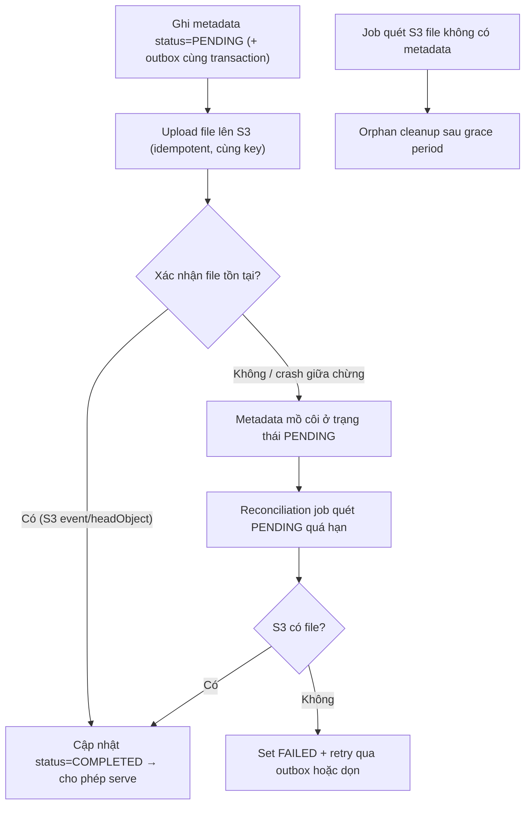

# File metadata ghi DB thành công nhưng upload file thất bại. Làm sao đảm bảo consistency?

## ⚡ Tóm tắt ngắn (30s)
* **Bản chất**: Đây là bài toán **dual-write** kinh điển: ghi vào **hai hệ thống khác nhau** (DB quan hệ + object storage) mà **không có transaction phân tán**. **Không tồn tại XA/2PC giữa S3 và Postgres** — bạn không thể commit cả hai một cách nguyên tử. Hệ quả: hoặc có **metadata mồ côi** (DB có row, S3 không có file), hoặc **file mồ côi** (S3 có file, DB không có row). Phải chấp nhận **eventual consistency** và xử lý bằng **trạng thái + reconciliation**, không cố ép "atomic".
* **Hướng xử lý**:
  1. **State machine + thứ tự đúng**: ghi metadata `PENDING` → upload file → confirm `COMPLETED`. File `PENDING` không được serve.
  2. **Reconciliation job** quét hai chiều: metadata `PENDING` quá hạn mà không có file → fail/dọn; file không có metadata → orphan cleanup.
  3. **Idempotent** + **outbox** để retry phần ghi còn thiếu một cách bền bỉ.
* **Quyết định Senior**: Không có distributed transaction qua S3+DB ⇒ thiết kế quanh **trạng thái trung gian + đối soát**. "Consistency" ở đây là **eventual**, đạt được nhờ reconciliation, không nhờ lock hai-pha.

---

## 🔍 Chi tiết bản chất thực chiến

### 1. Vì sao không thể "atomic" hai bên
DB transaction chỉ bao được các thao tác **trong DB**. Lệnh `putObject` lên S3 nằm **ngoài** ranh giới transaction đó. Dù bạn gọi S3 **bên trong** `@Transactional`, nếu S3 thành công nhưng commit DB **sau đó** thất bại (hoặc app crash giữa hai bước), hai bên đã lệch. **Không có cách nào** làm cả hai thành nguyên tử — S3 không tham gia 2PC. Vì vậy mọi giải pháp đều xoay quanh việc **chấp nhận có cửa sổ không nhất quán** rồi **hội tụ** về sau.

### 2. Thứ tự ghi và ý nghĩa của nó
Có hai thứ tự, mỗi cái sinh một loại "mồ côi":
* **Metadata trước → file sau**: nếu file lỗi, có **metadata mồ côi** (`PENDING`). Dễ phát hiện (quét row `PENDING` quá hạn) và an toàn (chưa serve gì cho user).
* **File trước → metadata sau**: nếu metadata lỗi, có **file mồ côi** (tốn dung lượng, không ai tham chiếu). Phát hiện khó hơn (phải liệt kê S3 đối chiếu DB).

Thực chiến thường chọn **metadata `PENDING` trước**, vì trạng thái trung gian nằm trong DB — nơi dễ truy vấn, dễ reconcile, và **không lộ file dở cho người dùng**.

### 3. State machine: PENDING → COMPLETED / FAILED
* `PENDING`: vừa ghi metadata, **chưa** chắc file đã lên. **Không serve**.
* `COMPLETED`: đã xác nhận file tồn tại trên S3 (lý tưởng là xác nhận bằng **S3 event** hoặc `headObject`, không chỉ tin response client).
* `FAILED`: quá hạn mà không có file → đánh dấu để dọn.

Việc serve **chỉ** dựa vào `COMPLETED` đảm bảo người dùng không bao giờ thấy file mồ côi.

### 4. Reconciliation — nơi "consistency" thực sự đạt được
Một job định kỳ:
* Quét metadata `PENDING` quá ngưỡng (vd > 15 phút): kiểm tra S3; có file → nâng `COMPLETED`; không → `FAILED` (và cho retry/dọn).
* Quét file trên S3 không có metadata tương ứng → **orphan**, dọn sau grace period.

Đây là **nguồn hội tụ tối hậu**: dù dual-write lệch thế nào, reconciliation cũng kéo hai bên về khớp nhau.

### 5. Outbox để retry phần còn thiếu
Nếu muốn tự động hoàn tất thay vì chỉ `FAILED`, ghi một bản **outbox** ("cần đảm bảo file cho key X") trong **cùng transaction** với metadata. Worker đọc outbox, kiểm tra/đẩy file lên, rồi đóng. Outbox nằm cùng DB nên ghi được **atomic với metadata**, giải quyết được nửa "intent" của dual-write.

---

## 🎨 Sơ đồ trực quan: Metadata PENDING → upload → reconcile

Sơ đồ mô tả thứ tự ghi an toàn và vai trò của reconciliation khi một bên lỗi:



---

## 💻 Code thực chiến: BAD vs GOOD

Hai đoạn dưới tương phản: tin rằng `@Transactional` bao được cả S3, và mô hình PENDING → confirm → reconcile.

### ❌ BAD: Tưởng transaction DB bao được cả S3
```java
@Transactional
public void save(FileMeta meta, MultipartFile file) {
    metaRepo.insert(meta);                       // ghi DB
    s3.putObject(putReq(meta.key()), body(file));// ❌ nằm NGOÀI transaction DB
    // ❌ Nếu commit DB lỗi sau đây -> S3 đã có file nhưng DB rollback -> file mồ côi
    // ❌ Nếu putObject lỗi -> exception rollback DB, nhưng nếu S3 đã ghi 1 phần thì vẫn lệch
}
```

### ✅ GOOD: PENDING trước → upload idempotent → confirm; reconcile dọn lệch
```java
@Transactional
public String initUpload(FileMeta meta) {
    meta.setStatus(Status.PENDING);              // ✅ trạng thái trung gian, chưa serve
    metaRepo.insert(meta);
    outboxRepo.insert(new EnsureFile(meta.key()));// ✅ outbox cùng transaction với metadata
    return meta.key();
}

public void completeUpload(String key) {
    // Gọi sau khi nhận S3 event (không chỉ tin client báo "xong")
    if (s3.headObject(headReq(key)) != null) {   // ✅ xác nhận file THỰC SỰ tồn tại
        metaRepo.updateStatus(key, Status.COMPLETED); // ✅ giờ mới cho serve
    }
}

// Reconciliation: kéo hai bên về khớp nhau (nguồn hội tụ tối hậu)
@Scheduled(fixedDelay = 60000)
public void reconcile() {
    for (FileMeta m : metaRepo.findPending(Duration.ofMinutes(15))) {
        boolean exists = s3Exists(m.key());
        metaRepo.updateStatus(m.key(), exists ? Status.COMPLETED : Status.FAILED); // ✅ hội tụ
    }
    for (String orphanKey : s3KeysWithoutMetadata()) {   // file mồ côi
        if (olderThanGrace(orphanKey)) s3.deleteObject(delReq(orphanKey)); // ✅ dọn an toàn
    }
}
```

Phục vụ file **chỉ** khi `COMPLETED`:
```java
public String urlFor(String key) {
    FileMeta m = metaRepo.get(key);
    if (m.getStatus() != Status.COMPLETED)       // ✅ không bao giờ serve PENDING/FAILED
        throw new NotReadyException(key);
    return presigner.presignGetObject(getReq(key)).url().toString();
}
```

---

## 📊 Bảng so sánh cách đảm bảo consistency giữa DB và storage

Bảng dưới đối chiếu các phương án theo tính khả thi và rủi ro:

| Phương án | Atomic thật? | Rủi ro | Khi nào dùng |
| :--- | :--- | :--- | :--- |
| **`@Transactional` bao cả S3** | ❌ Không (ảo tưởng) | Cả file lẫn metadata mồ côi | Không bao giờ |
| **Metadata PENDING → upload → confirm** | Không, nhưng **an toàn** | Metadata PENDING tạm thời | Mặc định |
| **Upload file trước → metadata sau** | Không | File mồ côi khó dò | Khi cần file chắc chắn tồn tại trước |
| **Outbox + reconciliation** | Không, **eventual** | Cửa sổ trễ ngắn | Khi cần tự động hoàn tất |
| **Cố ép 2PC/XA** | ❌ Không khả thi với S3 | Phức tạp, vẫn lệch | Không khả thi |

---

## ⚠️ Common Gotchas & Questions follow-up

### 1. Cạm bẫy "tin response upload của client để set COMPLETED"
* Khi dùng direct-to-S3, client báo "upload xong" **không** đáng tin (client có thể nói dối, hoặc upload thất bại một phần). Đặt `COMPLETED` dựa trên lời client → metadata nói có nhưng S3 không có file. Hãy xác nhận bằng **S3 Event Notification** hoặc `headObject` phía server, rồi mới `COMPLETED`.

### 2. Cạm bẫy "xóa metadata mà không xóa file (và ngược lại)"
* Khi user xóa file, nếu chỉ xóa row DB mà quên xóa object S3 → **file mồ côi** tích tụ tốn tiền. Nếu chỉ xóa S3 mà quên DB → metadata trỏ vào hư vô (`404` khi tải). Thao tác xóa cũng là **dual-write** — cần cùng mô hình trạng thái (`DELETING` → xóa S3 → `DELETED`) và reconciliation dọn phần sót.

### 3. Câu hỏi đào sâu từ interviewer
* **Interviewer: "Tại sao không bọc cả `putObject` lẫn `insert metadata` trong một `@Transactional` cho chắc chắn nguyên tử?"**
* **Trả lời**: Vì `@Transactional` của Spring chỉ điều khiển transaction của **DB** (qua JDBC/JPA), nó **không bao** được S3 — S3 là một dịch vụ HTTP bên ngoài, không tham gia 2PC với database. Đặt `putObject` trong khối transaction chỉ tạo cảm giác an toàn giả: nếu `putObject` thành công nhưng `commit` DB thất bại sau đó (deadlock, mất kết nối, app crash giữa hai bước), thì **file đã nằm trên S3 còn DB đã rollback** → file mồ côi; ngược lại nếu S3 ghi một phần rồi lỗi, rollback DB cũng không "undo" được bytes đã lên S3. Bản chất đây là bài toán **dual-write không có distributed transaction**, và lời giải đúng không phải cố ép atomic mà là **thiết kế quanh eventual consistency**: ghi metadata ở trạng thái `PENDING` (kèm outbox trong cùng DB transaction), upload **idempotent** theo cùng key, xác nhận bằng S3 event rồi mới `COMPLETED`, và để **reconciliation job** đối soát hai chiều dọn mọi mồ côi. Tôi **chỉ serve file `COMPLETED`**, nên trong suốt cửa sổ chưa hội tụ, người dùng không bao giờ thấy dữ liệu lệch. Consistency đạt được bằng **đối soát**, không bằng lock hai-pha vốn không tồn tại ở đây.
