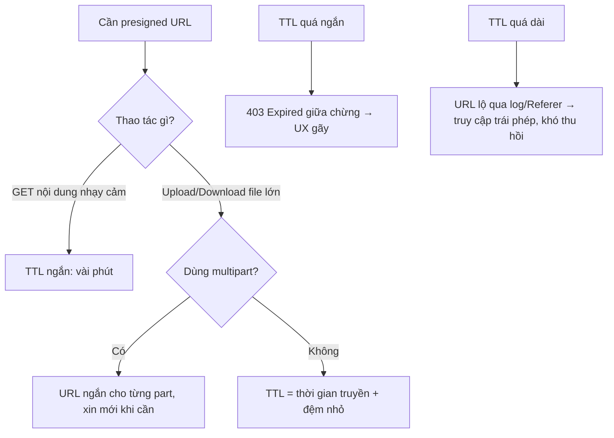

# Signed URL hết hạn quá sớm/quá muộn gây vấn đề gì?

## ⚡ Tóm tắt ngắn (30s)
* **Bản chất**: TTL của presigned URL là một **đánh đổi giữa trải nghiệm và bảo mật**. **Quá sớm** → URL hết hạn **giữa chừng** thao tác (tải/đẩy file lớn trên mạng chậm, người dùng mở lại tab cũ) → lỗi `403 Expired`, UX gãy. **Quá muộn** → URL trở thành **bí mật sống lâu**: bị lộ qua log/Referer/chia sẻ link sẽ cho **bất kỳ ai** truy cập tài nguyên private trong suốt thời gian còn hiệu lực, và **rất khó thu hồi**.
* **Hướng xử lý**:
  1. **Khớp TTL với thao tác**: GET ngắn (phút) cho nội dung nhạy cảm; upload file lớn cần đủ dài **hoặc** dùng **multipart với presigned URL cho từng part**.
  2. **TTL = thời gian thao tác + đệm nhỏ**, không "cho dư cho chắc".
  3. **Giảm sát thương khi lộ**: không log full URL, không nhúng vào trang bị Referer rò rỉ, kết hợp kiểm soát khác (IP/đăng nhập) cho tài nguyên rất nhạy cảm.
* **Quyết định Senior**: TTL **vừa đủ cho một thao tác cụ thể**. Presigned URL là **bearer token** — ai cầm cũng dùng được — nên thời gian sống là **bề mặt tấn công**; tối thiểu hóa nó.

---

## 🔍 Chi tiết bản chất thực chiến

### 1. Presigned URL là một "bearer credential"
URL đã ký **tự chứa** chữ ký xác thực: bất kỳ ai có URL đều thực hiện được đúng hành động đã ký (GET/PUT object đó) **mà không cần đăng nhập**, cho tới khi hết hạn. Vì vậy TTL chính là **cửa sổ rủi ro**: URL lộ ra ngoài thì khoảng thời gian còn hiệu lực là khoảng kẻ xấu dùng được. Đây là lý do "cho TTL dài cho tiện" là một quyết định **bảo mật**, không chỉ tiện ích.

### 2. Hết hạn quá SỚM — hỏng trải nghiệm
* **Tải/đẩy file lớn**: 2GB qua mạng 5 Mbps mất gần một giờ; TTL 5 phút sẽ hết hạn **giữa chừng** → `403`, người dùng phải làm lại từ đầu.
* **URL nhúng sẵn trong trang**: trang render lúc 10:00 với URL TTL 5 phút, người dùng bấm lúc 10:10 → chết link. Ảnh trong email/PDF còn tệ hơn (mở sau nhiều ngày).
* **Resumable upload**: nếu upload bị gián đoạn và resume sau khi URL hết hạn → không tiếp tục được.

### 3. Hết hạn quá MUỘN — rủi ro bảo mật
* **Lộ qua log**: full URL (gồm query chữ ký) lọt vào access log, APM, log proxy → ai đọc log đều dùng lại được.
* **Lộ qua `Referer`**: nhúng URL ký vào ``/`<a>` trên một trang; khi trình duyệt request sang domain khác, header `Referer` mang theo URL → rò rỉ sang bên thứ ba.
* **Chia sẻ link**: người dùng copy URL gửi cho người khác; với TTL dài, link "tạm thời" thành "gần như vĩnh viễn".
* **Khó thu hồi**: presigned URL **không có cơ chế revoke trực tiếp** — muốn vô hiệu sớm phải **xoay khóa ký** (ảnh hưởng mọi URL khác) hoặc đổi key/policy. TTL dài = không kiểm soát được khi đã phát ra.

### 4. Cách cân bằng đúng
* **Đo thời gian thao tác thật** (kích thước file ÷ băng thông kỳ vọng) rồi đặt TTL = thời gian đó + đệm nhỏ.
* **File lớn**: dùng **multipart upload với presigned URL cho từng part**; mỗi part nhỏ, TTL ngắn cho từng part, và có thể xin URL mới cho part chưa xong thay vì một URL khổng lồ sống lâu.
* **Sinh URL ngay trước khi dùng** (lazy), không sinh sẵn hàng loạt rồi để đó.
* **Tài nguyên rất nhạy cảm**: kết hợp ràng buộc khác (giới hạn IP nếu khả thi, yêu cầu đăng nhập ở tầng app trước khi cấp URL).

---

## 🎨 Sơ đồ trực quan: Chọn TTL theo thao tác

Sơ đồ mô tả cách quyết định TTL và hệ quả của hai thái cực:



---

## 💻 Code thực chiến: BAD vs GOOD

Hai đoạn dưới tương phản: TTL dài cào bằng và sinh sẵn, với TTL khớp thao tác sinh lazy.

### ❌ BAD: TTL 7 ngày cho mọi thứ, sinh sẵn hàng loạt
```java
public String url(String key) {
    return s3Presigner.presignGetObject(GetObjectPresignRequest.builder()
        .signatureDuration(Duration.ofDays(7))   // ❌ URL sống 7 ngày: lộ là toang, không revoke được
        .getObjectRequest(getReq(key)).build())
        .url().toString();
}

// ❌ Sinh sẵn URL cho cả danh sách rồi cache -> URL "già" trước khi user bấm + tăng bề mặt lộ
List<String> urls = files.stream().map(f -> url(f.key())).toList();
log.info("urls = {}", urls);                     // ❌ log full URL gồm chữ ký -> rò rỉ
```

### ✅ GOOD: TTL khớp thao tác, sinh lazy, không log full URL
```java
// GET nội dung nhạy cảm: TTL ngắn, sinh ngay trước khi trả cho client
public String shortLivedGet(String key, Principal user) {
    authz.assertCanRead(user, key);              // ✅ kiểm soát truy cập ở app TRƯỚC khi ký
    return s3Presigner.presignGetObject(GetObjectPresignRequest.builder()
        .signatureDuration(Duration.ofMinutes(5))// ✅ vài phút, đủ để bấm tải
        .getObjectRequest(getReq(key)).build())
        .url().toString();
}

// Upload file lớn: multipart, presigned cho từng part, TTL vừa phải mỗi part
public PartUploadUrls multipartUrls(String key, int parts) {
    String uploadId = s3.createMultipartUpload(mpuReq(key)).uploadId();
    List<String> partUrls = IntStream.rangeClosed(1, parts).mapToObj(p ->
        s3Presigner.presignUploadPart(UploadPartPresignRequest.builder()
            .signatureDuration(Duration.ofMinutes(15)) // ✅ đủ cho 1 part, không phải cả file
            .uploadPartRequest(partReq(key, uploadId, p)).build())
            .url().toString()).toList();
    return new PartUploadUrls(uploadId, partUrls);   // client xin URL mới nếu part nào quá hạn
}

// ✅ Không bao giờ log full presigned URL; chỉ log key/thao tác
log.info("issued presigned GET for key={}", key);
```

---

## 📊 Bảng so sánh hệ quả của TTL

Bảng dưới đối chiếu hai thái cực và mức TTL khuyến nghị theo tình huống:

| Tình huống | TTL quá ngắn | TTL quá dài | Khuyến nghị |
| :--- | :--- | :--- | :--- |
| **GET nội dung nhạy cảm** | `403` khi mở lại | Lộ → truy cập trái phép | 1–5 phút, sinh lazy |
| **Upload/Download file lớn** | Hỏng giữa chừng | Cửa sổ lộ dài | Multipart + URL/part 10–15 phút |
| **Ảnh nhúng email/PDF** | Chết link khi mở sau | Link "tạm" thành vĩnh viễn | Dùng URL qua app/redirect, không nhúng URL ký dài hạn |
| **Khả năng thu hồi** | Tự hết hạn nhanh | ❌ Gần như không revoke | Ưu tiên TTL ngắn để tự thu hồi |

---

## ⚠️ Common Gotchas & Questions follow-up

### 1. Cạm bẫy "lệch đồng hồ làm URL chết sớm/được dùng lâu hơn dự tính"
* Chữ ký presigned phụ thuộc thời gian; nếu đồng hồ server sinh URL **lệch** so với S3, URL có thể bị coi là hết hạn sớm hoặc còn hiệu lực lệch với dự tính. Đảm bảo **NTP đồng bộ**. Ngoài ra TTL của presigned dùng SigV4 có **trần** (tối đa 7 ngày) — đặt dài hơn sẽ bị từ chối.

### 2. Cạm bẫy "tưởng hết hạn là đã thu hồi"
* TTL chỉ giới hạn **thời điểm**, không thu hồi **trong** khoảng hiệu lực. Nếu một URL TTL 1 giờ bị lộ ở phút thứ 5, kẻ xấu vẫn còn 55 phút. Presigned URL **không revoke trực tiếp**; muốn vô hiệu ngay phải xoay khóa/đổi policy (ảnh hưởng diện rộng). Vì thế **TTL ngắn là cơ chế "thu hồi" thực dụng nhất**.

### 3. Câu hỏi đào sâu từ interviewer
* **Interviewer: "User phàn nàn link tải file lớn cứ báo hết hạn giữa chừng, nhưng bảo mật lại không cho nâng TTL lên nhiều giờ. Bạn giải quyết mâu thuẫn này thế nào?"**
* **Trả lời**: Tôi không chọn một con số TTL duy nhất cho mọi thứ, vì đây là mâu thuẫn giữa **đủ thời gian cho thao tác** và **tối thiểu cửa sổ lộ**. Với download một file lớn, gốc rễ là URL phải sống đủ lâu cho cả lần tải — nhưng thay vì kéo TTL của **một** URL lên hàng giờ (làm tăng rủi ro nếu link lộ và gần như không revoke được), tôi chuyển sang mô hình **chia nhỏ**: dùng multipart với **presigned URL cho từng part**, mỗi part nhỏ và TTL ngắn (10–15 phút); nếu một part bị gián đoạn, client chỉ cần **xin URL mới cho riêng part đó** thay vì cho cả file. Như vậy không URL nào sống lâu, mà thao tác tổng thể vẫn hoàn tất được dù mạng chậm. Với download không chia part được, tôi để client tải qua một **endpoint của app** chỉ redirect sang presigned URL TTL ngắn **sinh ngay tại thời điểm bấm** (lazy), kèm kiểm tra đăng nhập — link người dùng giữ là link app (revoke được bằng phiên đăng nhập), còn presigned URL thật chỉ tồn tại trong vài phút lúc tải. Tôi cũng đảm bảo **không log full URL** và không nhúng URL ký dài hạn vào nơi `Referer` rò rỉ. Kết quả: trải nghiệm liền mạch mà cửa sổ rủi ro vẫn tính bằng phút, không phải giờ.
