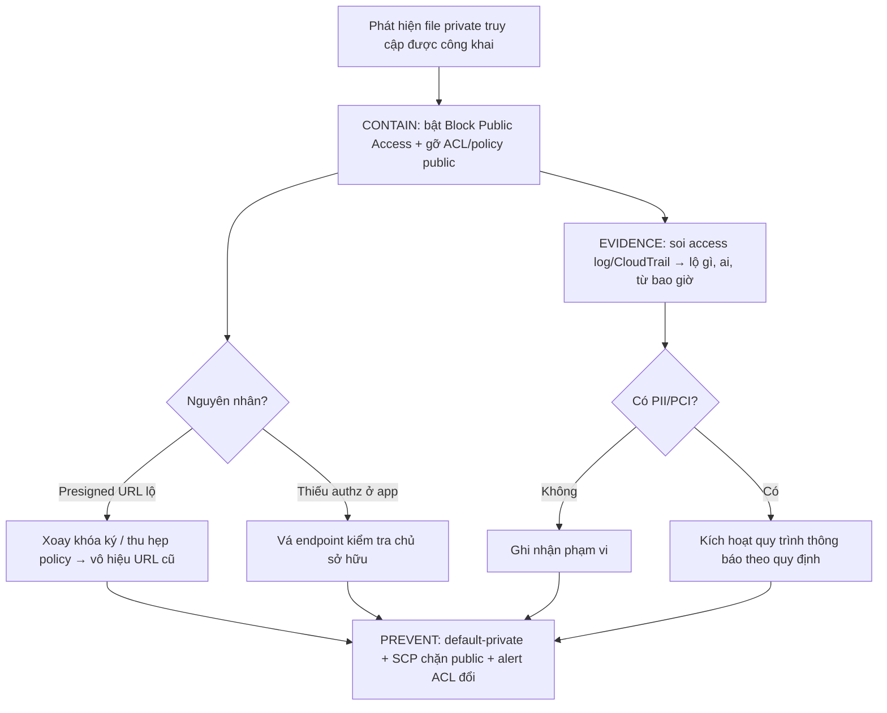

# File private bị public access. Bạn xử lý incident thế nào?

## ⚡ Tóm tắt ngắn (30s)
* **Bản chất**: File đáng lẽ private nhưng bất kỳ ai cũng truy cập được — một **sự cố lộ dữ liệu (data exposure)**. Nguyên nhân điển hình: **bucket policy/ACL cấu hình sai** (`public-read`, `AllUsers`), **tắt Block Public Access**, thiếu kiểm tra phân quyền ở tầng app, **URL đoán được/IDOR**, hoặc **presigned URL TTL dài bị lộ**. Xử lý theo trình tự incident: **Chặn ngay (containment) → Đánh giá phạm vi (blast radius) → Sửa gốc rễ → Thông báo nếu có PII → Phòng tái diễn**.
* **Hướng xử lý**:
  1. **Containment tức thời**: bật **Block Public Access**, gỡ ACL/policy public, vô hiệu presigned URL đang lộ (xoay khóa nếu cần).
  2. **Đánh giá**: dùng **access log/CloudTrail** xác định đã lộ gì, ai truy cập, từ bao giờ.
  3. **Sửa gốc + phòng ngừa**: default-private, least-privilege, chặn public ở cấp **tổ chức (SCP)**, alert khi ACL đổi.
* **Quyết định Senior**: Ưu tiên **dừng chảy máu trước, điều tra sau**. Bảo mật file dựa trên **default-deny + nhiều lớp**, không bao giờ dựa vào "URL khó đoán".

---

## 🔍 Chi tiết bản chất thực chiến

### 1. Trình tự xử lý incident (không đảo thứ tự)
Một incident lộ dữ liệu xử lý theo các pha chuẩn: **Impact → Stabilize/Contain → Evidence → Root cause → Fix → Prevent**. Sai lầm thường gặp là nhảy vào "tìm nguyên nhân" trong khi dữ liệu **vẫn đang lộ**. Senior **chặn truy cập public trước** (cầm máu), rồi mới điều tra — vì mỗi phút chậm là thêm dữ liệu bị tải về.

### 2. Các nguyên nhân gốc thường gặp
* **ACL/Policy public**: object/bucket gắn `public-read`, hoặc bucket policy có `Principal: "*"` cho `s3:GetObject`.
* **Block Public Access bị tắt**: lớp chặn cuối cùng của S3 bị disable, để ACL/policy public có hiệu lực.
* **Thiếu authz ở app**: endpoint tải file không kiểm tra người gọi có quyền với file đó (kết hợp ID tuần tự → **IDOR**).
* **Predictable key/URL**: dùng tên file/ID tăng dần làm key, không có chữ ký → ai cũng đoán URL.
* **Presigned URL lộ**: TTL dài, lọt vào log/`Referer`/được chia sẻ.

### 3. Containment — chặn theo đúng tầng nguyên nhân
* Nếu do **bucket policy/ACL**: bật **Block Public Access** (4 cờ) ở cấp bucket/tài khoản — đây là "công tắc tổng" vô hiệu mọi cấp public bất kể ACL/policy; gỡ statement public trong policy.
* Nếu do **presigned URL lộ**: không revoke trực tiếp được → **xoay access key dùng để ký** hoặc thu hẹp policy của key đó để vô hiệu chữ ký cũ; rút ngắn TTL về sau.
* Nếu do **thiếu authz ở app**: vá ngay endpoint (thêm kiểm tra chủ sở hữu), tạm khóa route nếu cần.

### 4. Đánh giá blast radius bằng log
* **S3 Server Access Logs / CloudTrail data events**: liệt kê request `GetObject` từ IP lạ, thời điểm bắt đầu lộ, các key bị tải.
* Xác định **dữ liệu loại gì** (có PII/PCI không) để quyết định nghĩa vụ **thông báo** (GDPR/nghị định bảo vệ dữ liệu) — thường có mốc thời gian bắt buộc.

### 5. Phòng tái diễn
* **Default private**: bucket private mặc định, chỉ truy cập qua presigned URL TTL ngắn hoặc qua app có authz.
* **Block Public Access ở cấp tổ chức** bằng **SCP** để không team nào lỡ tay bật public.
* **Phát hiện sai lệch**: AWS Config rule / cảnh báo khi ACL/policy chuyển sang public; quét định kỳ.
* **Random key** (UUID) thay cho ID tuần tự để chống đoán/IDOR — nhưng coi đây là **lớp phụ**, không thay cho authz.

---

## 🎨 Sơ đồ trực quan: Quy trình xử lý sự cố lộ file private

Sơ đồ mô tả các pha xử lý incident từ chặn tới phòng ngừa:



---

## 💻 Code thực chiến: BAD vs GOOD

Hai đoạn dưới tương phản: cấu hình/đường dẫn để file public và cách phục vụ file private đúng.

### ❌ BAD: Bucket public + endpoint không kiểm tra quyền
```java
// ❌ Set object public-read khi upload -> ai có URL cũng tải được
s3.putObject(PutObjectRequest.builder()
    .bucket("user-docs").key(key)
    .acl(ObjectCannedACL.PUBLIC_READ)            // ❌ public hóa dữ liệu private
    .build(), body);

// ❌ Endpoint tải file theo ID tuần tự, KHÔNG kiểm tra chủ sở hữu -> IDOR
@GetMapping("/files/{id}")
public ResponseEntity<byte[]> get(@PathVariable long id) {
    FileMeta f = repo.get(id);                   // id=124 -> đổi thành 125 là xem file người khác
    return ResponseEntity.ok(s3.getObjectAsBytes(getReq(f.key())).asByteArray());
}
```

### ✅ GOOD: Default-private + authz + presigned TTL ngắn
```java
// ✅ Object private (không set ACL public); key ngẫu nhiên để chống đoán (lớp phụ)
String key = user.getId() + "/" + UUID.randomUUID();
s3.putObject(PutObjectRequest.builder().bucket("user-docs").key(key).build(), body);

// ✅ Endpoint kiểm tra QUYỀN trước, rồi cấp presigned URL TTL ngắn
@GetMapping("/files/{id}")
public ResponseEntity<String> get(@PathVariable long id, Principal user) {
    FileMeta f = repo.get(id);
    if (!f.getOwnerId().equals(user.getName()))  // ✅ chặn IDOR: chỉ chủ sở hữu mới được
        return ResponseEntity.status(403).build();
    String url = presigner.presignGetObject(GetObjectPresignRequest.builder()
        .signatureDuration(Duration.ofMinutes(5)).getObjectRequest(getReq(f.key())).build())
        .url().toString();
    return ResponseEntity.ok(url);
}
```

Cấu hình hạ tầng chặn public (containment + prevent):
```bash
# ✅ CONTAINMENT tức thời: bật Block Public Access toàn bộ ở cấp bucket
aws s3api put-public-access-block --bucket user-docs \
  --public-access-block-configuration \
  BlockPublicAcls=true,IgnorePublicAcls=true,BlockPublicPolicy=true,RestrictPublicBuckets=true
```
```json
// ✅ PREVENT: SCP cấp tổ chức chặn mọi nỗ lực tắt Block Public Access
{ "Effect": "Deny", "Action": "s3:PutAccountPublicAccessBlock", "Resource": "*",
  "Condition": { "Bool": { "s3:PublicAccessBlockEnabled": "false" } } }
```

---

## 📊 Bảng so sánh nguyên nhân & cách chặn

Bảng dưới ánh xạ nguyên nhân lộ file tới biện pháp containment và phòng ngừa:

| Nguyên nhân | Dấu hiệu | Containment | Phòng ngừa |
| :--- | :--- | :--- | :--- |
| **Bucket policy/ACL public** | `Principal: "*"`, `public-read` | Block Public Access, gỡ statement | SCP, AWS Config alert |
| **Block Public Access tắt** | Cờ public bị disable | Bật lại 4 cờ | SCP chặn tắt |
| **Thiếu authz ở app (IDOR)** | Đổi ID xem file người khác | Vá kiểm tra chủ sở hữu | Test authz, key ngẫu nhiên |
| **Predictable key** | URL đoán được | Chuyển sang UUID + presigned | Không serve trực tiếp |
| **Presigned URL lộ** | URL trong log/Referer | Xoay khóa ký, rút TTL | TTL ngắn, không log URL |

---

## ⚠️ Common Gotchas & Questions follow-up

### 1. Cạm bẫy "đổi UUID là đủ an toàn" (security through obscurity)
* Thay ID tuần tự bằng UUID giúp **khó đoán** nhưng **không phải** kiểm soát truy cập. Nếu một UUID bị lộ (qua log, lịch sử trình duyệt, chia sẻ link) mà object vẫn public hoặc endpoint không kiểm tra quyền, dữ liệu vẫn lộ. UUID là **lớp làm khó**, không thay cho **authz default-deny**.

### 2. Cạm bẫy "chỉ sửa file đang bị nhắc, quên rà toàn bộ bucket"
* Khi một file lộ do policy sai, thường **toàn bộ** object trong bucket cùng cảnh ngộ. Vá đúng một file rồi đóng incident là thiếu sót. Phải **quét toàn bucket/tài khoản** (Block Public Access cấp tài khoản, audit policy) để chắc không còn object public nào khác.

### 3. Câu hỏi đào sâu từ interviewer
* **Interviewer: "Bạn phát hiện một bucket chứa CMND khách hàng đang để public-read. Mô tả 30 phút đầu tiên bạn làm gì?"**
* **Trả lời**: Ưu tiên số một là **cầm máu**, không phải truy nguyên. Ngay lập tức tôi bật **Block Public Access** ở cấp bucket (và cân nhắc cấp tài khoản) — đây là công tắc tổng vô hiệu mọi ACL/policy public bất kể chúng cấu hình ra sao, nhanh hơn việc đi sửa từng statement. Đồng thời gỡ statement `Principal:"*"` trong bucket policy. Khi truy cập public đã bị chặn, tôi chuyển sang **thu thập bằng chứng**: bật/đọc **S3 access log và CloudTrail data events** để xác định bucket đã public **từ bao giờ**, **những key nào** bị `GetObject`, và **IP nào** truy cập — từ đó ước lượng có bao nhiêu hồ sơ thực sự bị tải về (blast radius). Vì đây là **PII nhạy cảm (CMND)**, tôi kích hoạt song song **quy trình thông báo sự cố** theo quy định bảo vệ dữ liệu (thường có mốc thời gian bắt buộc) và báo cho security/legal. Sau khi ổn định, tôi truy **root cause** (ai/khi nào set public — pipeline IaC hay thao tác tay), **vá gốc** bằng default-private + presigned TTL ngắn + authz ở app, rồi **phòng tái diễn** bằng **SCP** chặn tắt Block Public Access toàn tổ chức và **AWS Config alert** khi có bucket/object chuyển public. Nguyên tắc xuyên suốt: chặn trước, điều tra sau, và thiết kế lại để **mặc định không thể public** chứ không trông chờ con người nhớ cấu hình đúng.
